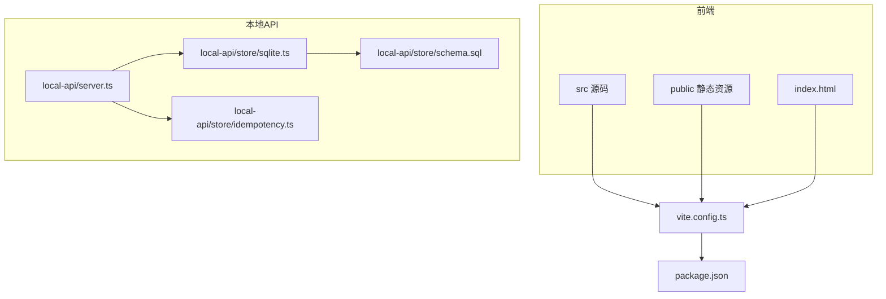
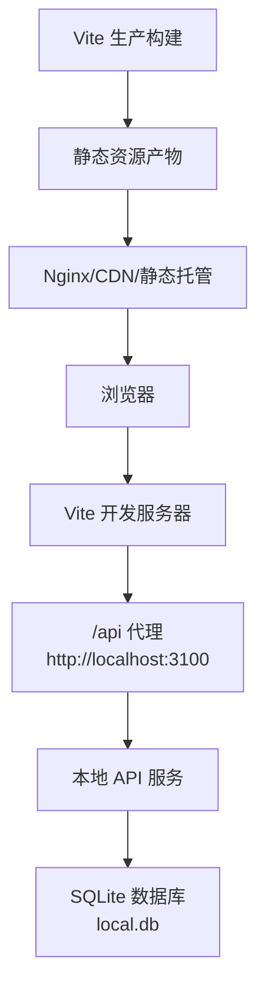
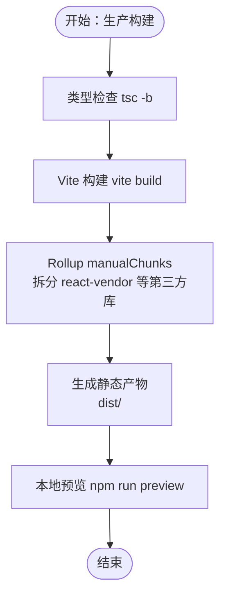
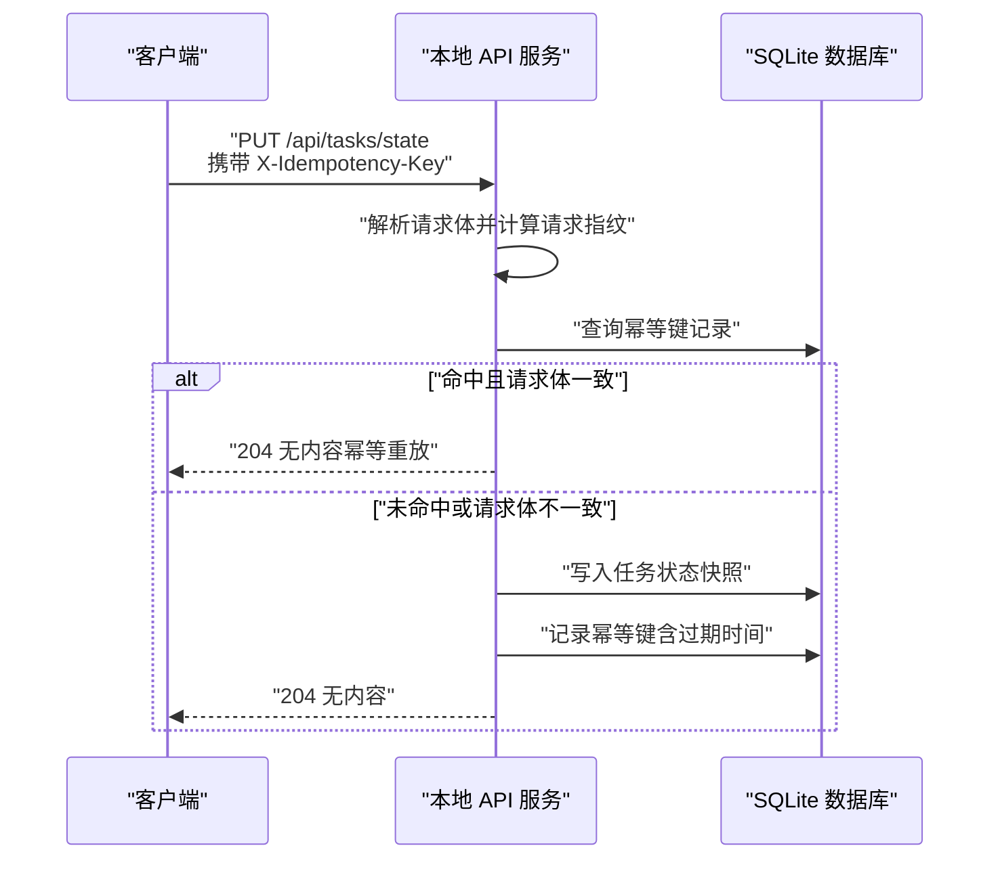
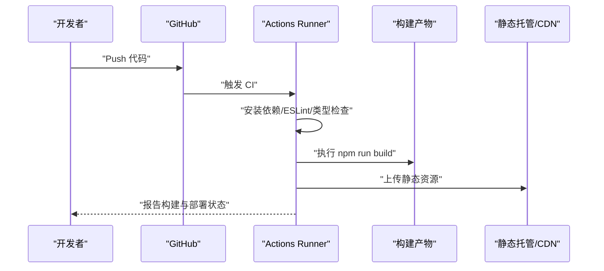
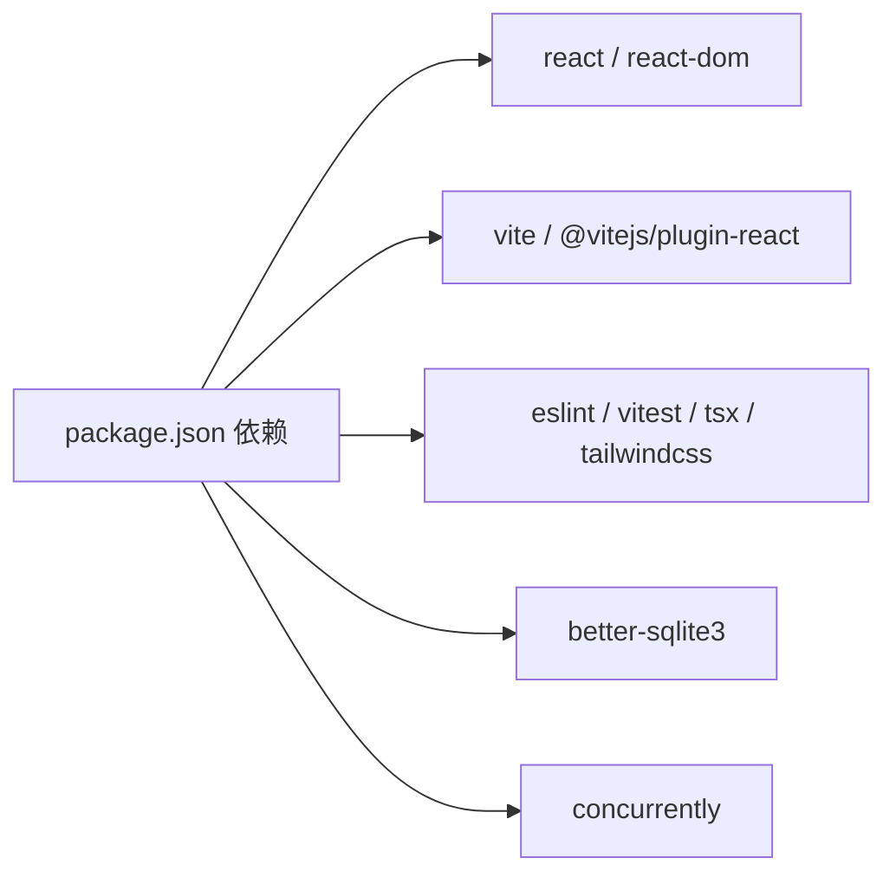

# 构建与部署

<cite>
**本文引用的文件**
- [vite.config.ts](file://vite.config.ts)
- [package.json](file://package.json)
- [.github/workflows/ci.yml](file://.github/workflows/ci.yml)
- [local-api/server.ts](file://local-api/server.ts)
- [local-api/store/sqlite.ts](file://local-api/store/sqlite.ts)
- [local-api/store/schema.sql](file://local-api/store/schema.sql)
- [local-api/store/idempotency.ts](file://local-api/store/idempotency.ts)
- [index.html](file://index.html)
- [README.md](file://README.md)
- [CODEBUDDY.md](file://CODEBUDDY.md)
</cite>

## 目录

1. [简介](#简介)
2. [项目结构](#项目结构)
3. [核心组件](#核心组件)
4. [架构总览](#架构总览)
5. [详细组件分析](#详细组件分析)
6. [依赖关系分析](#依赖关系分析)
7. [性能考量](#性能考量)
8. [故障排查指南](#故障排查指南)
9. [结论](#结论)
10. [附录](#附录)

## 简介

本指南面向 CodeBuddy 项目的构建与部署，聚焦以下目标：

- Vite 构建配置与优化：代码分割策略、chunk 大小阈值、手动分块规则
- 构建输出目录结构与静态资源处理
- 生产环境构建命令与参数
- 本地 API 服务部署：SQLite 数据库文件部署与权限配置
- 前端静态资源部署：Nginx 配置、CDN 集成与缓存策略
- Docker 容器化部署：Dockerfile 编写与镜像构建
- CI/CD 流水线：GitHub Actions 配置与自动化部署流程
- 部署后验证与故障排查

## 项目结构

该项目采用前端 React + Vite + TypeScript 的单页应用架构，配合本地 HTTP API 服务（基于 Node.js + better-sqlite3）进行演示与联调。核心目录与职责如下：

- src：前端源码与组件
- local-api：本地 API 服务与 SQLite 存储
- public：静态资源目录
- vite.config.ts：Vite 构建与开发服务器配置
- package.json：构建脚本、依赖与开发工具
- .github/workflows/ci.yml：CI 质量门禁与构建流程

**图表来源**

- [vite.config.ts](file://vite.config.ts)
- [package.json](file://package.json)
- [local-api/server.ts](file://local-api/server.ts)
- [local-api/store/sqlite.ts](file://local-api/store/sqlite.ts)
- [local-api/store/schema.sql](file://local-api/store/schema.sql)
- [local-api/store/idempotency.ts](file://local-api/store/idempotency.ts)
- [index.html](file://index.html)

**章节来源**

- [README.md](file://README.md)
- [CODEBUDDY.md](file://CODEBUDDY.md)

## 核心组件

- Vite 构建配置：定义开发代理、代码分割策略、chunk 大小警告阈值
- 本地 API 服务：基于 Node.js HTTP 服务器，提供五类状态接口与审计日志接口，内置幂等性保障
- SQLite 存储：better-sqlite3 连接、WAL 模式、Schema 初始化与索引
- 幂等键模块：请求指纹、过期清理、重放一致性
- 构建脚本与 CI：生产构建、类型检查与质量门禁

**章节来源**

- [vite.config.ts](file://vite.config.ts)
- [package.json](file://package.json)
- [.github/workflows/ci.yml](file://.github/workflows/ci.yml)
- [local-api/server.ts](file://local-api/server.ts)
- [local-api/store/sqlite.ts](file://local-api/store/sqlite.ts)
- [local-api/store/schema.sql](file://local-api/store/schema.sql)
- [local-api/store/idempotency.ts](file://local-api/store/idempotency.ts)

## 架构总览

前端通过 Vite 开发服务器运行，开发期间对 /api 前缀请求进行代理到本地 API 服务。生产构建产出静态资源，可部署至任意静态托管或反向代理（如 Nginx）。本地 API 服务使用 SQLite 数据库存储项目/任务/验收/结算/审计日志等状态，并通过幂等键保障写操作的幂等性。

**图表来源**

- [vite.config.ts](file://vite.config.ts)
- [local-api/server.ts](file://local-api/server.ts)
- [local-api/store/sqlite.ts](file://local-api/store/sqlite.ts)

## 详细组件分析

### Vite 构建配置与优化

- 代码分割策略
  - 使用 Rollup 的 manualChunks 将 React 生态（react、react-dom）拆分为独立 chunk（名称约定为 react-vendor），降低主包体积并提升缓存命中率
  - 为未来扩展图表库、UI 组件库预留了扩展点（注释中给出示例）
- chunk 大小优化
  - 提升 chunkSizeWarningLimit 至 400 KB，以适配当前项目体量与懒加载策略
- 开发代理
  - 将 /api 前缀代理到 http://localhost:3100，便于前端联调本地 API
- 构建产物与静态资源
  - 生产构建由 package.json 的 build 脚本触发，先执行 tsc -b 类型检查，再执行 vite build 产出静态资源
  - index.html 中通过模块脚本引入入口文件，构建后由 Vite 注入带哈希的资源名

**图表来源**

- [vite.config.ts](file://vite.config.ts)
- [package.json](file://package.json)

**章节来源**

- [vite.config.ts](file://vite.config.ts)
- [package.json](file://package.json)
- [index.html](file://index.html)

### 本地 API 服务与 SQLite 部署

- 服务启动与路由
  - 服务监听端口可通过环境变量 LOCAL_API_PORT 指定，默认 3100
  - API 前缀为 /api，支持健康检查 /health
  - 提供五类状态接口与审计日志接口，PUT/POST 写操作支持幂等键（X-Idempotency-Key）
- SQLite 数据库
  - 数据库文件路径位于 local-api/store/local.db，首次启动自动创建目录并初始化 Schema
  - 启用 WAL 模式以提升并发读写性能
  - 提供幂等键过期清理（默认 7 天）
- 幂等性保障
  - 通过请求体哈希与环境维度（env_id）校验幂等键，避免重复提交
  - 支持幂等重放时直接返回 204，保持一致性

**图表来源**

- [local-api/server.ts](file://local-api/server.ts)
- [local-api/store/sqlite.ts](file://local-api/store/sqlite.ts)
- [local-api/store/idempotency.ts](file://local-api/store/idempotency.ts)
- [local-api/store/schema.sql](file://local-api/store/schema.sql)

**章节来源**

- [local-api/server.ts](file://local-api/server.ts)
- [local-api/store/sqlite.ts](file://local-api/store/sqlite.ts)
- [local-api/store/schema.sql](file://local-api/store/schema.sql)
- [local-api/store/idempotency.ts](file://local-api/store/idempotency.ts)

### 前端静态资源部署（Nginx/CDN/缓存）

- 部署位置
  - 生产构建产物位于 dist/ 目录，可直接部署至 Nginx 的 root 或 alias 指向的目录
- 反向代理与路由
  - Nginx 将 /api 前缀转发至本地 API 服务（例如 http://localhost:3100），实现前后端分离
  - 对于 SPA，建议将所有非 API、非静态资源的请求回退到 index.html，确保前端路由生效
- CDN 集成
  - 将 dist/ 静态资源上传至 CDN，结合缓存头（Cache-Control/ETag/Last-Modified）实现高效分发
- 缓存策略建议
  - 静态资源（JS/CSS/图片）：强缓存（immutable 或较长 max-age）+ 文件名哈希
  - HTML：短缓存或协商缓存（ETag/Last-Modified）
  - API：不缓存或短缓存，避免跨域缓存问题

[本节为通用部署建议，不直接分析具体文件，故不附加章节来源]

### Docker 容器化部署

- 容器化思路
  - 前端：构建静态资源，使用 Nginx 镜像作为静态站点服务器，挂载 dist/ 目录
  - 后端：将本地 API 服务打包为 Node.js 容器，暴露 3100 端口，挂载 SQLite 数据库存储目录
- Dockerfile 示例（概念性描述）
  - 基础镜像：node:alpine 或 nginx:alpine
  - 构建阶段：安装依赖、执行 npm run build
  - 运行阶段：复制 dist/ 到 Nginx 默认站点目录，或启动 Node 服务
  - 环境变量：LOCAL_API_PORT、NODE_ENV 等
  - 健康检查：/health 接口
- 镜像构建与运行
  - 构建：docker build -t codebuddy-frontend .
  - 运行：docker run -d -p 80:80 -p 3100:3100 --name codebuddy

[本节为通用容器化建议，不直接分析具体文件，故不附加章节来源]

### CI/CD 流水线与自动化部署

- GitHub Actions 流程
  - 触发条件：push 到 main 分支或发起 Pull Request
  - 步骤：检出代码、设置 Node.js（版本 20）、安装依赖、ESLint 核心文件检查、类型与构建检查、质量门禁
- 自动化部署建议
  - 前端：构建完成后上传至静态托管（如对象存储/CDN），或推送至容器镜像仓库后编排部署
  - 后端：将本地 API 服务打包为容器镜像，部署至容器平台（如 Cloud Run/容器服务）
  - 部署后验证：访问 /health 与关键页面，检查构建产物可用性

**图表来源**

- [.github/workflows/ci.yml](file://.github/workflows/ci.yml)
- [package.json](file://package.json)

**章节来源**

- [.github/workflows/ci.yml](file://.github/workflows/ci.yml)
- [package.json](file://package.json)

## 依赖关系分析

- 前端依赖
  - React 19、TypeScript、Vite 8、Tailwind CSS 4、ESLint、Vitest
- 本地 API 依赖
  - better-sqlite3：SQLite 驱动
  - tsx：TS 入口执行
- 构建与开发工具
  - concurrently：同时启动前端与本地 API
  - autoprefixer/postcss/tailwindcss：样式管线
  - eslint-plugin-react-hooks/eslint-plugin-react-refresh：ESLint 插件

**图表来源**

- [package.json](file://package.json)

**章节来源**

- [package.json](file://package.json)

## 性能考量

- 代码分割与懒加载
  - manualChunks 将 react-vendor 单独拆分，降低主包体积并提升缓存命中
  - README 指出页面组件全部按需加载，主包体积优化至 27 KB，首屏体积 216 KB
- 构建体积阈值
  - chunkSizeWarningLimit 提升至 400 KB，适配当前项目体量与懒加载策略
- SQLite 性能
  - WAL 模式提升并发读写性能，适合演示场景

**章节来源**

- [vite.config.ts](file://vite.config.ts)
- [README.md](file://README.md)

## 故障排查指南

- 本地 API 服务
  - 端口占用：通过 LOCAL_API_PORT 指定端口，避免冲突
  - 数据库文件：确认 local.db 是否在 local-api/store/ 目录下，权限是否允许读写
  - 幂等键异常：检查 X-Idempotency-Key 是否一致，请求体哈希是否匹配
- 前端联调
  - /api 代理：确认 vite.config.ts 的 proxy 配置指向正确地址
  - 静态资源：生产构建后通过 npm run preview 验证 dist/ 可用性
- CI/CD
  - Node 版本：Actions 使用 Node 20，确保本地与 CI 一致
  - 质量门禁：ESLint 核心文件检查失败需修复后再合并
- 部署后验证
  - 健康检查：访问 /health 确认服务可用
  - 关键页面：访问首页与核心页面，确认静态资源加载与路由生效

**章节来源**

- [vite.config.ts](file://vite.config.ts)
- [local-api/server.ts](file://local-api/server.ts)
- [local-api/store/sqlite.ts](file://local-api/store/sqlite.ts)
- [.github/workflows/ci.yml](file://.github/workflows/ci.yml)
- [README.md](file://README.md)

## 结论

本指南围绕 CodeBuddy 的前端构建、本地 API 服务与部署进行了系统性说明。通过合理的代码分割、chunk 大小阈值与懒加载策略，结合 SQLite 的 WAL 模式与幂等性保障，项目可在本地与演示环境中高效运行。配合 Nginx/CDN 的静态资源部署与容器化方案，以及 GitHub Actions 的 CI 流水线，可实现从开发到生产的自动化交付。

## 附录

- 常用命令
  - 本地开发：npm run dev
  - 本地后端：npm run local-api
  - 前后端联调：npm run dev:local
  - 生产构建：npm run build
  - 本地预览：npm run preview
  - 代码检查：npm run lint
- 环境变量
  - LOCAL_API_PORT：本地 API 服务端口（默认 3100）
- 静态资源与入口
  - index.html 中通过模块脚本引入入口文件，构建后由 Vite 注入带哈希的资源名

**章节来源**

- [package.json](file://package.json)
- [index.html](file://index.html)
- [README.md](file://README.md)
