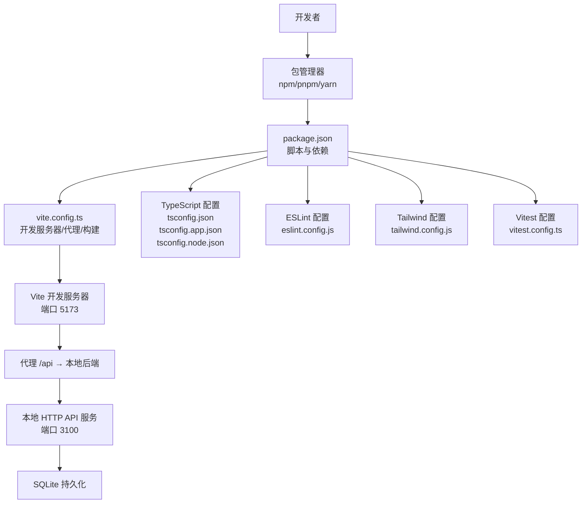
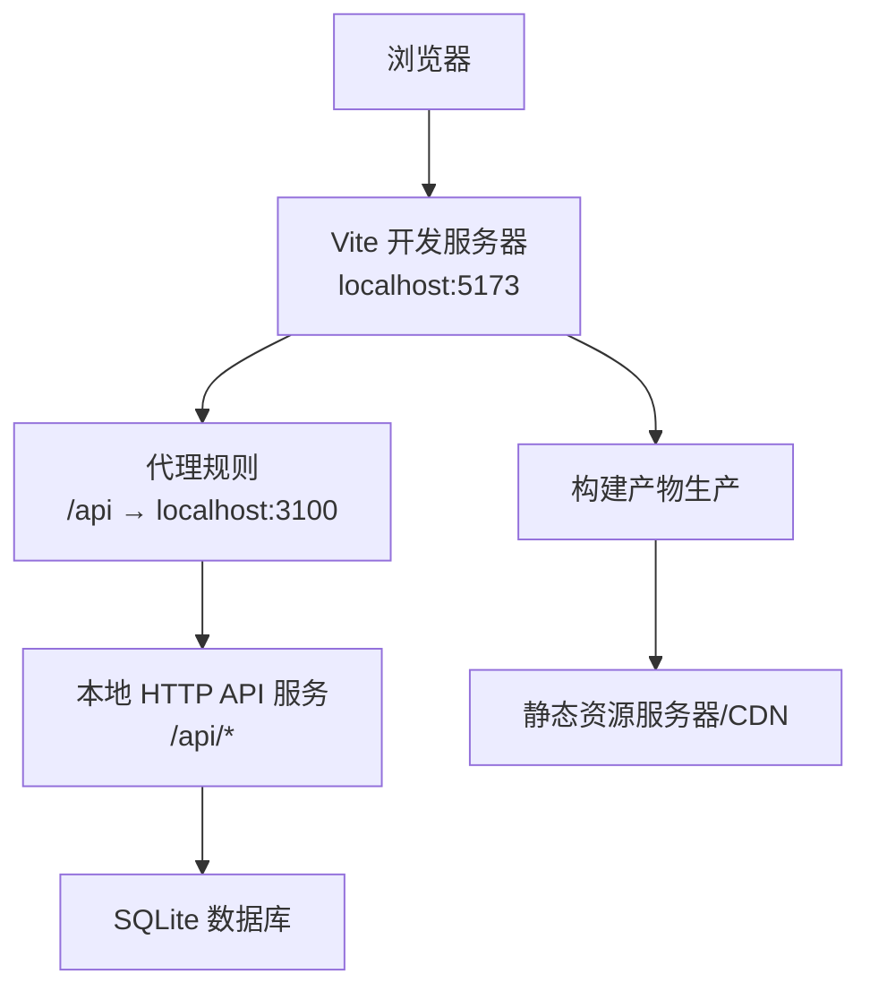
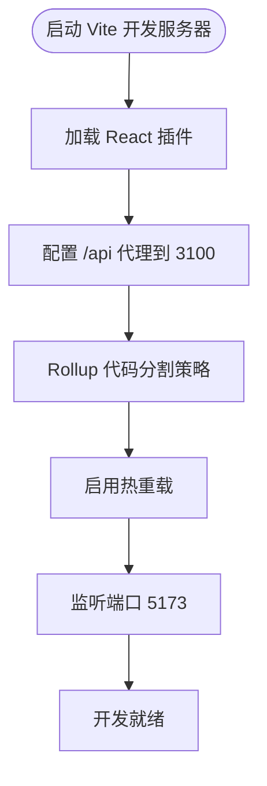
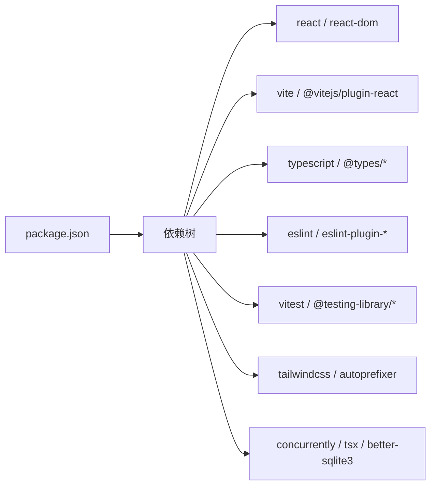

# 环境配置

<cite>
**本文引用的文件**
- [package.json](file://package.json)
- [vite.config.ts](file://vite.config.ts)
- [tsconfig.json](file://tsconfig.json)
- [tsconfig.app.json](file://tsconfig.app.json)
- [tsconfig.node.json](file://tsconfig.node.json)
- [eslint.config.js](file://eslint.config.js)
- [tailwind.config.js](file://tailwind.config.js)
- [vitest.config.ts](file://vitest.config.ts)
- [CODEBUDDY.md](file://CODEBUDDY.md)
- [README.md](file://README.md)
- [docs/03-engineering/development-guide.md](file://docs/03-engineering/development-guide.md)
- [local-api/server.ts](file://local-api/server.ts)
</cite>

## 目录

1. [简介](#简介)
2. [项目结构](#项目结构)
3. [核心组件](#核心组件)
4. [架构总览](#架构总览)
5. [详细组件分析](#详细组件分析)
6. [依赖分析](#依赖分析)
7. [性能考虑](#性能考虑)
8. [故障排查指南](#故障排查指南)
9. [结论](#结论)
10. [附录](#附录)

## 简介

本指南面向 CodeBuddy 项目的开发者与运维人员，提供从零搭建开发与生产环境的完整步骤，涵盖 Node.js 版本要求、包管理器选择、系统依赖、开发/生产差异配置、跨平台安装要点、IDE 配置建议、Vite 开发服务器配置与热重载机制，以及环境验证与常见问题排查。文中所有技术细节均以仓库实际配置为依据，并给出对应的文件与行号来源，便于快速定位与核对。

## 项目结构

本项目采用前端单页应用（SPA）架构，结合本地 HTTP 服务模拟后端接口，使用 Vite 作为开发服务器与构建工具，TypeScript 提供类型安全，ESLint 与 Vitest 负责代码质量与测试。核心配置集中在根目录的构建与工具链配置文件中，开发与测试脚本在 package.json 中统一管理。

**图示来源**

- [package.json:1-48](file://package.json#L1-L48)
- [vite.config.ts:1-35](file://vite.config.ts#L1-L35)
- [tsconfig.json:1-8](file://tsconfig.json#L1-L8)
- [tsconfig.app.json:1-29](file://tsconfig.app.json#L1-L29)
- [tsconfig.node.json:1-27](file://tsconfig.node.json#L1-L27)
- [eslint.config.js:1-24](file://eslint.config.js#L1-L24)
- [tailwind.config.js:1-12](file://tailwind.config.js#L1-L12)
- [vitest.config.ts:1-20](file://vitest.config.ts#L1-L20)
- [local-api/server.ts:1-414](file://local-api/server.ts#L1-L414)

**章节来源**

- [package.json:1-48](file://package.json#L1-L48)
- [vite.config.ts:1-35](file://vite.config.ts#L1-L35)
- [tsconfig.json:1-8](file://tsconfig.json#L1-L8)
- [tsconfig.app.json:1-29](file://tsconfig.app.json#L1-L29)
- [tsconfig.node.json:1-27](file://tsconfig.node.json#L1-L27)
- [eslint.config.js:1-24](file://eslint.config.js#L1-L24)
- [tailwind.config.js:1-12](file://tailwind.config.js#L1-L12)
- [vitest.config.ts:1-20](file://vitest.config.ts#L1-L20)
- [README.md:1-327](file://README.md#L1-L327)

## 核心组件

- Node.js 与包管理器
  - Node.js 版本要求：>= 18.0.0；推荐使用长期支持（LTS）版本以获得更稳定的运行时与生态支持。
  - 包管理器：npm（>= 9.0.0）、pnpm（>= 8.0.0）或 yarn（版本建议与 npm 对应版本相当）。项目脚本以 npm 为主，亦可通过等价命令使用 pnpm/yarn。
- 构建与开发工具
  - Vite 8：开发服务器、热重载、代理与生产构建。
  - TypeScript：严格的类型检查与模块解析配置。
  - ESLint：代码风格与潜在问题检查。
  - Vitest：单元测试与覆盖率。
  - Tailwind CSS 4：原子化样式工具。
- 本地后端服务
  - 本地 HTTP API 服务：提供项目/任务/验收/结算状态与审计日志接口，默认端口 3100，支持幂等键与 SQLite 存储。
- 代理与端口
  - Vite 开发服务器默认端口 5173；/api 前缀代理至本地后端 3100。
- 环境变量
  - 本地后端端口可通过 LOCAL_API_PORT 环境变量自定义（默认 3100）。

**章节来源**

- [README.md:7-11](file://README.md#L7-L11)
- [package.json:6-16](file://package.json#L6-L16)
- [vite.config.ts:7-14](file://vite.config.ts#L7-L14)
- [local-api/server.ts:18](file://local-api/server.ts#L18)

## 架构总览

下图展示了开发环境下的典型交互：浏览器通过 Vite 开发服务器访问前端应用，前端通过 /api 代理请求本地 HTTP API 服务，后者读写 SQLite 数据库并返回响应。生产环境构建产物由 Vite 生成，部署于静态服务器或反向代理之后。

**图示来源**

- [vite.config.ts:7-14](file://vite.config.ts#L7-L14)
- [local-api/server.ts:18](file://local-api/server.ts#L18)

**章节来源**

- [README.md:137-155](file://README.md#L137-L155)
- [vite.config.ts:1-35](file://vite.config.ts#L1-L35)
- [local-api/server.ts:1-414](file://local-api/server.ts#L1-L414)

## 详细组件分析

### Node.js 与包管理器

- 版本要求与建议
  - Node.js：>= 18.0.0；建议使用 LTS 版本以获得长期支持与稳定性。
  - npm：>= 9.0.0；pnpm/yarn 亦可使用，版本需与 npm 对应。
- 包管理器选择
  - npm：项目脚本以 npm 为主，推荐优先使用 npm。
  - pnpm：更快的安装速度与磁盘占用，可替代 npm。
  - yarn：稳定生态，可替代 npm。
- 安装与初始化
  - 安装依赖：npm install（或 pnpm install / yarn install）。
  - 启动开发：npm run dev；完整联调：npm run dev:local（同时启动本地后端与前端）。

**章节来源**

- [README.md:7-11](file://README.md#L7-L11)
- [README.md:18-26](file://README.md#L18-L26)
- [docs/03-engineering/development-guide.md:35-46](file://docs/03-engineering/development-guide.md#L35-L46)
- [package.json:6-16](file://package.json#L6-L16)

### 系统依赖与工具

- Git：版本控制与协作必备，用于克隆仓库与分支管理。
- Python：仓库未显式声明 Python 依赖，但若需某些原生模块或工具链，可按需安装 Python 3.x。
- 其他工具：根据包管理器选择安装 npm/pnpm/yarn；如需并发启动本地后端与前端，可使用 concurrently（已在依赖中）。

**章节来源**

- [docs/03-engineering/development-guide.md:37-41](file://docs/03-engineering/development-guide.md#L37-L41)
- [package.json:33](file://package.json#L33)

### 开发环境与生产环境差异

- 开发环境
  - Vite 开发服务器：默认端口 5173，启用热重载与模块联邦（bundler）解析。
  - 代理配置：/api 前缀代理至本地后端 3100。
  - 本地后端：通过 npm run local-api 启动，端口默认 3100，可通过 LOCAL_API_PORT 自定义。
- 生产环境
  - 构建：先执行类型检查（tsc -b），再执行 vite build 生成静态产物。
  - 预览：npm run preview 在本地预览构建产物。
  - 部署：将构建产物部署至静态服务器或 CDN，反向代理指向该目录。

**章节来源**

- [vite.config.ts:7-14](file://vite.config.ts#L7-L14)
- [local-api/server.ts:18](file://local-api/server.ts#L18)
- [package.json:10](file://package.json#L10)
- [README.md:30-34](file://README.md#L30-L34)
- [README.md:17-214](file://README.md#L17-L214)

### 环境变量与代理配置

- 环境变量
  - LOCAL_API_PORT：本地后端服务端口（默认 3100）。
- 代理配置
  - Vite 代理将 /api 前缀转发至 http://localhost:3100，便于前端直连本地后端接口。
- 端口映射
  - 前端：localhost:5173
  - 本地后端：localhost:3100（可由 LOCAL_API_PORT 覆盖）

**章节来源**

- [local-api/server.ts:18](file://local-api/server.ts#L18)
- [vite.config.ts:7-14](file://vite.config.ts#L7-L14)
- [README.md:205-215](file://README.md#L205-L215)

### IDE 配置建议（VS Code）

- 插件推荐
  - TypeScript Vue/React/JS/TS 支持类插件（如 ESLint、Prettier、Tailwind CSS IntelliSense）。
  - Git 相关插件（GitLens、Git History）提升版本管理体验。
- TypeScript 配置
  - 使用工作区多项目配置（references），分别针对应用与 Node 工具链进行严格类型检查。
- ESLint 规则
  - 集成 React Hooks 与 React Refresh 规则，启用严格模式与未使用变量/参数检查。

**章节来源**

- [tsconfig.json:3-6](file://tsconfig.json#L3-L6)
- [tsconfig.app.json:1-29](file://tsconfig.app.json#L1-L29)
- [tsconfig.node.json:1-27](file://tsconfig.node.json#L1-L27)
- [eslint.config.js:8-23](file://eslint.config.js#L8-L23)
- [tailwind.config.js:3-6](file://tailwind.config.js#L3-L6)

### Vite 开发服务器配置与热重载

- 基本配置
  - 插件：@vitejs/plugin-react。
  - 代理：/api → http://localhost:3100。
  - 构建优化：手动分包策略，将 React 生态核心库独立打包，提升缓存命中率。
- 热重载机制
  - Vite 默认启用 HMR（模块热替换），修改源码后浏览器无需整页刷新即可更新模块。
- 代码分割与体积控制
  - 通过 Rollup 的 manualChunks 将 react 与 react-dom 独立拆分，chunkSizeWarningLimit 提升警告阈值以适配当前懒加载策略。

**图示来源**

- [vite.config.ts:5-35](file://vite.config.ts#L5-L35)

**章节来源**

- [vite.config.ts:1-35](file://vite.config.ts#L1-L35)

### 测试与类型检查

- 测试
  - Vitest 配置：jsdom 环境、全局启用、覆盖率输出格式与排除规则。
  - 运行：npm run test / npm run test:run / npm run test:coverage。
- 类型检查
  - TypeScript：多项目配置，应用与 Node 工具链分别检查，严格模式与未使用项检查。
- 代码质量
  - ESLint：集成推荐规则与 React Hooks/Refresh 规则，启用严格模式与全局浏览器环境。

**章节来源**

- [vitest.config.ts:1-20](file://vitest.config.ts#L1-L20)
- [tsconfig.app.json:1-29](file://tsconfig.app.json#L1-L29)
- [tsconfig.node.json:1-27](file://tsconfig.node.json#L1-L27)
- [eslint.config.js:8-23](file://eslint.config.js#L8-L23)

### 本地后端服务（SQLite）

- 接口概览
  - GET /api/projects/state、PUT /api/projects/state
  - GET /api/tasks/state、PUT /api/tasks/state
  - GET /api/acceptance/state、GET /api/settlement/state
  - POST /api/audit/logs
- 幂等性
  - 支持 X-Idempotency-Key 请求头，避免重复提交。
- 数据存储
  - SQLite 表：project_state、task_state、acceptance_state、audit_logs。
- 启动与访问
  - 启动：npm run local-api；默认端口 3100；可通过 LOCAL_API_PORT 覆盖。
  - 健康检查：/health。

**章节来源**

- [README.md:137-155](file://README.md#L137-L155)
- [local-api/server.ts:1-414](file://local-api/server.ts#L1-L414)

## 依赖分析

- 直接依赖
  - React 19 与 React DOM：前端框架。
  - better-sqlite3：本地后端数据库驱动（用于本地 API 服务）。
- 开发依赖
  - Vite 8、@vitejs/plugin-react：开发与构建。
  - TypeScript 5.9.x、@types/\*：类型支持。
  - ESLint 与相关插件：代码质量。
  - Vitest 与 @testing-library：测试。
  - Tailwind CSS 4：样式工具。
  - concurrently、tsx：并发启动与本地后端执行。
- 间接依赖
  - 通过 Vite 与 React 插件链路引入的运行时与类型声明。

**图示来源**

- [package.json:17-46](file://package.json#L17-L46)

**章节来源**

- [package.json:1-48](file://package.json#L1-L48)

## 性能考虑

- 代码分割
  - 将 React 生态核心库独立打包，提升缓存命中与加载性能。
- 构建体积
  - 通过 Rollup 手动分包与阈值调整，平衡包体大小与加载性能。
- 懒加载
  - 页面组件按需加载，减少首屏负担。
- 建议
  - 持续监控构建产物体积与首屏加载时间，结合路由与组件懒加载策略进行优化。

**章节来源**

- [vite.config.ts:15-33](file://vite.config.ts#L15-L33)
- [README.md:156-166](file://README.md#L156-L166)

## 故障排查指南

- 网络请求失败
  - 检查本地后端是否启动（http://localhost:3100）。
  - 查看浏览器控制台的网络面板与错误日志。
  - 核对 Vite 代理配置（vite.config.ts）与请求头中的幂等键（X-Idempotency-Key）。
- 状态流转失败
  - 检查项目状态机守卫条件与相关字段（里程碑、任务树、验收结果、结算完成）。
  - 查看控制台日志与本地缓存（localStorage）。
- 本地缓存不一致
  - 清空 localStorage 后刷新页面，重新加载数据。
  - 核查仓库中状态持久化与读取逻辑。
- 代理与端口问题
  - 确认 Vite 代理 /api → 3100。
  - 若端口冲突，设置 LOCAL_API_PORT 覆盖本地后端端口。
- 构建与预览
  - 生产构建前先执行类型检查（tsc -b）。
  - 使用 npm run preview 预览构建产物，确认可正常访问。

**章节来源**

- [README.md:227-243](file://README.md#L227-L243)
- [vite.config.ts:7-14](file://vite.config.ts#L7-L14)
- [local-api/server.ts:18](file://local-api/server.ts#L18)

## 结论

本指南基于仓库实际配置，提供了从 Node.js 版本、包管理器、系统依赖到开发/生产差异、IDE 配置、Vite 代理与热重载、本地后端服务、测试与类型检查、性能优化与故障排查的完整环境配置路径。建议在新环境首次搭建时，严格遵循版本要求与脚本命令，逐步验证代理、端口与本地后端的连通性，确保开发与联调顺畅。

## 附录

### 跨平台安装步骤（Windows/macOS/Linux）

- Windows
  - 安装 Node.js（LTS 版本）与包管理器（npm/pnpm/yarn）。
  - 安装 Git。
  - 克隆仓库后执行 npm install。
  - 启动本地后端：npm run local-api；启动前端：npm run dev。
- macOS
  - 使用 Homebrew 安装 Node.js 与 Git（可选：pnpm/yarn）。
  - 执行 npm install 与 npm run dev:local。
- Linux
  - 使用发行版包管理器安装 Node.js 与 Git。
  - 执行 npm install 与 npm run dev:local。

**章节来源**

- [README.md:18-26](file://README.md#L18-L26)
- [docs/03-engineering/development-guide.md:35-46](file://docs/03-engineering/development-guide.md#L35-L46)

### 环境验证清单

- 依赖安装成功：npm install 无报错。
- 开发服务器启动：http://localhost:5173 可访问。
- 代理生效：/api 请求转发至本地后端。
- 本地后端可用：http://localhost:3100/health 返回健康状态。
- 幂等键可用：请求头携带 X-Idempotency-Key，重复提交被正确处理。
- 构建与预览：npm run build 与 npm run preview 成功。
- 测试通过：npm run test:run 无失败用例。

**章节来源**

- [README.md:18-26](file://README.md#L18-L26)
- [README.md:30-34](file://README.md#L30-L34)
- [README.md:42-53](file://README.md#L42-L53)
- [local-api/server.ts:332-334](file://local-api/server.ts#L332-L334)
