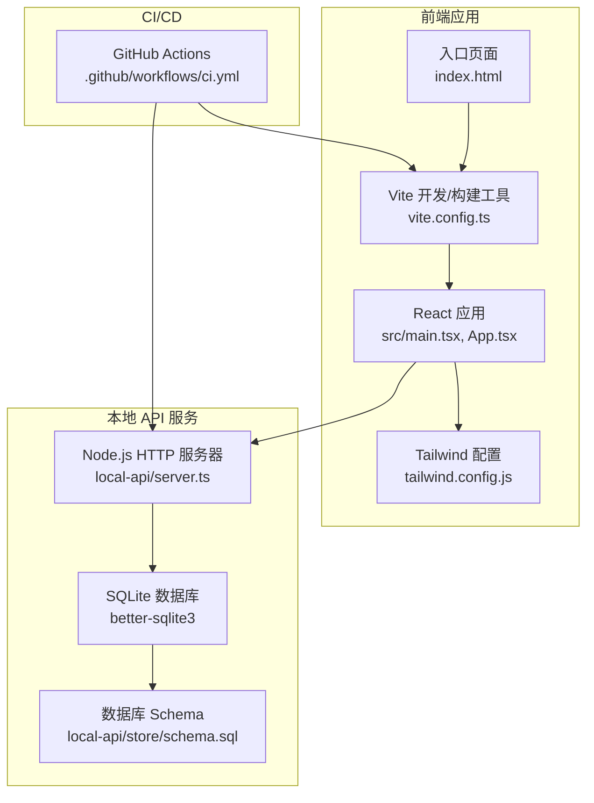
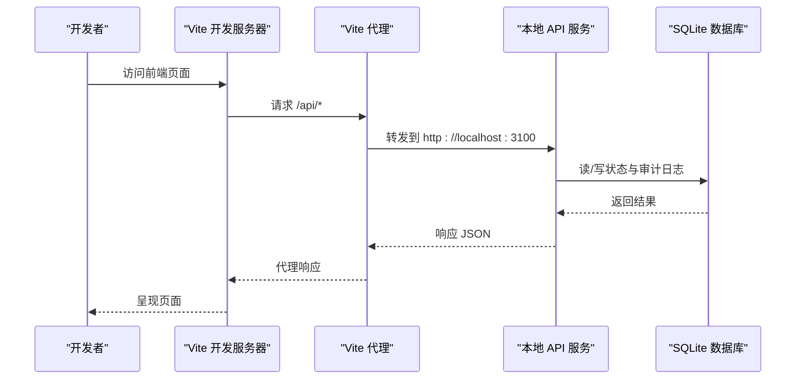
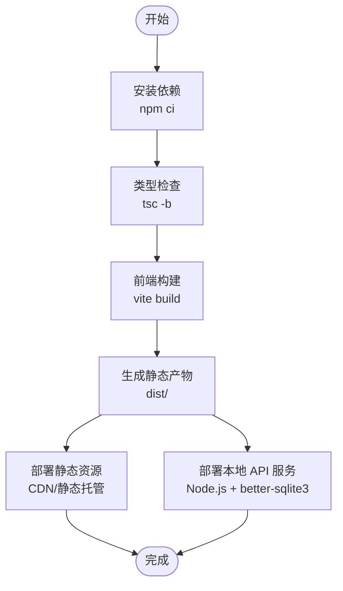
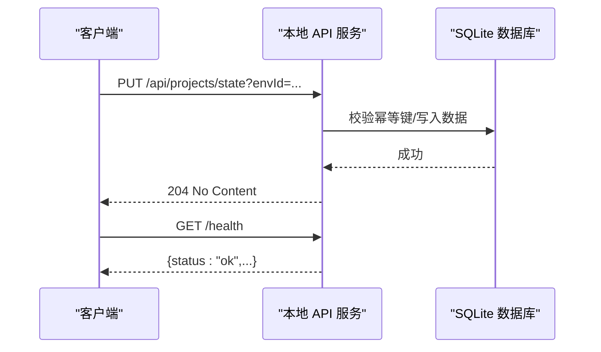
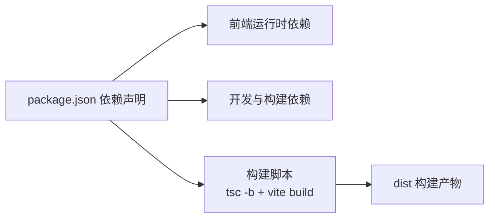

# 部署指南

<cite>
**本文引用的文件**
- [package.json](file://package.json)
- [vite.config.ts](file://vite.config.ts)
- [local-api/server.ts](file://local-api/server.ts)
- [local-api/store/sqlite.ts](file://local-api/store/sqlite.ts)
- [local-api/store/schema.sql](file://local-api/store/schema.sql)
- [.github/workflows/ci.yml](file://.github/workflows/ci.yml)
- [tsconfig.json](file://tsconfig.json)
- [tsconfig.app.json](file://tsconfig.app.json)
- [tsconfig.node.json](file://tsconfig.node.json)
- [tailwind.config.js](file://tailwind.config.js)
- [index.html](file://index.html)
- [CODEBUDDY.md](file://CODEBUDDY.md)
- [local-api/test-api.sh](file://local-api/test-api.sh)
- [vitest.config.ts](file://vitest.config.ts)
- [eslint.config.js](file://eslint.config.js)
</cite>

## 目录

1. [简介](#简介)
2. [项目结构](#项目结构)
3. [核心组件](#核心组件)
4. [架构总览](#架构总览)
5. [详细组件分析](#详细组件分析)
6. [依赖分析](#依赖分析)
7. [性能考虑](#性能考虑)
8. [故障排查指南](#故障排查指南)
9. [结论](#结论)
10. [附录](#附录)

## 简介

本指南面向运维团队，提供 CodeBuddy 项目的完整部署操作手册，涵盖环境配置、依赖安装、构建与部署、本地 API 服务部署、前端静态资源发布、Docker 容器化与云平台最佳实践、性能优化与监控集成建议。文档基于仓库中的实际配置与实现进行说明，确保可执行、可追溯。

## 项目结构

- 前端采用 Vite + React + TypeScript 架构，使用 React 插件与 TailwindCSS。
- 本地 API 服务基于 Node.js HTTP 服务器，使用 better-sqlite3 作为嵌入式数据库，提供五类状态接口与审计日志接口，并内置幂等性保障。
- 构建产物由 Vite 生成，支持代理与代码分割策略。
- CI 使用 GitHub Actions，在 Ubuntu 环境中执行安装、类型检查与构建。

**图表来源**

- [vite.config.ts:1-35](file://vite.config.ts#L1-L35)
- [local-api/server.ts:1-414](file://local-api/server.ts#L1-L414)
- [local-api/store/sqlite.ts:1-99](file://local-api/store/sqlite.ts#L1-L99)
- [.github/workflows/ci.yml:1-39](file://.github/workflows/ci.yml#L1-L39)

**章节来源**

- [package.json:1-48](file://package.json#L1-L48)
- [vite.config.ts:1-35](file://vite.config.ts#L1-L35)
- [local-api/server.ts:1-414](file://local-api/server.ts#L1-L414)
- [local-api/store/sqlite.ts:1-99](file://local-api/store/sqlite.ts#L1-L99)
- [.github/workflows/ci.yml:1-39](file://.github/workflows/ci.yml#L1-L39)

## 核心组件

- 前端构建与开发
  - 使用 Vite 进行开发与生产构建，支持 React 插件与代理配置。
  - 代码分割策略对 React 生态库进行独立打包，提升缓存命中率。
- 本地 API 服务
  - 提供项目/任务/验收/结算/审计五类状态接口，支持幂等写入。
  - 健康检查接口便于外部探活。
  - SQLite 存储，自动初始化表结构与索引。
- 类型与工具链
  - TypeScript 多配置文件组织，ESLint 与 Vitest 配置完善。
  - CI 在 Ubuntu 环境中执行安装、类型检查与构建。

**章节来源**

- [vite.config.ts:1-35](file://vite.config.ts#L1-L35)
- [local-api/server.ts:1-414](file://local-api/server.ts#L1-L414)
- [local-api/store/sqlite.ts:1-99](file://local-api/store/sqlite.ts#L1-L99)
- [tsconfig.json:1-8](file://tsconfig.json#L1-L8)
- [tsconfig.app.json:1-29](file://tsconfig.app.json#L1-L29)
- [tsconfig.node.json:1-27](file://tsconfig.node.json#L1-L27)
- [eslint.config.js:1-24](file://eslint.config.js#L1-L24)
- [vitest.config.ts:1-20](file://vitest.config.ts#L1-L20)

## 架构总览

前端通过 Vite 开发服务器与代理访问本地 API；生产构建后，静态资源由 Web 服务器或 CDN 提供；本地 API 服务负责状态持久化与幂等保障。

**图表来源**

- [vite.config.ts:7-14](file://vite.config.ts#L7-L14)
- [local-api/server.ts:18-399](file://local-api/server.ts#L18-L399)

## 详细组件分析

### 环境与依赖配置

- Node.js 版本
  - CI 使用 Node.js 20；建议生产与本地开发均使用 Node.js 20.x LTS。
- 系统依赖
  - 无系统级二进制依赖；前端构建与运行仅依赖 Node.js。
- 运行时配置
  - 本地 API 服务端口可通过环境变量 LOCAL_API_PORT 设置，默认 3100。
  - 前端代理目标地址为 http://localhost:3100，确保本地 API 服务已启动。

**章节来源**

- [.github/workflows/ci.yml:17-21](file://.github/workflows/ci.yml#L17-L21)
- [local-api/server.ts:18](file://local-api/server.ts#L18)
- [vite.config.ts:9-12](file://vite.config.ts#L9-L12)

### 依赖安装流程

- 生产依赖安装
  - 使用 npm ci 进行确定性安装，避免锁文件不一致。
- 构建优化与资源预处理
  - Vite 构建前先执行 TypeScript 编译，再进行前端打包。
  - 代码分割策略将 React 生态库单独打包，减少主包体积。
- 资源预处理
  - TailwindCSS 配置扫描 src 与 index.html，确保样式按需生成。
  - ESLint 与 Vitest 配置完善，保证质量门禁与覆盖率。

**章节来源**

- [.github/workflows/ci.yml:23-38](file://.github/workflows/ci.yml#L23-L38)
- [package.json:6-16](file://package.json#L6-L16)
- [vite.config.ts:15-33](file://vite.config.ts#L15-L33)
- [tailwind.config.js:1-12](file://tailwind.config.js#L1-L12)
- [eslint.config.js:1-24](file://eslint.config.js#L1-L24)
- [vitest.config.ts:1-20](file://vitest.config.ts#L1-L20)

### 构建与部署流程

- Vite 构建配置要点
  - 代理：将 /api 前缀转发至本地 API 服务地址。
  - 代码分割：手动分块策略将 React 生态库拆分为独立 vendor 包。
  - 警告阈值：提升 chunkSizeWarningLimit，配合懒加载降低误报。
- 静态资源处理
  - 构建产物由 Vite 生成，包含 HTML、JS、CSS、媒体资源等。
  - 建议在 CDN 或静态托管平台启用 gzip/br 压缩与缓存头。
- 部署包生成
  - 生产构建后，将 dist 目录作为静态站点发布；若需要 API，需同时部署本地 API 服务。

**图表来源**

- [.github/workflows/ci.yml:23-38](file://.github/workflows/ci.yml#L23-L38)
- [package.json:10](file://package.json#L10)
- [vite.config.ts:15-33](file://vite.config.ts#L15-L33)

**章节来源**

- [package.json:6-16](file://package.json#L6-L16)
- [vite.config.ts:15-33](file://vite.config.ts#L15-L33)
- [.github/workflows/ci.yml:23-38](file://.github/workflows/ci.yml#L23-L38)

### 本地 API 服务部署

- SQLite 数据库配置
  - 数据库存放于 local-api/store/local.db，首次启动会自动执行 schema.sql 初始化表结构与索引。
  - 启动时启用 WAL 模式以提升并发性能。
- 进程管理
  - 使用 Node.js 进程运行 local-api/server.ts；支持 SIGINT 优雅关闭，释放数据库连接。
- 健康检查
  - 提供 /health 接口返回服务状态，便于探活与编排。
- 幂等性
  - 通过 X-Idempotency-Key 头部实现幂等写入，内部记录幂等键并去重。

**图表来源**

- [local-api/server.ts:70-129](file://local-api/server.ts#L70-L129)
- [local-api/server.ts:331-334](file://local-api/server.ts#L331-L334)
- [local-api/store/sqlite.ts:18-42](file://local-api/store/sqlite.ts#L18-L42)

**章节来源**

- [local-api/server.ts:18-414](file://local-api/server.ts#L18-L414)
- [local-api/store/sqlite.ts:1-99](file://local-api/store/sqlite.ts#L1-L99)
- [local-api/store/schema.sql:1-72](file://local-api/store/schema.sql#L1-L72)

### 前端静态资源部署

- CDN 与缓存策略
  - 建议对静态资源启用强缓存（如一年），并使用内容指纹命名文件名以实现失效与更新。
  - 启用 gzip/br 压缩，合理设置 Cache-Control 与 ETag。
- 版本管理
  - 构建产物包含哈希文件名，推荐结合版本标签进行灰度发布。
- 入口与样式
  - index.html 作为入口，Tailwind 配置扫描 src 与根目录，确保样式正确注入。

**章节来源**

- [index.html:1-16](file://index.html#L1-L16)
- [tailwind.config.js:1-12](file://tailwind.config.js#L1-L12)
- [vite.config.ts:15-33](file://vite.config.ts#L15-L33)

### Docker 容器化部署指南

- 建议镜像
  - 使用 Node.js 20-alpine 或 Debian slim 作为基础镜像，减少镜像体积。
- 构建步骤
  - 复制 package\*.json，执行 npm ci --only=production。
  - 构建前端产物，复制 dist 至 Nginx/Apache 静态目录。
  - 启动本地 API 服务进程（可与前端在同一容器或分离容器）。
- 端口与卷
  - 暴露静态服务端口（如 80）与本地 API 端口（默认 3100）。
  - 将 SQLite 数据库存放在持久化卷中，避免容器重启丢失。
- 健康检查
  - 使用 /health 接口进行探活，结合重启策略与副本数。

[本节为通用容器化建议，不直接分析具体文件，故不附加“章节来源”]

### 云平台部署最佳实践

- 选择静态托管平台（如 Vercel、Cloudflare Pages、AWS S3 + CloudFront）发布前端产物。
- 本地 API 可部署于云函数/容器服务（如 AWS Lambda、Google Cloud Run、Azure Container Apps），注意数据库持久化与网络连通性。
- 使用环境变量区分环境（如 LOCAL_API_PORT、数据库路径），并启用密钥管理服务。
- 配置蓝绿/金丝雀发布策略，结合健康检查与回滚机制。

[本节为通用云平台建议，不直接分析具体文件，故不附加“章节来源”]

## 依赖分析

- 前端依赖
  - React 19、React DOM 19、Vite 8、@vitejs/plugin-react、TailwindCSS 4、better-sqlite3（运行时依赖）。
- 开发依赖
  - TypeScript ~5.9、ESLint、Vitest、PostCSS、autoprefixer、concurrently、tsx 等。
- 构建与类型
  - package.json 中先执行 tsc -b 再 vite build，确保类型安全与打包一致性。

**图表来源**

- [package.json:17-46](file://package.json#L17-L46)
- [package.json:6-16](file://package.json#L6-L16)

**章节来源**

- [package.json:17-46](file://package.json#L17-L46)
- [package.json:6-16](file://package.json#L6-L16)

## 性能考虑

- 代码分割
  - 将 React 生态库拆分为独立 vendor 包，提升长期缓存命中率。
- 构建体积
  - 合理使用懒加载与按需引入，控制主包大小；提升 chunkSizeWarningLimit 以减少误报。
- 数据库
  - 启用 WAL 模式提升并发读写性能；定期清理过期幂等键。
- 网络与缓存
  - 静态资源启用强缓存与压缩；CDN 边缘节点就近分发。

**章节来源**

- [vite.config.ts:15-33](file://vite.config.ts#L15-L33)
- [local-api/store/sqlite.ts:32-42](file://local-api/store/sqlite.ts#L32-L42)
- [local-api/store/sqlite.ts:68-80](file://local-api/store/sqlite.ts#L68-L80)

## 故障排查指南

- 本地 API 无法访问
  - 检查 LOCAL_API_PORT 是否被占用；确认 /api 代理指向 http://localhost:3100。
- 数据库初始化失败
  - 确认 local.db 与 schema.sql 存在且可读；检查目录权限。
- 幂等写入无效
  - 确认请求头 X-Idempotency-Key 正确传递；检查幂等键是否过期。
- 健康检查失败
  - 访问 /health 接口，查看返回状态；检查进程是否正常监听。
- 本地 API 接口测试
  - 使用提供的脚本对五类状态接口与审计日志进行端到端验证。

**章节来源**

- [local-api/server.ts:18-399](file://local-api/server.ts#L18-L399)
- [local-api/store/sqlite.ts:18-42](file://local-api/store/sqlite.ts#L18-L42)
- [local-api/test-api.sh:1-156](file://local-api/test-api.sh#L1-156)

## 结论

本指南提供了从环境准备、依赖安装、构建部署到本地 API 与前端静态资源发布的全流程说明。结合 Docker 与云平台最佳实践，可实现稳定、可扩展、可观测的交付体系。建议在生产环境中配套监控与日志采集，持续优化缓存与构建策略。

## 附录

- 常用命令参考
  - 安装依赖：npm ci
  - 本地开发：npm run dev
  - 生产构建：npm run build
  - 本地预览：npm run preview
  - 代码检查：npm run lint
  - 单元测试：npm run test / npm run test:run / npm run test:coverage
- TypeScript 与工具链
  - 多配置文件组织，ESLint 与 Vitest 配置完善，确保质量门禁与覆盖率。

**章节来源**

- [CODEBUDDY.md:3-22](file://CODEBUDDY.md#L3-L22)
- [tsconfig.json:1-8](file://tsconfig.json#L1-L8)
- [tsconfig.app.json:1-29](file://tsconfig.app.json#L1-L29)
- [tsconfig.node.json:1-27](file://tsconfig.node.json#L1-L27)
- [eslint.config.js:1-24](file://eslint.config.js#L1-L24)
- [vitest.config.ts:1-20](file://vitest.config.ts#L1-L20)
