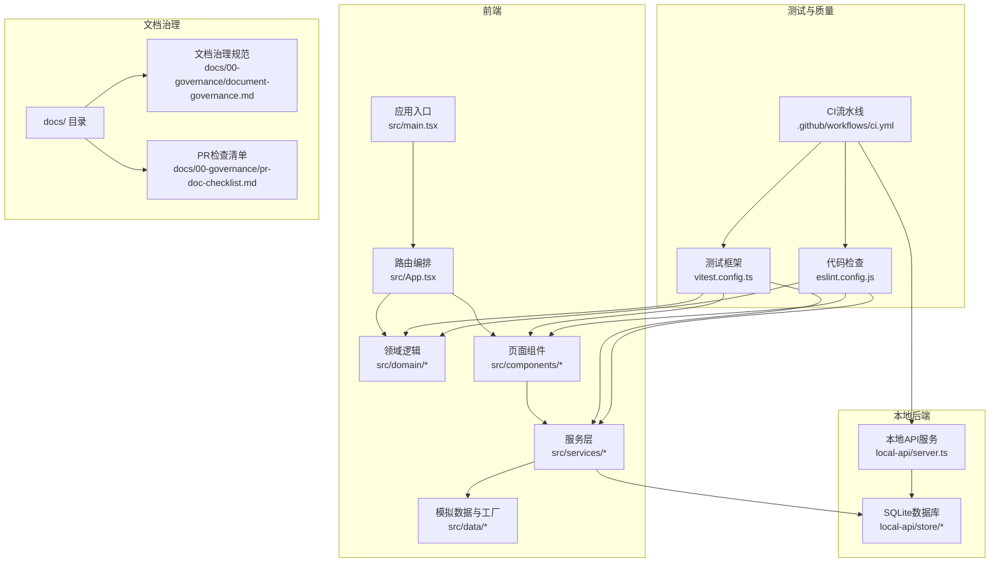
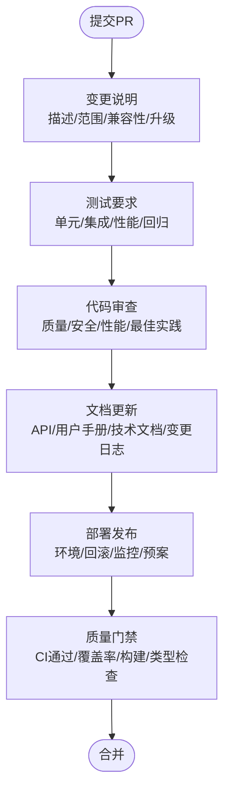
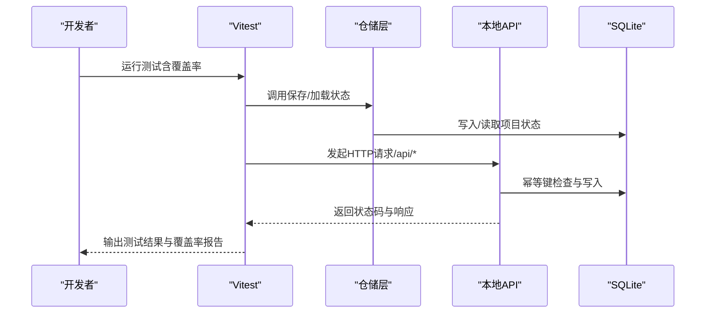
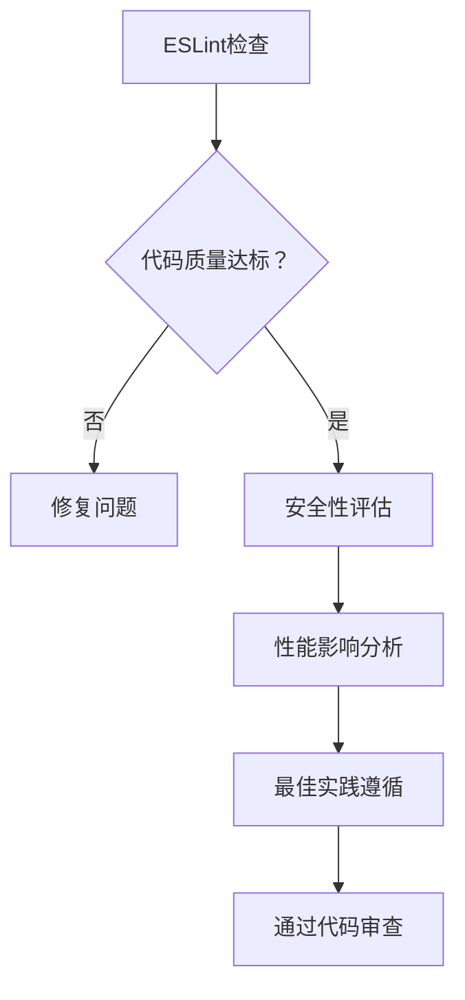
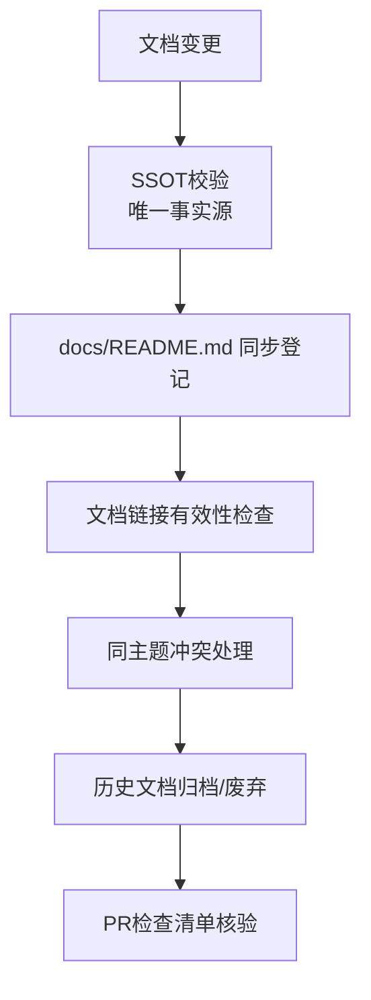
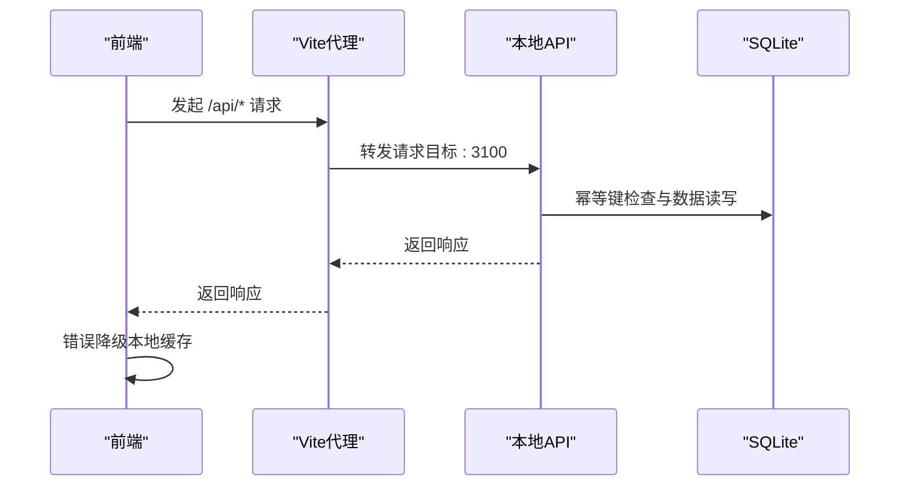
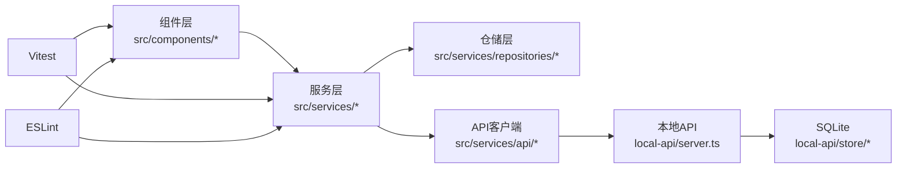

# PR文档检查清单

<cite>
**本文档引用的文件**
- [README.md](file://README.md)
- [CODEBUDDY.md](file://CODEBUDDY.md)
- [DESIGN_SPECIFICATION.md](file://DESIGN_SPECIFICATION.md)
- [docs/00-governance/pr-doc-checklist.md](file://docs/00-governance/pr-doc-checklist.md)
- [docs/00-governance/document-governance.md](file://docs/00-governance/document-governance.md)
- [docs/00-governance/design-specification.md](file://docs/00-governance/design-specification.md)
- [.github/workflows/ci.yml](file://.github/workflows/ci.yml)
- [package.json](file://package.json)
- [vitest.config.ts](file://vitest.config.ts)
- [eslint.config.js](file://eslint.config.js)
- [vite.config.ts](file://vite.config.ts)
- [src/services/errors/StructuredError.ts](file://src/services/errors/StructuredError.ts)
- [src/domain/__tests__/projectStatusMachine.test.ts](file://src/domain/__tests__/projectStatusMachine.test.ts)
- [src/services/__tests__/projectRepository.test.ts](file://src/services/__tests__/projectRepository.test.ts)
- [local-api/server.ts](file://local-api/server.ts)
</cite>

## 目录

1. [简介](#简介)
2. [项目结构](#项目结构)
3. [核心组件](#核心组件)
4. [架构总览](#架构总览)
5. [详细组件分析](#详细组件分析)
6. [依赖关系分析](#依赖关系分析)
7. [性能考虑](#性能考虑)
8. [故障排查指南](#故障排查指南)
9. [结论](#结论)
10. [附录](#附录)

## 简介

本检查清单面向CodeBuddy项目的Pull Request（PR）质量保证流程，覆盖变更说明要求、测试要求、代码审查标准、文档更新要求、部署与发布流程以及PR模板与检查清单工具使用指南。目标是确保每次变更都经过完整的质量门禁与合规审查，降低回归风险，提升交付质量与可维护性。

## 项目结构

项目采用前端React + Vite + TypeScript架构，结合本地Express后端（SQLite）与测试框架（Vitest + @testing-library），并通过GitHub Actions执行CI质量门禁。文档治理采用docs/目录统一管理，并建立单一事实源（SSOT）与状态治理。

**图表来源**

- [README.md:55-113](file://README.md#L55-L113)
- [.github/workflows/ci.yml:1-39](file://.github/workflows/ci.yml#L1-L39)
- [local-api/server.ts:1-414](file://local-api/server.ts#L1-L414)

**章节来源**

- [README.md:55-113](file://README.md#L55-L113)
- [CODEBUDDY.md:23-90](file://CODEBUDDY.md#L23-L90)

## 核心组件

- 应用入口与路由编排：应用入口为src/main.tsx，路由编排集中在src/App.tsx，采用Hash路由驱动多页面。
- 领域逻辑：项目状态机驱动状态流转，守卫逻辑与状态转换在src/domain/projectStatusMachine.ts中定义。
- 服务层：API客户端与服务适配器位于src/services/api/，仓储层位于src/services/repositories/，统一错误模型位于src/services/errors/StructuredError.ts。
- 本地后端：local-api/server.ts提供五条核心接口，支持幂等键与SQLite存储。
- 测试体系：Vitest + @testing-library/react，覆盖状态机守卫、仓储层持久化与错误处理模型。
- 文档治理：docs/目录作为唯一文档域，建立SSOT与状态治理。

**章节来源**

- [CODEBUDDY.md:25-52](file://CODEBUDDY.md#L25-L52)
- [README.md:115-200](file://README.md#L115-L200)
- [local-api/server.ts:70-329](file://local-api/server.ts#L70-L329)
- [src/services/errors/StructuredError.ts:1-195](file://src/services/errors/StructuredError.ts#L1-L195)

## 架构总览

PR质量保证贯穿以下关键环节：

- 变更说明：明确变更描述、影响范围、兼容性与升级注意事项。
- 测试验证：单元测试、集成测试、性能测试与回归测试。
- 代码审查：代码质量、安全性、性能影响与最佳实践。
- 文档更新：API文档、用户手册、技术文档与变更日志。
- 部署发布：环境准备、回滚策略、监控指标与问题预案。
- 工具链：ESLint、Vitest、CI流水线与文档检查清单。

[此图为概念性流程示意，无需图表来源]

## 详细组件分析

### 变更说明要求

- 变更描述：清晰说明变更动机、范围与预期效果，避免模糊表述。
- 影响范围评估：识别对前端组件、服务层、仓储层、本地后端与文档的影响。
- 兼容性影响分析：评估对现有API、状态机守卫、UI设计系统与本地缓存的兼容性。
- 升级注意事项：列出迁移步骤、破坏性变更与回退策略。

**章节来源**

- [README.md:167-200](file://README.md#L167-L200)
- [DESIGN_SPECIFICATION.md:12-21](file://DESIGN_SPECIFICATION.md#L12-L21)

### 测试要求

- 单元测试覆盖率：确保关键域（状态机、仓储层、错误模型）的测试用例覆盖。
- 集成测试验证：验证前端与本地后端的联调，包括幂等键、状态快照与审计日志。
- 性能测试结果：关注首屏加载、主包体积与懒加载策略。
- 回归测试执行情况：功能回归、性能回归与测试回归清单逐项核对。

**图表来源**

- [vitest.config.ts:1-20](file://vitest.config.ts#L1-L20)
- [src/services/**tests**/projectRepository.test.ts:1-122](file://src/services/__tests__/projectRepository.test.ts#L1-L122)
- [local-api/server.ts:70-329](file://local-api/server.ts#L70-L329)

**章节来源**

- [README.md:167-180](file://README.md#L167-L180)
- [README.md:244-274](file://README.md#L244-L274)
- [vitest.config.ts:1-20](file://vitest.config.ts#L1-L20)

### 代码审查标准

- 代码质量检查：遵循ESLint规则，确保TypeScript类型正确与React Hooks使用规范。
- 安全性评估：检查幂等键使用、CORS配置与错误日志输出，避免敏感信息泄露。
- 性能影响分析：关注组件懒加载、代码分割与构建产物体积。
- 最佳实践遵循：统一错误模型、状态机守卫、UI设计系统变量与文档治理规范。

**图表来源**

- [eslint.config.js:1-24](file://eslint.config.js#L1-L24)
- [vite.config.ts:1-35](file://vite.config.ts#L1-L35)
- [src/services/errors/StructuredError.ts:1-195](file://src/services/errors/StructuredError.ts#L1-L195)

**章节来源**

- [eslint.config.js:1-24](file://eslint.config.js#L1-L24)
- [DESIGN_SPECIFICATION.md:24-165](file://DESIGN_SPECIFICATION.md#L24-L165)

### 文档更新要求

- API文档同步：更新本地后端接口说明与请求头（如X-Idempotency-Key）。
- 用户手册更新：涉及UI变更时同步用户操作流程与界面说明。
- 技术文档维护：更新架构说明、设计规范与开发指南。
- 变更日志记录：在docs/README.md中登记新增/变更文档，并通过PR检查清单核验。

**图表来源**

- [docs/00-governance/document-governance.md:1-63](file://docs/00-governance/document-governance.md#L1-L63)
- [docs/00-governance/pr-doc-checklist.md:1-25](file://docs/00-governance/pr-doc-checklist.md#L1-L25)

**章节来源**

- [docs/00-governance/document-governance.md:1-63](file://docs/00-governance/document-governance.md#L1-L63)
- [docs/00-governance/pr-doc-checklist.md:1-25](file://docs/00-governance/pr-doc-checklist.md#L1-L25)

### 部署与发布流程

- 环境准备：本地后端服务启动与前端开发服务器联调，代理配置指向本地API。
- 回滚策略：幂等键保障重复请求安全，错误降级到本地缓存，UI触发降级事件。
- 监控指标：首屏加载、主包体积、测试用例数量与构建产物数量。
- 问题处理预案：网络错误降级、错误日志追踪与常见问题排查清单。

**图表来源**

- [vite.config.ts:7-14](file://vite.config.ts#L7-L14)
- [local-api/server.ts:338-386](file://local-api/server.ts#L338-L386)
- [README.md:201-243](file://README.md#L201-L243)

**章节来源**

- [README.md:137-155](file://README.md#L137-L155)
- [README.md:201-243](file://README.md#L201-L243)

### PR模板与检查清单工具使用

- PR模板：建议包含变更说明、影响范围、兼容性与升级注意事项、测试验证与回归清单。
- 检查清单工具：使用docs/00-governance/pr-doc-checklist.md逐项核验，确保文档治理合规。
- CI质量门禁：ESLint、类型检查与构建通过后方可合并。

**章节来源**

- [docs/00-governance/pr-doc-checklist.md:1-25](file://docs/00-governance/pr-doc-checklist.md#L1-L25)
- [.github/workflows/ci.yml:26-38](file://.github/workflows/ci.yml#L26-L38)

## 依赖关系分析

- 组件耦合：组件通过服务层访问仓储层，仓储层依赖SQLite存储；本地API服务统一对外提供REST接口。
- 外部依赖：Vitest、ESLint、React、TypeScript与Tailwind CSS。
- CI依赖：Node.js版本、npm缓存与ESLint核心规则集。

**图表来源**

- [README.md:55-90](file://README.md#L55-L90)
- [local-api/server.ts:1-414](file://local-api/server.ts#L1-L414)

**章节来源**

- [README.md:55-90](file://README.md#L55-L90)
- [package.json:1-48](file://package.json#L1-L48)

## 性能考虑

- 懒加载策略：14+页面组件按需加载，React vendor独立chunk，主包体积优化。
- 首屏加载：首屏体积显著下降，构建产物数量增加以支持按需加载。
- 代码分割：手动分块策略将React生态库独立打包，提升缓存命中率。
- 测试性能：Vitest覆盖率报告与测试运行时间需纳入回归评估。

**章节来源**

- [README.md:156-166](file://README.md#L156-L166)
- [README.md:300-308](file://README.md#L300-L308)
- [vite.config.ts:15-33](file://vite.config.ts#L15-L33)

## 故障排查指南

- 网络请求失败：检查本地后端是否启动、Vite代理配置与CORS头。
- 状态流转失败：检查守卫条件与项目里程碑、任务树、验收结果等字段。
- 本地缓存不一致：清空localStorage并重新加载数据，验证仓储层loadState返回值。
- 错误日志追踪：统一StructuredError模型提供可追踪日志字符串与JSON序列化。

**章节来源**

- [README.md:227-243](file://README.md#L227-L243)
- [src/services/errors/StructuredError.ts:54-88](file://src/services/errors/StructuredError.ts#L54-L88)

## 结论

通过完善的PR文档检查清单与质量保证流程，CodeBuddy项目能够在变更过程中保持一致性、可追溯性与高质量交付。建议在每次PR中严格执行变更说明、测试验证、代码审查与文档更新四项要求，并结合CI质量门禁与本地后端联调，确保系统稳定与用户体验。

## 附录

- 常用命令与开发指南：安装依赖、本地开发、生产构建、代码检查与单文件校验。
- 设计规范与组件开发SOP：色彩系统、字体系统、间距系统、圆角与阴影、布局规范与组件开发流程。
- 测试回归清单：功能回归、性能回归、测试回归与错误处理回归。

**章节来源**

- [CODEBUDDY.md:3-22](file://CODEBUDDY.md#L3-L22)
- [DESIGN_SPECIFICATION.md:24-472](file://DESIGN_SPECIFICATION.md#L24-L472)
- [README.md:244-274](file://README.md#L244-L274)
