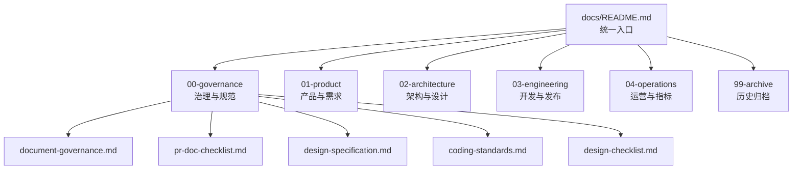
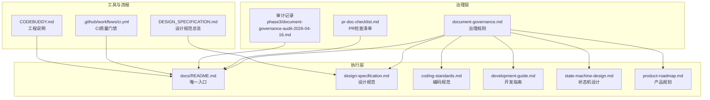
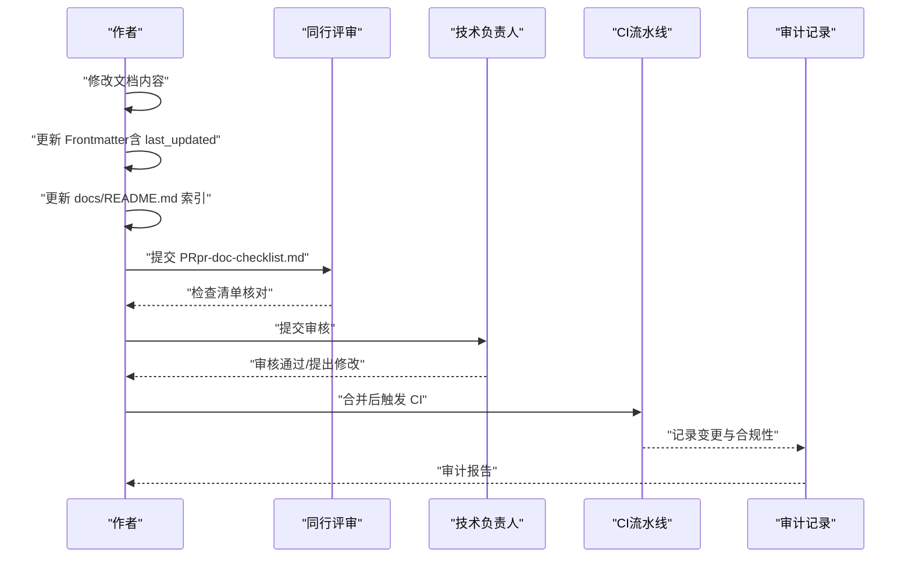
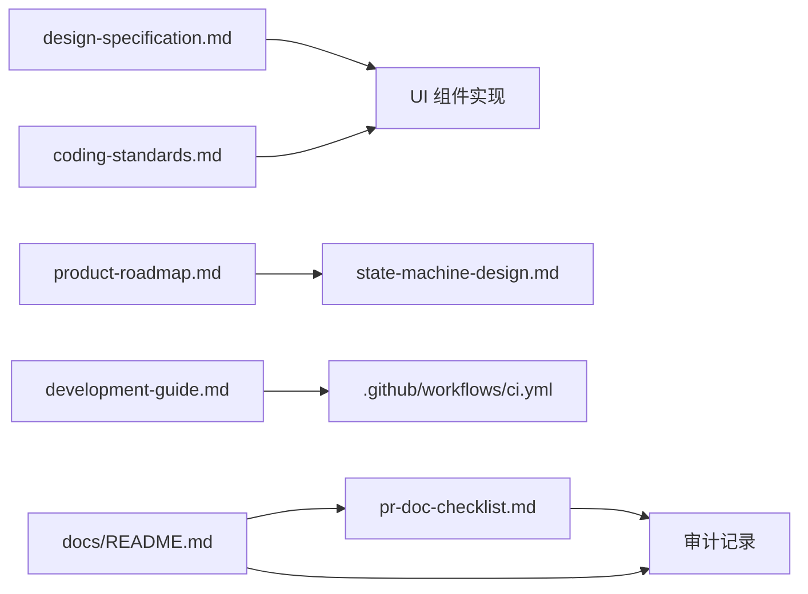

# 文档治理

<cite>
**本文引用的文件**   
- [文档治理规范](file://docs/00-governance/document-governance.md)
- [设计规范](file://docs/00-governance/design-specification.md)
- [设计检查清单](file://docs/00-governance/design-checklist.md)
- [编码规范](file://docs/00-governance/coding-standards.md)
- [文档治理PR检查清单](file://docs/00-governance/pr-doc-checklist.md)
- [文档中心（统一入口）](file://docs/README.md)
- [产品规划文档](file://docs/01-product/product-roadmap.md)
- [状态机设计说明](file://docs/02-architecture/state-machine-design.md)
- [开发指南](file://docs/03-engineering/development-guide.md)
- [CI流水线](file://.github/workflows/ci.yml)
- [CODEBUDDY.md](file://CODEBUDDY.md)
- [设计规范总览](file://DESIGN_SPECIFICATION.md)
- [文档治理首轮审计记录（2026-04-16）](file://docs/04-operations/phase3/document-governance-audit-2026-04-16.md)
</cite>

## 目录

1. [简介](#简介)
2. [项目结构](#项目结构)
3. [核心组件](#核心组件)
4. [架构总览](#架构总览)
5. [详细组件分析](#详细组件分析)
6. [依赖分析](#依赖分析)
7. [性能考虑](#性能考虑)
8. [故障排查指南](#故障排查指南)
9. [结论](#结论)
10. [附录](#附录)

## 简介

本文件为 CodeBuddy 项目的“文档治理”专项文档，旨在建立统一的文档编写规范、版本管理机制、审核流程、分类体系与维护责任，确保文档的唯一事实源（SSOT）、一致性与可追溯性。文档治理以 docs/ 为唯一域，以 docs/README.md 为导航入口，通过 Frontmatter 元数据、状态模型与变更流程，实现文档的规范化与可审计化。

## 项目结构

- 文档域划分
  - 00-governance：治理规则、设计规范、编码规范、PR检查清单
  - 01-product：产品规划与需求文档
  - 02-architecture：架构与技术设计文档
  - 03-engineering：开发、联调、回归、发布文档
  - 04-operations：阶段运营与治理指标文档
  - 99-archive：历史归档（不作为执行依据）

- 统一入口
  - docs/README.md 作为唯一导航入口，登记所有 active 文档索引，要求新增/修改 active 文档必须同步更新索引。

图表来源

- [文档中心（统一入口）:1-63](file://docs/README.md#L1-L63)
- [文档治理规范:21-28](file://docs/00-governance/document-governance.md#L21-L28)

章节来源

- [文档中心（统一入口）:1-63](file://docs/README.md#L1-L63)
- [文档治理规范:21-28](file://docs/00-governance/document-governance.md#L21-L28)

## 核心组件

- 唯一事实源（SSOT）与状态治理
  - 以 docs/ 为唯一文档域，以 docs/README.md 为导航入口，避免重复与歧义。
  - 文档状态模型：draft（草稿，禁止执行）、active（执行版本，唯一事实源）、deprecated（废弃，保留追溯）、archived（归档，仅历史查询）。

- Frontmatter 最低要求
  - active 文档必须包含：id、title、owner、status、last_updated、source_of_truth、related_code、related_docs。

- 引用规则
  - 统一使用 docs/... 路径；根目录仅允许入口级说明文档，禁止新增业务规范文档；同主题仅允许一个 active 文档。

- 变更流程
  - 修改内容 → 更新 Frontmatter（尤其 last_updated）→ 更新 docs/README.md 索引 → 通过 pr-doc-checklist.md 检查 → 合并后记录至审计文档。

章节来源

- [文档治理规范:15-20](file://docs/00-governance/document-governance.md#L15-L20)
- [文档治理规范:30-36](file://docs/00-governance/document-governance.md#L30-L36)
- [文档治理规范:37-49](file://docs/00-governance/document-governance.md#L37-L49)
- [文档治理规范:50-55](file://docs/00-governance/document-governance.md#L50-L55)
- [文档治理规范:56-63](file://docs/00-governance/document-governance.md#L56-L63)
- [文档治理PR检查清单:1-25](file://docs/00-governance/pr-doc-checklist.md#L1-L25)

## 架构总览

文档治理的运行架构由“规则制定—执行—审计—归档”构成，贯穿产品、架构、工程与运营各层文档。

图表来源

- [文档治理规范:1-63](file://docs/00-governance/document-governance.md#L1-L63)
- [文档治理PR检查清单:1-25](file://docs/00-governance/pr-doc-checklist.md#L1-L25)
- [文档中心（统一入口）:1-63](file://docs/README.md#L1-L63)
- [设计规范:1-472](file://docs/00-governance/design-specification.md#L1-L472)
- [编码规范:1-872](file://docs/00-governance/coding-standards.md#L1-L872)
- [开发指南:1-601](file://docs/03-engineering/development-guide.md#L1-L601)
- [状态机设计说明:1-896](file://docs/02-architecture/state-machine-design.md#L1-L896)
- [产品规划文档:1-1074](file://docs/01-product/product-roadmap.md#L1-L1074)
- [CI流水线:1-39](file://.github/workflows/ci.yml#L1-L39)
- [CODEBUDDY.md:1-90](file://CODEBUDDY.md#L1-L90)
- [设计规范总览:1-16](file://DESIGN_SPECIFICATION.md#L1-L16)
- [文档治理首轮审计记录（2026-04-16）:1-34](file://docs/04-operations/phase3/document-governance-audit-2026-04-16.md#L1-L34)

## 详细组件分析

### 文档结构标准与内容质量要求

- 结构标准
  - 采用统一 Frontmatter，包含 id、title、owner、status、last_updated、source_of_truth、related_code、related_docs。
  - 文档标题与目录层次清晰，避免冗余与重复。
  - 仅在 docs/ 目录新增或修改业务文档；根目录仅保留入口级说明。

- 内容质量要求
  - 以设计规范与编码规范为执行口径，确保视觉与实现一致。
  - 产品文档需覆盖业务目标、角色场景、对象定义、任务结构、标准绑定、状态机、权限、异常处理与验收标准。
  - 架构文档需明确状态机、数据模型、API 接口与前后端实现说明。
  - 工程文档需包含开发指南、集成指南、回归检查清单与发布流程。

章节来源

- [文档治理规范:37-49](file://docs/00-governance/document-governance.md#L37-L49)
- [文档治理规范:50-55](file://docs/00-governance/document-governance.md#L50-L55)
- [设计规范:1-472](file://docs/00-governance/design-specification.md#L1-L472)
- [编码规范:1-872](file://docs/00-governance/coding-standards.md#L1-L872)
- [产品规划文档:463-562](file://docs/01-product/product-roadmap.md#L463-L562)
- [状态机设计说明:1-896](file://docs/02-architecture/state-machine-design.md#L1-L896)
- [开发指南:1-601](file://docs/03-engineering/development-guide.md#L1-L601)

### 语言风格统一与格式规范

- 语言风格
  - 采用中文表述，术语统一，避免口语化与歧义。
  - 产品文档强调业务价值与闭环；技术文档强调可执行与可审计。

- 格式规范
  - 使用 docs/... 绝对路径引用；避免相对路径与断链。
  - 目录与标题层级清晰；表格与代码块使用一致的缩进与换行。
  - 设计规范与编码规范作为执行口径，所有实现需与之对齐。

章节来源

- [文档治理规范:50-55](file://docs/00-governance/document-governance.md#L50-L55)
- [设计规范:1-472](file://docs/00-governance/design-specification.md#L1-L472)
- [编码规范:1-872](file://docs/00-governance/coding-standards.md#L1-L872)

### 文档版本管理机制

- 版本号规则
  - 文档采用语义化版本（语义化版本号），版本号与更新日期在 Frontmatter 中维护。
  - 设计规范与编码规范在文档头包含版本与最后更新信息，作为执行补充与基线。

- 变更记录
  - active 文档更新 last_updated；历史版本通过 archived 或 deprecated 状态保留。
  - 审计记录文档记录迁移与合规性检查结果。

- 版本发布流程
  - 变更流程：修改内容 → 更新 Frontmatter → 更新 docs/README.md → PR 检查 → 合并 → 审计记录。
  - CI 质量门禁：ESLint 核心文件检查、类型与构建验证、阶段文档完整性校验。

- 向后兼容性保证
  - 通过设计规范与编码规范的 SSOT 角色，确保变更不影响既定实现。
  - deprecated 文档保留追溯，避免断链；archived 文档仅用于历史查询。

章节来源

- [文档治理规范:56-63](file://docs/00-governance/document-governance.md#L56-L63)
- [设计规范:14-20](file://docs/00-governance/design-specification.md#L14-L20)
- [编码规范:14-17](file://docs/00-governance/coding-standards.md#L14-L17)
- [CI流水线:26-38](file://.github/workflows/ci.yml#L26-L38)
- [文档治理首轮审计记录（2026-04-16）:22-27](file://docs/04-operations/phase3/document-governance-audit-2026-04-16.md#L22-L27)

### 文档审核流程

- 作者责任
  - 负责文档内容准确性、引用路径有效性与 Frontmatter 完整性。
  - 负责同步更新 docs/README.md 索引与相关文档关联。

- 同行评审
  - 通过 pr-doc-checklist.md 进行自检，确保：
    - 仅在 docs/ 目录新增或修改业务文档；
    - active 文档 Frontmatter 字段完整；
    - docs/README.md 已同步登记；
    - 文档链接均为有效 docs/... 路径；
    - 同主题无多份 active 冲突文档；
    - 历史文档已迁入 archive 或标记 deprecated；
    - 若影响设计规范，已同步 design-specification 与 design-checklist。

- 技术负责人审核与发布权限管理
  - CI 质量门禁：ESLint 核心文件检查、类型与构建验证、阶段文档完整性校验。
  - 发布权限：仅维护者可合并 PR；合并后记录至审计文档，确保可追溯。

图表来源

- [文档治理PR检查清单:16-25](file://docs/00-governance/pr-doc-checklist.md#L16-L25)
- [CI流水线:26-38](file://.github/workflows/ci.yml#L26-L38)
- [文档治理首轮审计记录（2026-04-16）:22-34](file://docs/04-operations/phase3/document-governance-audit-2026-04-16.md#L22-L34)

章节来源

- [文档治理PR检查清单:16-25](file://docs/00-governance/pr-doc-checklist.md#L16-L25)
- [CI流水线:26-38](file://.github/workflows/ci.yml#L26-L38)

### 文档分类体系

- 功能文档（01-product）
  - 产品规划与需求文档，覆盖工作台、项目管理、任务中心、标准管理、采购管理、验收整改、资产管理、人员管理、系统设置、合同结算、数据中心等模块。
  - 需遵循产品文档结构：文档头信息、模块概述、角色与场景、业务对象定义、任务结构设计、标准绑定设计、页面结构与功能点、状态机设计、权限与角色控制、异常与人工介入、埋点与验收标准。

- 技术文档（02-architecture）
  - 架构与技术设计文档，包括状态机设计、任务树建模、结构化标准库、项目规则、多智能体技术设计等。
  - 需明确状态机、数据模型、API 接口与前后端实现说明。

- 工程文档（03-engineering）
  - 开发、联调、回归、发布文档，包括开发指南、集成指南、回归检查清单、发布检查清单与飞书发布运行手册。
  - 需包含开发环境、后端/前端开发、数据库开发、设计规范遵循、常见问题与部署指南。

- 运维文档（04-operations）
  - 阶段运营与治理指标文档，包括端到端检查清单、协作矩阵、可行性评估、周治理指标与阶段性回顾与提案。
  - 需记录审计范围、结论与风险处置建议。

- 管理文档（00-governance）
  - 治理规则、设计规范、编码规范与 PR 检查清单，作为执行口径与质量门禁。

章节来源

- [文档中心（统一入口）:6-56](file://docs/README.md#L6-L56)
- [产品规划文档:463-562](file://docs/01-product/product-roadmap.md#L463-L562)
- [状态机设计说明:1-896](file://docs/02-architecture/state-machine-design.md#L1-L896)
- [开发指南:1-601](file://docs/03-engineering/development-guide.md#L1-L601)
- [设计规范:1-472](file://docs/00-governance/design-specification.md#L1-L472)
- [编码规范:1-872](file://docs/00-governance/coding-standards.md#L1-L872)

### 文档维护责任

- 责任人分配
  - 每份文档在 Frontmatter 中指定 owner，负责内容维护与更新。
  - 设计规范与编码规范作为 SSOT，由维护团队负责校验与更新。

- 更新频率要求
  - active 文档需定期更新 last_updated；变更后同步更新 docs/README.md 索引。
  - 设计规范与编码规范在执行补充中明确更新节奏与基线。

- 废弃文档处理
  - 同主题冲突文档需标记 deprecated 或迁移到 99-archive。
  - 审计记录文档记录迁移与断链处置。

- 文档生命周期管理
  - draft → active（唯一事实源）→ deprecated（保留追溯）→ archived（仅历史查询）。
  - 生命周期状态与维护要求在治理规范中明确。

章节来源

- [文档治理规范:3-8](file://docs/00-governance/document-governance.md#L3-L8)
- [文档治理规范:30-36](file://docs/00-governance/document-governance.md#L30-L36)
- [文档治理规范:56-63](file://docs/00-governance/document-governance.md#L56-L63)
- [设计规范总览:3-6](file://DESIGN_SPECIFICATION.md#L3-L6)
- [文档治理首轮审计记录（2026-04-16）:22-34](file://docs/04-operations/phase3/document-governance-audit-2026-04-16.md#L22-L34)

### 文档工具链配置

- 文档生成工具
  - 采用 Markdown 文档与静态站点生成（结合 docs/README.md 作为导航入口）。
  - 设计规范与编码规范作为执行口径，确保实现与设计一致。

- 版本控制系统
  - 以 Git 为版本控制，PR 审核与 CI 质量门禁保障变更合规。
  - Frontmatter 与状态模型确保文档可追踪与可审计。

- 发布平台使用指南
  - 文档发布遵循 PR 检查清单与 CI 流水线，确保设计规范与编码规范得到执行。
  - 飞书发布运行手册（feishu-publish-runbook.md）作为发布流程参考。

章节来源

- [开发指南:590-596](file://docs/03-engineering/development-guide.md#L590-L596)
- [CI流水线:1-39](file://.github/workflows/ci.yml#L1-L39)
- [设计规范:1-472](file://docs/00-governance/design-specification.md#L1-L472)
- [编码规范:1-872](file://docs/00-governance/coding-standards.md#L1-L872)

## 依赖分析

- 组件耦合与协作
  - 设计规范与编码规范作为 SSOT，驱动前端实现与视觉基线。
  - 产品规划文档与状态机设计文档共同定义业务闭环与状态流转。
  - 开发指南与 CI 流水线共同保障开发质量与构建稳定性。
  - PR 检查清单与审计记录确保变更合规与可追溯。

图表来源

- [设计规范:1-472](file://docs/00-governance/design-specification.md#L1-L472)
- [编码规范:1-872](file://docs/00-governance/coding-standards.md#L1-L872)
- [产品规划文档:1-1074](file://docs/01-product/product-roadmap.md#L1-L1074)
- [状态机设计说明:1-896](file://docs/02-architecture/state-machine-design.md#L1-L896)
- [开发指南:1-601](file://docs/03-engineering/development-guide.md#L1-L601)
- [CI流水线:1-39](file://.github/workflows/ci.yml#L1-L39)
- [文档治理PR检查清单:1-25](file://docs/00-governance/pr-doc-checklist.md#L1-L25)
- [文档中心（统一入口）:1-63](file://docs/README.md#L1-L63)

章节来源

- [设计规范:1-472](file://docs/00-governance/design-specification.md#L1-L472)
- [编码规范:1-872](file://docs/00-governance/coding-standards.md#L1-L872)
- [产品规划文档:1-1074](file://docs/01-product/product-roadmap.md#L1-L1074)
- [状态机设计说明:1-896](file://docs/02-architecture/state-machine-design.md#L1-L896)
- [开发指南:1-601](file://docs/03-engineering/development-guide.md#L1-L601)
- [CI流水线:1-39](file://.github/workflows/ci.yml#L1-L39)
- [文档治理PR检查清单:1-25](file://docs/00-governance/pr-doc-checklist.md#L1-L25)
- [文档中心（统一入口）:1-63](file://docs/README.md#L1-L63)

## 性能考虑

- 文档检索与导航
  - 通过 docs/README.md 统一索引，减少跨目录查找成本。
  - Frontmatter 元数据便于按状态、主题、负责人检索。

- 变更与审计成本
  - PR 检查清单与 CI 质量门禁降低回归风险与返工成本。
  - 审计记录文档帮助快速定位断链与冲突问题。

- 维护成本
  - SSOT 与状态模型减少重复与歧义，降低维护复杂度。
  - 设计规范与编码规范作为执行口径，减少实现偏差。

## 故障排查指南

- 常见问题与处理
  - 根目录出现业务文档：迁移至 docs/01-product 或 docs/02-architecture，并更新 docs/README.md 索引。
  - 文档链接断链：统一使用 docs/... 路径，确保路径有效性；必要时保留归档说明。
  - 同主题多份 active 文档：仅保留一份 active，其余标记 deprecated 或迁移到 99-archive。
  - 设计不一致：对照 design-specification.md 与 design-checklist.md，逐项核对颜色、间距、圆角与阴影。
  - 代码质量不达标：运行 CI 质量门禁，修复 ESLint、类型与构建错误。

- 审计与复审
  - 审计范围：根目录与 docs/ 全量 Markdown 文档路径、迁移后引用路径有效性、active 文档元数据完整性。
  - 风险处置：外部系统若仍引用旧路径，短期可能存在断链；保留 99-archive/ 文档索引作为过渡说明；建议一周后执行二次链接审计。

章节来源

- [文档治理规范:50-55](file://docs/00-governance/document-governance.md#L50-L55)
- [文档治理首轮审计记录（2026-04-16）:16-34](file://docs/04-operations/phase3/document-governance-audit-2026-04-16.md#L16-L34)
- [设计检查清单:1-238](file://docs/00-governance/design-checklist.md#L1-L238)

## 结论

CodeBuddy 项目的文档治理以“唯一事实源、统一入口、状态模型与变更流程”为核心，结合设计规范与编码规范作为执行口径，通过 PR 检查清单与 CI 质量门禁保障文档质量与实现一致性。建议持续完善审计记录与复审机制，确保文档体系的长期可维护性与可追溯性。

## 附录

- 相关文档与工具
  - 设计规范总览：指向 design-specification.md 作为唯一执行口径。
  - 工程说明：CODEBUDDY.md 提供高层架构与运行时入口说明。
  - 飞书发布运行手册：作为发布流程参考。

章节来源

- [设计规范总览:3-6](file://DESIGN_SPECIFICATION.md#L3-L6)
- [CODEBUDDY.md:23-90](file://CODEBUDDY.md#L23-L90)
- [开发指南:590-596](file://docs/03-engineering/development-guide.md#L590-L596)
