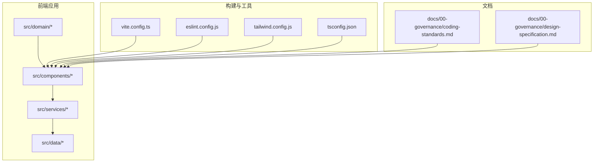
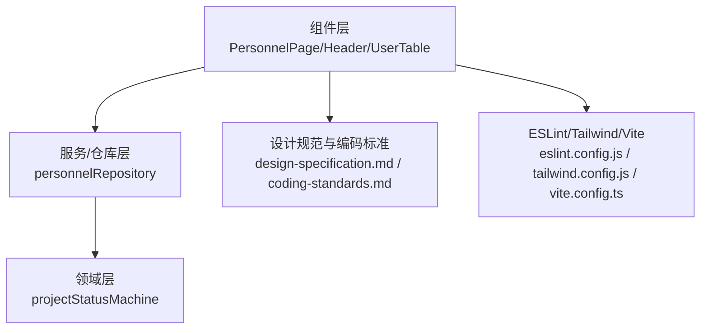
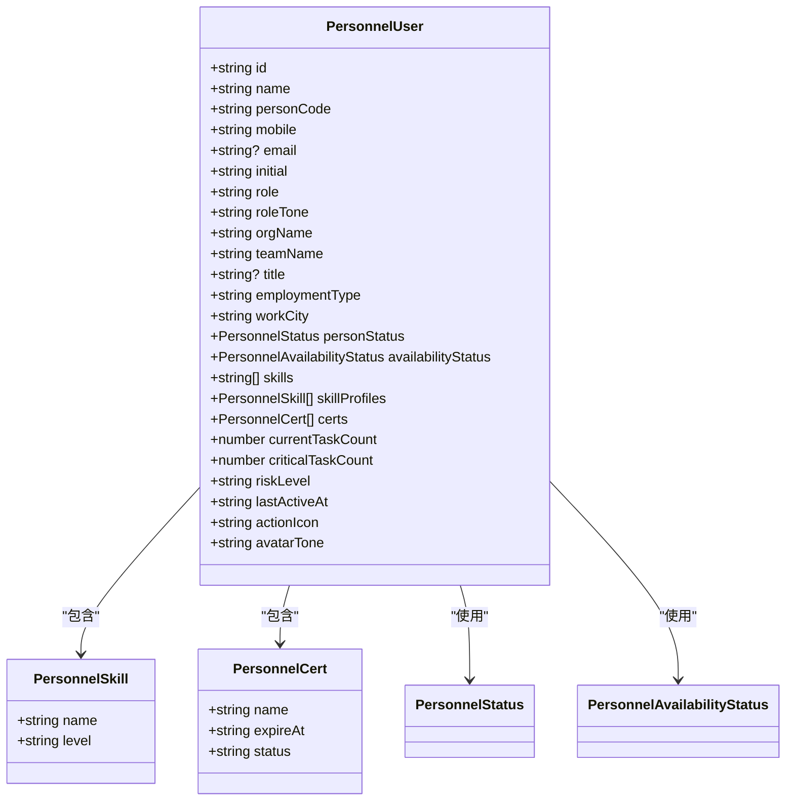
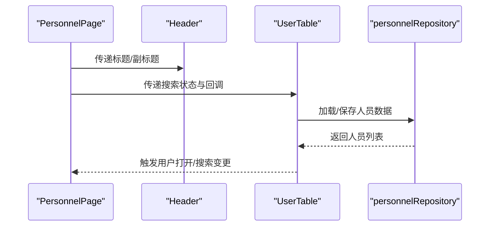
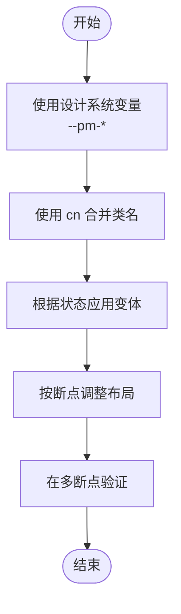
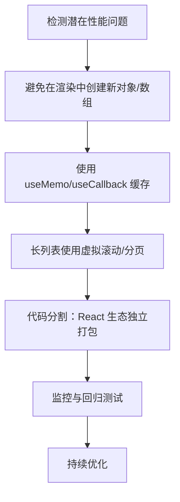
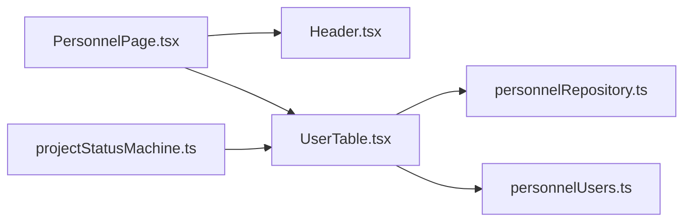

# 编码标准

<cite>
**本文引用的文件**
- [eslint.config.js](file://eslint.config.js)
- [package.json](file://package.json)
- [tailwind.config.js](file://tailwind.config.js)
- [vite.config.ts](file://vite.config.ts)
- [tsconfig.json](file://tsconfig.json)
- [coding-standards.md](file://docs/00-governance/coding-standards.md)
- [design-specification.md](file://docs/00-governance/design-specification.md)
- [personnelUsers.ts](file://src/components/personnel/personnelUsers.ts)
- [Header.tsx](file://src/components/layout/Header.tsx)
- [PersonnelPage.tsx](file://src/components/personnel/PersonnelPage.tsx)
- [UserTable.tsx](file://src/components/personnel/UserTable.tsx)
- [personnelRepository.ts](file://src/services/repositories/personnelRepository.ts)
- [projectStatusMachine.ts](file://src/domain/projectStatusMachine.ts)
</cite>

## 目录

1. [简介](#简介)
2. [项目结构](#项目结构)
3. [核心组件](#核心组件)
4. [架构总览](#架构总览)
5. [详细组件分析](#详细组件分析)
6. [依赖关系分析](#依赖关系分析)
7. [性能考虑](#性能考虑)
8. [故障排查指南](#故障排查指南)
9. [结论](#结论)
10. [附录](#附录)

## 简介

本编码标准文档面向 CodeBuddy 项目，旨在统一开发规范，提升代码一致性、可维护性与可读性。内容覆盖代码风格（ESLint、Prettier）、TypeScript 规范（类型定义、Props 设计、类型守卫）、React 组件规范（结构、自定义 Hook、组合模式、性能优化）、样式规范（Tailwind CSS、响应式设计、类名管理）、文件组织与命名规范、注释规范、性能优化策略、Git 提交规范与代码审查标准。

## 项目结构

项目采用 Vite + React 19 + TypeScript 技术栈，结合 Tailwind CSS 实现样式与响应式布局。核心目录与职责如下：

- src/components：通用组件与页面组件，按功能域划分（如 personnel、project、layout 等）
- src/services：服务层与仓库层，封装数据访问与业务逻辑
- src/domain：领域模型与状态机，抽象业务规则
- docs：治理与设计规范文档
- 配置文件：ESLint、Tailwind CSS、Vite、TypeScript 等

**图表来源**

- [vite.config.ts:1-35](file://vite.config.ts#L1-L35)
- [eslint.config.js:1-24](file://eslint.config.js#L1-L24)
- [tailwind.config.js:1-12](file://tailwind.config.js#L1-L12)
- [tsconfig.json:1-8](file://tsconfig.json#L1-L8)
- [coding-standards.md:1-872](file://docs/00-governance/coding-standards.md#L1-L872)
- [design-specification.md:1-472](file://docs/00-governance/design-specification.md#L1-L472)

**章节来源**

- [vite.config.ts:1-35](file://vite.config.ts#L1-L35)
- [eslint.config.js:1-24](file://eslint.config.js#L1-L24)
- [tailwind.config.js:1-12](file://tailwind.config.js#L1-L12)
- [tsconfig.json:1-8](file://tsconfig.json#L1-L8)
- [coding-standards.md:1-872](file://docs/00-governance/coding-standards.md#L1-L872)
- [design-specification.md:1-472](file://docs/00-governance/design-specification.md#L1-L472)

## 核心组件

- ESLint 配置：采用 flat 配置与推荐规则集，覆盖 TS、React Hooks、React Refresh 等插件，确保类型安全与 Hooks 使用规范。
- Tailwind CSS：content 覆盖 src 下 TS/TSX，主题可扩展，无额外插件。
- Vite 构建：启用 React 插件与代理，手动分包策略将 React 生态独立打包，提升缓存命中率。
- TypeScript：多引用配置，分别指向 app 与 node 环境配置。

**章节来源**

- [eslint.config.js:1-24](file://eslint.config.js#L1-L24)
- [tailwind.config.js:1-12](file://tailwind.config.js#L1-L12)
- [vite.config.ts:1-35](file://vite.config.ts#L1-L35)
- [tsconfig.json:1-8](file://tsconfig.json#L1-L8)

## 架构总览

整体采用“组件-服务-仓库-领域”的分层架构，组件负责 UI 与交互；服务/仓库负责数据持久化与业务访问；领域模块抽象状态流转与业务规则；样式通过 Tailwind 与设计规范变量统一。

**图表来源**

- [PersonnelPage.tsx:1-37](file://src/components/personnel/PersonnelPage.tsx#L1-L37)
- [Header.tsx:1-37](file://src/components/layout/Header.tsx#L1-L37)
- [UserTable.tsx:1-540](file://src/components/personnel/UserTable.tsx#L1-L540)
- [personnelRepository.ts:1-58](file://src/services/repositories/personnelRepository.ts#L1-L58)
- [projectStatusMachine.ts:1-164](file://src/domain/projectStatusMachine.ts#L1-L164)
- [design-specification.md:1-472](file://docs/00-governance/design-specification.md#L1-L472)
- [coding-standards.md:1-872](file://docs/00-governance/coding-standards.md#L1-L872)
- [eslint.config.js:1-24](file://eslint.config.js#L1-L24)
- [tailwind.config.js:1-12](file://tailwind.config.js#L1-L12)
- [vite.config.ts:1-35](file://vite.config.ts#L1-L35)

## 详细组件分析

### TypeScript 规范

- 类型定义原则：优先使用 interface 定义对象结构，使用 type 定义联合与工具类型，使用 enum 定义常量枚举，避免 any。
- Props 类型设计：明确必填/可选字段，使用 React 内置 HTML 属性接口扩展，合理使用默认值解构。
- 类型守卫：对联合类型使用“谓词函数”进行运行时类型判断，保证分支安全。

**图表来源**

- [personnelUsers.ts:1-100](file://src/components/personnel/personnelUsers.ts#L1-L100)

**章节来源**

- [personnelUsers.ts:1-100](file://src/components/personnel/personnelUsers.ts#L1-L100)
- [coding-standards.md:114-214](file://docs/00-governance/coding-standards.md#L114-L214)

### React 组件规范

- 组件结构：遵循“导入 → Props 接口 → Hooks → 计算属性 → 副作用 → 事件处理 → 渲染辅助 → JSX”的顺序，提升可读性与可维护性。
- 自定义 Hook：以 use 前缀命名，返回对象或数组，内部封装状态、副作用与派生逻辑，便于复用。
- 组件组合：通过静态子组件方式实现组合（如 Card.Header/Title/Content），增强可读性与可扩展性。
- 性能优化：合理使用 useMemo/useCallback 缓存计算与函数，避免在渲染期间创建新对象/函数；长列表使用虚拟化或分页。

**图表来源**

- [PersonnelPage.tsx:1-37](file://src/components/personnel/PersonnelPage.tsx#L1-L37)
- [Header.tsx:1-37](file://src/components/layout/Header.tsx#L1-L37)
- [UserTable.tsx:1-540](file://src/components/personnel/UserTable.tsx#L1-L540)
- [personnelRepository.ts:1-58](file://src/services/repositories/personnelRepository.ts#L1-L58)

**章节来源**

- [PersonnelPage.tsx:1-37](file://src/components/personnel/PersonnelPage.tsx#L1-L37)
- [Header.tsx:1-37](file://src/components/layout/Header.tsx#L1-L37)
- [UserTable.tsx:1-540](file://src/components/personnel/UserTable.tsx#L1-L540)
- [coding-standards.md:217-375](file://docs/00-governance/coding-standards.md#L217-L375)

### 样式规范与响应式设计

- Tailwind 使用：使用设计系统变量与工具类组合，通过 cn 合并类名，实现变体与 className 的灵活组合。
- 响应式设计：移动端优先，使用断点与栅格系统实现渐进式布局；卡片与按钮遵循设计规范中的尺寸、圆角、阴影与色彩体系。

**图表来源**

- [design-specification.md:1-472](file://docs/00-governance/design-specification.md#L1-L472)
- [coding-standards.md:378-435](file://docs/00-governance/coding-standards.md#L378-L435)

**章节来源**

- [design-specification.md:1-472](file://docs/00-governance/design-specification.md#L1-L472)
- [coding-standards.md:378-435](file://docs/00-governance/coding-standards.md#L378-L435)

### 文件组织与命名规范

- 目录结构：按功能域划分组件、页面、服务与仓库，类型与常量集中管理，便于查找与复用。
- 命名规范：变量与函数使用 camelCase；组件与类型使用 PascalCase；常量使用 UPPER_SNAKE_CASE；枚举与配置对象明确语义。

**章节来源**

- [coding-standards.md:439-580](file://docs/00-governance/coding-standards.md#L439-L580)

### 注释规范

- 产品经理学习项目特殊规则：每一行代码均需中文注释，解释导入、变量、函数、条件、循环、JSX 与 CSS 类名。
- 复杂逻辑与边界条件需补充注释；组件可采用 JSDoc 形式，提供参数说明与使用示例。

**章节来源**

- [coding-standards.md:582-731](file://docs/00-governance/coding-standards.md#L582-L731)

### 性能优化指南

- React 性能：使用 useMemo 缓存昂贵计算，使用 useCallback 缓存回调，避免在渲染中创建新对象/函数；长列表采用虚拟滚动或分页。
- 代码分割：Vite 配置中将 React 生态独立打包，减少重复依赖，提升缓存命中率。
- 常见反模式：在渲染中创建新对象/数组、不必要的重渲染、未使用 memo 化导致的性能浪费。

**图表来源**

- [coding-standards.md:734-800](file://docs/00-governance/coding-standards.md#L734-L800)
- [vite.config.ts:15-33](file://vite.config.ts#L15-L33)

**章节来源**

- [coding-standards.md:734-800](file://docs/00-governance/coding-standards.md#L734-L800)
- [vite.config.ts:15-33](file://vite.config.ts#L15-L33)

### Git 提交规范与代码审查标准

- 提交规范：建议采用“类型: 简述”格式，正文说明动机与影响；涉及样式/类型/性能变更时附带截图或示例。
- 代码审查：关注类型安全、Props 设计、Hook 使用、性能与可读性；确保注释完整、命名规范、文件组织清晰。

**章节来源**

- [coding-standards.md:1-872](file://docs/00-governance/coding-standards.md#L1-L872)

## 依赖关系分析

- 组件依赖：PersonnelPage 依赖 Header、Sidebar、Tabs、StatsCards、UserTable；UserTable 依赖 personnelRepository 与 personnelUsers 类型。
- 服务依赖：personnelRepository 依赖本地存储与 personnelUsers 初始数据。
- 领域依赖：projectStatusMachine 提供状态流转与守卫逻辑，被页面与服务使用。

**图表来源**

- [PersonnelPage.tsx:1-37](file://src/components/personnel/PersonnelPage.tsx#L1-L37)
- [Header.tsx:1-37](file://src/components/layout/Header.tsx#L1-L37)
- [UserTable.tsx:1-540](file://src/components/personnel/UserTable.tsx#L1-L540)
- [personnelRepository.ts:1-58](file://src/services/repositories/personnelRepository.ts#L1-L58)
- [personnelUsers.ts:1-100](file://src/components/personnel/personnelUsers.ts#L1-L100)
- [projectStatusMachine.ts:1-164](file://src/domain/projectStatusMachine.ts#L1-L164)

**章节来源**

- [PersonnelPage.tsx:1-37](file://src/components/personnel/PersonnelPage.tsx#L1-L37)
- [UserTable.tsx:1-540](file://src/components/personnel/UserTable.tsx#L1-L540)
- [personnelRepository.ts:1-58](file://src/services/repositories/personnelRepository.ts#L1-L58)
- [personnelUsers.ts:1-100](file://src/components/personnel/personnelUsers.ts#L1-L100)
- [projectStatusMachine.ts:1-164](file://src/domain/projectStatusMachine.ts#L1-L164)

## 性能考虑

- 构建优化：Vite 配置中将 React 生态独立打包，降低重复依赖，提升缓存命中率。
- 运行时优化：组件内部使用 useMemo/useCallback 缓存计算与回调；长列表采用虚拟化或分页；避免在渲染中创建新对象/数组。
- 样式优化：使用 Tailwind 工具类与设计系统变量，减少自定义样式体积，提升渲染效率。

**章节来源**

- [vite.config.ts:15-33](file://vite.config.ts#L15-L33)
- [coding-standards.md:734-800](file://docs/00-governance/coding-standards.md#L734-L800)
- [design-specification.md:1-472](file://docs/00-governance/design-specification.md#L1-L472)

## 故障排查指南

- ESLint 报错：检查 flat 配置是否正确扩展推荐规则；确保 TS/React/React Hooks 插件版本兼容。
- Tailwind 样式未生效：确认 content 路径包含目标文件；检查类名拼写与合并函数使用。
- Vite 代理失败：检查代理 target 与 changeOrigin 配置；确认本地 API 端口与路径。
- 性能问题：使用 React DevTools Profiler 检测重渲染热点；对昂贵计算与回调使用 useMemo/useCallback；对长列表使用虚拟化。

**章节来源**

- [eslint.config.js:1-24](file://eslint.config.js#L1-L24)
- [tailwind.config.js:1-12](file://tailwind.config.js#L1-L12)
- [vite.config.ts:7-14](file://vite.config.ts#L7-L14)
- [coding-standards.md:734-800](file://docs/00-governance/coding-standards.md#L734-L800)

## 结论

本编码标准文档基于项目现有配置与组件实现，总结了代码风格、TypeScript、React 组件、样式与文件组织规范，并提供了性能优化与故障排查建议。建议在日常开发中严格遵循，持续演进，确保代码质量与团队协作效率。

## 附录

- 代码风格与注释示例可参考编码标准文档中的示例片段与规范条目。
- 设计规范与变量体系可参考设计规范文档中的色彩、字体、间距、圆角与阴影等章节。

**章节来源**

- [coding-standards.md:1-872](file://docs/00-governance/coding-standards.md#L1-L872)
- [design-specification.md:1-472](file://docs/00-governance/design-specification.md#L1-L472)
