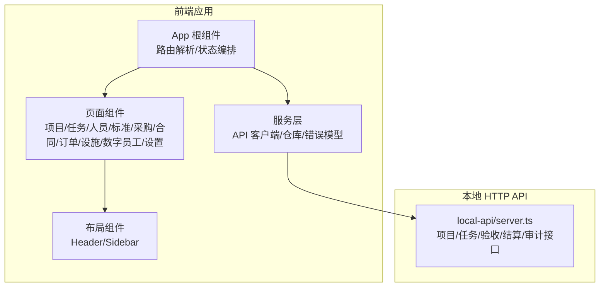
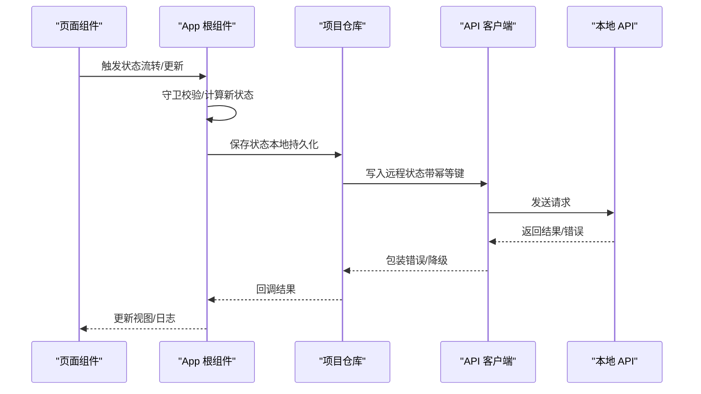
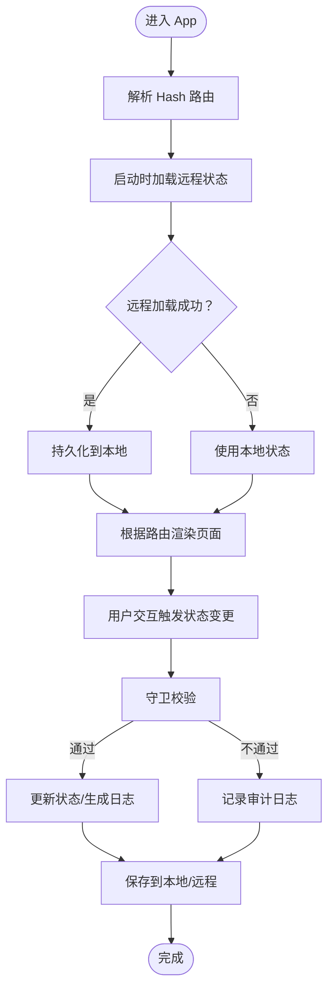
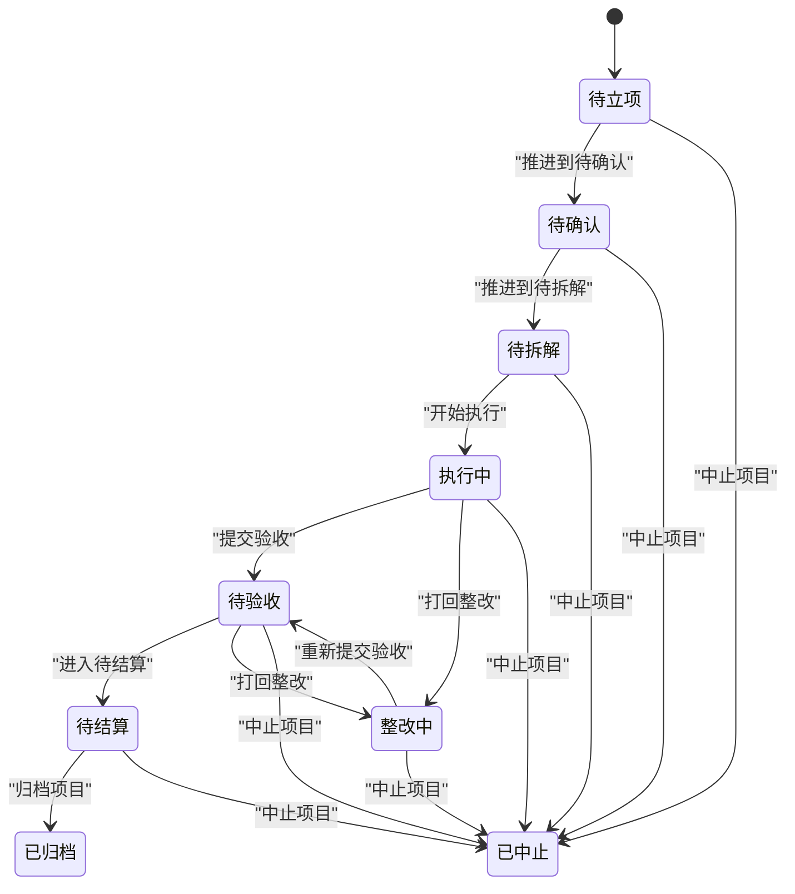
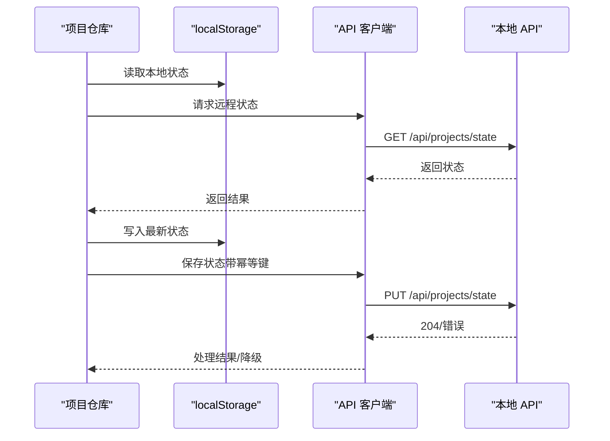
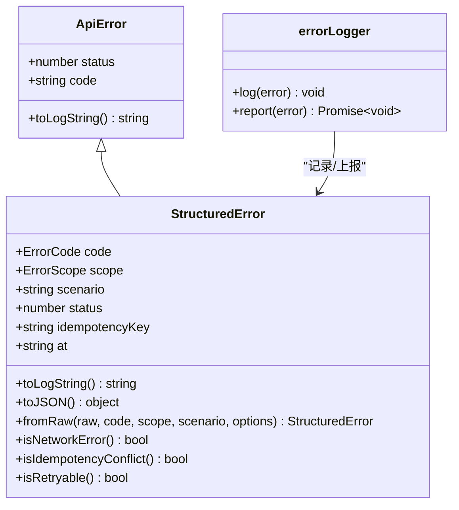
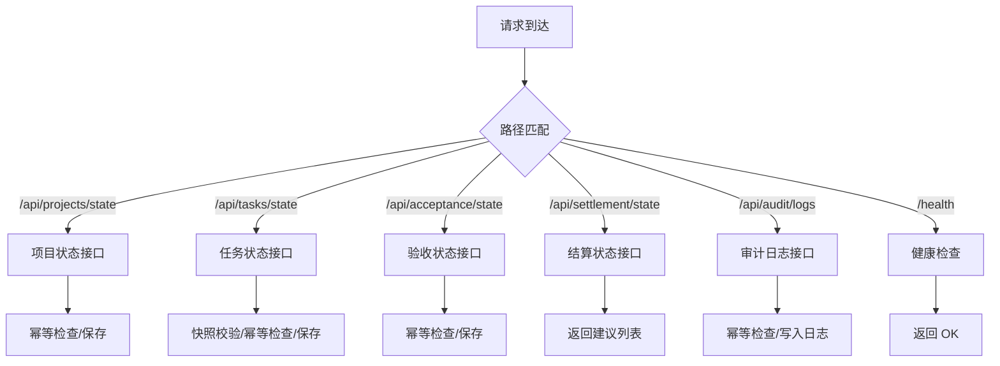
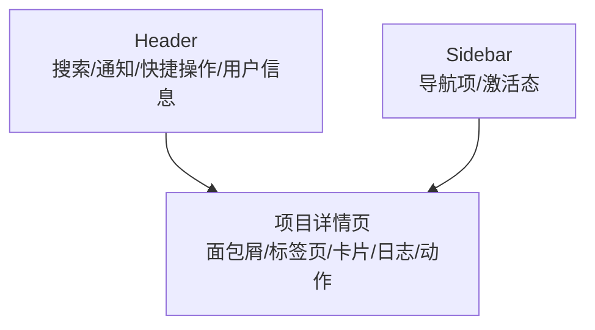
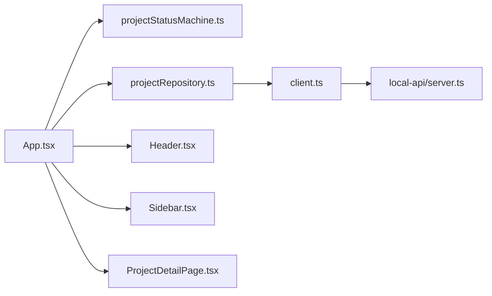

# 设计规范

<cite>
**本文引用的文件**
- [DESIGN_SPECIFICATION.md](file://DESIGN_SPECIFICATION.md)
- [CODEBUDDY.md](file://CODEBUDDY.md)
- [docs/00-governance/design-specification.md](file://docs/00-governance/design-specification.md)
- [docs/02-architecture/project-rules.md](file://docs/02-architecture/project-rules.md)
- [src/App.tsx](file://src/App.tsx)
- [src/domain/projectStatusMachine.ts](file://src/domain/projectStatusMachine.ts)
- [src/services/repositories/projectRepository.ts](file://src/services/repositories/projectRepository.ts)
- [src/services/api/client.ts](file://src/services/api/client.ts)
- [src/services/errors/StructuredError.ts](file://src/services/errors/StructuredError.ts)
- [local-api/server.ts](file://local-api/server.ts)
- [src/components/layout/Header.tsx](file://src/components/layout/Header.tsx)
- [src/components/layout/Sidebar.tsx](file://src/components/layout/Sidebar.tsx)
- [src/components/project/ProjectDetailPage.tsx](file://src/components/project/ProjectDetailPage.tsx)
- [src/index.css](file://src/index.css)
- [src/App.css](file://src/App.css)
- [src/components/project/project-detail.css](file://src/components/project/project-detail.css)
</cite>

## 目录

1. [简介](#简介)
2. [项目结构](#项目结构)
3. [核心组件](#核心组件)
4. [架构总览](#架构总览)
5. [详细组件分析](#详细组件分析)
6. [依赖分析](#依赖分析)
7. [性能考虑](#性能考虑)
8. [故障排查指南](#故障排查指南)
9. [结论](#结论)
10. [附录](#附录)

## 简介

本设计规范面向 CodeBuddy 项目，系统化阐述架构设计原则、组件化开发理念、API 设计标准、数据流与状态管理、用户体验设计以及设计工具与评审标准，并给出设计变更流程与版本管理规范。文档以仓库现有实现为基础，结合“设计规范（执行规范）”与“项目规则文档”形成统一的 SSOT（单一可信来源），指导前端与本地 API 的开发与演进。

## 项目结构

- 应用入口与路由编排集中在应用根组件，采用 Hash 路由实现“单入口控制多页面”的前端架构。
- 业务域划分清晰：项目域、任务域、人员域、标准域、采购与合同结算、订单与设施、数字员工与系统设置。
- 样式系统以 CSS 变量为核心，统一色彩、字体、间距、圆角与阴影，页面局部样式按模块拆分。
- 本地 API 提供五类核心接口：项目状态、任务状态、验收状态、结算状态、审计日志，支持幂等与健康检查。

图表来源

- [src/App.tsx:1-800](file://src/App.tsx#L1-L800)
- [src/components/layout/Header.tsx:1-37](file://src/components/layout/Header.tsx#L1-L37)
- [src/components/layout/Sidebar.tsx:1-108](file://src/components/layout/Sidebar.tsx#L1-L108)
- [src/services/api/client.ts:1-172](file://src/services/api/client.ts#L1-L172)
- [local-api/server.ts:1-414](file://local-api/server.ts#L1-L414)

章节来源

- [CODEBUDDY.md:23-90](file://CODEBUDDY.md#L23-L90)
- [src/App.tsx:1-800](file://src/App.tsx#L1-L800)

## 核心组件

- 应用根组件 App：负责路由解析、Hash 变更监听、全局状态持久化、远程降级兜底、状态机守卫与日志记录、页面级状态推进（项目状态流转、基础信息更新、里程碑同步等）。
- 项目状态机：定义项目状态集合、允许流转、守卫条件与进入状态钩子，提供可用流转选项与守卫解析。
- 仓库层：封装 localStorage 与本地 API 的读写，提供本地降级与远程回退能力。
- API 客户端：统一请求封装、幂等键、重试策略、错误结构化与降级事件派发。
- 错误模型：结构化错误类型与日志格式，支持网络、业务、幂等冲突等分类。
- 本地 API：提供项目状态、任务状态、验收状态、结算状态、审计日志接口，支持幂等与健康检查。

章节来源

- [src/App.tsx:1-800](file://src/App.tsx#L1-L800)
- [src/domain/projectStatusMachine.ts:1-164](file://src/domain/projectStatusMachine.ts#L1-L164)
- [src/services/repositories/projectRepository.ts:1-90](file://src/services/repositories/projectRepository.ts#L1-L90)
- [src/services/api/client.ts:1-172](file://src/services/api/client.ts#L1-L172)
- [src/services/errors/StructuredError.ts:1-195](file://src/services/errors/StructuredError.ts#L1-L195)
- [local-api/server.ts:1-414](file://local-api/server.ts#L1-L414)

## 架构总览

- 分层架构：表现层（页面与布局）、业务层（状态机与领域逻辑）、服务层（API 客户端与仓库）、基础设施（本地 API 与持久化）。
- 模块化设计：按业务域拆分组件与样式，共享布局与设计系统变量，避免重复实现。
- 组件化开发：页面组件消费统一布局与状态机能力，不重建状态机；通过 props 与回调实现组件间协作。
- 数据流：前端本地状态 + localStorage 作为主承载，结合本地 API 提供的接口实现远程读写与幂等保障；状态机驱动关键业务流转，守卫与日志确保可追溯。

图表来源

- [src/App.tsx:439-504](file://src/App.tsx#L439-L504)
- [src/services/repositories/projectRepository.ts:53-89](file://src/services/repositories/projectRepository.ts#L53-L89)
- [src/services/api/client.ts:83-171](file://src/services/api/client.ts#L83-L171)
- [local-api/server.ts:70-129](file://local-api/server.ts#L70-L129)

## 详细组件分析

### 应用根组件（App）设计

- 路由解析与页面调度：基于 Hash 路由解析 AppRoute，按需懒加载页面组件，减少首包体积。
- 全局状态与持久化：持有项目主数据与状态日志，分别持久化至 localStorage；启动时从远程加载并回退到本地。
- 状态机驱动：统一的状态流转入口，结合守卫上下文与日志记录，确保流程合规与可审计。
- 事件降级：监听远程降级事件，向用户提示并保证本地可用。

图表来源

- [src/App.tsx:346-420](file://src/App.tsx#L346-L420)
- [src/App.tsx:439-504](file://src/App.tsx#L439-L504)
- [src/services/repositories/projectRepository.ts:53-89](file://src/services/repositories/projectRepository.ts#L53-L89)

章节来源

- [src/App.tsx:1-800](file://src/App.tsx#L1-L800)

### 项目状态机（domain）

- 状态集合与允许流转：定义项目生命周期状态与合法转换。
- 守卫上下文：包含容器、审批、里程碑、任务树、标准绑定、关键任务完成度、验收通过、验收反馈、整改闭环、结算完成等维度。
- 可用流转与钩子：提供可用状态选项与进入状态钩子，用于联动触发其他流程。

图表来源

- [src/domain/projectStatusMachine.ts:47-95](file://src/domain/projectStatusMachine.ts#L47-L95)

章节来源

- [src/domain/projectStatusMachine.ts:1-164](file://src/domain/projectStatusMachine.ts#L1-L164)

### 仓库层（repositories）

- 本地状态读取与持久化：从 localStorage 读取项目状态与日志，异常时回退到初始值。
- 远程状态加载与保存：优先使用远程状态，失败时记录结构化错误并回退本地；保存时同样支持幂等键与错误记录。

图表来源

- [src/services/repositories/projectRepository.ts:14-51](file://src/services/repositories/projectRepository.ts#L14-L51)
- [src/services/repositories/projectRepository.ts:53-89](file://src/services/repositories/projectRepository.ts#L53-L89)
- [local-api/server.ts:70-129](file://local-api/server.ts#L70-L129)

章节来源

- [src/services/repositories/projectRepository.ts:1-90](file://src/services/repositories/projectRepository.ts#L1-L90)

### API 客户端与错误模型

- 请求封装：统一方法、Body、幂等键、重试次数与作用域/场景标识；网络错误与可重试状态自动降级。
- 结构化错误：统一错误码、作用域、场景、时间戳与原始错误，支持序列化与日志格式化。
- 降级事件：当远程不可用时，向窗口派发自定义事件，提示用户并记录上下文。

图表来源

- [src/services/api/client.ts:13-30](file://src/services/api/client.ts#L13-L30)
- [src/services/errors/StructuredError.ts:27-52](file://src/services/errors/StructuredError.ts#L27-L52)
- [src/services/errors/StructuredError.ts:179-194](file://src/services/errors/StructuredError.ts#L179-L194)

章节来源

- [src/services/api/client.ts:1-172](file://src/services/api/client.ts#L1-L172)
- [src/services/errors/StructuredError.ts:1-195](file://src/services/errors/StructuredError.ts#L1-L195)

### 本地 API 接口

- 项目状态接口：GET/PUT，支持环境标识与幂等键，返回空内容表示成功。
- 任务状态接口：GET/PUT，支持环境与上下文键，包含快照校验。
- 验收状态接口：GET/PUT，按项目代码分区。
- 结算状态接口：GET，返回建议列表。
- 审计日志接口：POST，记录场景、详情与项目代码。
- 健康检查：/health。

图表来源

- [local-api/server.ts:338-386](file://local-api/server.ts#L338-L386)
- [local-api/server.ts:70-129](file://local-api/server.ts#L70-L129)
- [local-api/server.ts:131-197](file://local-api/server.ts#L131-L197)
- [local-api/server.ts:199-259](file://local-api/server.ts#L199-L259)
- [local-api/server.ts:261-280](file://local-api/server.ts#L261-L280)
- [local-api/server.ts:282-329](file://local-api/server.ts#L282-L329)
- [local-api/server.ts:331-334](file://local-api/server.ts#L331-L334)

章节来源

- [local-api/server.ts:1-414](file://local-api/server.ts#L1-L414)

### 布局与页面组件

- Header：顶部操作区包含搜索、通知、快捷操作与用户信息。
- Sidebar：导航项与激活态判定，支持 Hash 跳转。
- 项目详情页：面包屑、标签页、信息卡、活动日志、状态动作与里程碑同步等。

图表来源

- [src/components/layout/Header.tsx:8-34](file://src/components/layout/Header.tsx#L8-L34)
- [src/components/layout/Sidebar.tsx:39-105](file://src/components/layout/Sidebar.tsx#L39-L105)
- [src/components/project/ProjectDetailPage.tsx:103-115](file://src/components/project/ProjectDetailPage.tsx#L103-L115)

章节来源

- [src/components/layout/Header.tsx:1-37](file://src/components/layout/Header.tsx#L1-L37)
- [src/components/layout/Sidebar.tsx:1-108](file://src/components/layout/Sidebar.tsx#L1-L108)
- [src/components/project/ProjectDetailPage.tsx:1-200](file://src/components/project/ProjectDetailPage.tsx#L1-L200)

## 依赖分析

- 组件耦合：页面组件依赖布局组件与状态机；App 作为中枢协调路由、状态与仓库。
- 外部依赖：本地 API 提供核心数据接口；浏览器 localStorage 作为持久化介质。
- 幂等与降级：API 客户端与仓库层共同保障幂等与网络异常下的本地降级。

图表来源

- [src/App.tsx:1-800](file://src/App.tsx#L1-L800)
- [src/domain/projectStatusMachine.ts:1-164](file://src/domain/projectStatusMachine.ts#L1-L164)
- [src/services/repositories/projectRepository.ts:1-90](file://src/services/repositories/projectRepository.ts#L1-L90)
- [src/services/api/client.ts:1-172](file://src/services/api/client.ts#L1-L172)
- [local-api/server.ts:1-414](file://local-api/server.ts#L1-L414)
- [src/components/layout/Header.tsx:1-37](file://src/components/layout/Header.tsx#L1-L37)
- [src/components/layout/Sidebar.tsx:1-108](file://src/components/layout/Sidebar.tsx#L1-L108)
- [src/components/project/ProjectDetailPage.tsx:1-200](file://src/components/project/ProjectDetailPage.tsx#L1-L200)

章节来源

- [src/App.tsx:1-800](file://src/App.tsx#L1-L800)

## 性能考虑

- 懒加载页面组件：按需加载减少首屏体积。
- 本地优先：优先使用远程状态，失败时快速回退本地，保证可用性。
- 幂等写入：避免重复请求带来的副作用与资源浪费。
- 样式变量：统一设计系统变量，减少重复计算与样式抖动。

## 故障排查指南

- 网络错误与重试：客户端对可重试状态自动重试，超过次数后触发降级事件。
- 结构化错误：统一错误码与日志格式，便于定位与上报。
- 本地回退：远程不可用时，自动提示并启用本地兜底，避免业务中断。
- 仓库异常：本地存储读写失败时，记录结构化错误并回退到初始状态。

章节来源

- [src/services/api/client.ts:83-171](file://src/services/api/client.ts#L83-L171)
- [src/services/errors/StructuredError.ts:179-194](file://src/services/errors/StructuredError.ts#L179-L194)
- [src/services/repositories/projectRepository.ts:26-37](file://src/services/repositories/projectRepository.ts#L26-L37)

## 结论

本设计规范以“设计规范（执行规范）”与“项目规则文档”为准则，结合现有前端与本地 API 实现，明确了分层架构、模块化与组件化开发理念，给出了状态机驱动的数据流设计、统一的 API 设计标准与错误处理机制，并提供了可视化流程图与组件关系图，帮助团队在保持一致性的同时高效迭代。

## 附录

### 设计系统与样式基线

- 色彩系统、字体系统、间距系统、圆角系统、阴影系统与布局规范以“设计规范（执行规范）”为准。
- 全局样式通过 CSS 变量集中管理，页面局部样式按模块拆分，避免样式冲突。

章节来源

- [docs/00-governance/design-specification.md:24-472](file://docs/00-governance/design-specification.md#L24-L472)
- [src/index.css:1-800](file://src/index.css#L1-L800)
- [src/App.css:1-185](file://src/App.css#L1-L185)
- [src/components/project/project-detail.css:1-800](file://src/components/project/project-detail.css#L1-L800)

### 设计工具与评审标准

- 设计工具：推荐使用 Figma、Zeplin、蓝湖等工具进行设计稿标注与协作。
- 评审标准：遵循统一页面骨架、状态机守卫与数据模型、样式与交互规范、权限边界与审计留痕。

章节来源

- [docs/00-governance/design-specification.md:404-426](file://docs/00-governance/design-specification.md#L404-L426)
- [docs/02-architecture/project-rules.md:114-138](file://docs/02-architecture/project-rules.md#L114-L138)

### 设计变更流程与版本管理

- 变更流程：先读需求与相关模块文档，确认边界；先对齐状态机与数据模型，再写页面；优先复用统一组件与样式规范；完成后执行构建与必要 lint 校验。
- 版本管理：提交信息遵循约定式提交；涉及路由、状态机、权限、Agent 的改动必须附带影响说明；规则与实现冲突时需更新规则或实现，并同步文档。

章节来源

- [docs/02-architecture/project-rules.md:188-233](file://docs/02-architecture/project-rules.md#L188-L233)
