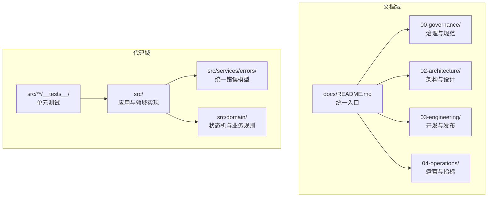
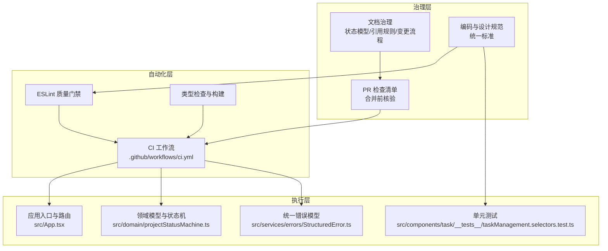
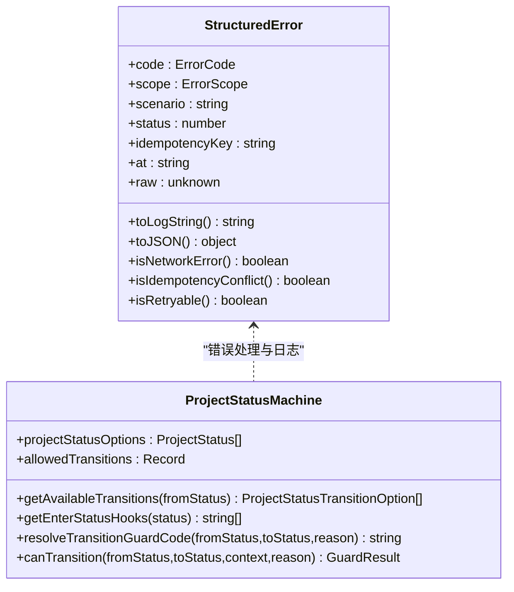
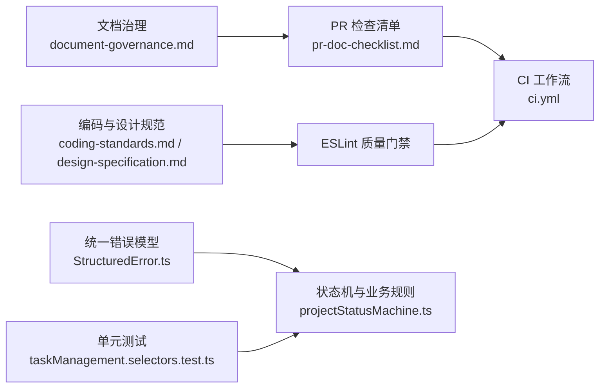

# 项目治理文档

<cite>
**本文档引用的文件**
- [coding-standards.md](file://docs/00-governance/coding-standards.md)
- [design-specification.md](file://docs/00-governance/design-specification.md)
- [document-governance.md](file://docs/00-governance/document-governance.md)
- [pr-doc-checklist.md](file://docs/00-governance/pr-doc-checklist.md)
- [CODEBUDDY.md](file://CODEBUDDY.md)
- [ci.yml](file://.github/workflows/ci.yml)
- [package.json](file://package.json)
- [projectStatusMachine.ts](file://src/domain/projectStatusMachine.ts)
- [StructuredError.ts](file://src/services/errors/StructuredError.ts)
- [taskManagement.selectors.test.ts](file://src/components/task/__tests__/taskManagement.selectors.test.ts)
- [DESIGN_SPECIFICATION.md](file://DESIGN_SPECIFICATION.md)
- [docs/README.md](file://docs/README.md)
</cite>

## 目录

1. [简介](#简介)
2. [项目结构](#项目结构)
3. [核心组件](#核心组件)
4. [架构总览](#架构总览)
5. [详细组件分析](#详细组件分析)
6. [依赖关系分析](#依赖关系分析)
7. [性能考虑](#性能考虑)
8. [故障排查指南](#故障排查指南)
9. [结论](#结论)
10. [附录](#附录)

## 简介

本文件为 CodeBuddy 项目的治理参考，面向项目管理者与贡献者，系统阐述编码标准、设计规范、文档治理机制、PR 文档检查清单、项目决策流程、变更管理与质量保证机制，并提供治理工具与自动化检查配置说明。文档同时给出合规性要求与最佳实践指导，帮助团队在统一标准下高效协作、持续演进。

## 项目结构

CodeBuddy 采用“文档中心 + 代码实现”的双轨治理结构：

- 文档域（docs/）：集中存放治理规则、设计规范、编码规范、文档治理与 PR 检查清单等，确保“单一事实源（SSOT）”与可追溯性。
- 代码域（src/）：包含应用入口、领域模型、服务层、组件层与测试，体现实际执行逻辑与质量门禁。

图表来源

- [docs/README.md:1-63](file://docs/README.md#L1-L63)
- [document-governance.md:1-63](file://docs/00-governance/document-governance.md#L1-L63)

章节来源

- [docs/README.md:1-63](file://docs/README.md#L1-L63)
- [document-governance.md:1-63](file://docs/00-governance/document-governance.md#L1-L63)

## 核心组件

- 编码标准：涵盖代码风格、TypeScript 规范、React 组件规范、样式规范、文件组织、命名规范、注释规范、性能优化与 Git 提交规范，形成统一的代码质量基线。
- 设计规范：定义色彩、字体、间距、圆角、阴影、布局与响应式断点，提供组件开发 SOP 与设计工具使用指引。
- 文档治理：明确文档域职责、状态模型、Frontmatter 要求、引用规则与变更流程，保障文档一致性与可追溯性。
- PR 文档检查清单：在合并前逐项核验，确保文档质量与一致性。
- 质量门禁与自动化：通过 ESLint、类型检查与构建流程形成质量门禁；CI 工作流对关键文件进行强制检查与阶段文档校验。

章节来源

- [coding-standards.md:1-872](file://docs/00-governance/coding-standards.md#L1-L872)
- [design-specification.md:1-472](file://docs/00-governance/design-specification.md#L1-L472)
- [document-governance.md:1-63](file://docs/00-governance/document-governance.md#L1-L63)
- [pr-doc-checklist.md:1-25](file://docs/00-governance/pr-doc-checklist.md#L1-L25)
- [ci.yml:1-39](file://.github/workflows/ci.yml#L1-L39)

## 架构总览

治理架构围绕“文档 SSOT + 代码执行 + 自动化门禁”展开，形成闭环：

图表来源

- [ci.yml:1-39](file://.github/workflows/ci.yml#L1-L39)
- [projectStatusMachine.ts:1-164](file://src/domain/projectStatusMachine.ts#L1-L164)
- [StructuredError.ts:1-195](file://src/services/errors/StructuredError.ts#L1-L195)
- [taskManagement.selectors.test.ts:1-102](file://src/components/task/__tests__/taskManagement.selectors.test.ts#L1-L102)

章节来源

- [CODEBUDDY.md:1-90](file://CODEBUDDY.md#L1-L90)
- [ci.yml:1-39](file://.github/workflows/ci.yml#L1-L39)

## 详细组件分析

### 编码标准

- 代码风格：基于 ESLint 与 Prettier 的统一配置，约束空格、分号、缩进、箭头函数括号等，确保团队一致性。
- TypeScript 规范：推荐使用 interface/union types/enums，避免 any；Props 类型清晰、默认值解构；类型守卫提升类型安全。
- React 组件规范：标准组件结构（hooks、memo、effect、callback、渲染辅助）、自定义 Hook 命名与返回值设计、组件组合优于继承。
- 样式规范：Tailwind CSS 使用设计系统变量，响应式设计遵循移动端优先与渐进式断点。
- 文件组织：按功能域划分目录，文件命名采用 PascalCase/驼峰命名，保持一致性。
- 命名规范：变量与函数使用 camelCase，组件与类型使用 PascalCase，常量使用 UPPER_SNAKE_CASE，枚举与配置对象清晰。
- 注释规范：产品经理学习项目要求逐行中文注释；复杂逻辑与边界条件需中文注释；组件支持 JSDoc。
- 性能优化：合理使用 useMemo/useCallback、组件懒加载、虚拟滚动等；避免在 render 中创建新对象/函数。
- Git 提交规范：建议采用“类型: 描述”的格式，结合变更说明与影响评估。

章节来源

- [coding-standards.md:1-872](file://docs/00-governance/coding-standards.md#L1-L872)

### 设计规范

- 色彩系统：定义主色调、背景色、文字色、功能色与边框色，配套 CSS 变量体系。
- 字体系统：指定字体家族、字号、行高与字重规范。
- 间距系统：内间距、外边距与间隙的量化标准。
- 圆角与阴影：统一圆角半径与阴影层级，提升视觉一致性。
- 布局规范：页面布局结构、卡片结构与按钮、输入框样式规范。
- 响应式设计：断点系统与多断点适配规则。
- 组件开发 SOP：从设计稿到代码审查的标准流程；命名规范（页面/卡片/视图/基础组件）与 CSS 类名（BEM/语义化/状态类）。

章节来源

- [design-specification.md:1-472](file://docs/00-governance/design-specification.md#L1-L472)
- [DESIGN_SPECIFICATION.md:1-16](file://DESIGN_SPECIFICATION.md#L1-L16)

### 文档治理机制

- 目标：建立 docs/ 为唯一文档域与导航入口，避免重复执行口径。
- 目录与职责：按主题划分（治理、产品、架构、工程、运营、归档），明确职责边界。
- 状态模型：draft/active/deprecated/archived，确保版本清晰与可追溯。
- Frontmatter 要求：每篇 active 文档必须包含 id/title/owner/status/last_updated/source_of_truth/related_code/related_docs。
- 引用规则：统一使用 docs/... 路径；根目录仅允许入口级说明文档；同主题仅允许一个 active 文档。
- 变更流程：修改内容 → 更新 Frontmatter → 同步 docs/README.md → 通过 PR 检查清单 → 合并后记录审计。

章节来源

- [document-governance.md:1-63](file://docs/00-governance/document-governance.md#L1-L63)
- [docs/README.md:1-63](file://docs/README.md#L1-L63)

### PR 文档检查清单

- 仅在 docs/ 目录新增或修改业务文档
- active 文档 Frontmatter 字段完整
- docs/README.md 已同步登记新增/变更文档
- 文档链接均为有效 docs/... 路径
- 同主题无多份 active 冲突文档
- 历史文档已迁入 99-archive 或标记 deprecated
- 若影响设计规范，已同步 design-specification 与 design-checklist

章节来源

- [pr-doc-checklist.md:1-25](file://docs/00-governance/pr-doc-checklist.md#L1-L25)

### 项目决策流程与变更管理

- 决策角色：文档维护者负责维护与校验；设计规范为 SSOT。
- 变更路径：文档修改 → Frontmatter 更新 → 索引同步 → PR 检查 → 合并 → 审计记录。
- 影响评估：若涉及设计规范或架构，需同步更新相关文档并进行交叉核验。

章节来源

- [document-governance.md:1-63](file://docs/00-governance/document-governance.md#L1-L63)
- [pr-doc-checklist.md:1-25](file://docs/00-governance/pr-doc-checklist.md#L1-L25)

### 质量保证机制

- 统一错误模型：StructuredError 提供结构化错误信息，支持日志字符串、JSON 序列化、场景分类与可重试判定。
- 状态机守卫：项目状态机定义合法流转与守卫条件，确保业务流程正确性。
- 单元测试：任务选择器的测试覆盖统计、筛选、排序与分页等关键逻辑。
- 质量门禁：ESLint、类型检查与构建；CI 对关键文件进行强制检查与阶段文档校验。

图表来源

- [StructuredError.ts:1-195](file://src/services/errors/StructuredError.ts#L1-L195)
- [projectStatusMachine.ts:1-164](file://src/domain/projectStatusMachine.ts#L1-L164)

章节来源

- [StructuredError.ts:1-195](file://src/services/errors/StructuredError.ts#L1-L195)
- [projectStatusMachine.ts:1-164](file://src/domain/projectStatusMachine.ts#L1-L164)
- [taskManagement.selectors.test.ts:1-102](file://src/components/task/__tests__/taskManagement.selectors.test.ts#L1-L102)

### 治理工具与自动化检查配置

- ESLint：作为主要质量门禁，统一规则与插件配置。
- 类型检查与构建：先类型检查，再构建打包，确保类型安全。
- CI 工作流：对关键文件进行强制 ESLint 检查，校验阶段文档存在性，最终执行构建。
- 测试：Vitest 提供单元测试能力，覆盖选择器管道等核心逻辑。

章节来源

- [package.json:1-48](file://package.json#L1-L48)
- [ci.yml:1-39](file://.github/workflows/ci.yml#L1-L39)

## 依赖关系分析

- 文档治理依赖：PR 检查清单与文档治理规范共同约束文档质量与一致性。
- 设计规范依赖：设计系统变量与组件规范为样式与布局提供执行依据。
- 质量门禁依赖：ESLint、类型检查与 CI 工作流共同构成质量门禁链路。
- 代码实现依赖：统一错误模型与状态机守卫为业务流程与错误处理提供支撑。

图表来源

- [document-governance.md:1-63](file://docs/00-governance/document-governance.md#L1-L63)
- [pr-doc-checklist.md:1-25](file://docs/00-governance/pr-doc-checklist.md#L1-L25)
- [ci.yml:1-39](file://.github/workflows/ci.yml#L1-L39)
- [coding-standards.md:1-872](file://docs/00-governance/coding-standards.md#L1-L872)
- [design-specification.md:1-472](file://docs/00-governance/design-specification.md#L1-L472)
- [StructuredError.ts:1-195](file://src/services/errors/StructuredError.ts#L1-L195)
- [projectStatusMachine.ts:1-164](file://src/domain/projectStatusMachine.ts#L1-L164)
- [taskManagement.selectors.test.ts:1-102](file://src/components/task/__tests__/taskManagement.selectors.test.ts#L1-L102)

章节来源

- [document-governance.md:1-63](file://docs/00-governance/document-governance.md#L1-L63)
- [pr-doc-checklist.md:1-25](file://docs/00-governance/pr-doc-checklist.md#L1-L25)
- [ci.yml:1-39](file://.github/workflows/ci.yml#L1-L39)

## 性能考虑

- React 性能优化：使用 useMemo/useCallback 缓存计算与函数；组件懒加载与虚拟滚动降低长列表渲染成本。
- 避免在渲染中创建新对象/数组，减少不必要的重渲染。
- 样式性能：统一使用设计系统变量，减少重复计算与样式抖动。

章节来源

- [coding-standards.md:734-800](file://docs/00-governance/coding-standards.md#L734-L800)

## 故障排查指南

- 文档问题
  - 症状：同主题存在多份 active 文档导致执行口径不一致
  - 解决：迁移至 99-archive 或标记 deprecated，保留一份 active
  - 参考：文档治理状态模型与引用规则
- 设计不一致
  - 症状：组件样式与设计规范不一致
  - 解决：使用设计系统变量与组件规范，避免内联样式
  - 参考：设计规范中的色彩、字体、间距与组件结构
- 质量门禁失败
  - 症状：ESLint 报错或类型检查失败
  - 解决：根据规则修正代码风格与类型问题；必要时更新类型定义
  - 参考：编码标准与 CI 工作流
- 错误处理不当
  - 症状：错误信息不可追踪或日志不规范
  - 解决：使用统一错误模型，确保结构化日志与场景分类
  - 参考：统一错误模型与状态机守卫

章节来源

- [document-governance.md:1-63](file://docs/00-governance/document-governance.md#L1-L63)
- [design-specification.md:1-472](file://docs/00-governance/design-specification.md#L1-L472)
- [coding-standards.md:1-872](file://docs/00-governance/coding-standards.md#L1-L872)
- [ci.yml:1-39](file://.github/workflows/ci.yml#L1-L39)
- [StructuredError.ts:1-195](file://src/services/errors/StructuredError.ts#L1-L195)
- [projectStatusMachine.ts:1-164](file://src/domain/projectStatusMachine.ts#L1-L164)

## 结论

CodeBuddy 项目通过“文档 SSOT + 统一编码与设计规范 + PR 检查清单 + CI 质量门禁”的治理闭环，实现了高质量、可追溯、可演进的工程实践。建议在日常开发中严格遵循编码与设计规范，按流程进行文档治理与 PR 审核，并充分利用统一错误模型与状态机守卫提升系统稳定性与可维护性。

## 附录

- 文档总览与导航：设计规范总览文件指向执行规范与检查清单，确保读者准确获取最新执行标准。
- 代码架构概览：应用入口、路由编排、状态持久化边界、状态机驱动流程、数据分层与页面组织模式，为理解系统提供高层视角。

章节来源

- [DESIGN_SPECIFICATION.md:1-16](file://DESIGN_SPECIFICATION.md#L1-L16)
- [CODEBUDDY.md:1-90](file://CODEBUDDY.md#L1-L90)
