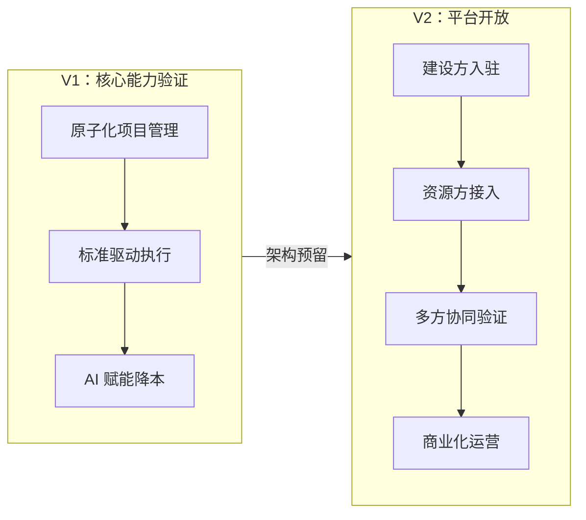

# 数字营建项目 - 产品规划 V1

> **文档层级**：L1 — 产品规划  
> **文档状态**：活跃（当前工作基线，向下对齐 L2 V1 产品定义、L3 模块 PRD）  
> **项目阶段**：V1 / MVP（核心能力验证）→ V2 / 平台化（战略展望）  
> **一句话概括**：V1 — 让建店更简单。V2 — 把系统能力开放给生态。

---

## 1. 项目背景

连锁品牌建店管理长期面临三个核心问题：

- **专业门槛高**：营建涉及选址、设计、报建、施工、验收、结算等多个专业领域，品牌方需要配备专业的营建团队，人力成本高
- **标准化落地难**：品牌有管理标准，但标准停留在纸面文档，执行中靠人传递，容易出现偏差
- **多品牌复制难**：不同品牌、不同业态的建店流程各不相同，传统系统固化度高，难以灵活适配

**产品目标**：为连锁品牌方提供一个"营建管理操作系统"，通过原子化项目管理、标准驱动执行和 AI 赋能，降低建店专业门槛，缩短建店周期，实现标准化管理。

---

## 2. 两阶段战略



| 阶段   | 定位               | 核心用户                          | 验证目标                                   |
| ------ | ------------------ | --------------------------------- | ------------------------------------------ |
| **V1** | 品牌方营建管理系统 | 品牌方营建部门                    | 三大核心能力能否支撑品牌方独立完成建店管理 |
| **V2** | 平台化协同系统     | 品牌方 + 建设方 + 资源方 + 加盟商 | 多方协同效率 + 商业模式验证                |

---

## 3. 三大核心能力（V1）

### 3.1 原子化项目管理

**核心理念**：任务是最小执行单元和状态单元。项目是容器，项目状态从任务聚合推导，没有独立状态机。

传统项目管理是"项目驱动任务"——项目有固定的阶段和状态，任务被塞进这些阶段里。换一个品牌、换一种业务模式，项目结构就得重新设计。

**本方案反转了这种关系**：

- 每个任务有自己的独立状态机，独立推进（草稿→待分配→执行中→待验收→已完成）
- 项目不设人工操作的"状态按钮"，项目概览中的状态标签是从所有任务的聚合状态实时计算而来
- 业务变化在任务层吸收：不同品牌的建店流程差异通过调整任务模板来适应，项目模型不动

```
传统模式：    项目结构决定任务形态
本方案：      任务的聚合决定项目形态
```

### 3.2 标准驱动执行

**核心理念**：品牌管理规范是系统的"源代码"，任务从标准自动生成。

- 标准库将品牌管理规范结构化，形成可执行的条款集合
- 从标准库匹配模板，模板自动生成项目任务树
- 任务执行过程中，标准作为执行指导和验收依据
- 标准化管理的落地不再是"纸面文档→靠人传递"，而是"数字标准→系统执行"

这是连锁经营的核心诉求：**同一品牌、不同门店的建店质量一致可控**。

### 3.3 AI 赋能降本

**核心理念**：用 AI 降低营建管理的专业门槛，让非专业人员也能高效管理建店。

- AI Agent 在受控流程节点中提供辅助：标准推荐、计划生成、异常预警、验收辅助
- 所有 AI 输出必须经过人工确认才可生效（辅助建议，非自动执行）
- 目标不是替代人，而是让一个营建主管能管更多项目，让新人能快速上手

---

## 4. 核心设计原则

| 原则                   | 含义                                             |
| ---------------------- | ------------------------------------------------ |
| **任务原子化**         | 任务是最小执行单元和状态单元。项目没有独立状态机 |
| **任务驱动项目**       | 项目是容器，项目进度取决于任务的执行速度         |
| **标准先行**           | 先沉淀标准，再做自动化和智能化                   |
| **结果对象独立**       | 任务推进动作，结果对象沉淀成果                   |
| **AI 辅助 + 人工兜底** | Agent 做辅助建议，关键节点人工确认               |
| **全程留痕**           | 关键动作和 Agent 决策必须可审计                  |
| **架构预留**           | V1 设计时预留平台化扩展点（用户体系、权限、API） |

---

## 5. V1 模块概览

| 模块         | 定位                           | 对应 L3 文档                                        |
| ------------ | ------------------------------ | --------------------------------------------------- |
| **项目管理** | 项目容器、项目概览、项目配置   | `project-management-prd.md`                         |
| **任务中心** | 任务树、任务状态机、标准绑定   | `task-center-prd.md`                                |
| **人员管理** | 品牌方人员、工队管理、角色权限 | `personnel-management-prd.md`                       |
| **采购管理** | 采购申请、订单管理、供应商管理 | `procurement-management-prd.md`                     |
| **标准管理** | 标准库、模板中心、条款维护     | `standard-management-prd.md`                        |
| **验收管理** | 验收计划、检查项、整改追踪     | （归属项目/任务管理）                               |
| **AI Agent** | Agent 辅助、智能推荐           | `multi-agent-v1-prd.md` / `digital-employee-prd.md` |
| **系统设置** | 权限、角色、基础配置           | `settings-prd.md`                                   |

> 各模块的详细需求、功能拆解、验收标准见对应 L3 文档。L2 V1 产品定义文档（待建）将描述模块间的集成关系和 V1 交付范围边界。

---

## 6. 商业展望（V2 方向）

> 以下为战略方向描述，V1 阶段不涉及商业模式实现。完整的商业计划将作为独立 BRD 文档编写，用于后续路演等场景。

- **V2 目标**：从品牌方内部管理系统演进为多方协同平台，连接品牌方（需求方）与建设方/资源方（供给方）
- **价值主张**：通过平台化降低营建产业链的协作成本，提升资源匹配效率
- **潜在方向**：交易撮合、SaaS 订阅、增值服务（数据洞察、标准化咨询）
