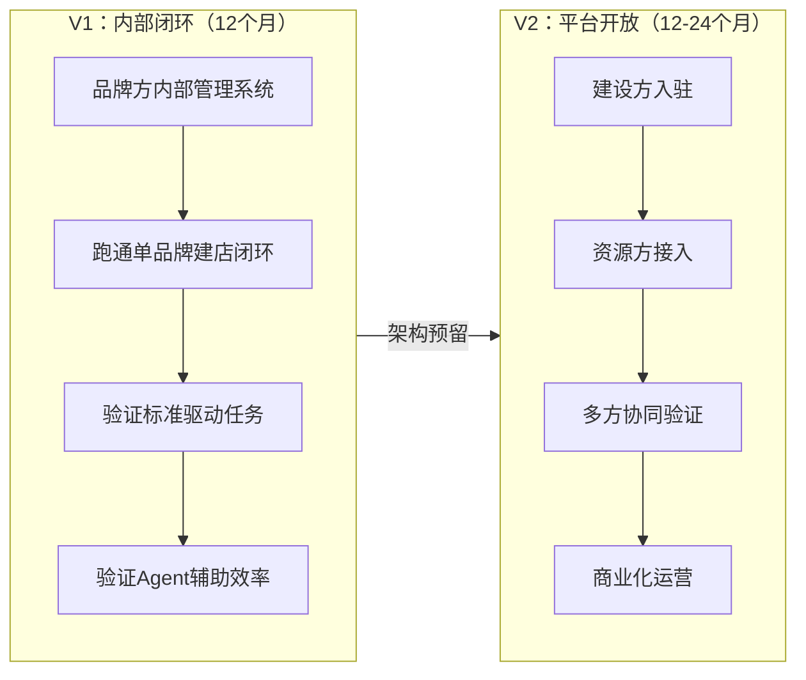
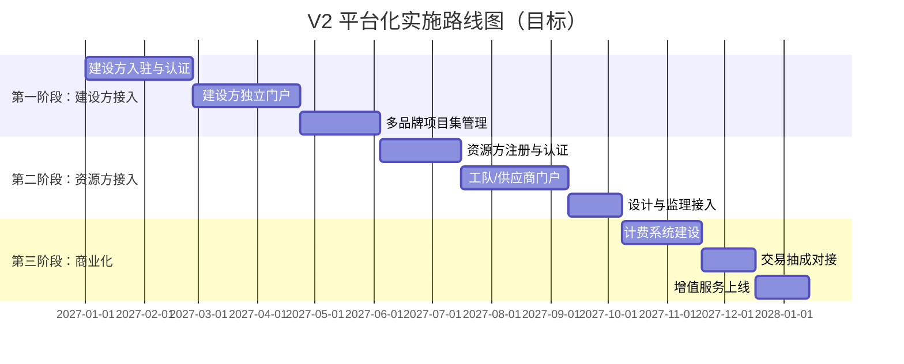

# 连锁门店营建管理系统 - 产品规划文档 V1.2

> **文档版本**：V1.2  
> **文档状态**：活跃（整合 V1.1 + V2.3，当前工作基线）  
> **项目阶段**：V1 / MVP（内部系统）→ V2 / 平台化（战略展望）  
> **核心用户**：V1 品牌方营建部门；V2 品牌方、建设方、加盟商、资源方  
> **UI 主栈**：shadcn/ui Neutral Light（`src-next/`，Tailwind CSS v4）  
> **V1 后端**：Node.js + Express + SQLite + Prisma  
> **V2 后端**：PostgreSQL + Redis（战略目标）

---

# 执行摘要

## 战略统一口径

**V1（当前）**：面向品牌方营建部门的`内部标准化管理系统`，验证"标准驱动任务、任务推进项目、结果对象沉淀"的核心闭环。

**V2（战略方向）**：在 V1 验证成功的基础上，演进为`平台化系统`，连接品牌方（需求方）与建设方/资源方（供给方），通过效率提升获取平台价值。

**一句话概括**：

> **V1：把营建专业能力交给系统，把品牌精力留给品牌。**  
> **V2：把系统能力开放给生态，让多方协同降本增效。**

## 关键变更（相对 V1.1 / V2.3）

| 变更项          | V1.1 / V2.3 问题                                        | V1.2 处理方案                                                    |
| --------------- | ------------------------------------------------------- | ---------------------------------------------------------------- |
| 战略定位        | V1.1 内部系统 vs V2.3 平台商业模式冲突                  | 统一为"先内部闭环、后平台开放"两阶段战略                         |
| source_of_truth | 两份文档同时标记为 true                                 | 仅 V1.2 标记为 true，V1.1 / V2.3 归档为历史版本                  |
| 技术路线        | V1.1 原定 Express + Prisma + PostgreSQL，但后端尚未启动 | 重新评估为 Node.js + Express + SQLite 轻量方案，V2 迁 PostgreSQL |
| 角色体系        | V1.1 仅品牌方视角，V2.3 突然引入大量新角色              | 分阶段定义：V1 角色（必备）+ V2 角色（扩展）                     |
| 实施路线        | V1.1 粗略分 5 阶段；V2.3 四阶段路线图过于理想化         | 重新规划为 6 阶段 12 个月详细路线，每阶段有明确交付物和验证标准  |
| 商业测算        | V2.3 首年 2,379 万收入假设过于乐观                      | 保留在"战略展望"章节，标注假设前提，新增保守测算                 |

---

# 一、战略定位

## 1.1 两阶段演进模型



## 1.2 V1 核心目标（验证 4 个能力）

1. 系统是否能承接品牌方营建部门的核心管理职责
2. 标准库是否能驱动任务生成、执行指导和验收判断
3. 任务树模型是否能统一支撑项目、流程、服务三种业务形态
4. Agent 是否能在受控流程节点中提升执行效率

## 1.3 V1 核心闭环

`需求接入 → 项目立项 → 任务生成 → 执行推进 → 采购协同 → 验收整改 → 资产归档 → 结算建议`

## 1.4 V2 战略方向（平台化）

在 V1 验证成功后，系统将演进为平台模式：

- 品牌方：基础功能免费 + 增值服务收费
- 建设方/资源方：交易抽成 + Agent 使用费
- 平台方：数据沉淀 + 效率提升获取合理收益

**V2 详细内容见第 9 章"战略展望"。**

---

# 二、参与方与角色体系

## 2.1 V1 角色（当前阶段必备）

| 角色               | 核心诉求                     | 系统权限                     | 关键动作                     |
| ------------------ | ---------------------------- | ---------------------------- | ---------------------------- |
| **品牌方总部**     | 保证标准落地、控制项目风险   | 标准制定、项目审批、全局数据 | 制定标准、审批变更、监控进度 |
| **品牌项目负责人** | 按时交付、质量可控、成本清晰 | 项目管理、任务分配、验收确认 | 立项、拆解任务、推进执行     |
| **采购专员**       | 采购与项目联动、供应商管理   | 采购申请、订单管理、到货跟踪 | 发起采购、确认到货、对账     |
| **验收/质量人员**  | 标准执行到位、问题可追溯     | 验收任务、检查项、整改追踪   | 发起验收、判定结果、跟踪整改 |
| **财务审核人员**   | 结算准确、付款合规           | 结算审核、付款审批           | 核对单据、审核结算、执行付款 |
| **系统管理员**     | 系统稳定、权限可控           | 组织管理、权限配置、系统设置 | 配置角色、管理账号、监控日志 |

## 2.2 V2 角色（平台化阶段扩展）

| 角色                | 阶段  | 核心诉求             | 关键动作                           |
| ------------------- | ----- | -------------------- | ---------------------------------- |
| **加盟商**          | V1.5+ | 投得明白、建得放心   | 查看进度、参与验收、确认变更       |
| **建设方-客户经理** | V2    | 多品牌统筹、资源优化 | 对接多个品牌、统筹项目集、横向对比 |
| **建设方-财务专员** | V2    | 结算核对、现金流管理 | 单据核对、结算编制、付款执行       |
| **建设方-工程师**   | V2    | 技术统筹、质量把控   | 技术交底、质量验收、变更评估       |
| **工队/施工方**     | V2    | 按图施工、进度款结算 | 任务执行、进度上报、完工提交       |
| **道具供应商**      | V2    | 订单管理、内部协同   | 订单确认、进度更新、内部任务分配   |
| **设计公司**        | V2    | 按需求出图、变更配合 | 图纸提交、变更配合                 |
| **监理公司**        | V2    | 质量监督、进度跟踪   | 质量验收、问题上报、整改确认       |

## 2.3 角色演进路线

```
V1.0（1-6月）：品牌方内部角色
    ↓
V1.5（6-9月）：+ 加盟商（只读视图 + 关键节点确认）
    ↓
V2.0（9-15月）：+ 建设方角色（客户经理、工程师、财务）
    ↓
V2.5（15-24月）：+ 资源方角色（工队、供应商、设计、监理）
```

---

# 三、核心价值主张

## 3.1 V1 价值支柱（内部效率）

| 支柱           | 能力                           | 价值                                            |
| -------------- | ------------------------------ | ----------------------------------------------- |
| **项目可控**   | 进度、风险、责任透明可追踪     | 项目经理信息汇总时间从 4 小时/天降至 30 分钟/天 |
| **标准可复制** | 设计、施工、验收标准沉淀为模板 | 新人上手周期从 6 个月缩短至 2 周                |
| **采购可协同** | 采购与项目、任务、验收联动     | 采购漏项减少 50%，到货及时率提升                |
| **资产可沉淀** | 门店交付后形成一店一档         | 资料完整度从 60% 提升至 95%                     |
| **Agent 提效** | 节点型 Agent 辅助执行          | 标准化协调工作减少 30%                          |

## 3.2 V2 增值价值（平台协同）

详见第 9 章"战略展望"。

---

# 四、功能模块规划

## 4.1 核心建模方式（V1/V2 共用）

### 任务树模型

- `父任务`：承载阶段目标和责任范围
- `子任务`：承载具体执行动作和结果回传
- 每个任务可绑定：执行标准、验收标准、标签、责任人、状态、时间要求

### 项目 / 流程 / 服务统一视图

- **项目**：围绕建店目标组织的任务集合
- **流程**：围绕业务动作形成的任务链路
- **服务**：围绕交付结果组织的任务包

### 结果对象模型

采购申请单、采购单、验收单、整改单、结算建议单、资产台账、一店一档

## 4.2 V1 功能模块

### P0（必须上线）

| 模块         | 核心功能                                     | 说明                                                                                                                  |
| ------------ | -------------------------------------------- | --------------------------------------------------------------------------------------------------------------------- |
| **工作台**   | 待办、预警、消息、项目动态                   | 统一入口                                                                                                              |
| **项目管理** | 项目列表、详情、里程碑、风险、资料、地图视图 | **PMBOK 领域标签视图**（概览/范围与任务/进度/成本与采购/质量与验收/资源与人员/风险与沟通/设置），含门店地址与地图标记 |
| **任务中心** | 任务树、任务关系、状态流转、标准绑定         | 已与 WBS 合并到项目详情                                                                                               |
| **标准管理** | 标准来源、条款结构化、规则项、模板           | V1 先支持高频标准域                                                                                                   |
| **采购管理** | 采购申请、订单、到货跟踪                     | 基础版，与任务联动                                                                                                    |
| **资产管理** | 资产台账、一店一档、交付资料                 | 基础归档                                                                                                              |
| **人员管理** | 组织、角色、账号、资源人员                   | V1 支持内部角色                                                                                                       |
| **系统设置** | 权限、字典、编码规则、通知、Agent 配置       | 基础配置                                                                                                              |

### P1（顺延）

| 模块             | 核心功能                                               | 预计阶段 |
| ---------------- | ------------------------------------------------------ | -------- |
| **工队管理**     | 工队档案、班组结构、资质证照、评级、排期负载、派单对接 | V1.5     |
| **合同结算**     | 合同台账、结算建议、付款记录                           | V1.5     |
| **数据中心**     | 项目、任务、采购、验收统计                             | V1.5     |
| **工单协同**     | 工单池、催办、投诉处理                                 | V1.5     |
| **标准模板增强** | 更多标准域、自动匹配                                   | V1.5     |

### P2（延后）

| 模块                      | 核心功能              | 预计阶段 |
| ------------------------- | --------------------- | -------- |
| **资源方独立门户**        | 建设方/资源方独立系统 | V2       |
| **平台商业化**            | 计费、抽成、增值服务  | V2       |
| **高级 BI / 地图 / 大屏** | 可视化分析            | V2.5     |
| **深度 AI 质检**          | 图像/视频识别         | V2.5     |
| **完整设施运维**          | 门店交付后运维        | V3       |

## 4.3 模块关系

```
标准管理 → 定义模板、规则、标准
    ↓
项目管理 → 生成项目容器
    ↓
任务中心 → 生成并推进任务树
    ↓
采购管理 → 协同物料、设备、服务采购
    ↓
资产管理 → 沉淀交付成果和一店一档
    ↓
合同结算 → 形成结算建议
    ↓
数据中心 → 汇总经营与执行结果

人员管理 → 组织、角色、内部账号
    ↓
工队管理 → 班组结构、资质、评级、排期、派单对接
```

## 4.4 项目详情标签设计（PMBOK 领域导向）

### 为什么从生命周期标签改为领域标签

原设计按项目生命周期阶段划分标签（启动→计划→执行→监控→收尾），存在两个问题：

1. **功能割裂**：同一业务对象（如采购）分散在多个阶段标签中，用户查找困难
2. **与 PMBOK 脱节**：营建项目管理天然契合 PMBOK 知识领域，按领域组织更符合专业习惯

### 设计原则

- 以 **PMBOK 第 6 版十大知识领域** 为骨架
- 参考 **PMBOK 第 7 版八大绩效域** 的价值导向
- 同一业务对象聚合在同一标签内，不跨标签重复
- 每个标签有明确的责任边界和核心交付物

### 新标签结构（8 标签）

| 标签             | PMBOK 6 映射        | PMBOK 7 映射      | 核心功能                                        | 对应原内容          |
| ---------------- | ------------------- | ----------------- | ----------------------------------------------- | ------------------- |
| **项目概览**     | 整合管理            | 项目工作 + 交付   | 项目基本信息、状态、里程碑、关键指标、变更日志  | dashboard           |
| **范围与任务**   | 范围管理            | 规划 + 交付       | 任务树（WBS）、范围基准、标准绑定、需求跟踪     | plan（WBS 部分）    |
| **进度管理**     | 进度管理            | 规划 + 度量       | 甘特图、里程碑、排期、关键路径、进度偏差        | plan（甘特部分）    |
| **成本与采购**   | 成本管理 + 采购管理 | 项目工作 + 交付   | 采购申请、订单、到货跟踪、成本预算、实际支出    | execute（采购部分） |
| **质量与验收**   | 质量管理            | 交付              | 验收申请、检查项、初验/复验、整改追踪、质量标准 | close（验收部分）   |
| **资源与人员**   | 资源管理            | 团队              | 项目成员、工队分配、角色权限、资源负载          | monitor（人员部分） |
| **风险与沟通**   | 风险管理 + 沟通管理 | 不确定性 + 干系人 | 风险登记册、问题跟踪、沟通记录、相关方管理      | start + monitor     |
| **设置与 Agent** | -                   | -                 | 项目配置、编码规则、Agent 配置、自动化规则      | settings            |

### 标签与状态机的关系

项目状态机（待立项→待确认→待拆解→执行中→待验收→整改中→待结算→已归档）**不随标签改变而改变**。状态机描述项目的生命周期推进，标签描述项目管理的知识领域视图。两者正交：

- **状态机**：回答"项目现在在哪一步"
- **领域标签**：回答"在这个领域我需要管理什么"

### 实施影响

| 影响项   | 处理方案                                             |
| -------- | ---------------------------------------------------- |
| 前端路由 | `#/projects/:code/:tab` 参数值从生命周期改为领域标识 |
| 组件拆分 | 按领域重新组织 `components/project/` 目录结构        |
| 数据获取 | 每个标签独立的数据加载策略，避免一次性加载全部       |
| 权限控制 | 不同角色可见不同标签（如财务人员可见"成本与采购"）   |

---

# 五、技术路线（重新评估）

## 5.1 技术选型决策

| 层级         | 技术方案                                     | 说明                                           |
| ------------ | -------------------------------------------- | ---------------------------------------------- |
| **前端框架** | React 18.3 + TypeScript + Vite               | 保留现有技术栈                                 |
| **样式方案** | Tailwind CSS v4 + 模块 CSS                   | 保留现有方案，逐步统一 CSS 变量                |
| **UI 组件**  | **MUI v9 + MUI X（DataGrid / DatePickers）** | **替换现有自研组件，保留暗色玻璃态主题**       |
| **路由**     | Hash 路由（`#/projects/:code/:tab`）         | 保留，V2 再考虑 BrowserRouter                  |
| **图表**     | Recharts + @mui/x-charts（甘特/树形场景）    | 保留，按需补充 MUI X 图表                      |
| **状态管理** | React Context + useReducer                   | V1 足够，V2 再评估 Redux/Zustand               |
| **开发模式** | **产品经理 + AI 编码**                       | **MVP 阶段核心模式，需配套评估机制与质量门禁** |
| **V1 后端**  | **Node.js + Express + SQLite**               | **轻量方案，快速验证**                         |
| **V1 ORM**   | Prisma                                       | 保留，SQLite 后期可平滑迁移到 PostgreSQL       |
| **V1 部署**  | CloudBase / 云开发                           | 降低初期运维成本                               |
| **V2 后端**  | Node.js + Express + PostgreSQL + Redis       | 平台化阶段迁移                                 |
| **V2 部署**  | 容器化 + K8s / 云服务器                      | 平台化阶段                                     |
| **地理信息** | 腾讯地图 / 高德地图 JS API + 地址解析服务    | 门店选址、工队区域、项目地图、配送范围         |

## 5.2 为什么 V1 选择 SQLite 而非 PostgreSQL

| 考量维度   | SQLite                                 | PostgreSQL             |
| ---------- | -------------------------------------- | ---------------------- |
| 部署复杂度 | 零配置，单文件                         | 需安装、配置、运维     |
| 开发速度   | 即开即用，快速迭代                     | 需建库、建表、配置连接 |
| 团队现状   | 后端尚未启动，需最小阻力起步           | 需要专门的后端开发时间 |
| 数据规模   | V1 试点期数据量小（< 10万条）          | 优势在大数据量和高并发 |
| 迁移成本   | Prisma 支持，后期平滑迁移到 PostgreSQL | -                      |
| 成本       | 零额外成本                             | 云数据库有持续费用     |

**决策**：V1 使用 SQLite 跑通闭环，V2 数据量和并发上升后迁移至 PostgreSQL。

## 5.3 本地后端最小闭环（V1 阶段）

为支持前端独立开发和联调，建立本地后端服务：

| 模块                             | 功能              | 说明                               |
| -------------------------------- | ----------------- | ---------------------------------- |
| `local-api/server.ts`            | HTTP 服务入口     | 五接口路由、参数校验、错误响应     |
| `local-api/store/sqlite.ts`      | SQLite 连接与事务 | 基础 CRUD                          |
| `local-api/store/schema.sql`     | 表结构定义        | 项目、任务、验收、结算、审计、幂等 |
| `local-api/store/idempotency.ts` | 幂等键处理        | 写接口去重与重放                   |
| `local-api/contracts.ts`         | API 契约类型      | 对齐前端 `serverAdapter`           |

## 5.5 地理信息服务（GIS）

### 业务场景

| 场景                  | 说明                                           | 涉及模块           |
| --------------------- | ---------------------------------------------- | ------------------ |
| **门店选址/地址管理** | 项目关联门店的精准地址、坐标、行政区划         | 项目管理           |
| **工队服务区域**      | 工队可服务城市、区域范围，派单时按地理位置匹配 | 工队管理、任务中心 |
| **项目地图可视化**    | 多城市、多门店的项目分布地图，状态色块标记     | 项目管理、数据中心 |
| **供应商配送范围**    | 供应商/道具商的配送覆盖区域                    | 采购管理           |
| **人员签到/轨迹**     | 工队现场施工签到、验收人员到场确认（可选）     | 任务中心           |

### 地图服务商选型

| 服务商       | 优势                                     | 适用场景                  |
| ------------ | ---------------------------------------- | ------------------------- |
| **腾讯地图** | 与微信生态打通，小程序集成友好           | V2 加盟商小程序、位置分享 |
| **高德地图** | 地址解析精度高，POI 数据丰富，企业版成熟 | V1 门店地址管理、项目地图 |
| **百度地图** | 大屏可视化 SDK 完善                      | V2.5 BI 大屏、数据可视化  |

**建议**：V1 采用 **高德地图 JS API**（地址解析 + 地图标注），V2 视场景补充腾讯地图（微信端）或百度地图（大屏端）。

### 分阶段接入策略

| 阶段     | 深度     | 功能                                                   |
| -------- | -------- | ------------------------------------------------------ |
| **V1.0** | 轻量接入 | 门店地址解析（经纬度）、项目列表地图标记、基础行政区划 |
| **V1.5** | 区域匹配 | 工队服务区域与项目地址匹配、供应商配送范围校验         |
| **V2.0** | 协同地图 | 建设方/资源方门户地图视图、多品牌项目集地理分布        |
| **V2.5** | 深度分析 | 热力图、选址分析、配送路径优化、大屏地图               |

### 数据存储方案

```typescript
// 门店/项目地址
interface GeoAddress {
  fullAddress: string // 完整地址文本
  province: string
  city: string
  district: string
  street?: string
  longitude: number // 经度
  latitude: number // 纬度
  poiId?: string // 高德/腾讯 POI ID
  geoHash?: string // GeoHash 索引（用于附近查询）
}

// 工队服务区域
interface ServiceArea {
  type: 'city' | 'district' | 'polygon' // 城市级 / 区级 / 自定义多边形
  codes: string[] // 行政区划编码
  polygon?: GeoPolygon // 自定义围栏（V2）
}
```

- V1 阶段：地址解析结果存储于 SQLite，`longitude` + `latitude` + `geoHash` 字段即可支撑基础查询
- V2 阶段：迁移至 PostgreSQL + PostGIS 扩展，支撑复杂空间查询（附近、围栏、路径）

## 5.6 技术债务清偿（V1 并行）

| 债务项                     | 影响                              | 清偿方案                        | 预计时间   |
| -------------------------- | --------------------------------- | ------------------------------- | ---------- |
| 5 套侧边栏                 | 维护困难、视觉不一致              | 统一为一套 Sidebar 组件         | 2-3 天     |
| 7+ 套统计卡片              | 重复代码、逻辑分散                | 抽象为统一 StatsCards           | 2-3 天     |
| 200+ 处 CSS 硬编码         | 难以维护、响应式混乱              | 统一 CSS 变量 + 类名规范        | 3-5 天     |
| 状态机联动为 mock          | 系统停留在演示层面                | 接入真实后端后真实化            | 与后端同步 |
| 项目详情标签为生命周期阶段 | 与 PMBOK 知识领域不匹配，功能割裂 | 重构为 PMBOK 领域标签（8 标签） | 5-7 天     |

## 5.7 UI 组件替换策略（不再自研）

### 选型依据

项目已安装 **MUI v9**（`@mui/material@9.0.0`），`theme.ts` 已做完整的暗色玻璃态主题定制，`main.tsx` 已挂好 `ThemeProvider`。目前 src 里大量组件仍为自研，MUI 实际使用率很低。**决策：不再新增自研组件，存量自研组件按优先级逐步替换为 MUI/MUI X 组件。**

### 基础组件库

| 层级         | 技术方案              | 说明                                                                                      |
| ------------ | --------------------- | ----------------------------------------------------------------------------------------- |
| **基础 UI**  | `@mui/material` v9    | 已安装，Button / Dialog / Table / Tabs / TextField / Select / Chip / Accordion / Alert 等 |
| **高级表格** | `@mui/x-data-grid`    | **需补充安装**，项目列表、任务列表、人员列表统一替换                                      |
| **日期选择** | `@mui/x-date-pickers` | **需补充安装**，任务排期、里程碑、结算日期等                                              |
| **树形组件** | `@mui/x-tree-view`    | **需补充安装**，任务树 / WBS 层级展示                                                     |
| **图表补充** | `@mui/x-charts`       | 甘特图、进度图等场景按需补充，与 Recharts 共存                                            |

### 专用组件（视需求补充）

| 场景         | 推荐库                                | 说明                   |
| ------------ | ------------------------------------- | ---------------------- |
| 甘特图       | `gantt-task-react` 或 `@mui/x-charts` | 项目管理进度视图       |
| 富文本       | `react-quill` 或 `@tiptap/react`      | 项目备注、标准条款编辑 |
| 文件上传     | MUI + `react-dropzone`                | 资料上传               |
| 无限滚动列表 | `@tanstack/react-virtual`             | 大数据量项目列表       |
| 拖拽排序     | `@dnd-kit/core`                       | 任务排序、看板         |

### 自研组件替换优先级

按以下顺序逐步替换，**与 Phase 1-2 工程初始化并行**：

| 优先级 | 组件类型  | 典型场景                     | 目标 MUI 组件                         | 预计工作量 |
| ------ | --------- | ---------------------------- | ------------------------------------- | ---------- |
| **P0** | 表格类    | 项目列表、任务列表、人员列表 | `DataGrid`                            | 3-5 天     |
| **P0** | 表单类    | 输入框、选择器、日期、搜索   | `TextField` / `Select` / `DatePicker` | 2-3 天     |
| **P1** | 弹窗/抽屉 | 详情页、新建、编辑           | `Dialog` / `Drawer`                   | 2-3 天     |
| **P1** | 标签页    | 项目详情 8 领域标签          | `Tabs` + `TabPanel`                   | 1-2 天     |
| **P1** | 步骤条    | 状态机流转、立项向导         | `Stepper`                             | 1 天       |
| **P2** | 卡片/列表 | 统计卡片、信息卡片、工作台   | `Card` / `Paper` / `List`             | 2-3 天     |
| **P2** | 反馈类    | Toast、确认框、警告提示      | `Snackbar` / `Alert` / `Backdrop`     | 1-2 天     |

### 保留与替换原则

- **不再新增自研组件**：新功能开发直接使用 MUI/MUI X 组件
- **主题继承**：复用 `theme.ts` 中已有的暗色玻璃态定制，MUI 组件开箱即用
- **渐进替换**：与业务迭代并行，不单独安排全量重写，降低风险
- **兼容性处理**：自研组件与 MUI 组件共存期间，统一通过 `theme.ts` 保证视觉一致性

### 备选方案（如 MUI 不满足）

若特定场景 MUI 组件确实不满足需求，可引入以下库作为**局部补充**（非全局替换）：

| 库                 | 优势                               | 适用场景                     |
| ------------------ | ---------------------------------- | ---------------------------- |
| **Ant Design 5.x** | 国内最成熟，企业级组件最全         | 复杂表单、高级表格、权限控制 |
| **TDesign React**  | 腾讯出品，设计现代，暗色主题支持好 | 与腾讯生态集成、现代风格页面 |

> **注意**：如全局替换为 AntD 或 TDesign，需重写全部主题定制，迁移成本高，**仅建议作为局部补充使用**。

## 5.8 AI 编码模式评估关注点

V1 MVP 阶段采用**产品经理主导需求 + AI 辅助编码**的模式，与传统研发模式相比，在效率、质量、可控性上存在显著差异。评估进度和产出时，需重点关注以下维度：

### 效率假设修正

| 传统假设                     | AI 编码现实                                     | 评估调整                                          |
| ---------------------------- | ----------------------------------------------- | ------------------------------------------------- |
| 需求评审后开发排期可精确到日 | AI 生成代码快，但理解偏差和返工不可预测         | 每个功能预留 **20-30% 返工缓冲**                  |
| 代码量与进度正相关           | AI 可一次性生成大量代码，但可读性和可维护性参差 | 以**可合并、可审查**的代码量为进度标准，非生成量  |
| 技术债务随版本线性累积       | AI 缺乏全局架构意识，债务可能指数级累积         | 每 2 周安排一次**架构健康度评审**，而非仅功能验收 |

### 质量门禁（必须建立）

| 门禁项        | 最低标准                                             | 责任方              |
| ------------- | ---------------------------------------------------- | ------------------- |
| **代码审查**  | 所有 AI 生成代码必须经过人工 Review 后方可合并       | 产品经理/技术负责人 |
| **类型检查**  | `tsc --noEmit` 零报错                                | CI                  |
| **Lint 通过** | `npm run lint` 零报错                                | CI                  |
| **功能验收**  | 需求文档中的验收标准逐条通过                         | 产品经理            |
| **可解释性**  | 核心逻辑（状态机、权限、数据流）必须能由人讲清楚原理 | 技术负责人          |

### 知识传递风险

- **代码所有权模糊**：AI 生成的代码若未经深度理解，团队无人真正"拥有"它
- **文档滞后**：AI 编码速度快，但文档和注释往往跟不上
- **应对**：核心模块（状态机、项目模型、权限体系）必须手写 + 强制注释；非核心 UI 页面可 AI 生成但需标注生成来源

### 架构腐化防控

- **短期倾向**：AI 倾向于生成"能跑就行"的代码，缺乏长期可维护性考量
- **应对策略**：
  1. 关键接口和类型定义由人先行设计，AI 只做实现填充
  2. 任何跨模块改动必须经人工评估影响面
  3. 禁止 AI 直接修改 `domain/` 和 `data/` 层的核心模型

### 评估指标调整

| 指标         | 传统模式     | AI 编码模式                       |
| ------------ | ------------ | --------------------------------- |
| 迭代周期     | 2 周/Sprint  | 1 周/小迭代，更频繁验收           |
| 代码审查比例 | 30% 抽查     | **100% 全量审查**                 |
| 单元测试覆盖 | 行覆盖 80%   | 核心逻辑 100% 覆盖，UI 层允许降低 |
| 架构评审频率 | 月度         | **双周**                          |
| 文档同步要求 | 上线前补文档 | **需求评审时同步输出技术注释**    |

---

# 六、版本迭代规划

## 6.1 迭代原则

- `标准先行`：先沉淀标准，再做自动化和智能化
- `任务原子化`：任务是最小执行单元
- `结果对象独立`：任务推进动作，结果对象沉淀成果
- `状态驱动流程`：所有业务流转以状态机为准
- `人工兜底`：关键节点必须支持人工接管
- `全程留痕`：关键动作和 Agent 决策必须可审计
- `架构预留`：V1 设计时预留平台化扩展点（用户体系、权限、API）

## 6.2 V1.0 MVP 试点版（1-6 月）

**目标**：跑通单品牌、单区域、标准店型的建店标准化闭环。

**重点建设**：

- 项目管理 + 任务中心 + 标准库基础能力（含验收与整改任务流、门店地址解析）
- 采购基础协同 + 资产归档
- 基础 Agent 接入（品牌需求 Agent、项目经理 Agent、验收质检 Agent）
- 工作台 + 人员管理 + 系统设置

**验证标准**：

- 跑通至少 1 条真实建店闭环
- 标准能驱动任务生成与验收判断
- 采购、验收、资产形成同一管理链路

## 6.3 V1.5 增强版（6-9 月）

**目标**：提升可复制性与协同效率，引入工队资源管理和加盟商只读视图。

**重点建设**：

- 工队管理（档案、班组、资质、评级、排期、派单对接）
- 合同结算基础版
- 标准模板增强
- 数据中心增强
- 工单协同
- 采购与资产联动增强
- 加盟商门户（只读 + 关键节点确认）

## 6.4 V2.0 平台版（9-18 月）

**目标**：从品牌方营建管理系统升级为平台化系统。

**重点建设**：

- 建设方入驻与独立门户
- 资源方接入（工队、供应商、设计、监理）
- 双边协同与撮合
- 商业化体系（计费、抽成、增值服务）
- 高级分析能力
- 深度智能化能力（图像质检、视频巡检）

## 6.5 V2.5 生态版（18-24 月）

**目标**：多品牌、多城市、完整生态运营。

**重点建设**：

- 多品牌项目集管理
- 智能资源调度
- 供应链深度协同
- 数据资产变现

---

# 七、实施路线图（详细规划）

## 7.1 Phase 1：底座搭建（第 1-2 月）

**目标**：工程初始化、通用组件、任务模型、本地后端联调

| 周次  | 任务                      | 交付物                               | 验收标准                                |
| ----- | ------------------------- | ------------------------------------ | --------------------------------------- |
| W1-W2 | 工程初始化 + 组件重构     | 统一 Sidebar、StatsCards、PageHeader | 5套侧边栏合并为1套，7+统计卡片抽象为1套 |
| W3-W4 | 任务模型 + 本地后端       | SQLite 表结构、五接口本地联调        | `/projects/state` 等五接口可本地读写    |
| W5-W6 | 状态机真实化 + 权限模型   | 状态流转接入真实数据                 | 状态变更持久化到 SQLite                 |
| W7-W8 | CSS 变量统一 + 响应式适配 | 设计规范落地                         | 200+处硬编码CSS清零                     |

## 7.2 Phase 2：标准与项目（第 2-4 月）

**目标**：标准库、模板中心、项目立项、项目详情 PMBOK 领域标签闭环

| 周次    | 任务                             | 交付物                                                     | 验收标准                                                 |
| ------- | -------------------------------- | ---------------------------------------------------------- | -------------------------------------------------------- |
| W9-W10  | 标准库基础能力                   | 标准来源管理、条款结构化                                   | 可创建标准并绑定到任务                                   |
| W11-W12 | 模板中心                         | 项目模板、任务模板                                         | 从模板生成项目 + 任务树                                  |
| W13-W14 | 项目立项 + 详情页 PMBOK 标签重构 | 项目详情 8 领域标签完整                                    | 按 PMBOK 知识领域重组标签，功能不遗漏                    |
| W15-W16 | 任务标签页合并 + 地理信息基础    | 移除 `#/tasks`，WBS 合并为任务管理；门店地址解析与地图标记 | 任务管理在项目详情内完成；项目可关联精准地址并在地图标注 |

## 7.3 Phase 3：任务中心完善（第 4-5 月）

**目标**：任务树真实层级、标准联动、前置依赖

| 周次    | 任务           | 交付物                       | 验收标准                           |
| ------- | -------------- | ---------------------------- | ---------------------------------- |
| W17-W18 | 任务数据重构   | 真实父子层级（parentTaskId） | 任务树靠真实关联聚合，非字符串拆分 |
| W19-W20 | 标准联动真实化 | 执行/验收标准存 ID 而非文本  | 标准快照可生成，检查项从模板生成   |
| W21-W22 | 任务关系管理   | 前置依赖、阻塞派生           | 守卫条件检查真实 task_relation     |

## 7.4 Phase 4：采购、资源与资产沉淀（第 5-7 月）

**目标**：采购基础闭环、任务验收流闭环、工队管理基础版、资产归档

| 周次    | 任务             | 交付物                                 | 验收标准                                           |
| ------- | ---------------- | -------------------------------------- | -------------------------------------------------- |
| W23-W24 | 采购基础版       | 采购申请、订单、到货跟踪               | 采购与任务联动                                     |
| W25-W26 | 任务验收与整改流 | 验收任务、检查项、整改子任务           | 验收作为任务状态节点，整改任务自动派生并关联父任务 |
| W27-W28 | 工队管理基础版   | 工队档案、班组结构、资质证照、派单对接 | 可在任务派单时选择工队作为执行方                   |

## 7.5 Phase 5：Agent 与工作台（第 7-9 月）

**目标**：Agent 能力接入、工作台首页、数据闭环

| 周次    | 任务           | 交付物                       | 验收标准                         |
| ------- | -------------- | ---------------------------- | -------------------------------- |
| W29-W30 | 品牌需求 Agent | 需求补全、模板匹配、立项草案 | Agent 可生成立项建议             |
| W31-W32 | 项目经理 Agent | 任务树生成、催办预警         | Agent 可自动生成任务树并催办     |
| W33-W34 | 验收质检 Agent | 检查项生成、初验判断         | Agent 可生成检查项并判断初验结果 |
| W35-W36 | 工作台首页     | 待办、预警、消息、项目动态   | 项目经理一屏掌握全局             |

## 7.6 Phase 6：联调与试点（第 9-12 月）

**目标**：端到端联调、试点验证、反馈迭代

| 周次    | 任务       | 交付物                    | 验收标准                     |
| ------- | ---------- | ------------------------- | ---------------------------- |
| W37-W40 | 端到端联调 | 全链路测试通过            | 从立项到归档的完整闭环可执行 |
| W41-W44 | 试点部署   | 1个品牌、1个城市、5个项目 | 真实项目数据跑通系统         |
| W45-W48 | 反馈迭代   | 问题清单、优化版本        | 试点反馈问题解决率 > 80%     |

## 7.7 风险评估与应对

### 风险矩阵

| 风险类别     | 风险项                                                       | 可能性 | 影响程度 | 风险等级    | 应对策略                                                                                                                                                                      | 责任人                 |
| ------------ | ------------------------------------------------------------ | ------ | -------- | ----------- | ----------------------------------------------------------------------------------------------------------------------------------------------------------------------------- | ---------------------- |
| **技术风险** | AI 生成代码质量不可控，核心模块出现隐蔽缺陷                  | 高     | 高       | 🔴 严重     | 核心模块（状态机/权限/数据模型）人工设计+强制代码审查；非核心模块允许 AI 生成但需 100% Review                                                                                 | 技术负责人             |
| **技术风险** | MUI v9 + 暗色玻璃态主题定制在实际业务场景中视觉/交互不达预期 | 中     | 中       | 🟡 中等     | Phase 1 前两周完成关键页面（项目列表/项目详情）的视觉验证，不通过则回退到自研组件 + 设计重构                                                                                  | 产品经理               |
| **技术风险** | SQLite 在并发场景（多用户同时操作）下性能瓶颈                | 中     | 中       | 🟡 中等     | V1 试点期控制并发用户数（< 20人）；监控慢查询，若出现则提前启动 PostgreSQL 迁移                                                                                               | 后端负责人             |
| **技术风险** | 状态机逻辑复杂，AI 编码导致状态流转漏洞                      | 中     | 高       | 🟡 中等     | 状态机定义（`projectStatusMachine.ts`）人工维护，AI 仅做 UI 层实现；每个状态流转必须人工编写单元测试                                                                          | 技术负责人             |
| **业务风险** | 标准库结构化难度大，初期标准沉淀不足导致任务生成质量差       | 高     | 高       | 🔴 严重     | V1.0 先聚焦 1-2 个高频标准域（如装修验收标准），跑通后再扩展；允许人工兜底修正 AI 生成的任务                                                                                  | 产品/标准负责人        |
| **业务风险** | 试点品牌配合度不足，真实项目数据无法接入                     | 中     | 高       | 🟡 中等     | 试点前签署数据使用协议；准备 mock 数据 fallback 方案，确保系统可演示                                                                                                          | 项目经理               |
| **业务风险** | 营建业务本身复杂度高，系统过度简化导致无法落地               | 中     | 高       | 🟡 中等     | 每个 Phase 交付后安排 1-2 场业务方评审（营建部门真实用户），未通过不进入下阶段                                                                                                | 产品经理               |
| **业务风险** | **Agent 实际效果不达预期，生成内容错误率高导致用户不信任**   | **高** | **高**   | **🔴 严重** | **分阶段释放 Agent 能力（先做辅助建议，再做自动执行）；所有 Agent 输出必须经过人工确认才可生效；建立 Agent 效果评估指标体系（准确率/采纳率/返工率）；设置"人工一键接管"机制** | **产品经理/AI 负责人** |
| **组织风险** | 产品经理 + AI 编码模式下，技术决策权模糊                     | 中     | 中       | 🟡 中等     | 明确分工：产品经理负责需求/验收/业务逻辑正确性；技术负责人负责架构/性能/安全/代码质量；AI 仅做实现辅助                                                                        | 项目负责人             |
| **组织风险** | 团队对 AI 生成代码过度依赖，人工编码能力退化                 | 低     | 中       | 🟢 低       | 核心模块强制人工编写；定期（月度）安排纯人工编码的技术债清偿周                                                                                                                | 技术负责人             |
| **进度风险** | AI 编码效率假设过于乐观，实际进度滞后                        | 高     | 中       | 🟡 中等     | 每个功能预留 20-30% 返工缓冲；采用 1 周小迭代，每周验收，早发现早调整                                                                                                         | 产品经理               |
| **合规风险** | 门店地址、工队信息等敏感数据存储与传输安全                   | 低     | 高       | 🟡 中等     | V1 阶段数据不出内网；敏感字段加密存储；操作日志全量审计；V2 再引入等保合规                                                                                                    | 技术负责人             |

### 风险监控机制

| 机制               | 频率          | 内容                                           | 输出物     |
| ------------------ | ------------- | ---------------------------------------------- | ---------- |
| **迭代回顾**       | 每周          | 进度偏差、AI 代码质量反馈、阻塞问题            | 迭代纪要   |
| **架构健康度评审** | 每双周        | 技术债务盘点、核心模块可维护性评估             | 技术债清单 |
| **业务方验收**     | 每 Phase 结束 | 真实用户试用、业务流程走通验证                 | 验收报告   |
| **风险台账更新**   | 每月          | 风险状态更新、新增风险识别、应对措施有效性评估 | 风险台账   |

### 红线事项（触发即停）

以下情况出现时，必须暂停当前迭代，先解决问题：

1. **核心状态机出现漏洞**：项目状态可非法跳转，或数据一致性被破坏
2. **敏感数据泄露**：门店地址、联系人、结算信息未授权暴露
3. **AI 生成代码无法被任何人理解**：核心模块成为"黑盒"
4. **试点品牌关键用户拒绝使用**：非体验问题，而是业务流程无法匹配
5. **Agent 输出导致业务错误**：Agent 生成的任务树、检查项或结算建议出现事实性错误，且未经过人工确认即生效，造成实际业务损失

### 分阶段风险聚焦

不同阶段的核心风险不同，评估和应对资源应集中在当前阶段最关键的风险上：

#### V1.0 MVP 阶段（第 1-6 月）：仅关注「产品经理 + AI 编码」相关风险

此阶段团队最小（产品经理 1 人 + AI 辅助），外部依赖最少，**风险范围应严格收敛在与 AI 编码模式直接相关的维度**，不扩散至平台化或商业化风险。

| 风险项                       | 风险等级 | 阶段特有性 | 关键监控指标                           |
| ---------------------------- | -------- | ---------- | -------------------------------------- |
| AI 生成代码质量不可控        | 🔴 严重  | MVP 核心   | 每轮迭代 Review 拒绝率、线上 Bug 数    |
| AI 编码效率假设过于乐观      | 🟡 中等  | MVP 核心   | 实际完成故事点 / 计划故事点            |
| Agent 效果不达预期           | 🔴 严重  | MVP 核心   | Agent 输出准确率、用户采纳率、返工率   |
| 状态机 AI 编码漏洞           | 🟡 中等  | MVP 核心   | 状态流转单元测试覆盖率、非法跳转事件数 |
| 知识传递风险（代码无人理解） | 🟡 中等  | MVP 核心   | 核心模块人工讲解通过率                 |
| 架构腐化                     | 🟡 中等  | MVP 核心   | 技术债务清单增长速率                   |
| 团队对 AI 过度依赖           | 🟢 低    | MVP 核心   | 人工编写代码占比（月度）               |

> **V1.0 阶段不评估的风险**：多租户安全、平台商业化、外部协同复杂度、大规模并发性能——这些在 MVP 阶段不具备触发条件，纳入 V1.5/V2 后再评估。

#### V1.5 增强版（第 6-9 月）：新增外部协同与数据隔离风险

此阶段引入加盟商只读视图和工队管理，系统从封闭走向有限开放，新增风险：

| 新增风险项         | 风险等级 | 说明                                                |
| ------------------ | -------- | --------------------------------------------------- |
| 加盟商数据越权访问 | 🔴 严重  | 加盟商只能查看自己门店，需严格权限隔离              |
| 工队信息真实性     | 🟡 中等  | 工队资质、证照需验证，防止虚假入驻                  |
| 合同结算金额准确性 | 🔴 严重  | 财务数据错误直接影响付款，需人工复核机制            |
| 多用户并发写入     | 🟡 中等  | 加盟商、工队、品牌方同时操作，SQLite 可能出现锁竞争 |

#### V2.0 平台版（第 9-18 月）：新增平台化与商业化风险

此阶段系统开放给建设方、资源方，引入交易和计费，风险全面升级：

| 新增风险项                | 风险等级 | 说明                                           |
| ------------------------- | -------- | ---------------------------------------------- |
| 多租户数据隔离失效        | 🔴 严重  | 品牌方 A 看到品牌方 B 的数据，直接摧毁平台信任 |
| 交易抽成计算错误          | 🔴 严重  | 金额错误引发法律纠纷                           |
| 商业化计费系统漏洞        | 🟡 中等  | 计费规则被绕过，平台收入损失                   |
| 建设方入驻审核不严        | 🟡 中等  | 劣质建设方入驻损害品牌方利益                   |
| 平台合规（等保/数据安全） | 🔴 严重  | 必须满足最小合规要求才能对外运营               |

#### V2.5 生态版（第 18-24 月）：新增生态治理与深度 AI 风险

| 新增风险项           | 风险等级 | 说明                                              |
| -------------------- | -------- | ------------------------------------------------- |
| 多品牌数据竞争与泄露 | 🔴 严重  | 品牌方担心数据被竞争对手获取                      |
| AI 质检误判责任      | 🟡 中等  | Agent 误判通过/不通过，造成施工质量问题，责任归属 |
| 生态参与者违约       | 🟡 中等  | 工队/供应商/监理不履约，平台信誉受损              |
| 智能调度算法偏见     | 🟢 低    | 算法偏向某些建设方，引发公平性质疑                |

---

# 八、效益测算与 ROI（保守修正）

## 8.1 修正原则

- V2.3 原测算假设"首年 20 品牌、50 建设方、2000 项目"过于激进
- 修正为分阶段测算，每阶段基于上一阶段验证结果
- 所有数字标注假设前提，不作为承诺

## 8.2 MVP 验证阶段成本估算（V1.0，1-6 月）

> **核心关注点**：产品经理 + AI 编码模式下，AI Token 使用费是新增且容易被低估的成本项。

### 成本构成总览

| 成本项                  | 保守估算       | 适中估算       | 乐观估算       | 说明                                      |
| ----------------------- | -------------- | -------------- | -------------- | ----------------------------------------- |
| **产品经理人力**        | 12 万          | 12 万          | 12 万          | 1 人 × 6 个月 × 2 万/月                   |
| **AI Token 费用**       | 1,100 元       | 2,500 元       | 5,500 元       | 详见下表拆分；为主流国产/国际模型混合使用 |
| **AI IDE 订阅**         | 1,200 元       | 1,800 元       | 3,000 元       | Cursor / Copilot / 其他 AI 编程助手       |
| **云服务（CloudBase）** | 3,000 元       | 4,500 元       | 6,000 元       | 数据库、存储、CDN、函数计算               |
| **地图 API**            | 2,000 元       | 3,000 元       | 5,000 元       | 高德/腾讯地图 JS API + 地址解析           |
| **其他工具**            | 1,000 元       | 1,500 元       | 2,500 元       | 设计协作、文档、测试工具等                |
| **MVP 总成本**          | **约 13.4 万** | **约 13.7 万** | **约 14.2 万** | -                                         |

### AI Token 费用详细测算

**假设前提**：

- MVP 周期 6 个月，约 130 个工作日
- 使用国产大模型 API（如智谱 GLM-4、通义千问、文心一言）为主，国际模型（GPT-4）为辅
- 中档模型（编码用）综合单价约 0.01 元/1K tokens
- 高档模型（Agent/复杂推理用）综合单价约 0.05 元/1K tokens

#### 1. AI 编码 Token 消耗

| 维度                | 数值      | 说明                               |
| ------------------- | --------- | ---------------------------------- |
| 每日有效交互轮次    | 30-50 轮  | 功能开发、代码审查、调试、文档生成 |
| 每轮平均 Tokens     | ~20K      | 含代码库上下文、多轮对话历史       |
| 工作日总数          | 130 天    | 6 个月                             |
| **编码总 Token 量** | **~104M** | 130 × 40 × 20K                     |

#### 2. Agent 运行 Token 消耗

| Agent                 | 触发次数      | 单次 Tokens | 小计      |
| --------------------- | ------------- | ----------- | --------- |
| 品牌需求 Agent        | 5 项目 × 1 次 | ~100K       | 500K      |
| 项目经理 Agent        | 24 周 × 2 次  | ~50K        | 2.4M      |
| 验收质检 Agent        | 5 项目 × 2 次 | ~80K        | 800K      |
| 测试与调试            | -             | -           | ~5M       |
| **Agent 总 Token 量** |               |             | **~8.7M** |

#### 3. 费用分层测算

| 用途                 | 模型选择 | Token 量 | 单价      | 费用         |
| -------------------- | -------- | -------- | --------- | ------------ |
| 编码（70%）          | 中档模型 | 73M      | 0.01 元/K | 730 元       |
| 编码（30%）          | 高档模型 | 31M      | 0.05 元/K | 1,550 元     |
| Agent 运行           | 高档模型 | 9M       | 0.05 元/K | 450 元       |
| **合计（适中估算）** |          | **113M** |           | **2,730 元** |

> **敏感因素**：若全部使用 GPT-4 级别模型，费用可能上升至 5,000-6,000 元；若全部使用国产低价模型，可压缩至 1,000-1,500 元。建议实际执行时采用**模型路由策略**：简单编码任务用低价模型，复杂架构设计/Agent推理用强模型。

### 成本占比分析

```
MVP 总成本（适中估算 13.7 万）
├── 人力成本（产品经理）     87.6%  ████████████████████
├── 云服务                   3.3%  █
├── AI IDE 订阅              1.3%  ▌
├── AI Token 费用            2.0%  ▌
├── 地图 API                 2.2%  ▌
└── 其他工具                 1.1%  ▌
```

> **结论**：AI Token 费用在 MVP 阶段占比约 2%，绝对金额不大，但具有**不可预测性**（模型价格变动、使用量超预期）。建议每月监控实际消耗，设置月度 Token 预算上限（如 500 元/月），超限则切换至低价模型或人工兜底。

---

## 8.3 V1 试点期效益（内部效率）

| 维度     | 指标                 | 现状      | 目标        | 验证方式     |
| -------- | -------------------- | --------- | ----------- | ------------ |
| **效率** | 项目经理信息汇总时间 | 4 小时/天 | 30 分钟/天  | 系统日志统计 |
| **效率** | 任务拆解时间         | 2 天/项目 | 4 小时/项目 | 对比试验     |
| **质量** | 资料完整度           | 60%       | 95%         | 资产归档检查 |
| **质量** | 一次验收通过率       | 基准值    | 提升 20%    | 验收记录统计 |
| **能力** | 新人上手周期         | 6 个月    | 2 周        | 培训后测试   |

## 8.4 V2 平台期效益（保守测算）

**假设前提**：

- V1 试点成功，已验证单品牌闭环
- 已有 3 个品牌稳定使用系统超过 6 个月
- 后端已迁移至 PostgreSQL，支持多租户

| 维度             | 指标                    | 保守值     | 乐观值     |
| ---------------- | ----------------------- | ---------- | ---------- |
| **品牌方数**     | 接入品牌                | 5          | 10         |
| **建设方数**     | 入驻建设方              | 10         | 20         |
| **年项目数**     | 平台项目                | 200        | 500        |
| **单项目金额**   | 平均金额                | 30 万      | 50 万      |
| **交易抽成收入** | 2% × 项目金额           | 120 万     | 500 万     |
| **增值服务收入** | 标准定制 + 培训 + Agent | 30 万      | 100 万     |
| **年收入合计**   | -                       | **150 万** | **600 万** |
| **年成本**       | 研发 + 运营 + 基础设施  | 200 万     | 300 万     |
| **盈亏平衡**     | -                       | 第 2 年    | 第 1.5 年  |

> **说明**：以上 V2 测算为战略目标，需在 V1 验证成功后根据实际情况调整。

## 8.5 ROI 测算（V1 内部效率）

| 项目                                | 金额                          |
| ----------------------------------- | ----------------------------- |
| 系统建设投入（V1）                  | 150 万                        |
| 年运维成本                          | 30 万                         |
| 年节省人力成本（按 5 人效率提升计） | 75 万                         |
| **首年净收益**                      | **-105 万（投入期）**         |
| **第2年净收益**                     | **+45 万**                    |
| **投资回报周期**                    | **约 2.5 年（内部效率角度）** |

> **平台化后的 ROI 见第 9 章战略展望。**

---

# 九、战略展望（原 V2.3 核心内容）

> **⚠️ 本章内容为战略方向展望，所有数据均为假设性测算，需在 V1 验证成功后根据实际情况调整。**

## 9.1 平台商业模式

### 9.1.1 平台定位

本系统采用**平台商业模式**，作为中立的第三方平台，连接**品牌方**（需求方）和**资源方**（供给方），通过数字化工具+AI能力，实现多方协同降本增效。

### 9.1.2 收费模式（目标形态）

| 收费对象   | 收费项目         | 收费方式    | 说明                         |
| ---------- | ---------------- | ----------- | ---------------------------- |
| **品牌方** | 基础功能         | **免费**    | 项目管理、任务协同、进度跟踪 |
| **品牌方** | 标准定制服务     | 按项目收费  | 协助建立/优化营建标准体系    |
| **品牌方** | 系统培训服务     | 按人次收费  | 平台使用培训、最佳实践分享   |
| **品牌方** | AI Agent Token费 | 按用量计费  | 超出免费额度后的 AI 调用费用 |
| **资源方** | 交易抽成         | **2%**      | 基于项目结算金额抽成         |
| **资源方** | AI Agent 使用费  | 按用量/包月 | 协调 Agent、质检 Agent 等    |
| **资源方** | 增值服务费       | 按服务收费  | 优先派单、数据报表、金融保理 |

### 9.1.3 收入来源测算（目标形态，首年）

**假设前提**：V1 验证成功，已有 10 个品牌、20 家建设方稳定使用。

| 收入项目                  | 单价           | 数量            | 年收入     |
| ------------------------- | -------------- | --------------- | ---------- |
| **品牌方-标准定制**       | 5 万/品牌      | 10 个品牌       | 50 万      |
| **品牌方-系统培训**       | 0.5 万/人次    | 50 人次         | 25 万      |
| **品牌方-Agent Token**    | 0.1 万/品牌/月 | 10 个品牌×12 月 | 12 万      |
| **资源方-交易抽成（2%）** | 2%×30 万       | 500 个项目      | 300 万     |
| **资源方-Agent 使用费**   | 0.3 万/家/月   | 20 家×12 月     | 72 万      |
| **资源方-增值服务**       | 0.5 万/家/年   | 20 家           | 10 万      |
| **合计**                  | -              | -               | **469 万** |

> **注**：原 V2.3 测算为 2,379 万，修正为更保守的 469 万，仍需 V1 验证后调整。

### 9.1.4 成本结构（目标形态）

| 成本项目     | 金额（首年） | 说明                              |
| ------------ | ------------ | --------------------------------- |
| **产品研发** | 200 万       | 平台开发、AI Agent 训练、系统运维 |
| **市场推广** | 100 万       | 品牌方拓展、资源方入驻、行业活动  |
| **运营服务** | 80 万        | 客户成功、技术支持、标准咨询服务  |
| **基础设施** | 60 万        | 云服务器、数据库、带宽、安全      |
| **管理成本** | 60 万        | 人员工资、办公场地、行政          |
| **合计**     | **500 万**   | -                                 |

### 9.1.5 盈利预测（目标形态）

| 指标       | 首年   | 第二年          | 第三年           |
| ---------- | ------ | --------------- | ---------------- |
| **收入**   | 469 万 | 938 万（+100%） | 1,407 万（+50%） |
| **成本**   | 500 万 | 600 万          | 700 万           |
| **毛利**   | -31 万 | 338 万          | 707 万           |
| **毛利率** | -7%    | 36%             | 50%              |

## 9.2 AI 数字员工能力矩阵（目标形态）

### 9.2.1 协调 Agent

| 能力     | 说明                              | 替代场景 |
| -------- | --------------------------------- | -------- |
| 智能排程 | 基于任务依赖、资源负载自动排程    | 排程规划 |
| 自动催办 | 任务即将到期自动提醒责任人        | 进度催办 |
| 风险预警 | 自动识别延期风险，提前 3-7 天预警 | 风险识别 |
| 资源推荐 | 派单失败时自动推荐备选资源方      | 资源协调 |

### 9.2.2 质检 Agent

| 能力         | 说明                           | 替代场景 |
| ------------ | ------------------------------ | -------- |
| 图像识别质检 | 施工照片自动比对标准，识别违规 | 现场检查 |
| 标准自动比对 | 上传资料自动核对是否齐全       | 资料审核 |
| 缺陷自动分级 | 根据缺陷严重程度自动分级       | 问题分级 |
| 整改建议生成 | 基于缺陷自动生成整改建议       | 整改指导 |

### 9.2.3 客服 Agent

| 能力          | 说明                       | 替代场景 |
| ------------- | -------------------------- | -------- |
| 7x24 智能应答 | 全天候回答进度查询         | 进度查询 |
| 主动通知      | 关键节点自动通知相关方     | 节点通知 |
| 情绪识别      | 识别投诉情绪，自动升级人工 | 投诉处理 |

### 9.2.4 结算 Agent（V2 新增）

| 能力         | 说明                       | 替代场景 |
| ------------ | -------------------------- | -------- |
| 单据智能归集 | 自动抓取合同、验收单、发票 | 单据收集 |
| 单据自动核对 | 基于合同条款匹配验收单     | 单据核对 |
| 结算建议生成 | 自动生成结算建议书         | 结算编制 |
| 付款节点预警 | 自动计算付款节点到期时间   | 付款提醒 |
| 现金流预测   | 预测未来 3 个月现金流      | 资金规划 |

### 9.2.5 客户经理 Agent（V2 新增）

| 能力             | 说明                           | 替代场景 |
| ---------------- | ------------------------------ | -------- |
| 多品牌仪表盘生成 | 自动生成多品牌项目集仪表盘     | 信息汇总 |
| 品牌标准智能匹配 | 自动识别品牌并匹配标准         | 标准匹配 |
| 横向对比分析     | 分析不同品牌的效率、质量、成本 | 数据分析 |
| 智能资源调度建议 | 推荐最优资源调配方案           | 资源协调 |
| 一键报告生成     | 自动生成月度/季度报告          | 报告编制 |

## 9.3 实施路线图（V2 目标形态）



---

# 十、附录

## 10.1 核心术语

| 术语           | 定义                                                 |
| -------------- | ---------------------------------------------------- |
| **任务**       | 系统最小执行单元                                     |
| **子任务**     | 父任务的拆解执行项                                   |
| **项目**       | 围绕建店目标组织的任务集合与管理容器                 |
| **流程**       | 围绕业务动作形成的任务链路                           |
| **服务**       | 围绕交付结果组织的任务包                             |
| **执行标准**   | 定义任务"怎么做"                                     |
| **验收标准**   | 定义任务"怎么算通过"                                 |
| **标准库**     | 沉淀结构化标准的能力中心                             |
| **标准快照**   | 任务运行时固化的标准版本副本                         |
| **结果对象**   | 采购单、验收单、整改单、资产台账等业务沉淀对象       |
| **Agent 节点** | 明确允许 Agent 执行的流程节点                        |
| **人工兜底**   | 异常和争议场景下由人工接管处理                       |
| **建设方**     | 承接品牌方营建需求，统筹设计、施工、道具的总包方     |
| **客户经理**   | 建设方对外窗口，同时对接多个品牌，统筹多品牌项目集   |
| **财务专员**   | 建设方财务负责人，负责结算审核、付款执行、现金流管理 |

## 10.2 核心状态口径

### 项目状态

- 待立项 → 待确认 → 待拆解 → 执行中 → 待验收 → 整改中 → 待结算 → 已归档

### 任务状态（V1.2 精简版）

- 待分配 → 待执行 → 执行中 → 待验收 → 已完成 → 已关闭

### 验收状态

- 待申请 → 待初验 → 初验通过/不通过 → 整改中 → 待复验 → 复验通过

## 10.3 变更记录

| 版本 | 日期       | 变更内容                                                                                                                                                                                                                                                                                                  | 作者            |
| ---- | ---------- | --------------------------------------------------------------------------------------------------------------------------------------------------------------------------------------------------------------------------------------------------------------------------------------------------------- | --------------- |
| V1.2 | 2026-05-06 | 文档状态从 draft 升为 active；前端技术栈更新为 shadcn/ui Neutral Light（`src-next/`）；related_code 指向更新                                                                                                                                                                                              | docs-maintainer |
| V1.2 | 2026-04-24 | 整合 V1.1 + V2.3；统一战略口径；修正数据假设；补充角色体系；细化实施路线；重新评估技术路线；**UI组件选型从自研改为MUI v9 + MUI X**；**明确开发模式为产品经理+AI编码并补充评估机制**；**新增风险评估与应对章节（含Agent效果风险、分阶段风险聚焦）**；**新增MVP验证阶段成本估算（含AI Token费用详细测算）** | docs-maintainer |
| V2.3 | 2026-04-23 | 新增商业模式章节：平台定位、收费模式、收入测算、成本结构、盈利预测                                                                                                                                                                                                                                        | docs-maintainer |
| V2.2 | 2026-04-23 | 新增财务结算痛点、财务专员角色、财务结算价值支柱、增强结算 Agent 能力                                                                                                                                                                                                                                     | docs-maintainer |
| V2.1 | 2026-04-23 | 新增建设方客户经理角色，补充多品牌项目集管理场景、第七大价值支柱、客户经理 Agent                                                                                                                                                                                                                          | docs-maintainer |
| V2.0 | 2026-04-23 | 基于加盟模式、建设方枢纽、AI 数字员工重新梳理价值主张                                                                                                                                                                                                                                                     | docs-maintainer |
| V1.1 | 2026-04-16 | 增加项目管理 6 标签结构、任务-WBS 合并                                                                                                                                                                                                                                                                    | docs-maintainer |
| V1.0 | 2026-03-01 | 初版，聚焦项目管理、任务中心、标准管理                                                                                                                                                                                                                                                                    | docs-maintainer |

---

**文档维护者**：产品团队  
**下次评审**：2026-05-24  
**评审重点**：V1 Phase 1-2 执行进度、技术路线验证、试点品牌确认
