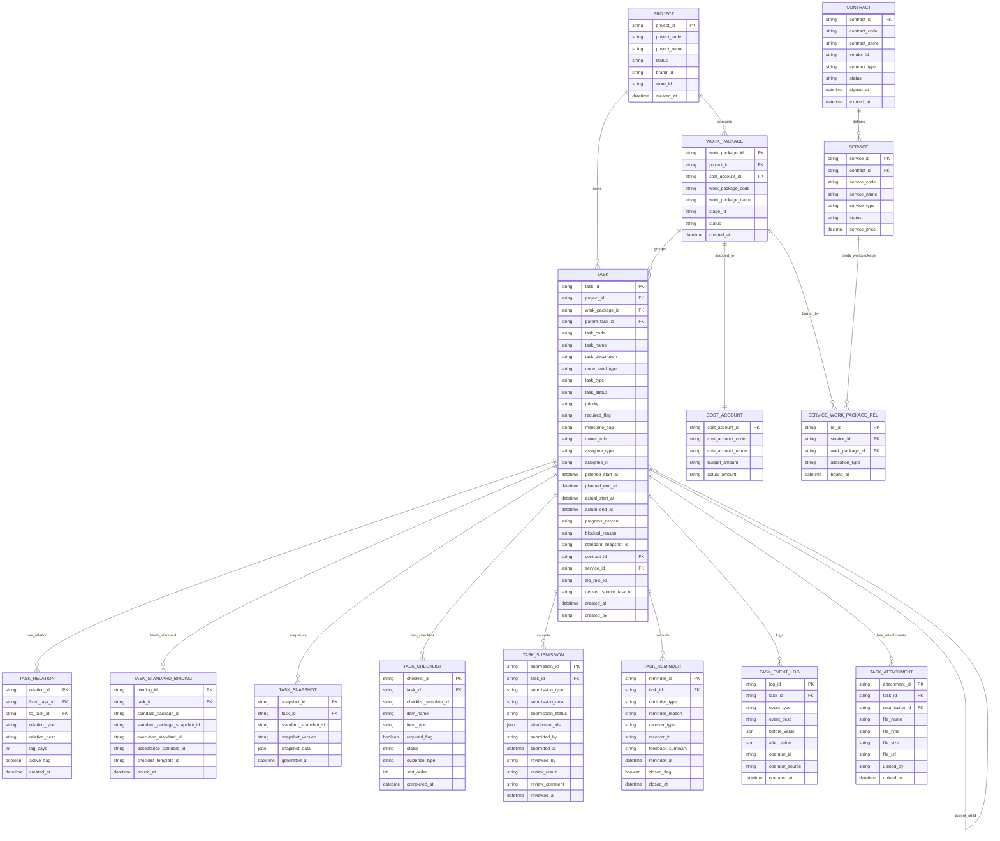

# 任务中心实体关系图

## 完整 ER 图

## 核心关系说明

| 关系                          | 类型   | 说明                        |
| ----------------------------- | ------ | --------------------------- |
| PROJECT 1:N WORK_PACKAGE      | 一对多 | 一个项目包含多个工作包      |
| WORK_PACKAGE 1:1 COST_ACCOUNT | 一对一 | 每个工作包绑定唯一成本账户  |
| WORK_PACKAGE 1:N TASK         | 一对多 | 工作包下包含多个任务/子任务 |
| TASK 1:N TASK                 | 自引用 | 父子任务层级关系            |
| TASK 1:N TASK_RELATION        | 一对多 | 任务间的依赖/派生关系       |
| CONTRACT 1:N SERVICE          | 一对多 | 一个合同可定义多个服务      |
| SERVICE N:M WORK_PACKAGE      | 多对多 | 服务与工作包通过关联表绑定  |

## 关键业务规则

1. **层级规则**
   - 项目(Project) → 工作包(WorkPackage) → 任务(Task) → 子任务(SubTask)
   - 任务通过 `parent_task_id` 自引用形成树形结构

2. **成本归集规则**
   - 所有任务成本归集到所属 `work_package_id`
   - 成本核算主键为 `cost_account_id`
   - `work_package_id` 与 `cost_account_id` 1:1 强约束

3. **状态流转规则**
   - 主状态字段：`task_status`
   - 派生/投影字段：`dispatch_status` / `sla_status`

4. **外包关系规则**
   - 外包任务必须绑定 `contract_id` 和 `service_id`
   - 一个服务可打包多个工作包

## 扩展实体说明

| 实体                  | 用途                                 |
| --------------------- | ------------------------------------ |
| TASK_STANDARD_BINDING | 绑定执行标准、验收标准、检查清单模板 |
| TASK_SNAPSHOT         | 任务标准快照，记录绑定时的标准版本   |
| TASK_CHECKLIST        | 执行清单/检查项，将标准转为具体动作  |
| TASK_SUBMISSION       | 任务提交记录，支持多次提交历史       |
| TASK_REMINDER         | 催办记录，支持系统/人工/自动催办     |
| TASK_EVENT_LOG        | 任务操作审计日志                     |
| TASK_ATTACHMENT       | 任务附件/资料管理                    |
