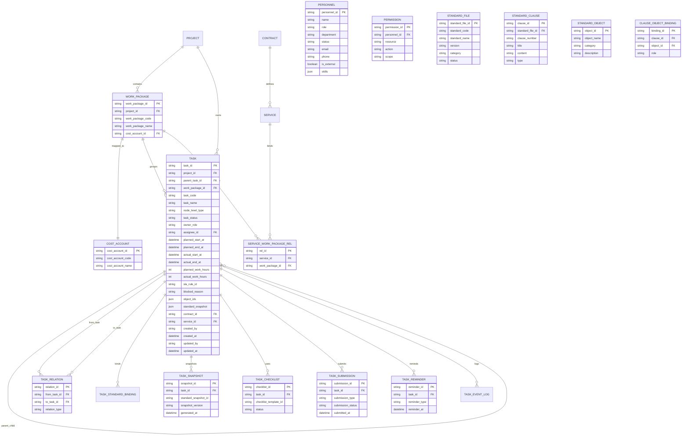
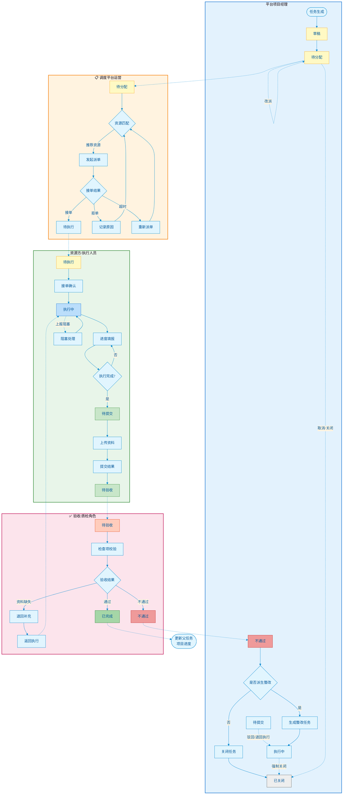

# 任务中心需求文档

> **文档版本**：V1.01
> **文档状态**：草稿中
> **适用阶段**：V1 / MVP
> **所属模块**：任务中心
> **关联文档**：`docs/01-product/product-roadmap.md`、`docs/02-architecture/task-tree-modeling.md`、`docs/02-architecture/structured-standard-library.md`、`docs/02-architecture/state-machine-design.md`、`docs/01-product/project-management-prd.md`、`docs/01-product/multi-agent-v1-prd.md`

---

## 1. 模块概述

### 1.1 模块定位

任务中心是系统的执行底座模块，用于统一承接项目拆解后的任务树、任务关系、责任分配、状态推进、标准绑定、执行记录、催办协同和结果提交。还用于设施管理中的维修、巡检、保养等任务。

在本系统中：

- `项目管理`负责承接项目容器与管理视图
- `任务中心`负责承接具体执行动作与推进过程
- `标准管理`负责提供执行与验收依据
- `验收`通过任务状态流转实现（待验收→不通过→已完成），整改以子任务形式自动派生，不设独立的「验收整改」模块

因此，任务中心不是简单的待办列表，而是整个门店生命周期中的`执行主链路控制台`。

任务中心的核心作用：

- 承接项目模板和任务模板生成的任务树
- 统一管理父任务、子任务和任务关系
- 管理分配、接单、执行、提交、验收前流转
- 绑定执行标准、验收标准、执行清单与标准快照
- 记录 SLA、催办、阻塞、异常和人工介入
- 为调度平台、品牌方、资源方提供一致的任务口径

### 1.2 模块目标

V1 阶段，任务中心重点解决以下问题：

- 项目拆解结果缺少统一承接模块
- 父子任务、依赖关系和状态流转口径不一致
- 派单、接单、执行、提交过程分散在多个环节中
- 任务执行缺少标准依据和资料要求约束
- 延期、阻塞、补传、整改等异常处理不透明
- 项目、任务、验收之间缺少统一的追踪链路

### 1.3 V1 范围

V1 纳入范围：

- 任务树管理
- 父子任务管理
- 任务关系管理
- 任务自动生成与补生成
- 任务分配与待派单池
- 任务执行推进与进度记录
- 任务资料提交与结果提交
- 执行标准、验收标准与标准快照绑定
- 执行清单与验收前检查项入口
- SLA、催办、阻塞、风险提示
- 派生任务生成（整改、补传、补货等）
- 项目经理 Agent / 调度 Agent 辅助能力

V1 不纳入范围：

- 复杂专业排程引擎
- 多项目资源容量优化
- 完整 P6 级关键路径计算
- 跨品牌共享任务市场
- 高自由度自定义任务流引擎
- Agent 自动闭环全部异常且无人工确认

---

## 2. 角色与场景

### 2.1 核心角色

#### 品牌方项目负责人

关注项目下各阶段任务进度、关键节点是否按计划推进、是否存在延期和待决事项。

#### 平台项目经理

关注任务树生成质量、任务分配、任务阻塞、跨角色协同、关键路径和异常升级。

#### 调度平台运营

关注待派单任务池、资源匹配建议、派单结果、改派和连续失败任务。

#### 资源方负责人 / 执行人员

关注分配给本方的待接单任务、待执行任务、资料要求、进度填报和完工提交。

#### 验收 / 质检角色

关注进入`待验收`前的任务提交完整性、检查项来源和验收前置条件。

#### 项目经理 Agent

辅助任务树生成、关系梳理、催办摘要、风险识别和任务补全建议。

#### 调度 Agent

辅助资源推荐、排期建议、派单冲突识别、改派建议和 SLA 风险提示。

### 2.2 核心业务场景

#### 场景 1：项目确认后自动生成任务树

项目创建完成后，系统基于项目模板、任务模板、标准包和规则输出任务树，项目经理确认后正式落库。

#### 场景 2：平台项目经理调整任务结构

项目经理查看自动生成结果，补充项目特殊任务、调整前置关系、修改默认责任角色和计划时间。

#### 场景 3：调度平台处理待派单任务

执行任务进入`待分配`后进入待派单池，系统给出资源推荐结果，调度人员确认派单或改派。

#### 场景 4：资源方执行任务并提交结果

资源方在待接单或待执行列表中处理任务，填写进度、上报阻塞、上传资料、完成作业并发起提交。

#### 场景 5：项目经理跟进超时任务

系统识别即将超 SLA 或已延期任务，项目经理查看催办记录、阻塞原因、前置未完成项，并决定催办、改派或升级。

#### 场景 6：任务不通过后派生整改任务

验收结论不通过时，原任务回到`不通过`，系统基于问题项派生整改任务，关联原任务、标准快照和问题来源。

#### 场景 7：管理者从多视图查看任务全局

管理者从项目视图、任务日历、任务列表、任务关系图、待派单池等视角查看任务全貌。

---

## 3. 业务对象定义

### 3.1 任务 Task

任务是系统最小执行单元，必须具备明确目标、责任主体、时间要求、执行依据、验收口径和结果输出。

字段口径合并说明（V1）：

- 本节以"`工作包与成本账户字段（新增）` + `任务字段说明文档内容（完整粘贴）"为主口径。
- 下文如出现历史字段别名或统计投影字段，以本节主口径优先。
- 必须保留字段说明表，并以表内约束作为实现与验收基准。

#### 工作包与成本账户字段（新增）

| 字段名              | 含义          | 层级适用       | 是否必填 | 约束/说明                                       |
| ------------------- | ------------- | -------------- | -------- | ----------------------------------------------- |
| `work_package_id`   | 所属工作包 ID | task / subtask | 是       | 任务与子任务必须归属唯一工作包                  |
| `work_package_code` | 工作包编码    | work_package   | 是       | 用于业财对账与外部单据映射                      |
| `work_package_name` | 工作包名称    | work_package   | 是       | 交付与成本归集最小管理单元名称                  |
| `cost_account_id`   | 成本账户 ID   | work_package   | 是       | 每个工作包必须绑定一个成本账户                  |
| `cost_account_code` | 成本账户编码  | work_package   | 是       | 用于预算/实际/偏差核算                          |
| `cost_account_name` | 成本账户名称  | work_package   | 是       | 财务展示字段，便于业务识别                      |
| `service_id`        | 服务 ID       | work_package   | 条件必填 | 外包成服务时必填；可打包多个工作包              |
| `contract_id`       | 合同 ID       | work_package   | 条件必填 | 外包时必填，V1 建议一个工作包仅归属一个合同口径 |

#### 工作包与成本账户关联关系（新增）

1. `project_id` 1:N `work_package_id`
2. `work_package_id` 1:N `task_id`（含 subtask）
3. `work_package_id` 1:1 `cost_account_id`（V1 强约束）
4. `service_id` 1:N `work_package_id`（服务可打包多个工作包）
5. `contract_id` 1:N `service_id`（或直接 1:N `work_package_id`，按合同建模口径二选一）

口径约束：

- 任务/子任务发生的工时、采购、外包、整改成本，统一归集到所属 `work_package_id`
- 成本核算主键为 `cost_account_id`
- 项目进度/质量按任务聚合，成本按工作包/成本账户聚合
- `stage_id` 为生命周期属性，不参与工作包/成本账户主外键关系

#### 任务字段说明文档内容（完整粘贴）

每个任务至少需要具备以下字段：

##### 5.1 基础标识

- `task_id`
- `project_id`
- `program_id`：所属项目集（可空）
- `portfolio_id`：所属项目组合（可空）
- `parent_task_id`
- `task_code`
- `task_name`
- `task_description`：任务描述（TEXT，建议默认空字符串）
- `task_type`
- `node_level_type`：project_root / work_package / task
  - **3 层结构**：项目根节点 → 工作包 → 任务
  - `subtask`（子任务）通过 `parent_task_id` 关联表达，不作为独立层级
  - `stage`（阶段）是项目生命周期属性，不纳入任务树层级
- `business_domain`

##### 5.2 业务属性

- `source_type`：手工创建 / 模板生成 / Agent 建议 / 系统派生
- `priority`：低 / 中 / 高 / 紧急
- `required_flag`：是否必做
- `milestone_flag`：是否里程碑
- `store_id`
- `brand_id`
- `stage_id`：项目生命周期阶段 ID（属性字段，不作为任务树层级节点）
- `work_package_id`：所属工作包（任务/子任务必填）

##### 5.3 执行属性

- `owner_role`
- `assignee_type`
- `assignee_id`
- `planned_start_at`
- `planned_end_at`
- `actual_start_at`
- `actual_end_at`
- `sla_rule_id`

##### 5.4 财务与合同属性

- `cost_account_id`：成本账户 ID（工作包层必填）
- `outsource_flag`：是否外包
- `contract_id`：外包合同 ID（外包时必填）
- `service_id`：服务 ID（外包成服务后必填）
- `vendor_id`：供应商 ID
- `settlement_rule_id`：结算规则 ID

##### 5.5 标准属性

- `execution_standard_ids`
- `acceptance_standard_ids`
- `standard_snapshot_id`
- `checklist_template_id`

##### 5.6 状态属性

- `task_status`
- `blocked_reason`
- `risk_level`
- `close_reason`
- `reopen_count`

##### 5.7 管理属性

- `tags`
- `attachments`
- `remark`
- `created_by`
- `updated_by`
- `last_operated_by`
- `last_operated_source`

#### 历史字段映射与兼容（避免口径冲突）

- `task_level` -> 统一收敛为 `node_level_type`
- `dispatch_status`：作为分配流程状态投影字段（不替代任务主状态 `task_status`）
- `sla_status`：作为SLA计算结果投影字段（来源于 `sla_rule_id` 与时间字段计算）
- `standard_package_id`：可作为标准装配入口，落地后需展开并固化到 `execution_standard_ids` / `acceptance_standard_ids` 与 `standard_snapshot_id`
- `execution_checklist_template_id` / `acceptance_checklist_template_id`：统一映射到 `checklist_template_id`（可在实现层保留子类型）
- `blocked_flag`：由 `blocked_reason` 是否为空推导，不再作为主数据口径必填字段
- `attachment_count`：由 `attachments` 数组长度实时计算，不作为主数据口径字段
- `service_package_type`：若保留，仅作为业务分类枚举；不得替代 `service_id` / `contract_id` 关系字段

### 3.2 父任务 Parent Task

父任务用于承接阶段目标、任务包视图和汇总进度，不要求直接由执行人员完成，但必须能表达其下子任务形成的业务结果。

V1 父任务主要承担：

- 汇总子任务进度
- 承接阶段责任范围
- 显示关键风险与阻塞
- 作为任务树折叠节点和统计入口
- 承接标准上下文和默认责任角色

### 3.3 子任务 Sub Task

子任务是可分配、可执行、可提交、可验收的动作单元，是任务中心最核心的执行颗粒。

V1 要求子任务具备：

- 明确执行主体
- 明确计划时间
- 明确标准与资料要求
- 明确前置依赖条件
- 明确提交与验收口径

### 3.4 任务关系 Task Relation

除树形父子关系外，任务之间还存在执行顺序和业务关联关系。V1 支持以下关系类型：

- `parent_child`：父子层级关系
- `depends_on`：前置依赖关系
- `derived_from`：由其他任务结果派生
- `relates_to`：业务关联关系

关系核心字段建议：

- `relation_id`
- `from_task_id`
- `to_task_id`
- `relation_type`
- `relation_desc`
- `active_flag`
- `created_at`
- `created_by`

### 3.5 执行清单 Execution Checklist

执行清单用于把执行标准转成具体动作项、资料项和完成条件，避免把任务无限拆小。

执行清单核心字段建议：

- `checklist_id`
- `task_id`
- `checklist_source`
- `item_name`
- `item_type`：动作 / 资料 / 回执 / 确认
- `required_flag`
- `status`
- `evidence_type`
- `sort_order`
- `standard_rule_id`

### 3.6 任务提交记录 Task Submission

任务提交记录用于固化某次提交的成果资料、说明和提交结论，是任务从`待提交`进入`待验收`的重要依据。

核心字段建议：

- `submission_id`
- `task_id`
- `submission_type`
- `submission_desc`
- `attachment_ids`
- `submitted_by`
- `submitted_at`
- `submission_status`

### 3.7 催办记录 Task Reminder

催办记录用于沉淀任务催办、跟进、反馈和升级过程。

核心字段建议：

- `reminder_id`
- `task_id`
- `reminder_type`：系统预警 / 人工催办 / 自动催办 / 升级催办
- `reminder_reason`
- `receiver_type`
- `receiver_id`
- `feedback_summary`
- `reminder_at`
- `closed_flag`

### 3.8 阻塞与派生任务记录

任务中心需要记录阻塞原因和派生来源，以承接异常闭环。

建议补充字段：

- `blocked_reason_code`
- `blocked_source_type`
- `blocked_source_id`
- `derived_source_task_id`
- `derived_reason`
- `derived_result_object_type`
- `derived_result_object_id`

### 3.9 WorkPackage 工作包实体（Phase 2 新增）

WorkPackage 是独立实体，与 `nodeLevelType='work_package'` 的任务节点区分：

**核心定位**：

- 成本归集的最小管理单元
- 交付范围与责任边界
- 支持工时预算与进度聚合

**字段设计**：

- `work_package_id`（PK）
- `project_id`（FK → Project）
- `work_package_code` / `work_package_name`
- `description`
- `manager_id`（FK → Personnel，工作包负责人）
- `status`：规划中 / 执行中 / 已完成 / 已暂停
- `planned_work_hours` / `actual_work_hours`（工时预算与实际）
- `budget`（预算金额）
- `progress`（进度百分比，聚合下属任务）
- `planned_start_at` / `planned_end_at` / `actual_start_at` / `actual_end_at`

**与任务的关系**：

- 任务通过 `work_package_id` 关联到 WorkPackage
- WorkPackage 作为 `nodeLevelType='work_package'` 出现在任务树中
- 成本按 WorkPackage 归集，进度按任务聚合

### 3.10 Personnel 人员模型（Phase 2 新增）

最小化 Personnel 表支持任务分配与权限管理：

**核心字段**：

- `personnel_id`（PK）
- `name`（姓名）
- `role`（角色：项目经理、施工员、设计师等）
- `department`（部门）
- `status`：active / inactive / leave（在职/离职/休假）
- `email` / `phone`
- `is_external`（是否外部合作方人员）
- `skills`（JSON 数组，如 `["水电", "木工", "设计"]`）
- `created_at` / `updated_at`

**Permission 权限表**：

- `permission_id`（PK）
- `personnel_id`（FK → Personnel）
- `resource`（资源类型：task / project / standard）
- `action`（操作类型：read / write / approve）
- `scope`（范围：own / department / all）

**与任务的关系**：

- 任务通过 `assignee_id`（FK → Personnel）关联执行人
- 支持人员负载分析、技能匹配、权限控制

### 3.11 任务实体关系图（ERD）

> 说明：本图以"字段说明表"为主口径，覆盖任务中心 V1 的核心实体关系；实现层可扩展，但不得与本图主关系冲突。



关系口径补充（Phase 2 更新）：

**项目与任务**：

- `project_id` 1:N `work_package_id`
- `work_package_id` 1:N `task_id`（含通过 `parent_task_id` 关联的子任务）
- `work_package_id` 1:1 `cost_account_id`（V1 强约束）
- `service_id` 1:N `work_package_id`（通过关系表 `SERVICE_WORK_PACKAGE_REL` 实现）

**人员与权限**：

- `personnel_id` 1:N `permission_id`（人员拥有多个权限）
- `personnel_id` 1:N `task_id`（作为 assignee，人员可执行多个任务）
- `personnel_id` 1:N `work_package_id`（作为 manager，人员可管理多个工作包）

**标准绑定（对象抽象层）**：

- `standard_file_id` 1:N `clause_id`（标准文件包含多个条款）
- `clause_id` 1:N `clause_object_binding_id`（条款可关联多个对象）
- `object_id` 1:N `clause_object_binding_id`（对象可关联多个条款）
- `task.object_ids` 逻辑关联 `object_id[]`（任务绑定多个对象）

**字段约定**：

- `task` 的状态主字段为 `task_status`；`dispatch_status` / `sla_status` 为流程与计算投影字段
- `is_blocked: boolean` 是标记，不对应独立状态

---

## 4. 任务结构设计

### 4.1 任务树总体设计

任务中心统一采用`单父节点树结构 + 任务关系扩展`模式。

也就是说：

- 主结构通过`parent_task_id`形成稳定树形层级
- 非树形关系通过`task_relation`表达
- 页面优先按树展示，必要时切换到依赖关系视图

这样可以同时满足：

- 页面易理解
- 数据结构稳定
- 可支持自动生成
- 可支持后续关系扩展
- 不把层级关系和网状依赖混为一体

### 4.2 层级模型（Phase 2 更新）

V1 采用 **3 层任务结构**：

1. **项目根节点 Project Root**（`node_level_type='project_root'`）
2. **工作包 Work Package**（`node_level_type='work_package'`）
3. **任务 Task**（`node_level_type='task'`）

**变更说明**：

- ~~4 层结构~~ → **3 层结构**（移除 subtask 作为独立层级）
- **子任务**通过 `parent_task_id` 关联表达，复用 `task` 层级
- **阶段 Stage** 不作为任务树层级节点，统一作为项目生命周期属性（`stage_id`）参与筛选、统计与权限分域
- 工作包 WorkPackage 既是独立实体，也作为任务树中的 `node_level_type='work_package'` 节点

**层级职责**：

- **项目根节点**：承接项目目标，汇总子节点进度，不直接执行
- **工作包节点**：交付范围与责任边界，成本归集单元，支持工时预算
- **任务节点**：最小可分配、可执行、可验收动作单元

**数据关系**：

```
Project
  └── project_root 任务（虚拟根）
       ├── work_package 任务（关联 WorkPackage 实体）
       │    └── task 任务（可嵌套：通过 parent_task_id 形成子任务链）
       └── work_package 任务
            └── task 任务
```

如果仍需更细颗粒控制，优先通过`执行清单`或`检查项`表达，而不是继续增加第 5 层、第 6 层任务。

### 4.3 父子任务继承与汇总规则

#### 继承规则

子任务默认继承父任务的以下属性：

- 项目归属
- 品牌与门店归属
- 阶段上下文
- 标签
- 默认标准包
- 默认责任角色

子任务允许覆盖以下属性：

- 执行人
- 计划时间
- 优先级
- 标准绑定
- 附件要求
- 是否里程碑

#### 汇总规则

父任务汇总应遵循以下原则：

- 只要存在未完成必做子任务，父任务不得完成
- 关键子任务阻塞时，父任务显示风险提示
- 父任务进度按必做子任务完成率计算
- 父任务完成时间取最后一个必做子任务完成时间
- 父任务验收结论由关键子任务验收结果汇总得到

### 4.4 任务关系设计

#### 前置依赖 `depends_on`

V1 采用轻量依赖模型，仅支持`完成后开始`口径：

- 前置任务未完成，后置任务不可进入`执行中`
- 前置任务延期时，后置任务触发风险重算
- 前置任务关闭时，后置任务需人工确认是否继续

#### 派生关系 `derived_from`

以下场景可派生新任务：

- 验收不通过生成整改任务
- 资料缺失生成补传任务
- 采购异常生成补货任务
- 资产校验异常生成补登记任务

派生任务必须保留：

- 来源任务
- 派生原因
- 来源结果对象
- 派生时间
- 派生责任人或 Agent

#### 业务关联 `relates_to`

用于表达不形成阻塞但存在业务关联的任务，如：

- 任务与采购单关联
- 任务与资产归档关联
- 任务与工单协同关联

### 4.5 自动生成逻辑

#### 生成输入

任务自动生成至少依赖以下输入：

- 品牌
- 店型
- 城市 / 区域
- 建店类型
- 面积 / 预算 / 工期
- 开业目标时间
- 项目模板
- 任务模板
- 标准包
- 服务范围

#### 生成输出

系统生成任务树时，应至少输出：

- 项目根节点
- 工作包清单
- 任务 / 子任务清单
- 任务依赖关系
- 默认责任角色
- 计划时间
- 标准绑定结果
- 必要结果对象入口
- 风险提示

#### 生成模式

V1 采用`模板 + 规则 + Agent 建议 + 人工确认`模式：

- 模板决定基础结构
- 规则决定适配条件和标准包
- Agent 负责补全建议和异常提示
- 人工负责确认、删改和最终生效

#### 触发点

典型触发点包括：

- 项目立项确认后
- 店型或范围重大变更后
- 验收不通过后
- 缺资料判断成立后
- 采购异常触发补充任务后

### 4.6 分配、接单与执行协同

任务中心需要覆盖从`待分配`到`待执行`的责任落实过程。

V1 口径如下：

- 平台项目经理可直接分配任务给内部角色
- 涉及外部资源执行的任务进入待派单池
- 资源方确认接单后，任务才真正具备执行前提
- 若资源方拒单、超时未接单或无法履约，允许改派
- 派单失败连续达到阈值时触发升级或人工介入

### 4.7 关键路径与风险提示

V1 不建设复杂排程引擎，但要支持基础关键路径识别能力：

- 里程碑关联任务识别
- 高优先级必做任务识别
- 即将超 SLA 任务识别
- 被阻塞的关键任务识别
- 前置链路未完成导致的延期风险识别

系统需要在任务列表、详情、项目总览中统一展示风险标签和影响范围。

---

## 5. 标准绑定设计

### 5.1 绑定目标

任务中心必须明确回答四个问题：

- `怎么做`：执行标准
- `怎么提交`：资料与结果要求
- `怎么判断做完`：验收标准
- `出问题怎么办`：整改与回退规则

### 5.2 绑定链路

任务中心与标准库的绑定链路建议为：

`标准来源 -> 条款 -> 规则项 -> 标准对象 -> 标准包 -> 任务模板 -> 具体任务 -> 标准快照`

### 5.3 对象抽象层（Phase 2 新增）

V1 引入**对象抽象层**优化标准绑定体验：

**核心概念**：

- **StandardObject（标准对象）**：工程领域的业务对象，如"线路铺设"、"接地系统"
- **StandardClause（标准条款）**：从标准文档拆解出的具体条款，如"4.2 线路铺设要求"
- **ClauseObjectBinding（条款-对象关联）**：多对多关联表，定义"哪些条款适用于哪些对象"

**绑定链路**：

```
Task（任务）
  ↓ 绑定
StandardObject（对象：如"线路铺设"）
  ↓ 关联（通过 ClauseObjectBinding）
StandardClause（条款：如"4.2 线路铺设要求"）
  ↓ 归属
StandardFile（标准文件：如"GB/T 50254-2024"）
```

**优势**：

- 工程人员按对象思考（"我要做线路铺设"），不用记条款号
- 一个对象可关联多个条款（执行标准 + 验收标准）
- 标准文件更新时，只要重建条款-对象映射，任务自动获得最新标准

**实现**：

- 任务表 `object_ids` 字段：JSON 数组，存储关联的 StandardObject.id
- 标准快照生成时，根据对象的条款关联自动收集执行标准 + 验收标准

### 5.3 绑定层级

V1 支持以下层级：

1. 项目模板层
2. 任务模板层
3. 具体任务层
4. 执行清单层
5. 验收检查项层
6. 派生整改任务层

### 5.4 绑定规则

- 父任务可承接标准上下文
- 子任务默认继承父任务标准上下文
- 子任务可增加更细规则项
- 子任务覆盖标准时必须记录原因
- 关键任务至少绑定一个执行标准和一个验收标准
- 进入执行阶段前必须生成标准快照

### 5.5 执行清单与检查项生成

建议采用以下生成关系：

- `执行标准 -> 执行清单模板 -> 任务执行清单`
- `验收标准 -> 检查项模板 -> 验收检查项`

任务中心负责：

- 展示执行清单完成情况
- 校验必传资料是否齐全
- 把任务提交结果送入验收前置校验
- 在进入`待验收`时联动生成检查项

### 5.6 标准快照机制

V1 建议以`待分配 -> 待执行`作为主快照生成时点，并在以下节点执行补充快照策略：

- 主快照：任务完成`待分配 -> 待执行`守卫校验后生成
- 验收单创建：允许生成验收视角快照（不覆盖主快照）
- 整改任务生成：为派生任务生成独立快照（不覆盖来源任务主快照）

快照至少包含：

- 任务或结果对象 ID
- 适用标准对象 ID
- 标准版本
- 规则项清单
- 执行清单 / 检查项清单
- 来源条款引用
- 快照生成时间
- 生成人 / Agent

### 5.7 标准变更治理

标准更新后，不允许静默覆盖已进入执行态的任务。

V1 原则：

- 未执行任务可重新匹配最新标准
- 已生成快照任务保持原口径
- 如确需调整，必须产生修订记录
- 有争议时以任务快照为优先依据

---

## 6. 任务模板实例化设计

### 6.1 模板体系架构

#### 模板层级关系

```
项目模板 (ProjectTemplate)
├── 阶段蓝图 (PhaseBlueprint[])
├── 里程碑蓝图 (MilestoneBlueprint[])
└── 任务模板绑定 (TaskTemplateBinding[])
    └── 引用 → 任务模板 (TaskTemplate)
        ├── 标准绑定 (StandardBinding)
        ├── 依赖蓝图 (DependencyBlueprint[])
        └── 子模板引用 (TaskTemplateChildRef[])
```

#### 模板与任务的生成链路

```
标准库 → 标准包 → 项目模板/任务模板 → 实例化 → 具体任务 → 标准快照
```

### 6.2 任务模板核心数据结构

#### 任务模板定义（TaskTemplate）

| 字段                    | 类型    | 说明                                                       |
| ----------------------- | ------- | ---------------------------------------------------------- |
| `task_template_id`      | string  | 任务模板唯一ID（主键）                                     |
| `task_template_code`    | string  | 任务模板编码（业务可读，如TPL-DESIGN-001）                 |
| `task_template_name`    | string  | 任务模板名称                                               |
| `task_template_version` | string  | 版本号（格式x.y.z，如1.2.0）                               |
| `status`                | enum    | 模板状态：draft/reviewing/ready/active/inactive/deprecated |
| `template_level`        | enum    | 模板层级：project_root/stage/work_package/task             |
| `business_domain`       | string  | 业务域（如设计、施工、验收）                               |
| `task_type`             | enum    | 任务类型（常规/里程碑/审批/整改/巡检等）                   |
| `required_flag`         | boolean | 是否必做任务                                               |
| `milestone_flag`        | boolean | 是否里程碑节点                                             |
| `owner_role`            | string  | 默认责任角色                                               |
| `assignee_type_default` | string  | 默认执行人类型                                             |
| `sla_rule_id`           | string  | SLA规则ID                                                  |
| `sort_order`            | int     | 排序序号                                                   |

#### 标准绑定配置（StandardBinding）

| 字段                                       | 类型     | 说明               |
| ------------------------------------------ | -------- | ------------------ |
| `default_standard_package_id`              | string   | 默认标准包ID       |
| `default_execution_standard_ids`           | string[] | 默认执行标准ID列表 |
| `default_acceptance_standard_ids`          | string[] | 默认验收标准ID列表 |
| `default_execution_checklist_template_id`  | string   | 执行清单模板ID     |
| `default_acceptance_checklist_template_id` | string   | 验收清单模板ID     |

#### 依赖蓝图（DependencyBlueprint）

| 字段                 | 类型   | 说明                                   |
| -------------------- | ------ | -------------------------------------- |
| `relation_id`        | string | 依赖关系唯一ID                         |
| `from_template_code` | string | 前置任务模板编码                       |
| `to_template_code`   | string | 当前任务模板编码                       |
| `relation_type`      | enum   | 关系类型：depends_on                   |
| `constraint_type`    | enum   | 约束类型：FS(Finish-to-Start)/SS/SF/FF |
| `lag_days`           | int    | 延迟天数（可为负数表示提前）           |

### 6.3 模板实例化流程

#### 实例化流程图

```
项目确认
  ↓
匹配项目模板（品牌/门店类型/区域/服务范围）
  ↓
获取绑定的任务模板列表
  ↓
依赖校验（拓扑排序检测循环依赖）
  ↓
{校验通过?}
  ├── 否 → 返回错误/警告，记录阻断原因
  └── 是 → 生成任务实例种子
              ↓
           填充模板追溯字段
              ↓
           生成模板实例化批次ID
              ↓
           绑定标准快照
              ↓
           项目经理预览确认
              ↓
           批量创建任务 + 记录实例化日志
```

#### 实例化诊断检查

| 检查项       | 类型   | 说明                               |
| ------------ | ------ | ---------------------------------- |
| 模板状态校验 | 阻断性 | 仅active状态模板可实例化           |
| 依赖循环检测 | 阻断性 | 禁止循环依赖（使用拓扑排序）       |
| 模板版本校验 | 警告   | 模板版本与当前最新版本不一致时警告 |
| 标准绑定校验 | 警告   | 关键任务未绑定标准时警告           |

### 6.4 关键约束与校验规则

#### 模板关系约束

| 约束                       | 值   | 说明         |
| -------------------------- | ---- | ------------ |
| `single_parent_only`       | true | 单父节点约束 |
| `allow_multiple_children`  | true | 允许多子节点 |
| `forbid_self_dependency`   | true | 禁止自依赖   |
| `forbid_cyclic_dependency` | true | 禁止循环依赖 |

#### 任务来源标记

| 来源类型   | 说明      | 触发场景                   |
| ---------- | --------- | -------------------------- |
| `manual`   | 手工创建  | 项目经理手动新建任务       |
| `template` | 模板生成  | 项目模板实例化自动生成     |
| `agent`    | Agent建议 | AI Agent建议创建的任务     |
| `derived`  | 系统派生  | 验收不通过时派生的整改任务 |

### 6.5 派生任务（整改任务）设计

#### 整改任务触发条件

1. **验收不通过** → 自动生成整改任务
2. **质量检查发现问题** → 手动创建整改任务
3. **巡检发现问题** → 手动创建整改任务

#### 整改任务字段关联

| 字段                   | 说明                 |
| ---------------------- | -------------------- |
| `is_rectification`     | true，标记为整改任务 |
| `derived_from_task_id` | 指向原任务ID         |
| `rectification_reason` | 记录整改原因描述     |
| `origin_type`          | derived              |

#### 整改任务链路

```
原任务（status=验收不通过）
  ↓ 触发派生
整改任务1（is_rectification=true, derived_from_task_id=原任务ID）
  ↓ 再次验收不通过
整改任务2（is_rectification=true, derived_from_task_id=原任务ID）
```

---

## 7. 页面结构与功能点

### 6.1 页面总体结构

任务中心建议包含以下核心页面或视图：

1. 任务中心首页
2. 待派单任务池
3. 任务详情页
4. 任务关系视图
5. 任务日历 / 时间视图

V1 页面原则：

- 以任务列表为主视图
- 以详情页承接全部执行动作
- 以待派单池承接分配和调度
- 以关系视图承接依赖分析
- 以日历视图承接时间风险识别

### 6.2 任务中心首页

#### 页面定位

统一承接任务清单、筛选、分组、风险识别、批量操作和多视图切换。

#### 视图模式

建议支持以下 3 种视图：

- 列表视图（默认，支持树形展开）
- 卡片视图（适合按状态或负责人浏览）
- 日历视图（适合查看计划时间和超期风险）

#### 顶部统计区

建议展示：

- 全部任务数
- 待分配数
- 执行中数
- 待提交数
- 待验收数
- 超时 / 即将超时数
- 阻塞任务数

#### 筛选与查询

支持以下维度：

- 项目
- 品牌
- 门店
- 区域
- 阶段
- 任务类型
- 状态
- 负责人
- 资源方
- 风险等级
- 是否里程碑
- 是否阻塞
- 是否超 SLA

#### 列表核心字段

建议展示：

- 任务编号
- 任务名称
- 项目名称
- 父任务路径
- 当前状态
- 负责人 /
- 计划开始 / 结束时间
- SLA 状态
- 风险等级
- 前置任务状态
- 催办次数
- 标准绑定状态

#### 批量操作

V1 可支持：

- 批量分配
- 批量催办
- 批量调整计划时间
- 批量打标签
- 批量导出

### 6.3 待派单任务池

#### 页面定位

面向调度平台，承接外部资源执行任务的派单与改派。

#### 进入条件

满足以下条件的任务进入待派单池：

- 任务状态为`待分配`
- 任务需外部资源执行
- 前置条件已基本明确
- 标准和资料要求已具备

#### 页面功能

- 查看待派单任务列表
- 查看资源推荐结果
- 查看推荐理由与风险提示
- 发起派单、改派、撤回派单
- 查看拒单原因、接单超时和连续失败次数

#### 推荐信息建议展示

- 资源方名称
- 城市匹配情况
- 品类能力
- 资质状态
- 履约评分
- 当前负载
- 排期冲突提示
- 推荐理由摘要

### 6.4 任务详情页

#### 页面定位

任务详情页是任务执行的唯一主操作面板，用于承接信息查看、状态推进、资料上传、阻塞上报、催办、日志和结果回溯。

#### 页面结构建议

1. 基本信息区
2. 责任与时间区
3. 标准与清单区
4. 资料与提交区
5. 关系与前置区
6. 进度日志区
7. 催办与风险区
8. 审计记录区

#### 基本信息区

展示：

- 任务编号
- 任务名称
- 项目 / 阶段 / 父任务路径
- 任务类型
- 任务等级
- 来源方式
- 当前状态

#### 责任与时间区

展示：

- 责任角色
- 执行人 / 资源方
- 派单状态
- 计划时间
- 实际时间
- SLA 规则与剩余时间

#### 标准与清单区

展示：

- 执行标准
- 验收标准
- 标准快照版本
- 执行清单
- 必传资料要求
- 检查项生成状态

#### 资料与提交区

支持：

- 上传图片 / 文档 / 回执
- 填写进度说明
- 填写完工说明
- 发起任务提交
- 查看历史提交记录

#### 关系与前置区

展示：

- 父任务
- 子任务
- 前置任务
- 派生来源
- 关联结果对象

#### 进度日志区

记录：

- 创建记录
- 分配记录
- 接单记录
- 开工记录
- 进度更新
- 阻塞上报
- 提交记录
- 状态变更记录

### 6.5 任务关系视图

#### 页面定位

用于辅助分析任务依赖、阻塞来源、派生链路和关键任务影响范围。

#### V1 展示重点

- 上下游依赖链
- 前置未完成项
- 派生整改链路
- 与采购 / 验收 / 资产结果对象的关联

V1 不追求复杂网络图编辑器，优先支持`只读分析 + 轻量编辑`。

### 6.6 任务日历 / 时间视图

#### 页面定位

用于查看任务计划时间、阶段时间分布和超期风险。

#### 核心功能

- 按日 / 周 / 月查看任务
- 查看即将到期任务
- 查看冲突排期
- 识别关键节点密集区
- 快速进入任务详情

### 6.7 关键交互规则

- 需验收任务不得跳过`待验收`直接完成
- 前置未完成任务禁止直接开工
- 标准未绑定任务不可进入执行态
- 已完成或已关闭任务默认只读
- 关键字段修改需记录变更原因和操作来源

---

## 7. 状态机设计

### 7.1 任务状态口径

V1 任务主状态统一为：

- `草稿` — 模板预生成，等待项目经理确认激活
- `待分配` — 等待分配执行人或进入派单池
- `待执行` — 已分配/已派单，等待执行方开始
- `执行中` — 执行方已确认开始，正在进行
- `已暂停` — 任务被人工暂停，可恢复或终止
- `待提交` — 执行完成，等待提交成果
- `待验收` — 已提交，等待验收检查
- `不通过` — 验收未通过，需整改
- `已完成` — 验收通过，任务闭环（可重开）
- `已关闭` — 任务被取消或关闭（可重开）

> **状态变更说明**：
>
> - "草稿"替代原"草稿"，语义更明确
> - 新增"已暂停"状态，支持执行中任务的人工暂停/恢复
> - 终态（已完成/已关闭）支持重开到"待分配"，并记录 `reopenCount`

### 7.2 任务状态泳道流程图

以下流程图展示各角色在任务生命周期中的职责分工与状态流转：



#### 状态说明表

| 状态   | 颜色标识 | 说明                          | 负责角色              |
| ------ | -------- | ----------------------------- | --------------------- |
| 草稿   | 🟡 黄色  | 模板预生成，待项目经理确认    | 平台项目经理          |
| 待分配 | 🟡 黄色  | 等待分配执行人或进入派单池    | 平台项目经理/调度平台 |
| 待执行 | 🟡 黄色  | 已分配/已派单，等待执行方开始 | 资源方                |
| 执行中 | 🔵 蓝色  | 执行方已确认开始，正在进行    | 资源方                |
| 已暂停 | ⚪ 灰色  | 任务被人工暂停，可恢复或终止  | 平台项目经理          |
| 待提交 | 🟢 绿色  | 执行完成，等待提交成果        | 资源方                |
| 待验收 | 🟠 橙色  | 已提交，等待验收检查          | 验收/质检角色         |
| 不通过 | 🔴 红色  | 验收未通过，需整改            | 验收/质检角色         |
| 已完成 | 🟢 绿色  | 验收通过，任务闭环（可重开）  | 系统自动              |
| 已关闭 | ⚪ 灰色  | 任务被取消或关闭（可重开）    | 平台项目经理          |

> **终态重开**：已完成/已关闭的任务可重开到"待分配"状态，用于整改或重新激活。每次重开 `reopenCount` 计数 +1。

#### 角色职责说明

| 角色                | 核心职责           | 关键操作                                 |
| ------------------- | ------------------ | ---------------------------------------- |
| **平台项目经理**    | 任务全生命周期管理 | 任务生成、分配、改派、关闭、整改决策     |
| **调度平台运营**    | 资源匹配与派单     | 资源推荐、派单、改派、处理拒单/超时      |
| **资源方/执行人员** | 任务执行与交付     | 接单、执行、进度填报、资料上传、结果提交 |
| **验收/质检角色**   | 成果检查与判定     | 检查项校验、验收判定、退回补充           |

### 7.3 主流转路径

`草稿 -> 待分配 -> 待执行 -> 执行中 -> 待提交 -> 待验收 -> 已完成`

### 7.4 异常流转路径

**验收与整改**：

- `待验收 -> 不通过` — 验收未通过，退回整改
- `不通过 -> 待执行` — 开始整改
- `不通过 -> 执行中` — 直接恢复执行（小修小改）

**暂停与终止**：

- `执行中 -> 已暂停` — 人工暂停任务（条件不具备、资源冲突等）
- `已暂停 -> 执行中` — 恢复执行
- `已暂停 -> 已关闭` — 终止任务
- `待分配 -> 已关闭` — 取消未分配任务
- `执行中 -> 已关闭` — 终止执行中任务

**回退与重开**：

- `待提交 -> 执行中` — 提交被驳回，回退执行
- `已完成 -> 待分配` — 重开已完成任务（整改或重新激活）
- `已关闭 -> 待分配` — 重开已关闭任务

> **阻塞 vs 暂停**：
>
> - `isBlocked: true` 是标记，任务状态不变（如"执行中"但阻塞）
> - `已暂停` 是独立状态，需要显式恢复

### 7.5 守卫条件

#### 待分配 -> 待执行

- 已分配责任角色或执行人
- 前置依赖满足
- 执行标准已绑定
- 标准快照已生成

#### 待执行 -> 执行中

- 执行主体已确认开始
- 无阻塞前置任务

#### 执行中 -> 待提交

- 执行动作完成
- 必传资料已提交或已明确不适用

#### 待提交 -> 待验收

- 提交结果完整
- 验收标准已绑定
- 检查项已生成或已具备生成条件

#### 待验收 -> 已完成

- 检查项通过
- 不存在未关闭缺陷

#### 待验收 -> 不通过

- 存在关键不合格项
- 必传资料缺失
- 关键阈值未满足

### 7.6 联动规则

- 任务在`待分配 -> 待执行`守卫通过后生成标准主快照
- 任务进入`执行中`时开启 SLA 计时
- 任务进入`待验收`时触发验收检查项生成
- 任务进入`不通过`时允许派生整改任务
- 任务进入`已完成`时更新父任务汇总状态
- 关键任务关闭时触发项目风险重算

### 7.7 父子任务状态约束

- 父任务不能早于关键子任务完成
- 子任务未完成时，父任务不得进入完成态
- 子任务批量不通过时，父任务显示阻塞或风险提示
- 父任务关闭时必须提示影响范围并要求人工确认

### 7.8 派生任务约束

- 派生任务必须保留来源关系
- 原任务与派生任务状态独立维护
- 原任务不通过不等于派生任务自动完成
- 派生任务完成后是否回写原任务，必须由明确规则决定

---

## 8. 权限与角色控制

### 8.1 品牌方权限

- 可查看本品牌项目下任务树和任务详情
- 可查看任务进度、风险、里程碑关联和验收前状态
- 可对关键任务发起催办
- 不可修改平台派单结果和他方任务关键状态
- 不可查看其他品牌数据

### 8.2 平台项目经理权限

- 可查看和管理所属范围内全部任务
- 可调整任务结构、关系、责任人、时间计划
- 可处理阻塞、催办、升级、关闭、重新打开
- 可发起派生任务和人工介入

### 8.3 调度平台权限

- 可查看待派单任务池
- 可查看资源推荐结果和推荐依据
- 可进行派单、改派、撤回派单
- 不可修改已生效的验收结论

### 8.4 资源方权限

- 仅可查看分配给本资源方的项目和任务
- 可接单、拒单、进度填报、上传资料、发起提交
- 不可查看其他资源方信息
- 不可绕过平台直接修改任务结构和标准口径

### 8.5 Agent 权限

- 仅可在授权节点进行建议、生成、提醒、识别动作
- 不可跨品牌读取无权限数据
- 不可跳过状态机直接完成关键任务
- 超权限动作必须转人工
- 所有动作必须产生日志与依据摘要

### 8.6 数据权限原则

- 品牌隔离
- 项目范围隔离
- 资源方隔离
- 最小权限
- 关键动作审计留痕

---

## 9. 异常与人工介入

### 9.1 典型异常类型

- 自动生成任务树缺失关键任务
- 任务依赖冲突或循环
- 派单连续失败
- 资源方拒单或失联
- 前置任务长期未完成
- 必传资料缺失
- 任务提交内容异常
- 验收连续不通过
- 关键任务被错误关闭
- 标准绑定缺失或快照异常

### 9.2 人工介入触发条件

以下情况必须支持人工介入：

- 模板或规则无法正确生成任务
- 关键任务需要删除或关闭
- 任务依赖关系形成冲突
- 连续派单失败达到阈值
- 关键路径任务超时
- 任务标准冲突无法自动决策
- 派生任务是否回写原任务存在争议
- Agent 输出低置信度或多轮失败

### 9.3 人工介入动作

V1 允许以下人工动作：

- 手工新增任务
- 手工调整父子关系
- 手工调整依赖关系
- 手工覆盖责任角色或执行人
- 手工修正计划时间
- 手工补绑标准
- 手工关闭或重开任务
- 手工确认派生任务策略

### 9.4 异常治理要求

- 所有异常需保留来源、处理人、处理结论
- 关键异常需能关联项目风险
- 关闭异常前需确认影响范围已处理
- 人工覆盖系统建议时需记录原因

---

## 10. 埋点与验收标准

### 10.1 关键埋点事件

建议埋点以下事件：

- `task.created`
- `task.auto_generated`
- `task.assigned`
- `task.dispatched`
- `task.accepted`
- `task.started`
- `task.blocked`
- `task.reminded`
- `task.submitted`
- `task.status_changed`
- `task.failed_acceptance`
- `task.derived_created`
- `task.completed`
- `task.closed`

### 10.2 核心指标

#### 效率指标

- 平均任务生成耗时
- 平均派单耗时
- 平均接单耗时
- 平均执行耗时
- 平均验收前等待耗时

#### 质量指标

- 标准绑定完整率
- 必传资料完整率
- 首次验收通过率
- 派生整改任务占比
- 任务重开率

#### 风险指标

- 超 SLA 任务占比
- 阻塞任务占比
- 连续派单失败次数
- 关键路径延期任务数
- 关键任务关闭数

### 10.3 功能验收标准

- 可基于模板自动生成任务树
- 可在页面中查看父子任务和依赖关系
- 可完成分配、派单、接单、执行、提交基本闭环
- 可对任务绑定执行标准和验收标准
- 可在任务执行前生成标准快照
- 可在任务进入待验收前校验资料完整性
- 可在任务不通过后生成派生整改任务
- 可查看 SLA、催办、阻塞和日志记录

### 10.4 业务验收标准

- 至少跑通 1 条真实建店项目任务闭环
- 任务状态流转与状态机口径一致
- 父子任务汇总结果正确
- 派单失败和整改派生链路可追溯
- Agent 失败可转人工兜底
- 关键任务与项目风险联动正确

### 10.5 模块结论

任务中心是 V1 最核心的执行底座。

它不是孤立的任务列表模块，而是连接`项目容器`、`标准库`、`资源调度`、`验收整改`和`结果对象`的统一执行中枢。

V1 设计重点不在于做复杂流程引擎，而在于先把以下能力跑通：

- 任务树生成
- 任务状态受控推进
- 标准可绑定、可快照、可执行
- 派单执行可追踪
- 异常可派生、可转人工、可审计

当这条链路稳定后，后续标准管理、采购管理、验收整改、资产管理都能建立在同一任务底座上持续扩展。

## 任务字段说明表（含约束条件）V1

> 适用范围：任务中心（含子任务、附件媒体、评论、历史、收藏）  
> 时间格式建议：`date=YYYY-MM-DD`，`datetime=ISO8601(含时区)`  
> 约束优先级：**数据库约束 > 服务端校验 > 前端校验**

---

## 1. 任务主表（`task`）

| 字段名称                  | 格式                                        | 信息归类 | 约束条件                                                 | 说明                                                                                               |
| ------------------------- | ------------------------------------------- | -------- | -------------------------------------------------------- | -------------------------------------------------------------------------------------------------- |
| `task_id`                 | string                                      | 基础标识 | 必填；全局唯一；不可更新                                 | 任务主键ID                                                                                         |
| `task_code`               | string                                      | 基础标识 | 必填；唯一索引；正则 `^[A-Z0-9_-]{6,40}$`                | 业务可读编码                                                                                       |
| `task_name`               | string                                      | 基础标识 | 必填；长度 1~120；去首尾空格；禁止纯空格                 | 任务名称                                                                                           |
| `project_id`              | string                                      | 归属信息 | 必填；外键存在                                           | 所属项目ID                                                                                         |
| `brand_id`                | string                                      | 归属信息 | 条件必填；外键存在                                       | 所属品牌ID                                                                                         |
| `store_id`                | string                                      | 归属信息 | 条件必填；外键存在                                       | 所属门店ID                                                                                         |
| `work_package_id`         | string                                      | 归属信息 | 条件必填；外键存在                                       | 所属工作包ID（成本归集单元）                                                                       |
| `parent_task_id`          | string \| null                              | 结构关系 | 可空；不可指向自身；外键存在；禁止循环依赖               | 父任务ID                                                                                           |
| `parent_path`             | string \| null                              | 结构关系 | 可空；最大长度 500；与层级一致                           | 展示用层级路径                                                                                     |
| `task_level`              | int                                         | 结构关系 | 必填；取值 1~6                                           | 任务层级                                                                                           |
| `sort_order`              | int                                         | 结构关系 | 必填；`>=0`；同级可重复但建议唯一                        | 同级排序                                                                                           |
| `node_level_type`         | enum(`project_root`,`work_package`,`task`)  | 结构关系 | 必填                                                     | 节点层级类型（项目根/工作包/任务），子任务通过 parent_task_id 关联，阶段 stage_id 为属性字段不入树 |
| `children_count`          | int                                         | 统计冗余 | 必填；`>=0`；与子任务计数一致                            | 子任务数量                                                                                         |
| `is_leaf`                 | boolean                                     | 结构关系 | 必填；默认 `true`；有子任务时必须为 `false`              | 是否叶子任务                                                                                       |
| `subtask_progress_mode`   | enum(`avg`,`weighted`,`manual`)             | 流程规则 | 必填；默认 `weighted`                                    | 子任务进度汇总方式                                                                                 |
| `task_type`               | enum                                        | 业务属性 | 必填；取值来自字典表                                     | 任务类型（常规/里程碑/审批/整改/巡检等）                                                           |
| `source_type`             | enum(`manual`,`template`,`agent`,`derived`) | 业务属性 | 必填；默认 `manual`                                      | 任务来源                                                                                           |
| `origin_type`             | enum(`manual`,`template`,`agent`,`derived`) | 业务属性 | 必填；默认 `manual`                                      | 任务来源类型（同source_type，用于前端展示）                                                        |
| `priority`                | enum(`low`,`medium`,`high`,`urgent`)        | 业务属性 | 必填；默认 `medium`                                      | 任务优先级                                                                                         |
| `required_flag`           | boolean                                     | 业务属性 | 必填；默认 `true`                                        | 是否必做任务                                                                                       |
| `milestone_flag`          | boolean                                     | 业务属性 | 必填；默认 `false`                                       | 是否里程碑节点                                                                                     |
| `task_template_id`        | string                                      | 模板追溯 | 可空；外键存在；模板实例化时填充                         | 任务模板ID                                                                                         |
| `task_template_code`      | string                                      | 模板追溯 | 可空；长度<=64；模板实例化时填充                         | 任务模板编码（业务可读）                                                                           |
| `task_template_version`   | string                                      | 模板追溯 | 可空；格式`x.y.z`；模板实例化时填充                      | 任务模板版本号                                                                                     |
| `project_template_id`     | string                                      | 模板追溯 | 可空；外键存在；模板实例化时填充                         | 所属项目模板ID                                                                                     |
| `template_instance_id`    | string                                      | 模板追溯 | 可空；同一批次实例化任务共享此ID                         | 模板实例化批次ID                                                                                   |
| `instantiated_at`         | datetime                                    | 模板追溯 | 可空；模板实例化时填充                                   | 模板实例化时间                                                                                     |
| `instantiated_by`         | string                                      | 模板追溯 | 可空；模板实例化时填充                                   | 实例化操作人ID                                                                                     |
| `status`                  | enum                                        | 流程状态 | 必填；仅允许状态机定义流转                               | 当前状态                                                                                           |
| `dispatch_status`         | enum                                        | 调度协同 | 必填；默认 `unassigned`                                  | 派单状态                                                                                           |
| `assignee_type`           | enum(`internal`,`vendor`)                   | 责任归属 | 可空；有 `assignee_id` 时建议必填                        | 执行主体类型                                                                                       |
| `assignee_id`             | string \| null                              | 责任归属 | `status` 进入"待执行/执行中"前必填；外键存在             | 执行人ID                                                                                           |
| `owner_role`              | string \| null                              | 责任归属 | 可空；长度 <=64                                          | 责任角色                                                                                           |
| `planned_start_at`        | date                                        | 时间SLA  | 必填；`<= planned_end_at`                                | 计划开始时间                                                                                       |
| `planned_end_at`          | date                                        | 时间SLA  | 必填；`>= planned_start_at`                              | 计划结束时间                                                                                       |
| `actual_start_at`         | datetime \| null                            | 时间SLA  | `status>=执行中` 时必填                                  | 实际开始时间                                                                                       |
| `actual_end_at`           | datetime \| null                            | 时间SLA  | `status in (已完成,已关闭)` 时必填；`>= actual_start_at` | 实际完成时间                                                                                       |
| `sla_rule_id`             | string \| null                              | 时间SLA  | 可空；若启用SLA则必填                                    | SLA规则标识                                                                                        |
| `sla_status`              | enum(`normal`,`warning`,`overdue`)          | 时间SLA  | 必填；默认 `normal`                                      | SLA状态                                                                                            |
| `progress`                | int                                         | 执行过程 | 必填；0~100；完成态必须=100                              | 进度百分比                                                                                         |
| `is_blocked`              | boolean                                     | 风险治理 | 必填；默认 `false`                                       | 是否阻塞                                                                                           |
| `blocked_reason`          | string \| null                              | 风险治理 | `is_blocked=true` 时必填；长度 <=500                     | 阻塞原因                                                                                           |
| `risk_level`              | enum(`low`,`medium`,`high`)                 | 风险治理 | 必填；默认 `low`                                         | 风险等级                                                                                           |
| `predecessor_status`      | enum                                        | 依赖关系 | 必填；默认 `none`                                        | 前置任务状态                                                                                       |
| `standard_binding_status` | enum(`bound`,`unbound`)                     | 标准合规 | 必填；默认 `unbound`                                     | 标准绑定状态                                                                                       |
| `standard_snapshot_id`    | string \| null                              | 标准合规 | 进入"待执行"前建议必填                                   | 标准快照ID                                                                                         |
| `snapshot_status`         | enum(`draft`,`bound`,`expired`)             | 标准合规 | 必填；默认 `draft`                                       | 标准快照状态                                                                                       |
| `derived_from_task_id`    | string \| null                              | 派生任务 | 可空；外键存在；禁止循环派生                             | 派生来源任务ID（整改任务指向原任务）                                                               |
| `is_rectification`        | boolean                                     | 派生任务 | 必填；默认 `false`                                       | 是否为整改任务                                                                                     |
| `rectification_reason`    | string \| null                              | 派生任务 | `is_rectification=true`时必填；长度<=500                 | 整改原因描述                                                                                       |
| `tags`                    | json/string[]                               | 管理属性 | 可空                                                     | 任务标签ID列表（如["urgent","design-issue"]）                                                      |
| `close_reason`            | string \| null                              | 流程状态 | 可空；任务关闭时必填                                     | 任务关闭原因                                                                                       |
| `reopen_count`            | int                                         | 统计冗余 | 必填；默认 `0`；`>=0`                                    | 任务重开次数                                                                                       |
| `attachment_count`        | int                                         | 统计冗余 | 必填；`>=0`；与附件表一致                                | 附件数                                                                                             |
| `comment_count`           | int                                         | 统计冗余 | 必填；`>=0`                                              | 评论数                                                                                             |
| `history_count`           | int                                         | 统计冗余 | 必填；`>=0`                                              | 历史事件数                                                                                         |
| `favorite_count`          | int                                         | 统计冗余 | 必填；`>=0`                                              | 收藏次数                                                                                           |
| `is_favorited`            | boolean                                     | 个性化   | 非持久化优先（按当前用户计算）；若持久化需按用户维度     | 当前用户是否收藏                                                                                   |
| `created_by`              | string                                      | 审计留痕 | 必填；插入写入；不可更新                                 | 创建人                                                                                             |
| `created_at`              | datetime                                    | 审计留痕 | 必填；插入写入；不可更新                                 | 创建时间                                                                                           |
| `updated_by`              | string                                      | 审计留痕 | 必填；更新写入                                           | 更新人                                                                                             |
| `updated_at`              | datetime                                    | 审计留痕 | 必填；更新自动刷新                                       | 更新时间                                                                                           |
| `last_operated_by`        | string \| null                              | 审计留痕 | 可空；发生操作时更新                                     | 最后操作人                                                                                         |
| `last_operated_at`        | datetime \| null                            | 审计留痕 | 可空；发生操作时更新                                     | 最后操作时间                                                                                       |

---

## 2. 附件表（`task_attachment`，含照片/视频）

| 字段名称               | 格式                                             | 信息归类 | 约束条件                                       | 说明             |
| ---------------------- | ------------------------------------------------ | -------- | ---------------------------------------------- | ---------------- |
| `attachment_id`        | string                                           | 资料主键 | 必填；全局唯一；不可更新                       | 附件ID           |
| `task_id`              | string                                           | 归属关系 | 必填；外键存在；删除策略需明确（建议软删）     | 关联任务         |
| `file_type`            | enum(`image`,`video`,`document`,`audio`,`other`) | 资料类型 | 必填                                           | 文件大类         |
| `mime_type`            | string                                           | 资料类型 | 必填；需与 `file_type` 匹配                    | MIME 类型        |
| `file_name`            | string                                           | 文件信息 | 必填；长度 1~255                               | 文件名           |
| `file_size`            | bigint                                           | 文件信息 | 必填；`>0`；图片<=20MB；视频<=200MB（可配置）  | 字节数           |
| `url`                  | string                                           | 文件信息 | 必填；可访问地址；建议签名URL                  | 文件地址         |
| `thumbnail_url`        | string \| null                                   | 媒体信息 | 图片/视频建议必填                              | 缩略图地址       |
| `duration_sec`         | int \| null                                      | 媒体信息 | `file_type in (video,audio)` 时建议必填且 `>0` | 时长（秒）       |
| `width`                | int \| null                                      | 媒体信息 | `image/video` 时建议>=1                        | 像素宽           |
| `height`               | int \| null                                      | 媒体信息 | `image/video` 时建议>=1                        | 像素高           |
| `capture_at`           | datetime \| null                                 | 媒体信息 | 可空；取EXIF时区需标准化                       | 拍摄时间         |
| `is_required_evidence` | boolean                                          | 合规校验 | 必填；默认 `false`                             | 是否必传佐证材料 |
| `uploaded_by`          | string                                           | 审计留痕 | 必填                                           | 上传人           |
| `uploaded_at`          | datetime                                         | 审计留痕 | 必填；插入写入                                 | 上传时间         |
| `is_deleted`           | boolean                                          | 审计留痕 | 必填；默认 `false`                             | 软删除标记       |

---

## 3. 评论表（`task_comment`）

| 字段名称            | 格式             | 信息归类 | 约束条件                                     | 说明     |
| ------------------- | ---------------- | -------- | -------------------------------------------- | -------- |
| `comment_id`        | string           | 协同主键 | 必填；唯一                                   | 评论ID   |
| `task_id`           | string           | 归属关系 | 必填；外键存在                               | 所属任务 |
| `parent_comment_id` | string \| null   | 结构关系 | 可空；存在时必须同 `task_id`；禁止跨任务回复 | 父评论ID |
| `content`           | string           | 协同内容 | 必填；长度 1~2000；去首尾空格                | 评论内容 |
| `mentions`          | json/string[]    | 协同内容 | 可空；成员ID必须有效                         | @人员    |
| `attachment_ids`    | json/string[]    | 协同内容 | 可空；附件ID需存在                           | 评论附件 |
| `is_pinned`         | boolean          | 协同管理 | 必填；默认 `false`                           | 是否置顶 |
| `is_deleted`        | boolean          | 审计留痕 | 必填；默认 `false`                           | 软删除   |
| `created_by`        | string           | 审计留痕 | 必填                                         | 创建人   |
| `created_at`        | datetime         | 审计留痕 | 必填；插入写入                               | 创建时间 |
| `updated_by`        | string \| null   | 审计留痕 | 可空；更新时写入                             | 更新人   |
| `updated_at`        | datetime \| null | 审计留痕 | 可空；更新时写入                             | 更新时间 |

---

## 4. 历史表（`task_history`）

| 字段名称          | 格式                                                                            | 信息归类 | 约束条件                      | 说明       |
| ----------------- | ------------------------------------------------------------------------------- | -------- | ----------------------------- | ---------- |
| `history_id`      | string                                                                          | 审计主键 | 必填；唯一                    | 历史记录ID |
| `task_id`         | string                                                                          | 归属关系 | 必填；外键存在                | 所属任务   |
| `event_type`      | enum(`status_change`,`field_change`,`comment`,`attachment`,`assign`,`favorite`) | 审计事件 | 必填                          | 事件类型   |
| `event_action`    | string                                                                          | 审计事件 | 必填；长度 1~200              | 动作描述   |
| `before_value`    | json \| null                                                                    | 变更快照 | 可空；`field_change` 建议必填 | 变更前     |
| `after_value`     | json \| null                                                                    | 变更快照 | 可空；`field_change` 建议必填 | 变更后     |
| `operator_id`     | string                                                                          | 审计主体 | 必填                          | 操作人     |
| `operator_source` | enum(`user`,`agent`,`system`)                                                   | 审计主体 | 必填；默认 `user`             | 操作来源   |
| `created_at`      | datetime                                                                        | 审计时间 | 必填；插入写入；不可更新      | 操作时间   |

> 审计要求：历史记录建议仅追加，不允许物理删除。

---

## 5. 收藏表（`task_favorite`）

| 字段名称      | 格式     | 信息归类   | 约束条件       | 说明       |
| ------------- | -------- | ---------- | -------------- | ---------- |
| `favorite_id` | string   | 个性化主键 | 必填；唯一     | 收藏记录ID |
| `user_id`     | string   | 个性化归属 | 必填；外键存在 | 收藏人     |
| `task_id`     | string   | 个性化归属 | 必填；外键存在 | 被收藏任务 |
| `created_at`  | datetime | 审计留痕   | 必填；插入写入 | 收藏时间   |

> 唯一约束：`UNIQUE(user_id, task_id)`，防止重复收藏。

---

## 6. 关键业务校验（建议写入 PRD "校验规则"章节）

1. 状态进入"待执行/执行中"前，`assignee_id` 必填。
2. `is_blocked=true` 时，`blocked_reason` 必填。
3. 状态进入"已完成/已关闭"前，`progress` 必须为 100。
4. 开工前需满足前置任务与标准绑定校验（`predecessor_status`、`standard_binding_status`）。
5. 若任务配置"必传佐证材料"，提交验收前必须存在 `is_required_evidence=true` 的合规附件。
6. 评论、附件新增/删除、状态变更、负责人变更都必须写入历史表。

---

## 7. 统计指标字段（用于列表/看板）

| 指标字段             | 计算口径                                  | 约束条件         |
| -------------------- | ----------------------------------------- | ---------------- |
| `completion_rate`    | `已完成任务数 / 总任务数 * 100%`          | 分母为0时返回0   |
| `overdue_rate`       | `超时任务数 / 进行中+待完成任务数 * 100%` | 分母为0时返回0   |
| `avg_cycle_time`     | `actual_end_at - actual_start_at` 平均值  | 仅统计已完成任务 |
| `comment_activity`   | 时间窗内评论总数                          | 时间窗默认近7天  |
| `attachment_density` | `附件总数 / 任务总数`                     | 分母为0时返回0   |
| `favorite_rate`      | `被收藏任务数 / 总任务数 * 100%`          | 分母为0时返回0   |

---

## 8. 字段设计建议（简版）

- 主表保核心状态与统计冗余；附件/评论/历史/收藏独立表。
- 展示字段（如 `status_tone`）建议前端派生，不入核心持久层。
- 索引优先：`(project_id,status)`、`(assignee_id,status)`、`planned_end_at`、`sla_status`、`is_blocked`。
- 审计字段统一自动维护，保证可追溯性。

---

## 9. 详情操作：显示/隐藏配置（新增）

> 目标：任务详情页支持"字段显示/隐藏、只读/可编辑、排序分组"，且可按角色或模板差异化配置。

### 9.1 详情字段配置表（`task_detail_field_config`）

| 字段名称             | 格式                                       | 信息归类 | 约束条件                                               | 说明                         |
| -------------------- | ------------------------------------------ | -------- | ------------------------------------------------------ | ---------------------------- |
| `config_id`          | string                                     | 配置主键 | 必填；唯一                                             | 配置ID                       |
| `scope_type`         | enum(`global`,`project`,`template`,`role`) | 配置范围 | 必填；默认 `global`                                    | 全局/项目/模板/角色          |
| `scope_id`           | string \| null                             | 配置范围 | `scope_type!=global` 时必填                            | 范围对象ID                   |
| `field_key`          | string                                     | 字段标识 | 必填；引用字段定义表 `task_field_definition.field_key` | 字段唯一键                   |
| `section_key`        | string                                     | 布局分组 | 必填；长度<=64                                         | 如 `basic_info`、`schedule`  |
| `display_order`      | int                                        | 展示规则 | 必填；`>=0`                                            | 字段显示顺序                 |
| `is_visible`         | boolean                                    | 展示规则 | 必填；默认 `true`                                      | 是否显示                     |
| `is_editable`        | boolean                                    | 交互规则 | 必填；默认 `true`                                      | 是否可编辑                   |
| `is_required_on_ui`  | boolean                                    | 交互规则 | 必填；默认 `false`                                     | UI是否标记必填               |
| `visible_when_expr`  | string \| null                             | 条件规则 | 可空；表达式长度<=500                                  | 条件显示表达式（如状态条件） |
| `editable_when_expr` | string \| null                             | 条件规则 | 可空；表达式长度<=500                                  | 条件可编辑表达式             |
| `created_at`         | datetime                                   | 审计留痕 | 必填                                                   | 创建时间                     |
| `updated_at`         | datetime                                   | 审计留痕 | 必填                                                   | 更新时间                     |

### 9.2 详情操作规则建议

1. 默认展示系统核心字段，隐藏字段可由用户在"字段设置"中打开。
2. `is_visible=false` 时字段不在详情中渲染，但不影响后端真实存储。
3. `is_editable=false` 时只读展示，服务端仍需二次校验防止越权修改。
4. 同一 `field_key` 多层级配置冲突时，优先级建议：`role > project/template > global`。

---

## 10. 区分系统字段与自定义字段（新增）

### 10.1 字段定义表（`task_field_definition`）

| 字段名称            | 格式                                                              | 信息归类   | 约束条件                                  | 说明                 |
| ------------------- | ----------------------------------------------------------------- | ---------- | ----------------------------------------- | -------------------- |
| `field_id`          | string                                                            | 字段主键   | 必填；唯一                                | 字段定义ID           |
| `field_key`         | string                                                            | 字段标识   | 必填；唯一；正则 `^[a-z][a-z0-9_]{1,63}$` | 字段代码             |
| `field_name`        | string                                                            | 字段元数据 | 必填；长度 1~50                           | 字段名称             |
| `field_origin`      | enum(`system`,`custom`)                                           | 字段分类   | 必填                                      | 系统字段/自定义字段  |
| `data_type`         | enum(`string`,`number`,`boolean`,`date`,`datetime`,`enum`,`json`) | 字段元数据 | 必填                                      | 字段类型             |
| `enum_options`      | json \| null                                                      | 字段元数据 | `data_type=enum` 时建议必填               | 枚举选项             |
| `default_value`     | json \| null                                                      | 字段元数据 | 可空；需与 `data_type` 一致               | 默认值               |
| `validation_rule`   | json \| null                                                      | 字段元数据 | 可空；推荐记录最小/最大/正则等            | 校验规则             |
| `is_required`       | boolean                                                           | 字段元数据 | 必填；默认 `false`                        | 是否必填             |
| `is_builtin_locked` | boolean                                                           | 字段元数据 | `field_origin=system` 时默认 `true`       | 是否锁定（不可删除） |
| `allow_in_list`     | boolean                                                           | 展示策略   | 必填；默认 `true`                         | 是否可在列表展示     |
| `allow_in_detail`   | boolean                                                           | 展示策略   | 必填；默认 `true`                         | 是否可在详情展示     |
| `created_by`        | string                                                            | 审计留痕   | 必填                                      | 创建人               |
| `created_at`        | datetime                                                          | 审计留痕   | 必填                                      | 创建时间             |
| `updated_at`        | datetime                                                          | 审计留痕   | 必填                                      | 更新时间             |

### 10.2 自定义字段值表（`task_custom_field_value`）

| 字段名称     | 格式     | 信息归类 | 约束条件                                                  | 说明          |
| ------------ | -------- | -------- | --------------------------------------------------------- | ------------- |
| `id`         | string   | 主键     | 必填；唯一                                                | 记录ID        |
| `task_id`    | string   | 归属关系 | 必填；外键存在                                            | 任务ID        |
| `field_key`  | string   | 字段映射 | 必填；必须是 `field_origin=custom` 的字段                 | 自定义字段key |
| `value`      | json     | 字段值   | 可空；需通过 `task_field_definition.validation_rule` 校验 | 字段值        |
| `updated_by` | string   | 审计留痕 | 必填                                                      | 更新人        |
| `updated_at` | datetime | 审计留痕 | 必填                                                      | 更新时间      |

> 唯一约束建议：`UNIQUE(task_id, field_key)`，确保每个任务每个自定义字段仅一条值记录。

### 10.3 系统字段与自定义字段边界规则

- **系统字段（`field_origin=system`）**：不可删除，只允许控制显示/隐藏和只读策略，不允许改变核心语义。
- **自定义字段（`field_origin=custom`）**：允许创建/编辑/停用，可配置类型、校验、默认值与显示分组。
- 字段被"隐藏"不等于"删除"；删除自定义字段前需评估历史数据迁移或归档策略。

---

## 11. 建议补充到验收标准

1. 详情页支持字段显示/隐藏，刷新后配置可持久化。
2. 能在字段管理中明确看到"系统字段/自定义字段"标识。
3. 系统字段不可删除，自定义字段可新增并实时在详情页渲染。
4. 自定义字段提交时严格按 `data_type + validation_rule` 校验。
5. 字段说明中必须标注"默认状态/默认值"和"录入方式（系统自动/人为录入）"。

---

## 12. 字段默认状态与录入方式（新增）

> 你可以在所有字段表统一新增两列：
>
> - `默认状态/默认值`：字段初始化时默认取值或默认业务状态
> - `录入方式`：`系统自动生成` / `人为录入` / `系统+人工`

### 12.1 列定义规范

| 列名              | 说明                       | 示例                                                 |
| ----------------- | -------------------------- | ---------------------------------------------------- |
| `默认状态/默认值` | 字段在未手动赋值时的初始值 | `status=草稿`、`is_blocked=false`、`comment_count=0` |
| `录入方式`        | 字段由谁产生与维护         | `系统自动生成`、`人为录入`、`系统+人工`              |

### 12.2 主字段映射示例（可直接并入原主表）

| 字段名称           | 默认状态/默认值           | 录入方式     | 说明                                 |
| ------------------ | ------------------------- | ------------ | ------------------------------------ |
| `task_id`          | 自动生成UUID/雪花ID       | 系统自动生成 | 创建任务时生成，不可编辑             |
| `task_code`        | 按编码规则自动生成        | 系统自动生成 | 支持业务可读编码                     |
| `task_name`        | 无默认（必填）            | 人为录入     | 任务标题由用户填写                   |
| `status`           | `草稿`                    | 系统+人工    | 初始系统设定，后续按状态机由操作触发 |
| `dispatch_status`  | `unassigned`              | 系统+人工    | 派单动作后由系统更新                 |
| `assignee_id`      | `null`                    | 人为录入     | 分配执行人时填写                     |
| `planned_start_at` | 无默认（建议必填）        | 人为录入     | 计划时间由用户设定                   |
| `planned_end_at`   | 无默认（建议必填）        | 人为录入     | 计划时间由用户设定                   |
| `actual_start_at`  | `null`                    | 系统自动生成 | 进入执行中时自动写入                 |
| `actual_end_at`    | `null`                    | 系统自动生成 | 完成/关闭时自动写入                  |
| `progress`         | `0`                       | 系统+人工    | 人工更新或由子任务汇总自动计算       |
| `is_blocked`       | `false`                   | 人为录入     | 风险阻塞由操作人标记                 |
| `blocked_reason`   | `null`                    | 人为录入     | 仅阻塞时填写                         |
| `children_count`   | `0`                       | 系统自动生成 | 子任务增删自动维护                   |
| `attachment_count` | `0`                       | 系统自动生成 | 附件增删自动维护                     |
| `comment_count`    | `0`                       | 系统自动生成 | 评论增删自动维护                     |
| `history_count`    | `0`                       | 系统自动生成 | 事件写入自动累加                     |
| `favorite_count`   | `0`                       | 系统自动生成 | 收藏变化自动维护                     |
| `is_favorited`     | `false`（按当前用户计算） | 系统自动生成 | 建议查询态派生                       |
| `created_by`       | 当前登录用户              | 系统自动生成 | 创建时自动注入                       |
| `created_at`       | 当前系统时间              | 系统自动生成 | 创建时自动写入                       |
| `updated_by`       | 当前操作用户              | 系统自动生成 | 更新时自动写入                       |
| `updated_at`       | 当前系统时间              | 系统自动生成 | 更新时自动刷新                       |

### 12.3 其他子表映射规则（摘要）

| 表名                       | 默认状态/默认值                             | 录入方式                                                  |
| -------------------------- | ------------------------------------------- | --------------------------------------------------------- |
| `task_attachment`          | `is_deleted=false`、媒体元数据默认为 `null` | 文件与备注人为上传；`uploaded_at`、缩略图、统计由系统自动 |
| `task_comment`             | `is_pinned=false`、`is_deleted=false`       | `content` 人为录入；`created_at/updated_at` 系统自动      |
| `task_history`             | 无人工默认值（事件触发即写入）              | 系统自动生成（强审计）                                    |
| `task_favorite`            | 收藏创建时写入；取消收藏时删除或失效        | 人为点击触发，系统自动落库与计数                          |
| `task_detail_field_config` | `is_visible=true`、`is_editable=true`       | 配置由管理员/用户设置；生效逻辑系统自动执行               |

### 12.4 判定口径建议

- **系统自动生成**：ID、时间戳、计数字段、审计字段、状态机派生字段。
- **人为录入**：业务描述类字段（名称、备注、原因、计划信息等）。
- **系统+人工**：人工触发动作，系统完成写入与联动（例如状态流转、派单、收藏）。

---

## 13. 任务主表字段汇总说明

### 13.1 字段分类统计

任务主表（`task`）共包含 **58个字段**，按信息归类分布如下：

| 信息归类     | 字段数量 | 占比     | 说明                                    |
| ------------ | -------- | -------- | --------------------------------------- |
| 基础标识字段 | 3        | 5.2%     | task_id/task_code/task_name             |
| 归属信息字段 | 5        | 8.6%     | 项目/品牌/门店/工作包                   |
| 结构关系字段 | 7        | 12.1%    | 父子关系、层级、排序、节点类型          |
| 模板追溯字段 | 7        | 12.1%    | 模板实例化血缘追溯                      |
| 派生任务字段 | 3        | 5.2%     | 整改任务关联                            |
| 业务属性字段 | 6        | 10.3%    | 任务类型、来源、优先级、必做/里程碑标记 |
| 流程状态字段 | 2        | 3.4%     | 主状态、关闭原因                        |
| 调度协同字段 | 1        | 1.7%     | 派单状态                                |
| 责任归属字段 | 3        | 5.2%     | 执行人、责任角色                        |
| 时间SLA字段  | 6        | 10.3%    | 计划/实际时间、SLA规则与状态            |
| 执行过程字段 | 1        | 1.7%     | 进度百分比                              |
| 风险治理字段 | 3        | 5.2%     | 阻塞标记、原因、风险等级                |
| 依赖关系字段 | 1        | 1.7%     | 前置任务状态                            |
| 标准合规字段 | 3        | 5.2%     | 标准绑定状态、快照ID与状态              |
| 管理属性字段 | 1        | 1.7%     | 任务标签                                |
| 统计冗余字段 | 5        | 8.6%     | 附件/评论/历史/收藏计数、重开次数       |
| 审计留痕字段 | 6        | 10.3%    | 创建/更新人及时间、最后操作人及时间     |
| **总计**     | **58**   | **100%** | -                                       |

### 13.2 字段优先级划分

#### P0 - 核心字段（必须实现）

| 字段名                                | 说明     | 使用场景           |
| ------------------------------------- | -------- | ------------------ |
| `task_id`                             | 任务主键 | 所有任务操作的基础 |
| `task_code`                           | 业务编码 | 对外展示、查询筛选 |
| `task_name`                           | 任务名称 | 列表展示、详情标题 |
| `project_id`                          | 所属项目 | 项目维度筛选统计   |
| `status`                              | 任务状态 | 状态流转、权限控制 |
| `assignee_id`                         | 执行人   | 派单、任务分配     |
| `planned_start_at` / `planned_end_at` | 计划时间 | 排期、SLA监控      |
| `created_by` / `created_at`           | 创建信息 | 审计追踪           |

#### P1 - 重要字段（建议实现）

| 字段名                                      | 说明       | 使用场景             |
| ------------------------------------------- | ---------- | -------------------- |
| `task_template_id` / `task_template_code`   | 模板追溯   | 模板更新影响分析     |
| `derived_from_task_id` / `is_rectification` | 派生任务   | 整改任务链路追踪     |
| `brand_id` / `store_id`                     | 业务归属   | 品牌/门店维度统计    |
| `work_package_id`                           | 工作包归属 | 成本归集、工作包视图 |
| `tags`                                      | 任务标签   | 灵活分类、批量筛选   |
| `priority`                                  | 优先级     | 任务排序、资源调配   |
| `milestone_flag`                            | 里程碑标记 | 关键节点识别         |
| `sla_status`                                | SLA状态    | 超期预警、风险识别   |

#### P2 - 增强字段（按需实现）

| 字段名                                | 说明       | 使用场景           |
| ------------------------------------- | ---------- | ------------------ |
| `template_instance_id`                | 实例化批次 | 批量操作、批次追溯 |
| `instantiated_at` / `instantiated_by` | 实例化信息 | 审计追踪           |
| `snapshot_status`                     | 快照状态   | 标准快照生命周期   |
| `close_reason`                        | 关闭原因   | 任务关闭分析       |
| `reopen_count`                        | 重开次数   | 任务质量分析       |
| `node_level_type`                     | 节点类型   | 树形结构展示       |

### 13.3 新增字段与原有字段对比

#### 相比V1新增字段（16个）

| 新增字段               | 信息归类 | 用途说明       |
| ---------------------- | -------- | -------------- |
| `brand_id`             | 归属信息 | 品牌维度筛选   |
| `store_id`             | 归属信息 | 门店维度筛选   |
| `work_package_id`      | 归属信息 | 成本归集单元   |
| `node_level_type`      | 结构关系 | 节点类型标识   |
| `task_template_id`     | 模板追溯 | 模板唯一标识   |
| `project_template_id`  | 模板追溯 | 项目模板关联   |
| `template_instance_id` | 模板追溯 | 实例化批次追踪 |
| `instantiated_at`      | 模板追溯 | 实例化时间     |
| `instantiated_by`      | 模板追溯 | 实例化操作人   |
| `origin_type`          | 业务属性 | 前端展示用来源 |
| `priority`             | 业务属性 | 任务优先级     |
| `required_flag`        | 业务属性 | 必做标记       |
| `milestone_flag`       | 业务属性 | 里程碑标记     |
| `derived_from_task_id` | 派生任务 | 整改来源追踪   |
| `is_rectification`     | 派生任务 | 整改标记       |
| `rectification_reason` | 派生任务 | 整改原因       |
| `snapshot_status`      | 标准合规 | 快照状态       |
| `tags`                 | 管理属性 | 任务标签       |
| `close_reason`         | 流程状态 | 关闭原因       |
| `reopen_count`         | 统计冗余 | 重开次数       |

#### 字段总数变化

| 版本    | 字段总数 | 新增字段 | 删除字段 |
| ------- | -------- | -------- | -------- |
| V1 原始 | 42       | -        | -        |
| V1 更新 | **58**   | **+16**  | 0        |

### 13.4 录入方式统计

| 录入方式     | 字段数量 | 代表字段                           |
| ------------ | -------- | ---------------------------------- |
| 系统自动生成 | 18       | ID、编码、时间戳、计数、审计字段   |
| 人为录入     | 22       | 名称、描述、时间、人员、原因、标签 |
| 系统+人工    | 18       | 状态、进度、模板追溯、派生标记     |

### 13.5 约束条件统计

| 约束类型       | 字段数量 | 占比  |
| -------------- | -------- | ----- |
| 必填（不可空） | 35       | 60.3% |
| 条件必填       | 8        | 13.8% |
| 可空           | 15       | 25.9% |

---

## 附录A：字段变更日志

### 2026-04-21 字段更新

**新增字段（16个）：**

1. 归属信息：`brand_id`, `store_id`, `work_package_id`
2. 结构关系：`node_level_type`
3. 模板追溯：`task_template_id`, `project_template_id`, `template_instance_id`, `instantiated_at`, `instantiated_by`
4. 业务属性：`origin_type`, `priority`, `required_flag`, `milestone_flag`
5. 派生任务：`derived_from_task_id`, `is_rectification`, `rectification_reason`
6. 标准合规：`snapshot_status`
7. 管理属性：`tags`
8. 流程状态：`close_reason`
9. 统计冗余：`reopen_count`

**更新字段说明：**

- `task_type`：扩展枚举值（新增整改/巡检等类型）
- `source_type`：明确枚举值为 manual/template/agent/derived

**新增章节：**

- 第6章：任务模板实例化设计
- 第13章：任务主表字段汇总说明
