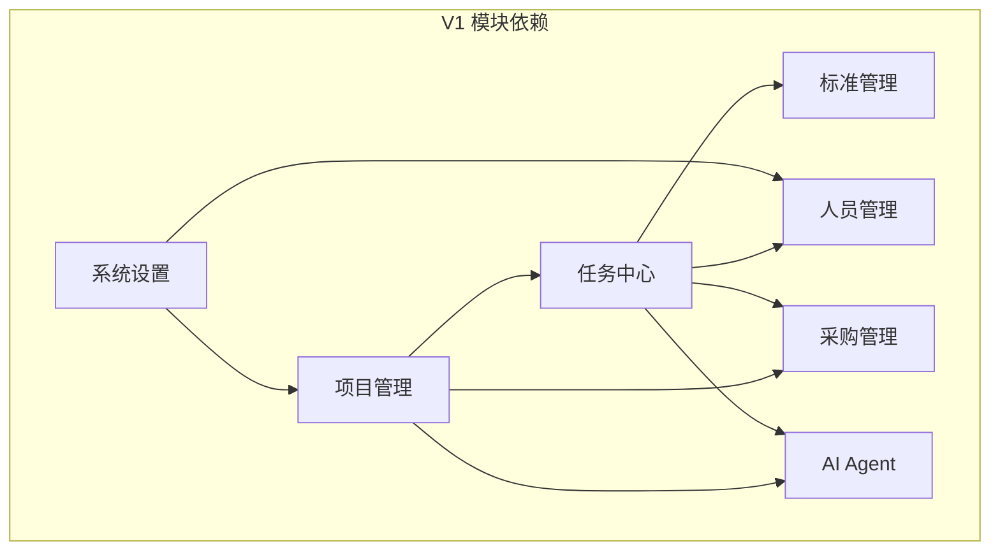

# 数字营建项目 V1 产品定义

> **文档层级**：L2 — V1 产品定义  
> **文档状态**：活跃（承接 L1 产品规划，向下对齐 L3 各模块 PRD）  
> **目标读者**：产品团队、开发团队、测试团队  
> **阅读建议**：先读 L1 了解战略方向，再读本文档了解 V1 边界，最后按需查阅 L3 模块 PRD

---

## 1. V1 产品概述

### 1.1 一句话定义

> **V1 是一个面向连锁品牌方营建部门的"营建管理操作系统"，通过原子化任务管理、标准驱动执行和 AI 辅助，让建店更简单。**

### 1.2 V1 要验证什么

| 核心能力       | 验证问题                                               |
| -------------- | ------------------------------------------------------ |
| 原子化项目管理 | 任务树模型是否能灵活适配不同品牌、不同业态的建店流程？ |
| 标准驱动执行   | 标准库是否能驱动任务生成、执行指导和质量验收？         |
| AI 赋能降本    | Agent 是否能降低专业门槛，让非专业人员也能管理建店？   |

### 1.3 V1 不做什么

| 不做                  | 原因                             |
| --------------------- | -------------------------------- |
| 平台化/多方协同       | V2 范围，V1 只服务品牌方营建部门 |
| 商业化/计费系统       | V2 范围，V1 验证产品价值         |
| 开放 API / 第三方集成 | V2 范围，V1 专注内部闭环         |
| 移动端原生应用        | V1 仅 Web 端，移动端视需要追加   |
| 多语言/国际化         | 非 MVP 必选项                    |
| 实时协作/多人编辑     | 非 MVP 必选项                    |

---

## 2. 三大核心能力详解

### 2.1 原子化项目管理

**核心假设**：营建项目可以拆解为一系列独立的原子任务，每个任务有独立的状态机。项目的整体进展由任务聚合推导，而非项目级硬编码。

**设计要点**：

| 要点       | 说明                                                                   |
| ---------- | ---------------------------------------------------------------------- |
| 任务状态机 | 草稿→待分配→执行中→待验收→已完成（每个任务独立推进）                   |
| 项目聚合   | 项目概览中的状态标签从所有任务的状态实时计算，不设人工操作的"状态按钮" |
| 任务树     | 项目→阶段→任务（支持多层嵌套，通过模板自动生成）                       |
| 多品牌适配 | 不同品牌的建店流程差异通过调整任务模板来吸收，项目模型和任务状态机不动 |

**边界**：

- 任务树的 CRUD 在任务中心（L3）
- 项目概览和项目列表在项目管理（L3）
- 任务模板管理在标准管理（L3）

**交付判定**：

- [ ] 任务可独立创建、分配、推进、验收、关闭
- [ ] 任务树支持多层嵌套
- [ ] 项目概览状态从任务聚合实时计算
- [ ] 品牌方可通过模板配置适配不同业务流程

### 2.2 标准驱动执行

**核心假设**：品牌管理规范可以结构化为数字标准库，任务从标准匹配的模板自动生成。

**设计要点**：

| 要点     | 说明                                                         |
| -------- | ------------------------------------------------------------ |
| 标准库   | 品牌营建标准的结构化存储，支持分类、版本、条款级管理         |
| 模板匹配 | 从标准库匹配项目类型 → 自动生成任务模板 → 实例化为项目任务树 |
| 执行指导 | 任务执行过程中，关联的标准条款作为执行指导文档               |
| 质量验收 | 验收检查项从标准条款派生，验收结果回写标准库                 |

**边界**：

- 标准库的增删改查在标准管理（L3）
- 模板创建和匹配在标准管理（L3）
- 任务执行中的标准引用在任务中心（L3）
- 验收检查项执行在项目管理/任务中心（L3）

**交付判定**：

- [ ] 标准库支持条款级管理（增删改查、版本控制）
- [ ] 模板可从标准库匹配生成
- [ ] 任务可关联标准条款作为执行指导
- [ ] 验收检查项可从标准条款派生

### 2.3 AI 赋能降本

**核心假设**：在受控流程节点中引入 AI Agent 辅助，可以降低营建管理的专业门槛，让一个营建主管能管更多项目。

**设计要点**：

| 要点       | 说明                                                     |
| ---------- | -------------------------------------------------------- |
| Agent 定位 | 辅助建议，非自动执行。所有 AI 输出必须经过人工确认才生效 |
| 应用场景   | 标准推荐、任务计划生成、进度异常预警、验收辅助判断       |
| 人工兜底   | Agent 出错不影响业务流转，关键节点可人工接管             |
| 可审计     | Agent 的所有建议和决策必须留痕                           |

**边界**：

- Agent 的完整能力在 multi-agent-prd 和 digital-employee-prd（L3）
- V1 阶段 Agent 为辅助角色，不承担独立执行职责

**交付判定**：

- [ ] 至少一个场景的 Agent 辅助功能可运行（如标准推荐）
- [ ] Agent 建议可人工确认/驳回
- [ ] Agent 决策全程留痕

---

## 3. V1 模块地图

### 3.1 模块总览

| 模块     | 优先级 | L3 文档                         | 定位                                   |
| -------- | ------ | ------------------------------- | -------------------------------------- |
| 项目管理 | P0     | `project-management-prd.md`     | 项目容器、项目列表、项目概览、项目配置 |
| 任务中心 | P0     | `task-center-prd.md`            | 任务树管理、任务状态机、执行推进       |
| 人员管理 | P0     | `personnel-management-prd.md`   | 品牌方人员、工队管理、角色权限         |
| 标准管理 | P0     | `standard-management-prd.md`    | 标准库、模板中心、条款维护             |
| 采购管理 | P1     | `procurement-management-prd.md` | 采购申请、订单管理、供应商管理         |
| AI Agent | P1     | `multi-agent-v1-prd.md`         | Agent 辅助（标准推荐、异常预警）       |
| 验收管理 | P1     | 并入项目管理/任务中心           | 验收计划、检查项、整改追踪             |
| 系统设置 | P0     | `settings-prd.md`               | 权限、角色、基础配置                   |

> P0 = MVP 必须交付，P1 = V1 阶段内但可以稍后

### 3.2 模块间依赖关系

| 依赖方向                     | 依赖内容                                 |
| ---------------------------- | ---------------------------------------- |
| 项目管理 → 任务中心          | 项目需要任务中心提供任务树和状态聚合能力 |
| 任务中心 → 标准管理          | 任务模板需要从标准库匹配生成             |
| 任务中心 → 人员管理          | 任务分配需要人员和工队数据               |
| 项目管理 → 采购管理          | 采购需求从项目/任务发起                  |
| 项目管理 → AI Agent          | 项目概览和任务管理调用 Agent 辅助        |
| 系统设置 → 项目管理/人员管理 | 权限和角色配置影响模块可用性             |

### 3.3 集成要点

1. **项目与任务**：项目创建时自动调用标准管理器匹配模板，生成任务树；项目概览从任务中心聚合状态
2. **任务与标准**：任务执行时加载关联的标准条款作为指导；验收时加载标准条款作为检查项
3. **任务与人员**：任务分配时从人员管理拉取可用人员和工队
4. **采购与任务**：采购申请从任务上下文发起，采购状态同步回任务
5. **AI Agent 与各模块**：Agent 在标准推荐、进度分析、异常预警等节点以"辅助建议"形式嵌入

---

## 4. V1 用户角色

| 角色       | 描述                                 | 核心操作                                   |
| ---------- | ------------------------------------ | ------------------------------------------ |
| 营建主管   | 品牌方营建部门的负责人，统筹所有项目 | 创建项目、配置模板、分配任务、查看全局看板 |
| 营建专员   | 具体执行建店管理的一线人员           | 推进任务、发起采购、提交验收、关联标准     |
| 工队       | 承接施工任务的外部执行方             | 接收任务、提交进度、上传施工记录           |
| 系统管理员 | 负责系统配置和维护                   | 管理用户、配置权限、维护基础数据           |

> V1 不涉及建设方/资源方/加盟商角色（V2 范围）。

---

## 5. V1 交付标准

### 5.1 功能完整性

- [ ] P0 模块全部完成，P1 模块至少完成核心流程
- [ ] 三大核心能力均可在单一品牌场景下跑通端到端闭环
- [ ] 模块间集成关系已验证（至少覆盖一条完整业务流）

### 5.2 质量门禁

- [ ] 核心任务状态机流转无非法跳转（单元测试覆盖）
- [ ] 项目聚合状态计算结果与任务实际状态一致
- [ ] 所有 Agent 建议可审计可追踪
- [ ] 系统设置中的权限配置生效

### 5.3 体验要求

- [ ] 无阻断性 UI 缺陷
- [ ] 核心操作路径不超过 5 步
- [ ] 新用户可在 30 分钟内完成首次项目创建和任务分配

---

## 6. V1 交付阶段

| 阶段     | 交付重点                                      | 依赖模块                     |
| -------- | --------------------------------------------- | ---------------------------- |
| 底座搭建 | 工程初始化、任务模型、本地后端联调            | 任务中心、系统设置           |
| 核心流程 | 项目创建→模板匹配→任务生成→任务推进→验收→归档 | 项目管理、任务中心、标准管理 |
| 能力补全 | 人员管理、采购管理、AI Agent 辅助             | 人员管理、采购管理、AI Agent |
| 集成验证 | 端到端业务流验证、Bug 修复、体验优化          | 全部模块                     |

> 详细阶段安排和迭代节奏见 `docs/05-project/development-plan-v2.0.md`。
