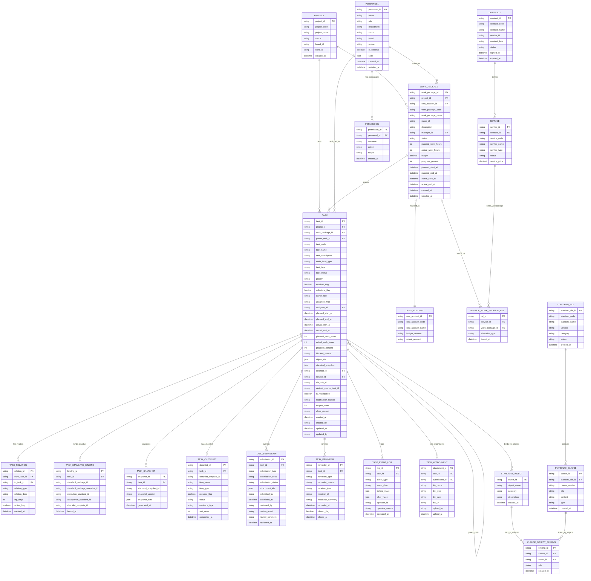

# 任务中心实体关系图

## 完整 ER 图



## 核心关系说明

| 关系                                    | 类型       | 说明                                 |
| --------------------------------------- | ---------- | ------------------------------------ |
| PROJECT 1:N WORK_PACKAGE                | 一对多     | 一个项目包含多个工作包               |
| WORK_PACKAGE 1:1 COST_ACCOUNT           | 一对一     | 每个工作包绑定唯一成本账户           |
| WORK_PACKAGE 1:N TASK                   | 一对多     | 工作包下包含多个任务/子任务          |
| TASK 1:N TASK                           | 自引用     | 父子任务层级关系                     |
| TASK 1:N TASK_RELATION                  | 一对多     | 任务间的依赖/派生关系                |
| CONTRACT 1:N SERVICE                    | 一对多     | 一个合同可定义多个服务               |
| SERVICE N:M WORK_PACKAGE                | 多对多     | 服务与工作包通过关联表绑定           |
| **PERSONNEL 1:N TASK**                  | **一对多** | **人员作为任务执行人（assignee）**   |
| **PERSONNEL 1:N WORK_PACKAGE**          | **一对多** | **人员作为工作包负责人（manager）**  |
| **PERSONNEL 1:N PERMISSION**            | **一对多** | **人员拥有多个权限**                 |
| **STANDARD_FILE 1:N STANDARD_CLAUSE**   | **一对多** | **标准文件包含多个条款**             |
| **STANDARD_CLAUSE N:M STANDARD_OBJECT** | **多对多** | **条款与对象通过绑定表关联**         |
| **TASK N:M STANDARD_OBJECT**            | **多对多** | **任务通过 object_ids 绑定多个对象** |

## 关键业务规则

1. **层级规则（Phase 2 更新：4层→3层）**
   - ~~项目(Project) → 工作包(WorkPackage) → 任务(Task) → 子任务(SubTask)~~
   - **项目(Project) → 工作包(WorkPackage) → 任务(Task)**
   - 子任务(SubTask)通过 `parent_task_id` 自引用在任务层内表达，不独立为层级
   - 阶段(Stage)作为项目生命周期属性（`stage_id`），不纳入任务树层级

2. **成本归集规则**
   - 所有任务成本归集到所属 `work_package_id`
   - 成本核算主键为 `cost_account_id`
   - `work_package_id` 与 `cost_account_id` 1:1 强约束

3. **状态流转规则**
   - 主状态字段：`task_status`
   - 派生/投影字段：`dispatch_status` / `sla_status`

4. **外包关系规则**
   - 外包任务必须绑定 `contract_id` 和 `service_id`
   - 一个服务可打包多个工作包

## 扩展实体说明

### 任务相关

| 实体                  | 用途                                 |
| --------------------- | ------------------------------------ |
| TASK_STANDARD_BINDING | 绑定执行标准、验收标准、检查清单模板 |
| TASK_SNAPSHOT         | 任务标准快照，记录绑定时的标准版本   |
| TASK_CHECKLIST        | 执行清单/检查项，将标准转为具体动作  |
| TASK_SUBMISSION       | 任务提交记录，支持多次提交历史       |
| TASK_REMINDER         | 催办记录，支持系统/人工/自动催办     |
| TASK_EVENT_LOG        | 任务操作审计日志                     |
| TASK_ATTACHMENT       | 任务附件/资料管理                    |

### Phase 2 新增实体

| 实体                      | 用途                                 |
| ------------------------- | ------------------------------------ |
| **PERSONNEL**             | **人员信息，支持任务分配与权限管理** |
| **PERMISSION**            | **权限配置（资源/操作/范围）**       |
| **STANDARD_FILE**         | **标准文件（如 GB/T 50254-2024）**   |
| **STANDARD_CLAUSE**       | **标准条款（如"4.2 线路铺设要求"）** |
| **STANDARD_OBJECT**       | **标准对象（如"线路铺设"）**         |
| **CLAUSE_OBJECT_BINDING** | **条款-对象关联（多对多）**          |

### 对象抽象层说明

**Phase 2 引入的标准绑定新链路**：

```
TASK（任务）
  ↓ object_ids（绑定对象ID列表）
STANDARD_OBJECT（标准对象，如"线路铺设"）
  ↓ CLAUSE_OBJECT_BINDING（通过关联表）
STANDARD_CLAUSE（标准条款，如"4.2 线路铺设要求"）
  ↓ standard_file_id（归属）
STANDARD_FILE（标准文件，如"GB/T 50254-2024"）
```

**优势**：

- 工程人员按对象思考（"我要做线路铺设"），不用记条款号
- 一个对象可关联多个条款（执行标准 + 验收标准）
- 标准文件更新时，重建条款-对象映射即可
