# 任务模块实体关系图

> 基于 `docs/01-product/task-center-prd.md` V1.01 + `docs/01-product/task-center-erd.md`
> 生成日期：2026-04-30

```mermaid
erDiagram
    %% ═══════════════════════════════════════════════
    %% 项目层 — 任务容器的顶层
    %% ═══════════════════════════════════════════════
    PROJECT ||--o{ WORK_PACKAGE : contains
    PROJECT ||--o{ TASK : owns
    PROJECT ||--o{ TEMPLATE_INSTANTIATION : records_instance

    %% ═══════════════════════════════════════════════
    %% 工作包层 — 成本归集单元（Phase 2）
    %% ═══════════════════════════════════════════════
    WORK_PACKAGE ||--|| COST_ACCOUNT : mapped_to
    WORK_PACKAGE ||--o{ TASK : groups
    WORK_PACKAGE ||--o{ SERVICE_WORK_PACKAGE_REL : bound_by

    %% ═══════════════════════════════════════════════
    %% 任务核心 — task 是执行底座的中心实体
    %% ═══════════════════════════════════════════════
    TASK ||--o{ TASK : parent_child
    TASK ||--o{ TASK_RELATION : from_task
    TASK ||--o{ TASK_RELATION : to_task

    TASK ||--o{ TASK_STANDARD_BINDING : binds
    TASK ||--o{ TASK_SNAPSHOT : snapshots
    TASK ||--o{ TASK_CHECKLIST : uses
    TASK ||--o{ TASK_SUBMISSION : submits
    TASK ||--o{ TASK_REMINDER : reminds
    TASK ||--o{ TASK_EVENT_LOG : logs
    TASK ||--o{ TASK_ATTACHMENT : has_attachments
    TASK ||--o{ TASK_COMMENT : has_comments
    TASK ||--o{ TASK_FAVORITE : favorited_by_users
    TASK ||--o{ TASK_CUSTOM_FIELD_VALUE : extends_with_custom

    %% ═══════════════════════════════════════════════
    %% 标准绑定层 — 任务执行依据
    %% ═══════════════════════════════════════════════
    STANDARD_FILE ||--o{ STANDARD_CLAUSE : contains
    STANDARD_CLAUSE ||--o{ CLAUSE_OBJECT_BINDING : linked_by_objects
    STANDARD_OBJECT ||--o{ CLAUSE_OBJECT_BINDING : links_to_clauses
    TASK ||--o{ STANDARD_OBJECT : binds_via_objects
    TASK_STANDARD_BINDING ||--o{ STANDARD_FILE : references

    %% ═══════════════════════════════════════════════
    %% 模板层 — 任务生成来源
    %% ═══════════════════════════════════════════════
    PROJECT_TEMPLATE ||--o{ TASK_TEMPLATE_BINDING : contains
    TASK_TEMPLATE_BINDING ||--o{ TASK_TEMPLATE : references
    PROJECT_TEMPLATE ||--o{ TEMPLATE_INSTANTIATION : instantiated_as
    TASK_TEMPLATE ||--o{ TEMPLATE_INSTANTIATION : instantiated_as
    TASK_TEMPLATE ||--o{ TASK_TEMPLATE_CHILD_REF : child_of
    TASK_TEMPLATE ||--o{ TASK_TEMPLATE_DEPENDENCY : from_template
    TASK_TEMPLATE ||--o{ TASK_TEMPLATE_DEPENDENCY : to_template
    TASK_TEMPLATE ||--o{ STANDARD_BINDING_TEMPLATE : default_binds

    %% ═══════════════════════════════════════════════
    %% 人员与权限层（Phase 2）
    %% ═══════════════════════════════════════════════
    PERSONNEL ||--o{ TASK : assigned_to
    PERSONNEL ||--o{ WORK_PACKAGE : manages
    PERSONNEL ||--o{ PERMISSION : has_permissions

    %% ═══════════════════════════════════════════════
    %% 外包/服务层 — 外部资源执行
    %% ═══════════════════════════════════════════════
    CONTRACT ||--o{ SERVICE : defines
    SERVICE ||--o{ SERVICE_WORK_PACKAGE_REL : binds_workpackage

    %% ═══════════════════════════════════════════════
    %% 实体定义
    %% ═══════════════════════════════════════════════

    PROJECT {
        string project_id PK
        string project_code
        string project_name
        string status
        string brand_id
        string store_id
        datetime created_at
    }

    WORK_PACKAGE {
        string work_package_id PK
        string project_id FK
        string cost_account_id FK
        string work_package_code
        string work_package_name
        string stage_id
        string description
        string manager_id FK
        string status "规划中|执行中|已完成|已暂停"
        int planned_work_hours
        int actual_work_hours
        decimal budget
        int progress_percent
        datetime planned_start_at
        datetime planned_end_at
        datetime actual_start_at
        datetime actual_end_at
        datetime created_at
        datetime updated_at
    }

    COST_ACCOUNT {
        string cost_account_id PK
        string cost_account_code
        string cost_account_name
        string budget_amount
        string actual_amount
    }

    TASK {
        string task_id PK
        string project_id FK
        string work_package_id FK "条件必填"
        string parent_task_id FK "可空,不自指"
        string task_code "UK, ^[A-Z0-9_-]{6,40}$"
        string task_name "1~120 chars"
        string task_description
        string node_level_type "project_root|work_package|task"
        string task_type "常规|里程碑|审批|整改|巡检"
        string source_type "manual|template|agent|derived"
        string priority "low|medium|high|urgent"
        boolean required_flag "default true"
        boolean milestone_flag "default false"
        string task_status "10态状态机"
        string dispatch_status "unassigned|pending|dispatched|accepted"
        string owner_role
        string assignee_type "internal|vendor"
        string assignee_id FK
        date planned_start_at
        date planned_end_at
        datetime actual_start_at
        datetime actual_end_at
        int progress_percent "0-100"
        string blocked_reason
        string risk_level "low|medium|high"
        string sla_rule_id
        string sla_status "normal|warning|overdue"
        string predecessor_status "none|blocked|completed"
        string standard_binding_status "bound|unbound"
        string standard_snapshot_id
        string snapshot_status "draft|bound|expired"
        string derived_from_task_id FK "整改来源"
        boolean is_rectification "default false"
        string rectification_reason
        json tags "string[]"
        string close_reason
        int reopen_count "default 0"
        int sort_order
        int children_count
        int attachment_count
        int comment_count
        string created_by
        datetime created_at
        string updated_by
        datetime updated_at
        string last_operated_by
        datetime last_operated_at
    }

    TASK_RELATION {
        string relation_id PK
        string from_task_id FK
        string to_task_id FK
        string relation_type "depends_on|derived_from|relates_to"
        string relation_desc
        int lag_days
        boolean active_flag "default true"
        datetime created_at
        string created_by
    }

    TASK_STANDARD_BINDING {
        string binding_id PK
        string task_id FK
        string standard_package_id
        string standard_package_snapshot_id
        string execution_standard_id
        string acceptance_standard_id
        string checklist_template_id
        datetime bound_at
        string bound_by
    }

    TASK_SNAPSHOT {
        string snapshot_id PK
        string task_id FK
        string standard_snapshot_id
        string snapshot_version
        json snapshot_data
        datetime generated_at
        string generated_by
    }

    TASK_CHECKLIST {
        string checklist_id PK
        string task_id FK
        string checklist_template_id
        string item_name
        string item_type "动作|资料|回执|确认"
        boolean required_flag
        string status "pending|completed|na"
        string evidence_type
        int sort_order
        datetime completed_at
        string completed_by
    }

    TASK_SUBMISSION {
        string submission_id PK
        string task_id FK
        string submission_type "normal|rectification|supplement"
        string submission_desc
        string submission_status "submitted|rejected|accepted"
        json attachment_ids
        string submitted_by
        datetime submitted_at
        string reviewed_by
        string review_result "pass|reject"
        string review_comment
        datetime reviewed_at
    }

    TASK_REMINDER {
        string reminder_id PK
        string task_id FK
        string reminder_type "系统预警|人工催办|自动催办|升级催办"
        string reminder_reason
        string receiver_type
        string receiver_id
        string feedback_summary
        datetime reminder_at
        boolean closed_flag "default false"
        datetime closed_at
    }

    TASK_EVENT_LOG {
        string log_id PK
        string task_id FK
        string event_type "status_change|field_change|comment|attachment|assign|favorite"
        string event_action
        json before_value
        json after_value
        string operator_id
        string operator_source "user|agent|system"
        datetime operated_at
    }

    TASK_ATTACHMENT {
        string attachment_id PK
        string task_id FK
        string submission_id FK "所属提交批次"
        string file_name
        string file_type "image|video|document|audio|other"
        string mime_type
        bigint file_size
        string file_url
        string thumbnail_url
        boolean is_required_evidence "default false"
        string uploaded_by
        datetime uploaded_at
        boolean is_deleted "default false"
    }

    TASK_COMMENT {
        string comment_id PK
        string task_id FK
        string parent_comment_id FK "可空,同task"
        string content "1-2000 chars"
        json mentions "user_id[]"
        json attachment_ids
        boolean is_pinned "default false"
        boolean is_deleted "default false"
        string created_by
        datetime created_at
        string updated_by
        datetime updated_at
    }

    TASK_FAVORITE {
        string favorite_id PK
        string user_id
        string task_id FK
        datetime created_at
    }

    TASK_CUSTOM_FIELD_VALUE {
        string id PK
        string task_id FK
        string field_key FK "->task_field_definition"
        json value
        string updated_by
        datetime updated_at
    }

    TASK_FIELD_DEFINITION {
        string field_id PK
        string field_key UK "^[a-z][a-z0-9_]{1,63}$"
        string field_name
        string field_origin "system|custom"
        string data_type "string|number|boolean|date|datetime|enum|json"
        json enum_options
        json default_value
        json validation_rule
        boolean is_required
        boolean is_builtin_locked
        boolean allow_in_list
        boolean allow_in_detail
        string created_by
        datetime created_at
        datetime updated_at
    }

    TASK_DETAIL_FIELD_CONFIG {
        string config_id PK
        string scope_type "global|project|template|role"
        string scope_id "scope_type!=global时必填"
        string field_key FK
        string section_key "basic_info|schedule|standard|..."
        int display_order
        boolean is_visible "default true"
        boolean is_editable "default true"
        boolean is_required_on_ui "default false"
        string visible_when_expr
        string editable_when_expr
        datetime created_at
        datetime updated_at
    }

    %% ═══════════════════════════════════════════════
    %% 模板实体
    %% ═══════════════════════════════════════════════

    PROJECT_TEMPLATE {
        string template_id PK
        string template_code UK
        string template_name
        string template_version
        string status "draft|reviewing|ready|active|inactive|deprecated"
        json scopes "brandScope,storeTypeScope等"
        json phase_blueprint "PhaseBlueprint[]"
        json milestone_blueprint "MilestoneBlueprint[]"
        json meta
        datetime created_at
        datetime updated_at
    }

    TASK_TEMPLATE_BINDING {
        string binding_id PK
        string project_template_id FK
        string task_template_id FK
        int sort_order
        json binding_rules
    }

    TASK_TEMPLATE {
        string task_template_id PK
        string task_template_code UK
        string task_template_name
        string task_template_version
        string status "draft|reviewing|ready|active|inactive|deprecated"
        string template_level "project_root|stage|work_package|task"
        string business_domain
        string task_type
        boolean required_flag
        boolean milestone_flag
        string owner_role
        string assignee_type_default
        string sla_rule_id
        json standard_binding
        json dependency_blueprint
        int sort_order
        json meta
        datetime created_at
        datetime updated_at
    }

    TASK_TEMPLATE_CHILD_REF {
        string ref_id PK
        string parent_template_id FK
        string child_template_id FK
        int sort_order
    }

    TASK_TEMPLATE_DEPENDENCY {
        string dep_id PK
        string from_template_code
        string to_template_code
        string relation_type "depends_on"
        string constraint_type "FS|SS|FF|SF"
        int lag_days
    }

    STANDARD_BINDING_TEMPLATE {
        string binding_id PK
        string task_template_id FK
        string default_standard_package_id
        json default_execution_standard_ids "string[]"
        json default_acceptance_standard_ids "string[]"
        string default_execution_checklist_template_id
        string default_acceptance_checklist_template_id
    }

    TEMPLATE_INSTANTIATION {
        string instance_id PK
        string project_id FK
        string project_template_id FK
        string task_template_id FK "可空,单模板实例化"
        string template_version
        json match_input
        json output_snapshot
        datetime created_at
        string created_by
    }

    %% ═══════════════════════════════════════════════
    %% 标准库实体（对象抽象层, Phase 2）
    %% ═══════════════════════════════════════════════

    STANDARD_FILE {
        string standard_file_id PK
        string standard_code
        string standard_name
        string version
        string category
        string status
        datetime created_at
    }

    STANDARD_CLAUSE {
        string clause_id PK
        string standard_file_id FK
        string clause_number
        string title
        string content
        string type "执行标准|验收标准"
        datetime created_at
    }

    STANDARD_OBJECT {
        string object_id PK
        string object_name
        string category
        string description
        datetime created_at
    }

    CLAUSE_OBJECT_BINDING {
        string binding_id PK
        string clause_id FK
        string object_id FK
        string role "execution|acceptance|both"
        datetime created_at
    }

    %% ═══════════════════════════════════════════════
    %% 人员与权限（Phase 2）
    %% ═══════════════════════════════════════════════

    PERSONNEL {
        string personnel_id PK
        string name
        string role
        string department
        string status "active|inactive|leave"
        string email
        string phone
        boolean is_external
        json skills "string[]"
        datetime created_at
        datetime updated_at
    }

    PERMISSION {
        string permission_id PK
        string personnel_id FK
        string resource "task|project|standard"
        string action "read|write|approve"
        string scope "own|department|all"
        datetime created_at
    }

    %% ═══════════════════════════════════════════════
    %% 外包/服务
    %% ═══════════════════════════════════════════════

    CONTRACT {
        string contract_id PK
        string contract_code
        string contract_name
        string vendor_id
        string contract_type
        string status
        datetime signed_at
        datetime expired_at
    }

    SERVICE {
        string service_id PK
        string contract_id FK
        string service_code
        string service_name
        string service_type
        string status
        decimal service_price
    }

    SERVICE_WORK_PACKAGE_REL {
        string rel_id PK
        string service_id FK
        string work_package_id FK
        string allocation_type
        datetime bound_at
    }
```

## 关系摘要

| 关系                             | 类型   | 说明                 |
| -------------------------------- | ------ | -------------------- |
| PROJECT → WORK_PACKAGE           | 1:N    | 项目包含多个工作包   |
| WORK_PACKAGE → COST_ACCOUNT      | 1:1    | 成本归集单元         |
| WORK_PACKAGE → TASK              | 1:N    | 工作包下多个任务     |
| TASK → TASK                      | 自引用 | 父子层级             |
| TASK → TASK_RELATION             | 1:N    | 依赖/派生/关联       |
| TASK → TASK_EVENT_LOG            | 1:N    | 操作审计             |
| TASK → TASK_SUBMISSION           | 1:N    | 提交记录             |
| TASK → TASK_ATTACHMENT           | 1:N    | 附件资料             |
| TASK → TASK_CHECKLIST            | 1:N    | 执行/检查项          |
| TASK → TASK_SNAPSHOT             | 1:N    | 标准快照             |
| TASK → TASK_REMINDER             | 1:N    | 催办记录             |
| TASK → STANDARD_OBJECT           | N:M    | 通过 object_ids 绑定 |
| PROJECT_TEMPLATE → TASK_TEMPLATE | N:M    | 通过绑定表           |
| TASK_TEMPLATE → TASK_TEMPLATE    | 自引用 | 模板父子/依赖        |
| PERSONNEL → TASK                 | 1:N    | 执行人               |
| PERSONNEL → PERMISSION           | 1:N    | 权限                 |

## V1 实施优先级

| 优先级 | 实体                                                                     | 说明            |
| ------ | ------------------------------------------------------------------------ | --------------- |
| P0     | TASK, TASK_RELATION, TASK_EVENT_LOG, PROJECT                             | 核心执行链路    |
| P1     | TASK_SUBMISSION, TASK_ATTACHMENT, TASK_CHECKLIST                         | 提交与资料      |
| P1     | TASK_SNAPSHOT, TASK_STANDARD_BINDING                                     | 标准绑定        |
| P1     | TASK_REMINDER                                                            | 催办            |
| P2     | WORK_PACKAGE, COST_ACCOUNT                                               | 成本归集        |
| P2     | TASK_TEMPLATE, PROJECT_TEMPLATE, TEMPLATE_INSTANTIATION                  | 模板体系        |
| P2     | TASK_COMMENT, TASK_FAVORITE                                              | 协同            |
| P3     | PERSONNEL, PERMISSION                                                    | 独立人员权限    |
| P3     | TASK_FIELD_DEFINITION, TASK_CUSTOM_FIELD_VALUE, TASK_DETAIL_FIELD_CONFIG | 自定义字段/配置 |
| P3     | STANDARD_FILE, STANDARD_CLAUSE, STANDARD_OBJECT, CLAUSE_OBJECT_BINDING   | 对象抽象层      |
| P3     | CONTRACT, SERVICE, SERVICE_WORK_PACKAGE_REL                              | 外包/服务       |
