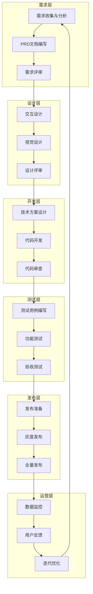

# 产品开发流程概览

## 六阶段开发模型

## 各阶段交付物

| 阶段   | 核心交付物                   | 参与角色       | 验收标准         |
| ------ | ---------------------------- | -------------- | ---------------- |
| 需求层 | PRD文档、用户故事、原型图    | PM、业务方     | 需求清晰、可量化 |
| 设计层 | 设计稿、设计规范、交互说明   | UI/UX设计师    | 符合品牌规范     |
| 开发层 | 技术方案、源代码、API文档    | 前端/后端/算法 | 代码审查通过     |
| 测试层 | 测试报告、Bug清单、验收报告  | QA、PM         | 无P0/P1级Bug     |
| 发布层 | 发布清单、回滚方案、监控配置 | 运维、DevOps   | 发布无故障       |
| 运营层 | 数据报表、用户反馈、优化建议 | 运营、PM       | 指标达成         |

## 关键原则

1. **每个阶段必须有明确的准入/准出标准**
2. **阶段间流转需正式评审会议**
3. **文档即代码，与代码同步迭代**
4. **问题早发现，阶段内闭环解决**
