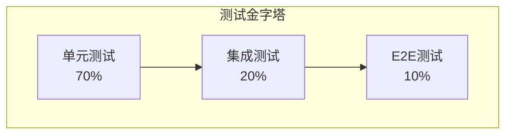

# 测试阶段

## 目标

发现缺陷，验证功能符合需求，确保产品质量。

## 测试类型



### 1. 单元测试

**范围**：函数、组件、工具类
**工具**：Jest、Vitest、React Testing Library
**标准**：

- 核心业务逻辑100%覆盖
- 边界条件测试
- 异常情况测试

```typescript
// 示例：单元测试
describe('状态机转换', () => {
  it('应从"待分配"转换到"待执行"', () => {
    const result = canTransition('待分配', '待执行', context)
    expect(result).toBe(true)
  })

  it('不应允许非法状态转换', () => {
    const result = canTransition('待分配', '已完成', context)
    expect(result).toBe(false)
  })
})
```

### 2. 集成测试

**范围**：模块间交互、API调用
**工具**：Supertest、MSW
**重点**：

- 数据流正确性
- 接口契约符合
- 错误处理机制

### 3. E2E测试

**范围**：完整用户流程
**工具**：Playwright、Cypress
**场景**：

- 核心业务流程
- 关键用户旅程
- 跨页面交互

### 4. 手动测试

- **功能测试**：按测试用例执行
- **回归测试**：验证旧功能未受影响
- **探索性测试**：自由探索发现隐藏问题
- **兼容性测试**：多浏览器、多设备

## 测试用例模板

```markdown
## 测试用例：任务分配

| 项       | 内容                       |
| -------- | -------------------------- |
| 用例ID   | TC-TASK-001                |
| 功能模块 | 任务管理                   |
| 优先级   | P0                         |
| 前置条件 | 1. 已登录<br>2. 有项目权限 |

### 测试步骤

1. 进入任务列表页
2. 选择一条待分配任务
3. 点击"分配"按钮
4. 选择执行人员
5. 点击确认

### 预期结果

- 任务状态变为"待执行"
- 被分配人收到通知
- 操作记录生成

### 测试数据

- 项目ID: PROJ-2024-001
- 任务ID: TASK-001
- 执行人: 张三
```

## Bug管理流程

```
发现Bug → 记录Bug → 分配修复 → 验证关闭
   ↑                                    |
   └──────── 未通过验证 ←──────────────┘
```

**Bug分级：**

- **P0（致命）**：系统崩溃、数据丢失，立即修复
- **P1（严重）**：核心功能不可用，24小时内修复
- **P2（一般）**：非核心功能问题，本迭代修复
- **P3（轻微）**：UI瑕疵、优化建议，排期修复

## 准出标准

- [ ] 全部P0/P1 Bug已修复验证
- [ ] 测试用例执行通过率>95%
- [ ] 性能指标达标
- [ ] 安全漏洞已修复
