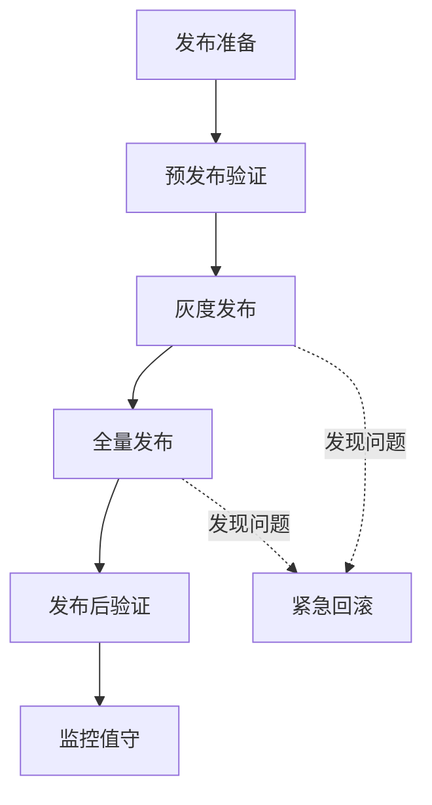

# 发布阶段

## 目标

将经过测试的代码安全、稳定地部署到生产环境。

## 发布流程



## 关键活动

### 1. 发布准备

**发布清单：**

- [ ] 发布版本已打Tag
- [ ] 发布说明已编写
- [ ] 数据库变更脚本已准备
- [ ] 配置变更已确认
- [ ] 回滚方案已制定
- [ ] 监控告警已配置

**发布说明模板：**

```markdown
## 版本：v1.2.0

### 发布日期

2024-01-15

### 更新内容

- ✨ 新增任务批量分配功能
- ✨ 新增甘特图视图
- 🐛 修复任务状态同步问题
- ⚡️ 优化列表页加载速度

### 数据库变更

- migration/001_add_task_batch.sql

### 配置变更

- 新增环境变量：ENABLE_GANTT

### 影响范围

- 任务管理模块
- 项目管理模块

### 回滚方案

1. 执行回滚脚本：rollback/v1.2.0.sql
2. 重新部署上一版本镜像
3. 验证服务正常
```

### 2. 灰度发布

**灰度策略：**
| 阶段 | 流量比例 | 持续时间 | 观察指标 |
|-----|---------|---------|---------|
| 金丝雀 | 5% | 30分钟 | 错误率、响应时间 |
| 小规模 | 20% | 2小时 | 核心业务指标 |
| 中规模 | 50% | 4小时 | 用户反馈 |
| 全量 | 100% | - | 持续监控 |

**灰度观察指标：**

- 系统错误率 < 0.1%
- API响应时间 P99 < 500ms
- 核心业务转化率无下降
- 无新增异常日志

### 3. 回滚机制

**触发条件：**

- 错误率超过阈值
- 核心功能不可用
- 数据异常
- 用户投诉集中

**回滚步骤：**

1. 立即切换流量到旧版本
2. 执行数据库回滚脚本
3. 验证服务恢复
4. 通知相关人员
5. 记录故障详情

## 发布窗口

**常规发布：**

- 时间：周二/周四 14:00-16:00
- 避开业务高峰期
- 预留足够回滚时间

**紧急发布：**

- 需经技术负责人审批
- 仍需经过基本验证
- 发布后加强监控

## 发布后验证

- [ ] 核心流程可正常访问
- [ ] 新功能按预期工作
- [ ] 监控大盘无异常
- [ ] 用户反馈通道畅通
