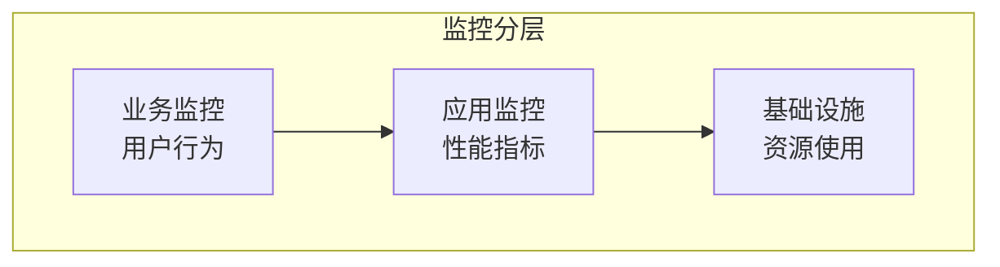

# 运营阶段

## 目标

持续监控产品运行状态，收集用户反馈，驱动产品迭代优化。

## 监控体系



### 1. 业务监控

**核心指标：**
| 指标 | 说明 | 正常范围 |
|-----|------|---------|
| DAU/MAU | 日活/月活用户 | 持续增长 |
| 功能使用率 | 新功能使用比例 | >30% |
| 转化率 | 核心流程完成率 | >80% |
| 留存率 | 次日/7日/30日留存 | 行业基准 |

**告警规则：**

- 核心业务指标下降>10%：立即告警
- 新功能7日使用率<20%：产品关注
- 用户投诉增加>50%：紧急处理

### 2. 技术监控

**性能指标：**
| 指标 | 目标值 | 告警阈值 |
|-----|-------|---------|
| 页面加载时间 | <2s | >3s |
| API响应时间P99 | <500ms | >1s |
| 错误率 | <0.1% | >0.5% |
| 可用性 | 99.9% | <99% |

**监控工具：**

- 日志收集：ELK / Loki
- 指标采集：Prometheus
- 链路追踪：Jaeger / Zipkin
- 告警通知：PagerDuty / 钉钉

### 3. 用户反馈收集

**收集渠道：**

- 应用内反馈入口
- 客服工单系统
- 应用商店评论
- 用户调研问卷
- NPS评分

**反馈处理流程：**

```
收集 → 分类 → 优先级排序 → 排期 → 实现 → 通知用户
```

## 数据驱动优化

### A/B测试流程

1. **假设提出**：某个改动会提升指标X
2. **实验设计**：确定样本量、分流策略、观察周期
3. **实验执行**：小流量灰度，收集数据
4. **结果分析**：统计显著性检验
5. **决策实施**：全量或放弃

### 数据分析框架

```
1. 描述性分析：发生了什么
2. 诊断性分析：为什么会发生
3. 预测性分析：将会发生什么
4. 处方性分析：应该怎么做
```

## 持续迭代

**迭代节奏：**

- 小优化：每周发布
- 功能迭代：双周发布
- 大版本：季度发布

**迭代决策依据：**

1. 用户反馈数量与紧急度
2. 数据分析发现的机会点
3. 业务战略方向调整
4. 技术债务偿还需求

## 运营阶段交付物

- **数据周报**：核心指标趋势
- **用户反馈月报**：问题分类与改进计划
- **产品迭代路线图**：未来3个月规划
- **运营总结报告**：季度复盘
