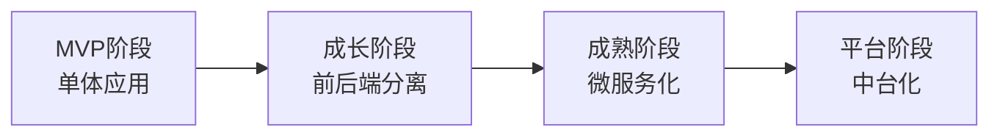

# 技术架构概览

## 架构演进阶段



## 分层架构图

```
┌─────────────────────────────────────────────────────────┐
│                     用户层 (User Layer)                   │
│  ┌────────────┐  ┌────────────┐  ┌────────────┐         │
│  │   Web App  │  │  Mobile App │  │   小程序   │         │
│  │  (React)   │  │  (RN/Flutter)│  │(微信/钉钉) │         │
│  └────────────┘  └────────────┘  └────────────┘         │
└─────────────────────────────────────────────────────────┘
                           │
                           ▼
┌─────────────────────────────────────────────────────────┐
│                    接入层 (Gateway)                       │
│     负载均衡 / CDN / API Gateway / 鉴权 / 限流            │
└─────────────────────────────────────────────────────────┘
                           │
                           ▼
┌─────────────────────────────────────────────────────────┐
│                    应用层 (Application)                   │
│  ┌──────────┐ ┌──────────┐ ┌──────────┐ ┌──────────┐   │
│  │  项目管理 │ │  任务中心 │ │  人员管理 │ │  数字员工 │   │
│  └──────────┘ └──────────┘ └──────────┘ └──────────┘   │
└─────────────────────────────────────────────────────────┘
                           │
                           ▼
┌─────────────────────────────────────────────────────────┐
│                    领域层 (Domain)                        │
│     状态机 / 领域模型 / 业务规则 / 领域事件               │
└─────────────────────────────────────────────────────────┘
                           │
                           ▼
┌─────────────────────────────────────────────────────────┐
│                    数据层 (Data)                          │
│  ┌──────────┐ ┌──────────┐ ┌──────────┐ ┌──────────┐   │
│  │  关系型DB │ │  缓存    │ │  对象存储 │ │  搜索引擎 │   │
│  │ (PostgreSQL)│ (Redis) │ │  (OSS)   │ │ (ES)    │   │
│  └──────────┘ └──────────┘ └──────────┘ └──────────┘   │
└─────────────────────────────────────────────────────────┘
```

## 当前项目技术栈

| 层级 | 技术选型              | 版本   |
| ---- | --------------------- | ------ |
| 框架 | React                 | 18.x   |
| 语言 | TypeScript            | 5.x    |
| 构建 | Vite                  | 5.x    |
| 样式 | TailwindCSS           | 3.x    |
| UI库 | shadcn/ui             | latest |
| 状态 | React Hooks + Context | -      |
| 图表 | Recharts              | 2.x    |
| 测试 | Vitest                | 1.x    |
| 部署 | CloudBase / Nginx     | -      |

## 架构设计原则

1. **单一职责**：每个模块只负责一件事
2. **开闭原则**：对扩展开放，对修改关闭
3. **依赖倒置**：依赖抽象，不依赖具体实现
4. **接口隔离**：客户端不依赖不需要的接口
5. **最小知识**：模块间只与必要的模块交互

## 质量属性

| 属性     | 策略                           |
| -------- | ------------------------------ |
| 可维护性 | 清晰分层 + 代码规范 + 单元测试 |
| 可扩展性 | 插件化架构 + 事件驱动          |
| 可测试性 | 依赖注入 + Mock支持            |
| 性能     | 懒加载 + 缓存策略 + 虚拟列表   |
| 安全性   | 输入校验 + XSS防护 + CSRF防护  |
