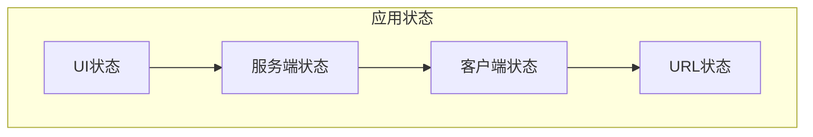

# 状态管理方案

## 状态分类



| 状态类型   | 说明           | 示例               | 管理方案        |
| ---------- | -------------- | ------------------ | --------------- |
| UI状态     | 组件内部状态   | 弹窗开关、加载中   | useState        |
| 服务端状态 | 来自API的数据  | 任务列表、用户信息 | React Query     |
| 客户端状态 | 应用全局状态   | 主题、登录状态     | Context/Zustand |
| URL状态    | 路由相关状态   | 当前页面、筛选参数 | URL/History     |
| 表单状态   | 表单数据与校验 | 输入值、错误提示   | React Hook Form |

## 当前方案：React Hooks + Context

### 服务端状态管理

```typescript
// src/hooks/useTasks.ts
export function useTasks(projectId: string) {
  const [tasks, setTasks] = useState<Task[]>([])
  const [loading, setLoading] = useState(false)
  const [error, setError] = useState<Error | null>(null)

  const fetchTasks = useCallback(async () => {
    setLoading(true)
    try {
      const data = await taskApi.getTasks(projectId)
      setTasks(data)
    } catch (err) {
      setError(err as Error)
    } finally {
      setLoading(false)
    }
  }, [projectId])

  useEffect(() => {
    fetchTasks()
  }, [fetchTasks])

  // 乐观更新
  const updateTask = useCallback(
    async (taskId: string, updates: Partial<Task>) => {
      // 1. 本地先更新
      setTasks(prev => prev.map(t => (t.id === taskId ? { ...t, ...updates } : t)))

      // 2. 调用API
      try {
        await taskApi.updateTask(taskId, updates)
      } catch (err) {
        // 3. 失败回滚
        fetchTasks()
        throw err
      }
    },
    [fetchTasks]
  )

  return { tasks, loading, error, fetchTasks, updateTask }
}
```

### 全局状态管理 (Context)

```typescript
// src/contexts/AuthContext.tsx
interface AuthContextType {
  user: User | null;
  login: (credentials: Credentials) => Promise<void>;
  logout: () => void;
}

const AuthContext = createContext<AuthContextType | undefined>(undefined);

export function AuthProvider({ children }: { children: React.ReactNode }) {
  const [user, setUser] = useState<User | null>(null);

  const login = useCallback(async (credentials: Credentials) => {
    const user = await authApi.login(credentials);
    setUser(user);
    localStorage.setItem('token', user.token);
  }, []);

  const logout = useCallback(() => {
    setUser(null);
    localStorage.removeItem('token');
  }, []);

  const value = useMemo(() => ({
    user,
    login,
    logout
  }), [user, login, logout]);

  return (
    <AuthContext.Provider value={value}>
      {children}
    </AuthContext.Provider>
  );
}

export const useAuth = () => {
  const context = useContext(AuthContext);
  if (!context) throw new Error('useAuth must be used within AuthProvider');
  return context;
};
```

## 推荐演进：引入 React Query

### 为什么需要 React Query

| 问题          | React Query 解决          |
| ------------- | ------------------------- |
| 重复请求      | 自动缓存与去重            |
| 加载状态管理  | 内置 isLoading/isFetching |
| 错误处理      | 内置错误重试              |
| 数据同步      | 自动后台刷新              |
| 乐观更新      | 内置支持                  |
| 分页/无限滚动 | 内置钩子                  |

### 使用示例

```typescript
// 替换自定义 Hook
import { useQuery, useMutation, useQueryClient } from '@tanstack/react-query'

// 查询任务列表
export function useTasks(projectId: string) {
  return useQuery({
    queryKey: ['tasks', projectId],
    queryFn: () => taskApi.getTasks(projectId),
    staleTime: 5 * 60 * 1000, // 5分钟内不重新请求
  })
}

// 更新任务
export function useUpdateTask() {
  const queryClient = useQueryClient()

  return useMutation({
    mutationFn: ({ taskId, updates }: { taskId: string; updates: Partial<Task> }) =>
      taskApi.updateTask(taskId, updates),

    // 乐观更新
    onMutate: async ({ taskId, updates }) => {
      await queryClient.cancelQueries({ queryKey: ['tasks'] })
      const previousTasks = queryClient.getQueryData(['tasks'])

      queryClient.setQueryData(['tasks'], (old: Task[]) =>
        old.map(t => (t.id === taskId ? { ...t, ...updates } : t))
      )

      return { previousTasks }
    },

    onError: (err, variables, context) => {
      queryClient.setQueryData(['tasks'], context?.previousTasks)
    },

    onSettled: () => {
      queryClient.invalidateQueries({ queryKey: ['tasks'] })
    },
  })
}
```

## 状态管理决策树

```
需要状态管理？
├── 是 → 状态类型？
│       ├── UI状态 → useState/useReducer
│       ├── 表单状态 → React Hook Form
│       ├── 服务端状态 → React Query
│       └── 全局客户端状态 → Context/Zustand/Redux
└── 否 → 通过props传递
```

## 最佳实践

1. **最小化状态**：能计算得出的不存状态
2. **状态靠近使用位置**：避免过度提升
3. **不可变更新**：始终返回新对象
4. **单一数据源**：同一数据不重复存储
5. **状态归一化**：嵌套数据扁平化存储
