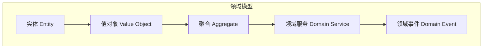

# 领域驱动设计 (DDD)

## 核心概念



## 项目中的DDD实践

### 1. 状态机模式

状态机是核心业务规则的集中体现。

```typescript
// src/domain/projectStatusMachine.ts
export interface GuardContext {
  hasMilestone: boolean
  taskTreeComplete: boolean
  acceptancePassed: boolean
  settlementComplete: boolean
}

export const ProjectStatusMachine = {
  // 定义所有状态
  states: [
    'DRAFT', // 草稿
    'PENDING_CONFIRM', // 待确认
    'PENDING_BREAKDOWN', // 待拆解
    'IN_PROGRESS', // 执行中
    'PENDING_ACCEPTANCE', // 待验收
    'PENDING_SETTLEMENT', // 待结算
    'ARCHIVED', // 已归档
  ] as const,

  // 定义状态流转规则
  transitions: {
    DRAFT: ['PENDING_CONFIRM'],
    PENDING_CONFIRM: ['DRAFT', 'PENDING_BREAKDOWN'],
    PENDING_BREAKDOWN: ['PENDING_CONFIRM', 'IN_PROGRESS'],
    IN_PROGRESS: ['PENDING_BREAKDOWN', 'PENDING_ACCEPTANCE'],
    PENDING_ACCEPTANCE: ['IN_PROGRESS', 'PENDING_SETTLEMENT'],
    PENDING_SETTLEMENT: ['PENDING_ACCEPTANCE', 'ARCHIVED'],
    ARCHIVED: [],
  },

  // 守卫规则：校验状态转换是否允许
  canTransition(from: string, to: string, context: GuardContext): boolean {
    const allowed = this.transitions[from] || []
    if (!allowed.includes(to)) return false

    // 特殊守卫规则
    switch (to) {
      case 'IN_PROGRESS':
        return context.hasMilestone && context.taskTreeComplete
      case 'PENDING_SETTLEMENT':
        return context.acceptancePassed
      case 'ARCHIVED':
        return context.settlementComplete
      default:
        return true
    }
  },
}
```

### 2. 仓储模式

仓储抽象数据访问，让领域层不关心持久化细节。

```typescript
// 仓储接口（领域层）
export interface TaskRepository {
  findById(id: string): Promise<Task | null>
  findByProjectId(projectId: string): Promise<Task[]>
  save(task: Task): Promise<void>
  delete(id: string): Promise<void>
}

// 仓储实现（基础设施层）
export class LocalTaskRepository implements TaskRepository {
  constructor(private storage: Storage) {}

  async findById(id: string): Promise<Task | null> {
    const data = this.storage.getItem(`task:${id}`)
    return data ? JSON.parse(data) : null
  }

  async save(task: Task): Promise<void> {
    this.storage.setItem(`task:${task.id}`, JSON.stringify(task))
  }

  // ...
}

// API仓储实现
export class ApiTaskRepository implements TaskRepository {
  constructor(private api: ApiClient) {}

  async findById(id: string): Promise<Task | null> {
    const response = await this.api.get(`/tasks/${id}`)
    return response.data
  }

  async save(task: Task): Promise<void> {
    await this.api.put(`/tasks/${task.id}`, task)
  }

  // ...
}
```

### 3. 自定义Hooks封装业务逻辑

```typescript
// src/hooks/useProjectStatus.ts
export function useProjectStatus(projectId: string) {
  const { project, updateProject } = useProject(projectId)
  const { tasks } = useTasks(projectId)

  // 计算守卫条件
  const guardContext: GuardContext = useMemo(
    () => ({
      hasMilestone: project?.milestones.length > 0,
      taskTreeComplete: tasks.every(t => t.status !== 'PENDING_BREAKDOWN'),
      acceptancePassed: project?.acceptanceResult === 'PASSED',
      settlementComplete: project?.settlementStatus === 'COMPLETED',
    }),
    [project, tasks]
  )

  // 获取可流转的状态列表
  const availableTransitions = useMemo(() => {
    if (!project) return []
    return ProjectStatusMachine.transitions[project.status] || []
  }, [project?.status])

  // 状态转换方法
  const transitionStatus = useCallback(
    async (newStatus: string) => {
      if (!project) return

      // 1. 校验转换合法性
      if (!ProjectStatusMachine.canTransition(project.status, newStatus, guardContext)) {
        throw new Error(`非法状态转换: ${project.status} -> ${newStatus}`)
      }

      // 2. 执行转换
      await updateProject({
        status: newStatus,
        statusChangedAt: new Date().toISOString(),
      })

      // 3. 记录日志
      addStatusLog({
        projectId,
        fromStatus: project.status,
        toStatus: newStatus,
        changedAt: new Date().toISOString(),
      })
    },
    [project, guardContext, updateProject]
  )

  return {
    currentStatus: project?.status,
    availableTransitions,
    canTransition: (to: string) =>
      ProjectStatusMachine.canTransition(project?.status || '', to, guardContext),
    transitionStatus,
  }
}
```

## 领域事件

领域事件用于解耦业务逻辑。

```typescript
// 定义领域事件
export class ProjectStatusChangedEvent {
  constructor(
    public readonly projectId: string,
    public readonly fromStatus: string,
    public readonly toStatus: string,
    public readonly changedAt: Date
  ) {}
}

// 事件发布
export class DomainEventPublisher {
  private handlers: Map<string, Function[]> = new Map()

  subscribe(eventType: string, handler: Function) {
    const handlers = this.handlers.get(eventType) || []
    handlers.push(handler)
    this.handlers.set(eventType, handlers)
  }

  publish(event: any) {
    const handlers = this.handlers.get(event.constructor.name) || []
    handlers.forEach(handler => handler(event))
  }
}

// 事件处理
publisher.subscribe('ProjectStatusChangedEvent', async event => {
  // 发送通知
  await notificationService.sendStatusChangeNotification(event)
  // 更新统计
  await analyticsService.trackStatusChange(event)
})
```

## 分层与DDD关系

```
用户层 ─────────────┐
                    │ 调用
应用层 ─────────────┤
                    │ 编排
领域层 ─────────────┤ ← DDD核心
  - 实体            │
  - 值对象          │
  - 领域服务        │
  - 领域事件        │
                    │ 依赖抽象
基础设施层 ─────────┘
  - 仓储实现
  - 外部服务
```
