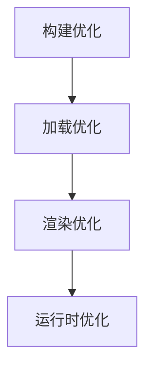

# 性能优化方案

## 优化层次



## 1. 构建优化

### 代码分割

```typescript
// 路由级懒加载
const ProjectDetailPage = lazy(() => import('./pages/ProjectDetailPage'));
const TaskManagementPage = lazy(() => import('./pages/TaskManagementPage'));

// 组件级懒加载（大组件）
const GanttChart = lazy(() => import('./components/GanttChart'));

// Suspense 包裹
<Suspense fallback={<PageSkeleton />}>
  <ProjectDetailPage />
</Suspense>
```

### Tree Shaking

```typescript
// ✅ 推荐：具名导入，支持 Tree Shaking
import { Button, Input } from 'antd'

// ❌ 避免：全量导入
import Antd from 'antd'

// ✅ 推荐：按需加载图标
import { PlusOutlined } from '@ant-design/icons'
```

### 构建配置

```javascript
// vite.config.ts
export default {
  build: {
    rollupOptions: {
      output: {
        // 代码分割策略
        manualChunks: {
          // 第三方库单独打包
          vendor: ['react', 'react-dom'],
          // UI库单独打包
          ui: ['antd', '@ant-design/icons'],
          // 图表库单独打包
          charts: ['recharts', 'echarts'],
        },
      },
    },
    // 压缩配置
    minify: 'terser',
    terserOptions: {
      compress: {
        drop_console: true,
        drop_debugger: true,
      },
    },
  },
}
```

## 2. 加载优化

### 资源预加载

```html
<!-- index.html -->
<link rel="preconnect" href="https://api.example.com" />
<link rel="dns-prefetch" href="https://cdn.example.com" />
<link rel="preload" href="/fonts/main.woff2" as="font" type="font/woff2" crossorigin />
```

### 图片优化

```typescript
// 使用 WebP 格式


// 响应式图片
<picture>
  <source srcSet="image.avif" type="image/avif" />
  <source srcSet="image.webp" type="image/webp" />
  
</picture>
```

### 数据预取

```typescript
// 使用 React Query 预取
const prefetchProject = async (projectId: string) => {
  await queryClient.prefetchQuery({
    queryKey: ['project', projectId],
    queryFn: () => fetchProject(projectId),
    staleTime: 10 * 60 * 1000
  });
};

// 鼠标悬停时预取
<button
  onMouseEnter={() => prefetchProject(projectId)}
  onClick={() => navigate(`/projects/${projectId}`)}
>
  查看项目
</button>
```

## 3. 渲染优化

### 避免不必要的渲染

```typescript
// ✅ 使用 React.memo 缓存组件
const TaskCard = React.memo(({ task, onUpdate }: TaskCardProps) => {
  return (
    <div className="task-card">
      <h4>{task.title}</h4>
      <p>{task.description}</p>
    </div>
  );
}, (prev, next) => {
  // 自定义比较函数
  return prev.task.id === next.task.id &&
         prev.task.status === next.task.status;
});

// ✅ 使用 useMemo 缓存计算
const sortedTasks = useMemo(() => {
  return tasks.sort((a, b) =>
    new Date(b.createdAt).getTime() - new Date(a.createdAt).getTime()
  );
}, [tasks]);

// ✅ 使用 useCallback 缓存回调
const handleUpdate = useCallback((taskId: string) => {
  updateTask(taskId, { status: 'COMPLETED' });
}, [updateTask]);
```

### 虚拟列表（大数据量）

```typescript
import { VirtualList } from 'react-window';

// 10万条数据也能流畅渲染
function TaskList({ tasks }: { tasks: Task[] }) {
  const Row = ({ index, style }: { index: number; style: any }) => (
    <div style={style}>
      <TaskCard task={tasks[index]} />
    </div>
  );

  return (
    <VirtualList
      height={600}
      itemCount={tasks.length}
      itemSize={80}
      width="100%"
    >
      {Row}
    </VirtualList>
  );
}
```

### 状态拆分

```typescript
// ❌ 避免：大对象频繁更新导致全量渲染
const [state, setState] = useState({
  user: {},
  tasks: [],
  filters: {},
  ui: { loading: false, modalOpen: false },
})

// ✅ 推荐：按更新频率拆分
const [user] = useState({})
const [tasks, setTasks] = useState([])
const [filters, setFilters] = useState({})
const [loading, setLoading] = useState(false)
const [modalOpen, setModalOpen] = useState(false)
```

## 4. 运行时优化

### 防抖与节流

```typescript
import { debounce, throttle } from 'lodash-es'

// 搜索输入防抖（延迟300ms）
const debouncedSearch = useMemo(
  () =>
    debounce((keyword: string) => {
      searchTasks(keyword)
    }, 300),
  [searchTasks]
)

// 滚动事件节流（每100ms最多一次）
const throttledScroll = useMemo(
  () =>
    throttle(() => {
      checkScrollPosition()
    }, 100),
  []
)

useEffect(() => {
  window.addEventListener('scroll', throttledScroll)
  return () => {
    throttledScroll.cancel()
    window.removeEventListener('scroll', throttledScroll)
  }
}, [throttledScroll])
```

### Web Workers

```typescript
// 复杂计算移至 Worker
const worker = new Worker('./heavy-calculation.worker.js')

const calculateInWorker = (data: any) => {
  return new Promise(resolve => {
    worker.postMessage(data)
    worker.onmessage = e => resolve(e.data)
  })
}

// 使用
const result = await calculateInWorker(largeDataset)
```

## 性能指标

| 指标               | 目标值  | 测量工具   |
| ------------------ | ------- | ---------- |
| FCP (首次内容绘制) | < 1.8s  | Lighthouse |
| LCP (最大内容绘制) | < 2.5s  | Lighthouse |
| TTI (可交互时间)   | < 3.8s  | Lighthouse |
| CLS (累积布局偏移) | < 0.1   | Lighthouse |
| FID (首次输入延迟) | < 100ms | Lighthouse |

## 性能监控

```typescript
// 性能数据上报
const reportPerformance = () => {
  const navigation = performance.getEntriesByType('navigation')[0];
  const paint = performance.getEntriesByType('paint');

  analytics.track('performance', {
    dns: navigation.domainLookupEnd - navigation.domainLookupStart,
    tcp: navigation.connectEnd - navigation.connectStart,
    ttfb: navigation.responseStart - navigation.startTime,
    fcp: paint.find(p => p.name === 'first-contentful-paint')?.startTime,
    lcp: // Largest Contentful Paint
  });
};

window.addEventListener('load', reportPerformance);
```
