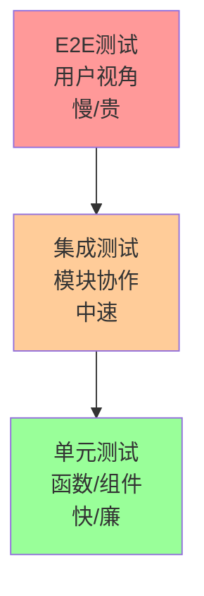

# 测试策略

## 测试金字塔



## 1. 单元测试

### 测试范围

| 类型     | 测试对象           | 占比 |
| -------- | ------------------ | ---- |
| 工具函数 | utils/_, helpers/_ | 70%  |
| 组件     | 纯展示组件         | 20%  |
| Hooks    | 自定义 Hooks       | 10%  |

### 工具函数测试

```typescript
// src/utils/dateUtils.test.ts
import { describe, it, expect } from 'vitest'
import { formatDuration, isOverdue } from './dateUtils'

describe('formatDuration', () => {
  it('应正确格式化天数', () => {
    expect(formatDuration(5, 'day')).toBe('5天')
    expect(formatDuration(1, 'day')).toBe('1天')
  })

  it('应正确格式化小时', () => {
    expect(formatDuration(8, 'hour')).toBe('8小时')
  })

  it('应处理边界值', () => {
    expect(formatDuration(0, 'day')).toBe('0天')
    expect(formatDuration(-1, 'day')).toBe('已过期')
  })
})

describe('isOverdue', () => {
  it('应正确判断逾期', () => {
    const yesterday = new Date(Date.now() - 86400000)
    expect(isOverdue(yesterday)).toBe(true)
  })

  it('应正确判断未逾期', () => {
    const tomorrow = new Date(Date.now() + 86400000)
    expect(isOverdue(tomorrow)).toBe(false)
  })
})
```

### 组件测试

```typescript
// src/components/TaskCard.test.tsx
import { render, screen, fireEvent } from '@testing-library/react';
import { describe, it, expect, vi } from 'vitest';
import { TaskCard } from './TaskCard';

describe('TaskCard', () => {
  const mockTask = {
    id: '1',
    title: '测试任务',
    status: 'PENDING',
    priority: 'HIGH',
    deadline: '2024-12-31'
  };

  it('应正确渲染任务信息', () => {
    render(<TaskCard task={mockTask} onClick={vi.fn()} />);

    expect(screen.getByText('测试任务')).toBeInTheDocument();
    expect(screen.getByText('高优先级')).toBeInTheDocument();
  });

  it('点击应触发回调', () => {
    const onClick = vi.fn();
    render(<TaskCard task={mockTask} onClick={onClick} />);

    fireEvent.click(screen.getByRole('article'));
    expect(onClick).toHaveBeenCalledWith('1');
  });

  it('逾期任务应显示警告样式', () => {
    const overdueTask = { ...mockTask, deadline: '2020-01-01' };
    render(<TaskCard task={overdueTask} onClick={vi.fn()} />);

    expect(screen.getByRole('article')).toHaveClass('overdue');
  });
});
```

### Hooks 测试

```typescript
// src/hooks/useTaskStatus.test.ts
import { renderHook, act } from '@testing-library/react'
import { describe, it, expect } from 'vitest'
import { useTaskStatus } from './useTaskStatus'

describe('useTaskStatus', () => {
  it('应返回初始状态', () => {
    const { result } = renderHook(() => useTaskStatus('PENDING'))

    expect(result.current.status).toBe('PENDING')
    expect(result.current.canTransitionTo('IN_PROGRESS')).toBe(true)
  })

  it('状态转换应生效', () => {
    const { result } = renderHook(() => useTaskStatus('PENDING'))

    act(() => {
      result.current.transitionTo('IN_PROGRESS')
    })

    expect(result.current.status).toBe('IN_PROGRESS')
  })

  it('非法转换应抛出错误', () => {
    const { result } = renderHook(() => useTaskStatus('PENDING'))

    expect(() => {
      act(() => {
        result.current.transitionTo('COMPLETED')
      })
    }).toThrow('非法状态转换')
  })
})
```

## 2. 集成测试

### API 集成测试

```typescript
// src/api/projectApi.test.ts
import { describe, it, expect, beforeAll, afterAll } from 'vitest'
import { setupServer } from 'msw/node'
import { rest } from 'msw'
import { projectApi } from './projectApi'

const server = setupServer(
  rest.get('/api/projects/:id', (req, res, ctx) => {
    return res(
      ctx.json({
        id: req.params.id,
        name: '测试项目',
      })
    )
  })
)

beforeAll(() => server.listen())
afterAll(() => server.close())

describe('projectApi', () => {
  it('应正确获取项目详情', async () => {
    const project = await projectApi.getProject('123')

    expect(project.id).toBe('123')
    expect(project.name).toBe('测试项目')
  })

  it('应处理错误响应', async () => {
    server.use(
      rest.get('/api/projects/:id', (req, res, ctx) => {
        return res(ctx.status(404))
      })
    )

    await expect(projectApi.getProject('999')).rejects.toThrow('项目不存在')
  })
})
```

## 3. E2E 测试

### 关键用户流程

```typescript
// e2e/task-workflow.spec.ts
import { test, expect } from '@playwright/test'

test.describe('任务工作流', () => {
  test.beforeEach(async ({ page }) => {
    await page.goto('/login')
    await page.fill('[name=username]', 'test@example.com')
    await page.fill('[name=password]', 'password')
    await page.click('button[type=submit]')
    await page.waitForURL('/dashboard')
  })

  test('完整任务生命周期', async ({ page }) => {
    // 1. 创建任务
    await page.click('button:has-text("新建任务")')
    await page.fill('[name=title]', 'E2E测试任务')
    await page.fill('[name=description]', '这是测试描述')
    await page.click('button:has-text("保存")')

    await expect(page.locator('.toast')).toHaveText('任务创建成功')

    // 2. 分配任务
    await page.click('button:has-text("分配")')
    await page.selectOption('[name=assignee]', '张三')
    await page.click('button:has-text("确认")')

    await expect(page.locator('.task-status')).toHaveText('待执行')

    // 3. 开始执行
    await page.click('button:has-text("开始执行")')
    await expect(page.locator('.task-status')).toHaveText('执行中')

    // 4. 提交验收
    await page.click('button:has-text("提交")')
    await page.fill('[name=comment]', '已完成开发')
    await page.click('button:has-text("提交验收")')

    await expect(page.locator('.task-status')).toHaveText('待验收')
  })
})
```

## 4. 测试配置

### Vitest 配置

```typescript
// vitest.config.ts
import { defineConfig } from 'vitest/config'

export default defineConfig({
  test: {
    globals: true,
    environment: 'jsdom',
    setupFiles: ['./src/test/setup.ts'],
    coverage: {
      provider: 'v8',
      reporter: ['text', 'json', 'html'],
      thresholds: {
        statements: 80,
        branches: 80,
        functions: 80,
        lines: 80,
      },
      exclude: ['node_modules/', 'src/test/', '**/*.d.ts', '**/*.config.*'],
    },
  },
})
```

### 测试脚本

```json
{
  "scripts": {
    "test": "vitest",
    "test:ui": "vitest --ui",
    "test:coverage": "vitest run --coverage",
    "test:e2e": "playwright test",
    "test:e2e:headed": "playwright test --headed"
  }
}
```

## 5. 测试最佳实践

1. **AAA 模式**：Arrange(准备) → Act(执行) → Assert(断言)
2. **一个测试一个概念**：每个测试只验证一个行为
3. **独立测试**：测试之间不依赖执行顺序
4. **可读性优先**：测试代码即文档
5. **避免过度模拟**：集成测试少用 mock

## 测试驱动开发 (TDD)

```
红 → 绿 → 重构
│
├─ 1. 写失败的测试（红）
├─ 2. 写最简单的代码通过测试（绿）
└─ 3. 重构代码保持测试通过（重构）
```
