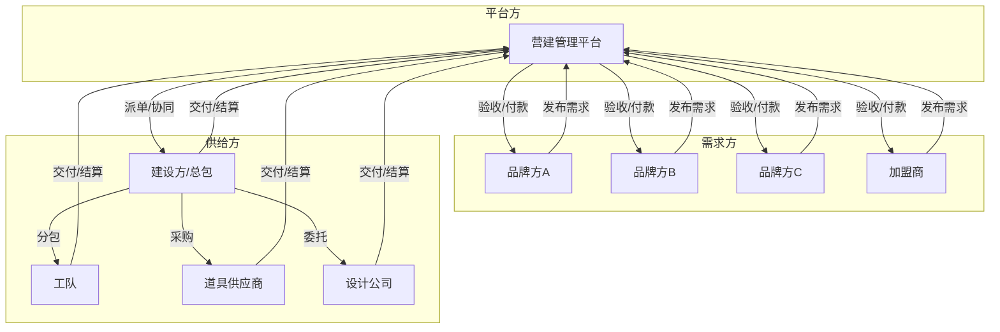
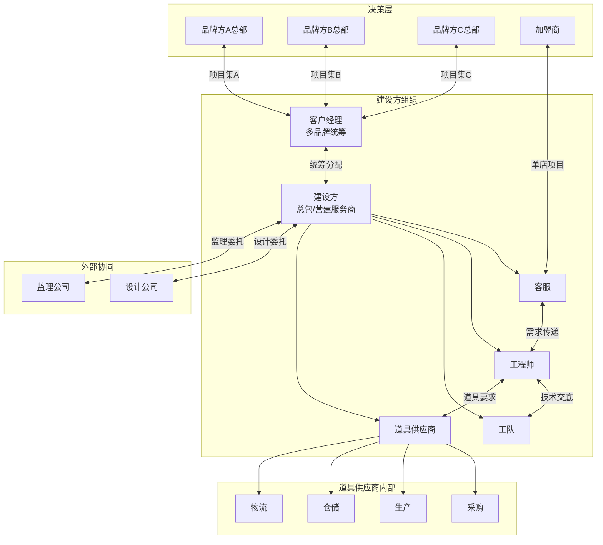
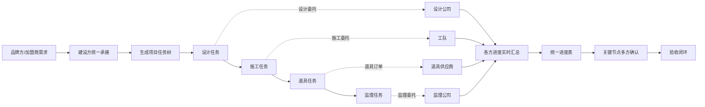
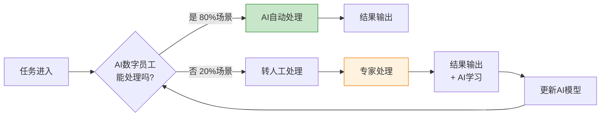
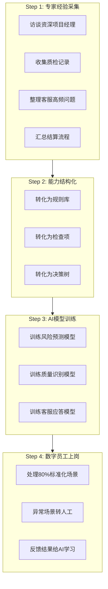
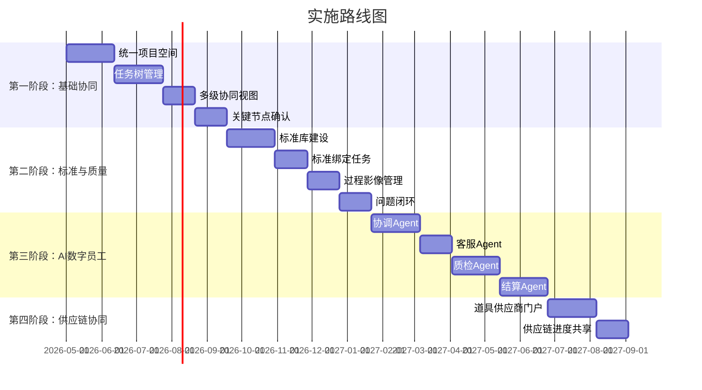

# 连锁门店营建管理系统 - 产品规划文档 V2.3

> **文档版本**：V2.3  
> **文档状态**：草稿（新增商业模式章节）  
> **项目阶段**：V1 / MVP  
> **核心用户**：品牌方营建部门、建设方（含客户经理、财务专员）、加盟商、资源方  
> **设计风格**：Liquid Glass + Material Design 3  
> **技术口径**：前端 `React + TypeScript + Tailwind`；后端 `Express + Prisma`；数据库 `PostgreSQL + SQLite`  
> **商业模式**：平台型，品牌方基础功能免费+增值服务收费，资源方交易抽成2%+Agent使用费  
> **核心价值**：通过AI数字员工替代70%标准化工作，实现多方协同降本增效，平台方获取合理收益

---

## 目录

- [一、执行摘要](#一执行摘要)
- [二、业务背景与核心痛点](#二业务背景与核心痛点)
- [三、参与方架构](#三参与方架构)
- [四、核心价值主张](#四核心价值主张)
- [五、AI数字员工能力矩阵](#五ai数字员工能力矩阵)
- [六、效益测算与ROI](#六效益测算与roi)
- [七、实施路径建议](#七实施路径建议)

---

# 一、执行摘要

## 1.1 一句话价值主张

**把营建专家的专业能力训练成数字员工，通过AI承担70%的标准化协调、质检、客服、结算工作，让建设方从"人肉协调器"升级为"平台指挥官"，实现多方协同降本增效。**

## 1.2 核心目标

| 维度     | 现状痛点                         | 目标                                   |
| -------- | -------------------------------- | -------------------------------------- |
| **成本** | 管理和沟通成本高，多方协调效率低 | 人力成本降低70%，沟通成本降低50%       |
| **效率** | 信息孤岛，流程不通，进度不透明   | 协同效率提升60%，项目周期缩短20-30%    |
| **质量** | 标准执行不到位，验收争议大       | 一次验收通过率提升60%，整改成本降低70% |
| **能力** | 专家依赖度高，能力难以复制       | 新人上手周期从6个月缩短到2周           |

## 1.3 商业模式（平台型）⭐

### 1.3.1 平台定位

本系统采用**平台商业模式**，作为中立的第三方平台，连接**品牌方**（需求方）和**资源方**（供给方），通过数字化工具+AI能力，实现多方协同降本增效，并从中获取合理收益。



### 1.3.2 收费模式

| 收费对象   | 收费项目         | 收费方式    | 说明                                    |
| ---------- | ---------------- | ----------- | --------------------------------------- |
| **品牌方** | 基础功能         | **免费**    | 项目管理、任务协同、进度跟踪等基础功能  |
| **品牌方** | 标准定制服务     | 按项目收费  | 协助品牌方建立/优化营建标准体系         |
| **品牌方** | 系统培训服务     | 按人次收费  | 平台使用培训、最佳实践分享              |
| **品牌方** | AI Agent Token费 | 按用量计费  | 超出免费额度后的AI调用费用              |
| **资源方** | 交易抽成         | **2%**      | 基于项目结算金额抽成                    |
| **资源方** | AI Agent使用费   | 按用量/包月 | 协调Agent、质检Agent、客服Agent等使用费 |
| **资源方** | 增值服务费       | 按服务收费  | 优先派单、数据报表、金融保理等          |

### 1.3.3 收入来源测算（首年）

**假设条件**：

- 接入品牌方：20个
- 接入建设方：50家
- 年项目数：2,000个
- 单项目平均金额：50万元

| 收入项目                  | 单价          | 数量          | 年收入      |
| ------------------------- | ------------- | ------------- | ----------- |
| **品牌方-标准定制**       | 5万/品牌      | 20个品牌      | 100万       |
| **品牌方-系统培训**       | 0.5万/人次    | 100人次       | 50万        |
| **品牌方-Agent Token**    | 0.1万/品牌/月 | 20个品牌×12月 | 24万        |
| **资源方-交易抽成（2%）** | 2%×50万       | 2,000个项目   | 2,000万     |
| **资源方-Agent使用费**    | 0.3万/家/月   | 50家×12月     | 180万       |
| **资源方-增值服务**       | 0.5万/家/年   | 50家          | 25万        |
| **合计**                  | -             | -             | **2,379万** |

> **首年预计收入：2,379万元**

### 1.3.4 成本结构

| 成本项目     | 金额（首年） | 说明                             |
| ------------ | ------------ | -------------------------------- |
| **产品研发** | 350万        | 平台开发、AI Agent训练、系统运维 |
| **市场推广** | 200万        | 品牌方拓展、资源方入驻、行业活动 |
| **运营服务** | 150万        | 客户成功、技术支持、标准咨询服务 |
| **基础设施** | 100万        | 云服务器、数据库、带宽、安全     |
| **管理成本** | 100万        | 人员工资、办公场地、行政         |
| **合计**     | **900万**    | -                                |

> **首年预计成本：900万元**

### 1.3.5 盈利预测

| 指标       | 首年    | 第二年           | 第三年          |
| ---------- | ------- | ---------------- | --------------- |
| **收入**   | 2,379万 | 4,758万（+100%） | 7,137万（+50%） |
| **成本**   | 900万   | 1,200万          | 1,500万         |
| **毛利**   | 1,479万 | 3,558万          | 5,637万         |
| **毛利率** | 62%     | 75%              | 79%             |

### 1.3.6 平台价值主张（对各方）

**对品牌方**：

- 免费使用基础功能，降低营建管理成本
- 可选增值服务，按需付费，灵活可控
- AI Agent加持，提升营建管理效率

**对资源方（建设方/工队/道具供应商）**：

- 2%抽成换取稳定的项目来源，降低获客成本
- AI Agent提升管理效率，节省人力成本
- 平台背书，获得更多品牌方信任

**对平台**：

- 轻资产运营，不承担项目风险
- 交易抽成+增值服务，收入来源稳定
- 数据沉淀，形成竞争壁垒

---

# 二、业务背景与核心痛点

## 2.1 连锁加盟模式下的多方协同困境

### 参与方全景图（Mermaid图表代码）



### 核心痛点矩阵

| 痛点维度           | 具体表现                                             | 业务影响                           |
| ------------------ | ---------------------------------------------------- | ---------------------------------- |
| **成本高**         | 多方协调靠微信群+Excel，项目经理70%时间在汇总信息    | 管理成本高，项目利润空间被压缩     |
| **流程不通**       | 品牌方、加盟商、建设方、施工方信息割裂，数据重复录入 | 信息传递失真，进度不透明，开业延期 |
| **标准执行不到位** | 标准写在文档里，现场执行靠经验，验收时争议大         | 交付质量参差，品牌一致性受损       |
| **专业度不够**     | 依赖个别营建专家，离职带走经验，新人培养慢           | 能力无法复制，扩张受限             |

---

## 2.2 痛点深度分析

### 痛点1：信息不对称（加盟商"蒙眼"投资）

```
品牌方：项目在正常推进，请放心
加盟商：钱花到哪了？什么时候能开业？质量达标吗？
```

**核心问题**：

- 加盟商不知道项目真实进度，只能被动等待
- 关键节点（设计确认、隐蔽工程验收）没有参与权
- 最终验收时才发现问题，整改成本已无法挽回

### 痛点2：利益博弈（品牌要标准，加盟商要省钱）

```
品牌方：必须用A级材料，这是标准
加盟商：B级材料便宜30%，我觉得也够用了
```

**核心问题**：

- 标准执行过程中，加盟商要求"降标"以节省成本
- 品牌方担心"降标"影响品牌形象，双方僵持
- 没有机制平衡"标准"与"成本"的关系

### 痛点3：建设方协调难（多方信息汇总靠人肉）

```
品牌方：这周要完成水电改造
加盟商：我想改一下吧台位置
工队：现场发现承重墙不能拆
道具商：生产周期要延长一周

建设方项目经理：信息散落在微信、邮件、电话里，汇总成统一进度表要半天
```

**核心问题**：

- 建设方作为统筹枢纽，信息汇总全靠Excel
- 多方进度不透明，现场协调靠"撞大运"
- 一处变更牵动多方，电话通知一圈，有的没收到，有的理解错

### 痛点4：道具供应链黑盒（采购-生产-仓储-物流断档）

```
道具供应商采购：原材料涨价，供应商延期交货
道具供应商生产：排期满，产能跟不上
道具供应商仓储：成品堆不下，仓储费暴涨
道具供应商物流：配送车辆调度困难，到现场没人接

建设方：不知道道具真实进度，只能打电话追问，承诺的交货时间一再推迟
```

### 痛点5：多品牌项目集管理难（客户经理疲于奔命）

```
客户经理小王：
- 同时服务3个品牌：奶茶A、咖啡B、快餐C
- 品牌A标准：吧台高度950mm，必须用大理石
- 品牌B标准：吧台高度900mm，必须用石英石
- 品牌C标准：吧台高度920mm，岩板或石英石都可以

今天的问题：
- 品牌A的项目经理问：这个月的10个项目进度怎么样？
- 品牌B的营建总监问：为什么我们的项目延期率比A高？
- 品牌C的加盟商投诉：为什么我的店比其他店慢？

小王：每个品牌的标准都不一样，项目散落在不同Excel里，没法统一看进度
```

**核心问题**：

- 建设方同时服务多个品牌，每个品牌标准不同、流程不同
- 客户经理需要分别对接多个品牌，信息散落在不同渠道
- 无法横向对比不同品牌的项目效率、质量、成本
- 品牌之间的资源调配靠人工经验，无法最优配置

### 痛点6：财务结算复杂（多方对账困难）

```
建设方财务小李：
- 这个月要结算30个项目，涉及5个品牌
- 品牌A：按节点付款，需要核对合同节点、验收单、变更单
- 品牌B：按工程量付款，需要核对月度工程量确认单
- 品牌C：固定总价，但有10%质保金，要算清楚什么时候退

今天的问题：
- 品牌A的项目经理说：这个变更单客户还没确认，能不能先结算？
- 工队老板催款：上个月做的活，为什么还没打钱？
- 财务总监问：我们垫资了多少？现金流还能撑多久？

小李：
- 合同散落在不同文件夹，找一份合同要10分钟
- 验收单、变更单、发票格式不统一，核对靠人工
- 一个项目结算要核对5-8份单据，容易出错
- 月底结账加班到凌晨是常态
```

**核心问题**：

- 多方（品牌方、建设方、工队、供应商）结算口径不一致
- 合同、验收单、变更单、发票分散在不同系统/文件夹，核对困难
- 付款节点复杂（预付款、进度款、验收款、质保金），容易遗漏或重复
- 垫资情况不透明，现金流管理靠经验
- 结算争议处理耗时耗力，影响合作关系

---

# 三、参与方架构

## 3.1 角色职责与权限

| 角色                   | 核心诉求                               | 系统权限                                                   | 关键动作                                   |
| ---------------------- | -------------------------------------- | ---------------------------------------------------------- | ------------------------------------------ |
| **品牌方总部**         | 保证标准落地、控制项目风险、加盟商满意 | 标准制定、建设方选择、关键节点审批、全局数据分析           | 制定标准、审批变更、监控进度               |
| **加盟商**             | 投得明白、建得放心、开业赚钱           | 查看进度、关键节点确认、变更申请、验收签字                 | 确认设计、参与验收、支付款项               |
| **建设方-客户经理** ⭐ | **多品牌统筹、资源优化、客户满意**     | **多品牌项目集视图、跨品牌资源调度、品牌隔离管理**         | **对接多个品牌、统筹项目集、横向对比分析** |
| **建设方（核心枢纽）** | 统筹全盘、降低协调成本、按时交付       | **统一进度表**（全盘任务树）、风险预警、多方协同、任务分配 | 任务分派、进度调整、问题分派               |
| **建设方-客服**        | 对接品牌+加盟商、处理投诉              | 客户沟通记录、满意度跟踪、问题升级                         | 信息录入、客户反馈、问题上报               |
| **建设方-工程师**      | 技术统筹、质量把控                     | 技术任务、工艺标准、问题技术支持                           | 技术交底、质量验收、变更技术评估           |
| **工队**               | 按图施工、进度款结算                   | 自己的任务列表、图纸资料、进度上报                         | 任务执行、进度更新、完工提交               |
| **道具供应商**         | 订单管理、内部协同                     | 道具订单 + 内部协同视图（采购/生产/仓储/物流）             | 订单确认、进度更新、内部任务分配           |
| **设计公司**           | 按需求出图、变更配合                   | 设计任务、变更单、图纸版本                                 | 图纸提交、变更配合                         |
| **监理公司**           | 质量监督、进度跟踪                     | 验收任务、质量问题、整改追踪                               | 质量验收、问题上报、整改确认               |
| **建设方-财务专员** ⭐ | 结算核对、付款管理、现金流监控         | 结算单据审核、付款审批、财务报表、争议处理                 | 单据核对、结算编制、付款执行、争议协调     |

---

## 3.1.1 建设方-客户经理特殊说明

### 角色定位

客户经理是建设方的**对外窗口**和**多品牌统筹者**，核心职责是：

1. **多品牌关系维护**：同时对接多个品牌方的营建部门，维护客户关系
2. **项目集统筹管理**：统筹管理多个品牌的项目集，合理分配资源
3. **横向对比分析**：横向对比不同品牌的项目效率、质量、成本
4. **异常升级处理**：处理品牌方的投诉和重大问题，协调内部资源解决

### 典型工作场景

```
场景1：周一上午
├── 9:00 查看多品牌项目集仪表盘
├── 9:30 参加品牌A的周例会，汇报上周项目进展
├── 10:30 处理品牌B的延期预警，协调资源支援
├── 11:00 回复品牌C的邮件，解答结算问题
└── 14:00 内部会议，讨论品牌A提出的新标准要求

场景2：月底复盘
├── 生成品牌A月度报告：项目数、延期率、质量评分
├── 生成品牌B月度报告：项目数、延期率、质量评分
├── 横向对比：为什么B的延期率比A高？
└── 制定下月资源调配计划
```

### 核心痛点

| 痛点           | 说明                                                                   |
| -------------- | ---------------------------------------------------------------------- |
| **信息碎片化** | 每个品牌用不同的Excel/系统管理，客户经理需要登录多个系统或打开多个文件 |
| **标准难记忆** | 每个品牌的标准不同，容易混淆，需要反复查文档                           |
| **对比困难**   | 无法快速横向对比不同品牌的项目效率、质量、成本                         |
| **资源调度难** | 不知道哪个品牌资源紧张，哪个品牌资源富余，调度靠经验                   |
| **报告耗时**   | 给每个品牌生成月度报告，需要手工汇总多个数据源，耗时2-3天              |

---

## 3.1.2 建设方-财务专员特殊说明 ⭐ 新增

### 角色定位

财务专员是建设方的**资金守护者**和**结算中枢**，核心职责是：

1. **结算审核**：审核项目结算单据，确保结算准确无误
2. **付款执行**：根据合同条款和项目进度，执行付款操作
3. **现金流管理**：监控应收应付，预测现金流，预警资金风险
4. **争议协调**：处理与品牌方、工队/供应商的结算争议

### 典型工作场景

```
场景1：月底结算周
├── 周一：收集30个项目的合同、验收单、变更单、发票
├── 周二：逐个项目核对单据，标记有争议的项目
├── 周三：编制结算表，计算应付金额
├── 周四：与品牌方、工队确认结算数据，处理争议
└── 周五：执行付款，更新现金流表

场景2：日常财务监控
├── 每日查看应收应付仪表盘
├── 发现3个项目即将到付款节点，提前准备资金
├── 发现1个工队的质保金已到期，发起退款流程
└── 向财务总监汇报本月现金流预测
```

### 核心痛点

| 痛点           | 说明                                                                |
| -------------- | ------------------------------------------------------------------- |
| **单据分散**   | 合同、验收单、变更单、发票散落在不同文件夹/系统，找一份单据要10分钟 |
| **核对困难**   | 一个项目要核对5-8份单据，手工比对容易出错                           |
| **节点复杂**   | 预付款、进度款、验收款、质保金等付款节点复杂，容易遗漏或重复        |
| **口径不一**   | 品牌方、建设方、工队/供应商的结算口径不一致，对账困难               |
| **现金流盲区** | 垫资情况不透明，现金流管理靠经验，容易资金链断裂                    |
| **争议频发**   | 结算争议处理耗时耗力，影响合作关系                                  |

---

## 3.2 数据流转关系



---

# 四、核心价值主张

## 4.1 价值主张（一句话）

**让建设方从"微信群治+Excel汇总"的困境中解放出来，通过统一进度表、多级协同视图、AI数字员工，把多方协同的复杂度交给系统，实现"一盘棋统筹、一张表管控、一条链贯通"。**

## 4.2 六大价值支柱

### 支柱1：统一进度表（告别Excel汇总）

| 能力             | 说明                                         |
| ---------------- | -------------------------------------------- |
| **统一项目视图** | 品牌方、加盟商、建设方、施工方在同一项目空间 |
| **多级任务树**   | 建设方任务 → 工队任务、道具商任务，层级清晰  |
| **实时进度汇总** | 子任务进度自动汇总，无需人工统计             |
| **关键路径识别** | 自动识别影响开业的关键任务，优先保障         |

**价值**：建设方项目经理每天节省 2 小时信息汇总时间

### 支柱2：投资透明（让加盟商投得明白）

| 能力             | 说明                                                     |
| ---------------- | -------------------------------------------------------- |
| **加盟商门户**   | 加盟商专属视图，项目进度、费用支出实时可见               |
| **关键节点确认** | 设计确认、隐蔽工程验收、竣工验收等关键节点必须加盟商确认 |
| **费用预警**     | 超预算风险提前预警，变更费用事前确认                     |
| **开业倒计时**   | 基于任务进度智能预测开业时间                             |

**价值**：加盟商满意度提升，品牌方招商更容易

### 支柱3：标准可控（平衡品牌标准与成本）

| 能力         | 说明                                                 |
| ------------ | ---------------------------------------------------- |
| **标准分级** | 明确区分"强制标准"（必须执行）和"可选标准"（可协商） |
| **降标评估** | 申请降标时，系统自动评估对质量、成本、工期的影响     |
| **审批留痕** | 降标申请-品牌方审核-加盟商确认，全程留痕             |
| **风险告知** | 降标可能带来的质量风险、验收风险提前告知             |

**价值**：品牌标准落地有保障，加盟商有参与感，双方利益平衡

### 支柱3.5：财务结算透明（告别对账噩梦）⭐ 新增

**目标客户**：建设方财务专员、品牌方财务、工队/供应商

| 能力                 | 说明                                                             |
| -------------------- | ---------------------------------------------------------------- |
| **结算单据集中管理** | 合同、验收单、变更单、发票统一归集，一键查询，告别文件夹翻找     |
| **智能结算匹配**     | 基于合同条款自动匹配验收单、变更单，生成结算建议，减少人工核对   |
| **付款节点预警**     | 预付款、进度款、验收款、质保金等付款节点自动提醒，避免遗漏或重复 |
| **现金流可视化**     | 实时展示应收应付、垫资情况、现金流预测，辅助资金规划             |
| **结算争议处理**     | 争议项目自动标记，提供历史结算依据，加速争议解决                 |
| **多方对账协同**     | 品牌方、建设方、工队/供应商在同一平台对账，减少扯皮              |

**价值**：

- 结算编制时间缩短 70%（从2天缩短到4小时）
- 对账准确率提升至 98%
- 结算争议减少 60%
- 垫资风险提前预警，避免资金链断裂

**典型使用场景**：

```
场景：月底结算

传统方式：
├── 收集30个项目的合同、验收单、变更单、发票 → 1天
├── 逐个核对单据与合同条款是否匹配 → 1天
├── 手工编制结算表，计算应付金额 → 半天
├── 与品牌方、工队反复确认，处理争议 → 2天
└── 总计：4.5天，经常加班到凌晨

系统方式：
├── 系统自动归集所有单据，智能匹配合同条款
├── AI自动生成结算建议书，标记异常项目
├── 财务人员审核确认，一键生成正式结算单
├── 相关方在线确认，争议项目标注依据
└── 总计：4小时，准点下班
```

### 支柱4：过程可控（让质量看得见）

| 能力               | 说明                                  |
| ------------------ | ------------------------------------- |
| **过程影像**       | 关键工序拍照/视频留档，加盟商远程查看 |
| **隐蔽工程验收**   | 水电改造、防水等隐蔽工程必须拍照验收  |
| **checklist 确认** | 每个阶段有明确的检查项，逐项确认      |
| **问题闭环**       | 发现问题→整改任务→复验确认，全程追踪  |

**价值**：质量问题早发现早整改，降低后期维修成本

### 支柱5：道具供应链透明（告别黑盒）

| 能力             | 说明                                     |
| ---------------- | ---------------------------------------- |
| **道具任务拆解** | 采购、生产、仓储、物流作为子任务         |
| **供应商门户**   | 道具供应商自己的协同空间，内部进度可见   |
| **进度共享**     | 建设方可看到道具各环节的进度，不再是黑盒 |
| **预警机制**     | 道具延期风险提前预警，建设方提前协调     |

**价值**：道具供应链透明可控，减少现场等道具的被动局面

### 支柱6：多方权责清晰（告别甩锅）

| 能力           | 说明                                             |
| -------------- | ------------------------------------------------ |
| **任务责任制** | 每个任务明确责任人、交付物、截止时间             |
| **多方签字**   | 关键节点品牌方、施工方、监理、加盟商多方签字确认 |
| **标准快照**   | 任务启动时固化标准版本，事后不改口径             |
| **审计日志**   | 谁做了什么，什么时候做的，全部记录               |

**价值**：责任纠纷减少 70%，问题追溯有依据

### 支柱7：多品牌项目集管理（客户经理的"作战指挥部"）⭐ 新增

**目标客户**：建设方客户经理（同时服务多个品牌）

| 能力               | 说明                                                                 |
| ------------------ | -------------------------------------------------------------------- |
| **品牌隔离与聚合** | 每个品牌数据隔离，客户经理可切换查看不同品牌；同时支持跨品牌聚合视图 |
| **多品牌仪表盘**   | 一屏查看所有品牌项目集：项目数、延期率、质量评分、资源负载           |
| **品牌标准库**     | 每个品牌的标准独立管理，系统自动匹配品牌标准，避免混淆               |
| **横向对比分析**   | 横向对比不同品牌的项目效率、质量、成本，识别优化空间                 |
| **智能资源调度**   | 基于各品牌项目进度和资源负载，AI推荐最优资源调配方案                 |
| **一键生成报告**   | 一键生成各品牌的月度/季度报告，自动汇总数据，节省2-3天工作量         |

**价值**：

- 客户经理管理效率提升 60%
- 品牌客户满意度提升 40%
- 资源利用率提升 25%

**典型使用场景**：

```
周一早上，客户经理打开多品牌仪表盘：
├── 品牌A：15个项目，延期率10%，资源负载80% → 正常
├── 品牌B：8个项目，延期率30%，资源负载120% → 预警（资源不足）
├── 品牌C：12个项目，延期率5%，资源负载60% → 健康
└── AI建议：从品牌C调配2名工程师支援品牌B

客户经理一键确认调度方案，系统自动通知相关人员
```

---

# 五、AI数字员工能力矩阵

## 5.1 AI数字员工愿景

**把营建专家的专业能力训练成数字员工，让AI承担标准化协调、监控、质检、客服工作，把稀缺的人力资源解放出来专注于解决真正需要人类判断的复杂问题。**

## 5.2 人机协作模式（Mermaid图表代码）



## 5.3 四大AI数字员工角色

### 角色1：协调Agent（替代项目经理70%协调工作）

**传统人力痛点**：

- 每天花4小时打电话、发微信催进度
- 手工汇总Excel进度表
- 发现延期后人工协调资源

**AI数字员工能力**：

| 能力         | 说明                                             | 替代场景 |
| ------------ | ------------------------------------------------ | -------- |
| **智能排程** | 基于任务依赖、资源负载自动排程，比人工排程快10倍 | 排程规划 |
| **自动催办** | 任务即将到期自动提醒责任人，无需人工电话         | 进度催办 |
| **风险预警** | 自动识别延期风险，提前3-7天预警                  | 风险识别 |
| **资源推荐** | 派单失败时自动推荐备选资源方                     | 资源协调 |
| **冲突调解** | 多方时间冲突时自动提出协调方案                   | 冲突协调 |

**节省人力**：1个AI协调Agent ≈ 3个项目经理的协调工作量

---

### 角色2：质检Agent（替代质检工程师70%现场工作）

**传统人力痛点**：

- 每天跑3-5个工地现场检查
- 凭经验判断是否符合标准
- 手工填写检查表

**AI数字员工能力**：

| 能力             | 说明                                           | 替代场景 |
| ---------------- | ---------------------------------------------- | -------- |
| **图像识别质检** | 施工照片自动比对标准，识别违规（如电线未套管） | 现场检查 |
| **视频巡检**     | 无人机/摄像头视频自动巡检进度和质量            | 进度巡查 |
| **标准自动比对** | 上传资料自动核对是否齐全、格式是否正确         | 资料审核 |
| **缺陷自动分级** | 根据缺陷严重程度自动分级，高优先级自动升级     | 问题分级 |
| **整改建议生成** | 基于缺陷自动生成整改建议和标准依据             | 整改指导 |

**节省人力**：1个AI质检Agent ≈ 5个质检工程师的基础检查工作量

---

### 角色3：客服Agent（替代客服专员80%重复工作）

**传统人力痛点**：

- 每天回答100+个重复问题（"进度怎么样了？""什么时候开业？"）
- 手工查询后回复
- 非工作时间无法响应

**AI数字员工能力**：

| 能力             | 说明                                         | 替代场景 |
| ---------------- | -------------------------------------------- | -------- |
| **7x24智能应答** | 全天候回答品牌方、加盟商、供应商的进度查询   | 进度查询 |
| **多轮对话**     | 理解复杂问题，如"我这个月的款项什么时候结？" | 复杂咨询 |
| **主动通知**     | 关键节点自动通知相关方，无需人工提醒         | 节点通知 |
| **情绪识别**     | 识别投诉情绪，自动升级给人工客服             | 投诉处理 |
| **知识沉淀**     | 每次问答都沉淀到知识库，越用越聪明           | 知识管理 |

**节省人力**：1个AI客服Agent ≈ 10个客服专员的基础咨询工作量

---

### 角色4：结算Agent（替代结算专员60%核对工作）

**传统人力痛点**：

- 手工核对合同、验收单、变更单、发票，一个项目要核对5-8份单据
- 付款节点复杂（预付款、进度款、验收款、质保金），容易遗漏或重复
- 多方结算口径不一致，对账困难，争议频发
- 垫资情况不透明，现金流管理靠经验
- 月底结账加班到凌晨是常态

**AI数字员工能力**：

| 能力             | 说明                                                             | 替代场景 |
| ---------------- | ---------------------------------------------------------------- | -------- |
| **单据智能归集** | 自动从各模块抓取合同、验收单、变更单、发票，统一归集             | 单据收集 |
| **单据自动核对** | 基于合同条款自动匹配验收单、变更单，识别金额差异、节点不符       | 单据核对 |
| **结算建议生成** | 基于合同条款和执行结果自动生成结算建议书，含应付金额、付款节点   | 结算编制 |
| **付款节点预警** | 自动计算各项目的预付款、进度款、验收款、质保金到期时间，提前提醒 | 付款提醒 |
| **现金流预测**   | 基于应收应付计划，预测未来3个月现金流，预警资金缺口              | 资金规划 |
| **争议自动识别** | 自动标记单据缺失、金额不符、节点争议的项目，提供依据和解决建议   | 争议识别 |
| **多方对账协同** | 生成对账单，推送给品牌方/工队在线确认，减少反复沟通              | 对账协同 |
| **审计留痕**     | 结算依据、审批流程、争议处理全程留痕，支持事后审计               | 审计支持 |

**典型场景示例**：

```
场景：月底批量结算30个项目

传统方式：
- 财务人员小李手工收集30个项目的合同、验收单、变更单 → 1天
- 逐个项目核对单据与合同条款，发现5个项目有争议 → 1天
- 手工计算应付金额，编制结算表 → 半天
- 电话/邮件与品牌方、工队确认，反复修改 → 2天
- 总计：4.5天，月底加班到凌晨

AI Agent方式：
- AI自动归集所有单据，智能匹配合同条款 → 10分钟
- AI自动标记5个争议项目，生成争议说明 → 5分钟
- AI自动生成30个项目的结算建议书，含应付金额、付款节点 → 10分钟
- 小李审核确认，一键推送相关方在线确认 → 30分钟
- 争议项目在线协商，系统自动记录协商结果 → 1小时
- 总计：2小时，准点下班
```

**节省人力**：1个AI结算Agent ≈ 4个结算专员的基础核对工作量

---

### 角色5：客户经理Agent（多品牌项目集智能管家）⭐ 新增

**传统人力痛点**：

- 同时服务3-5个品牌，每个品牌的项目信息散落在不同Excel/系统
- 需要记忆每个品牌的不同标准，容易混淆
- 每月花2-3天手工生成各品牌的月度报告
- 资源调度靠经验，无法做到最优配置

**AI数字员工能力**：

| 能力                 | 说明                                             | 替代场景 |
| -------------------- | ------------------------------------------------ | -------- |
| **多品牌仪表盘生成** | 自动生成多品牌项目集仪表盘，一屏掌握全局         | 信息汇总 |
| **品牌标准智能匹配** | 自动识别项目所属品牌，匹配对应标准，避免混淆     | 标准匹配 |
| **横向对比分析**     | 自动分析不同品牌的延期率、质量评分、成本效率     | 数据分析 |
| **智能资源调度建议** | 基于各品牌资源负载和项目优先级，推荐最优调度方案 | 资源协调 |
| **一键报告生成**     | 一键生成各品牌的月度/季度报告，自动汇总数据      | 报告编制 |
| **风险预警聚合**     | 聚合所有品牌的风险预警，按优先级排序             | 风险监控 |

**典型场景示例**：

```
场景：月底生成品牌报告

传统方式：
- 打开品牌A的Excel，手动统计项目数、延期率、质量评分 → 1小时
- 打开品牌B的Excel，手动统计 → 1小时
- 打开品牌C的Excel，手动统计 → 1小时
- 制作对比图表，撰写分析结论 → 2小时
- 总计：5小时

AI Agent方式：
- 客户经理："生成本月品牌报告"
- AI Agent：自动生成3个品牌的完整报告，含横向对比分析 → 5分钟
- 客户经理：审核、微调、发送
- 总计：30分钟
```

**节省人力**：1个AI客户经理Agent ≈ 2-3名客户经理的信息汇总和报告工作量

---

## 5.4 专家能力训练流程



---

# 六、效益测算与ROI

## 6.1 人力成本节省测算

| 角色            | 传统人力配置 | AI数字员工替代后             | 人力节省 | 年节省成本（15万/人） |
| --------------- | ------------ | ---------------------------- | -------- | --------------------- |
| **客户经理** ⭐ | 6人          | 2人（专注客户关系+重大决策） | 67%      | 60万                  |
| **项目经理**    | 10人         | 3人（专注决策+异常）         | 70%      | 105万                 |
| **质检工程师**  | 15人         | 5人（专注争议+标准制定）     | 67%      | 150万                 |
| **客服专员**    | 20人         | 4人（专注投诉+关系维护）     | 80%      | 240万                 |
| **结算专员**    | 8人          | 3人（专注争议+审计）         | 63%      | 75万                  |
| **合计**        | **59人**     | **17人**                     | **71%**  | **630万**             |

> **年节省人力成本：630万元**（含客户经理）

## 6.2 其他效益

| 维度       | 指标             | 预期提升    |
| ---------- | ---------------- | ----------- |
| **效率**   | 项目交付周期     | 缩短 20-30% |
| **质量**   | 一次验收通过率   | 提升 60%    |
| **成本**   | 整改成本         | 降低 70%    |
| **满意度** | 加盟商满意度     | 提升 40%    |
| **风险**   | 责任纠纷处理时间 | 缩短 70%    |

## 6.3 ROI测算

| 项目                 | 金额        |
| -------------------- | ----------- |
| 系统建设投入（首年） | 350万       |
| 年运维成本           | 60万        |
| 年节省人力成本       | 630万       |
| **首年净收益**       | **220万**   |
| **投资回报周期**     | **7-9个月** |

---

# 七、实施路径建议

## 7.1 分阶段实施路线图（Mermaid图表代码）



### 第一阶段：基础协同（MVP，3-6个月）

**目标**：跑通基础协同流程，建立统一进度表

**核心功能**：

- [ ] 统一项目空间（品牌方、加盟商、建设方）
- [ ] 任务树管理（项目→工作包→任务）
- [ ] 多级协同视图（各角色看各自视图）
- [ ] 关键节点确认（加盟商参与）

**验证标准**：

- 建设方项目经理每天信息汇总时间 < 30分钟
- 加盟商可实时查看项目进度
- 关键节点确认流程跑通1个真实项目

---

### 第二阶段：标准与质量（6-9个月）

**目标**：建立标准库，实现过程质量管控

**核心功能**：

- [ ] 标准库建设（结构化标准、模板）
- [ ] 标准绑定任务（执行标准、验收标准）
- [ ] 过程影像管理（关键工序拍照/视频）
- [ ] 问题闭环（整改任务、复验确认）

**验证标准**：

- 标准可绑定到具体任务
- 隐蔽工程验收线上完成
- 质量问题可追踪到具体工序

---

### 第三阶段：AI数字员工（9-15个月）

**目标**：上线AI Agent，实现自动化替代

**核心功能**：

- [ ] 协调Agent（自动催办、风险预警）
- [ ] 客服Agent（7x24智能应答）
- [ ] 质检Agent（图像识别质检）
- [ ] 结算Agent（自动对账、生成建议）

**验证标准**：

- AI Agent处理80%标准化场景
- 人力成本降低50%
- 客户满意度提升30%

---

### 第四阶段：供应链协同（15-18个月）

**目标**：打通道具供应商内部协同

**核心功能**：

- [ ] 道具供应商门户
- [ ] 采购-生产-仓储-物流内部协同
- [ ] 供应链进度共享
- [ ] 延期预警

**验证标准**：

- 道具供应链进度透明
- 现场等道具情况减少50%

---

## 7.2 成功关键因素

| 因素         | 说明                                   |
| ------------ | -------------------------------------- |
| **标准先行** | 先把标准结构化，才能训练AI质检Agent    |
| **试点先行** | 先跑通1-2个真实项目，再推广            |
| **专家参与** | 资深专家参与AI训练，保证能力传承       |
| **变革管理** | 做好人员转型培训，从操作者升级为决策者 |
| **数据积累** | 持续积累项目数据，AI越用越聪明         |

---

## 7.3 风险提示

| 风险               | 应对措施                               |
| ------------------ | -------------------------------------- |
| **AI准确率不足**   | 先辅助决策，后逐步自动；保留人工兜底   |
| **参与方抵触**     | 从痛点切入，让建设方/加盟商先尝到甜头  |
| **标准难以结构化** | 先聚焦高频标准域，AI辅助拆解，人工校对 |
| **数据安全**       | 品牌隔离、权限控制、审计留痕           |

---

# 八、附录

## 8.1 图表目录

| 图表编号 | 图表名称                       | 所在章节 |
| -------- | ------------------------------ | -------- |
| 图1      | 参与方全景图（含多品牌项目集） | 2.1      |
| 图2      | 数据流转关系图                 | 3.2      |
| 图3      | 人机协作模式图                 | 5.2      |
| 图4      | 专家能力训练流程图             | 5.4      |
| 图5      | 实施路线图                     | 7.1      |

> **说明**：以上图表使用Mermaid语法编写，可以在支持Mermaid的编辑器（如Typora、VS Code插件、GitLab、Notion等）中渲染为可视化图表。

## 8.2 核心术语

| 术语             | 定义                                                           |
| ---------------- | -------------------------------------------------------------- |
| **建设方**       | 承接品牌方营建需求，统筹设计、施工、道具的总包方               |
| **客户经理**     | 建设方对外窗口，同时对接多个品牌，统筹多品牌项目集             |
| **财务专员**     | 建设方财务负责人，负责结算审核、付款执行、现金流管理           |
| **工作包**       | 交付与成本归集的最小管理单元                                   |
| **标准快照**     | 任务启动时固化的标准版本副本                                   |
| **AI数字员工**   | 基于AI技术，可自动处理标准化任务的虚拟角色                     |
| **多方协同空间** | 品牌方、加盟商、建设方、施工方在同一平台的协作环境             |
| **品牌隔离**     | 不同品牌的数据相互隔离，确保商业机密安全                       |
| **结算建议书**   | 基于合同条款和执行结果自动生成的结算方案，含应付金额、付款节点 |
| **付款节点**     | 合同约定的付款时点，包括预付款、进度款、验收款、质保金等       |
| **垫资**         | 建设方为项目先行垫付的资金，需在结算时收回                     |
| **平台抽成**     | 平台从资源方交易金额中抽取的服务费，本系统为2%                 |
| **Token费**      | AI Agent调用的按量计费费用                                     |

## 8.3 变更记录

| 版本 | 日期       | 变更内容                                                                        | 作者            |
| ---- | ---------- | ------------------------------------------------------------------------------- | --------------- |
| V2.3 | 2026-04-23 | 新增商业模式章节：平台定位、收费模式、收入测算、成本结构、盈利预测              | docs-maintainer |
| V2.2 | 2026-04-23 | 新增财务结算痛点、财务专员角色、财务结算价值支柱、增强结算Agent能力             | docs-maintainer |
| V2.1 | 2026-04-23 | 新增建设方客户经理角色，补充多品牌项目集管理场景、第七大价值支柱、客户经理Agent | docs-maintainer |
| V2.0 | 2026-04-23 | 基于加盟模式、建设方枢纽、AI数字员工重新梳理价值主张                            | docs-maintainer |
| V1.1 | 2026-04-16 | 增加项目管理6标签结构、任务-WBS合并                                             | docs-maintainer |
| V1.0 | 2026-03-01 | 初版，聚焦项目管理、任务中心、标准管理                                          | docs-maintainer |

---

**文档维护者**：产品团队  
**下次评审**：2026-05-23
