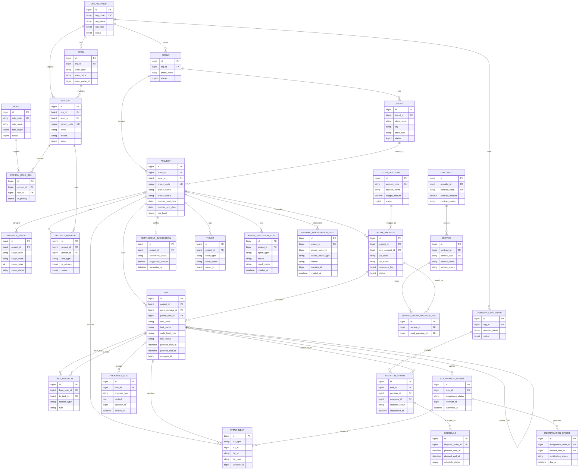

# 多Agent建店管理平台 V1 PRD

## 1. 文档概述

### 1.1 文档名称

多Agent建店管理平台 V1 PRD

### 1.2 项目阶段

V1 / MVP

### 1.3 文档目标

定义 V1 版本的产品目标、范围、角色、Agent 能力、业务流程、功能模块、状态流转和验收标准，支撑产品、设计、研发、测试统一理解。

### 1.4 项目一句话定义

面向连锁品牌建店场景，通过客服 Agent、品牌需求 Agent、项目经理 Agent、资源调度 Agent、资源执行 Agent、验收质检 Agent、结算对账 Agent 替代部分人工岗位，完成从需求接入到结算建议的自动化推进。

---

## 2. 项目背景

连锁品牌建店流程普遍存在以下问题：

- 需求录入依赖人工，前期沟通成本高
- 项目推进高度依赖项目经理和跟单人员
- 资源匹配和派单主要靠人工经验
- 施工进度、资料回传和验收标准不统一
- 客服咨询、催办、投诉处理分散
- 验收和结算前置整理工作量大

V1 的核心目标不是做一个传统流程系统，而是验证：

> Agent 是否能替代建店过程中的标准化岗位动作，并在真实项目中跑通最小业务闭环。

---

## 3. 项目目标

### 3.1 业务目标

- 提升建店项目立项效率
- 降低项目推进中的人工跟单成本
- 提升资源派单效率
- 提升资料规范性和验收标准化程度
- 降低客服重复答复和基础工单分发成本

### 3.2 产品目标

在 V1 实现以下闭环：

咨询/受理 → 需求补全 → 自动立项 → 项目拆解 → 自动派单 → 执行回传 → 初验整改 → 结算建议 → 人工审批归档

### 3.3 成功标准

- 跑通 1 条完整建店项目闭环
- 客服 Agent 自动答复率 > 40%
- 品牌需求 Agent 立项补全率 > 60%
- 资源调度 Agent 自动派单覆盖率 > 30%
- 验收质检 Agent 自动初验覆盖率 > 50%
- 人工项目跟进触达次数显著下降

---

## 4. 产品范围

### 4.1 V1 纳入范围

#### 三套系统

- 品牌端
- 资源调度平台
- 资源方端

#### 七个 Agent

- 客服 Agent
- 品牌需求 Agent
- 项目经理 Agent
- 资源调度 Agent
- 资源执行 Agent
- 验收质检 Agent
- 结算对账 Agent

#### 核心能力

- 对话式需求接入
- 项目自动立项
- 工作包/任务拆解与里程碑生成
- 工作包到成本账户映射
- 外包合同打包生成服务视图
- 资源匹配与派单建议
- 资源执行回传
- 验收资料初审
- 结算建议单生成
- 工单受理与分发

### 4.2 V1 不纳入范围

- 自动付款
- 复杂合同体系
- 智能报价优化
- 多品牌深度经营分析
- 图像/视频深度 AI 质检
- 跨区域最优调度算法
- Agent 自学习闭环

---

## 5. 用户角色

### 5.1 品牌端角色

- 品牌管理员
- 拓展/工程负责人
- 审批人
- 验收确认人

### 5.2 平台角色

- 平台管理员
- 人工兜底项目经理
- 调度运营
- 客服运营
- 财务审核人员

### 5.3 资源方角色

- 资源方管理员
- 项目负责人
- 现场执行人员
- 资料提交人员

### 5.4 Agent 角色

- 客服 Agent：咨询、工单、分发
- 品牌需求 Agent：立项补全
- 项目经理 Agent：全局推进
- 资源调度 Agent：资源匹配与派单
- 资源执行 Agent：执行协同与资料回传
- 验收质检 Agent：资料初验与整改建议
- 结算对账 Agent：结算建议生成

---

## 6. Agent 岗位职责

### 6.1 客服 Agent

**岗位目标**：统一承接咨询、进度查询、催办、投诉、申诉和工单分发。

**核心职责**：

- 自动答复常见问题
- 查询项目/派单/验收/结算状态
- 识别问题类型
- 创建工单、投诉单、催办单
- 分发给对应 Agent 或人工
- 跟踪结果回告

**升级条件**：

- 用户连续投诉
- 情绪化投诉
- 高风险项目争议
- 超时未处理工单

### 6.2 品牌需求 Agent

**岗位目标**：把模糊建店需求转成结构化立项单。

**核心职责**：

- 对话式收集需求
- 追问缺失字段
- 调用品牌模板补全
- 生成立项草案
- 生成初始任务清单
- 输出风险提示

**升级条件**：

- 缺失关键信息
- 预算异常
- 开业时间不合理
- 非标店型

### 6.3 项目经理 Agent

**岗位目标**：自动推进项目执行，替代大量人工项目跟单动作。

**核心职责**：

- 创建项目计划
- 拆阶段与任务
- 管理任务依赖
- 推动项目状态流转
- 自动催办
- 延期预警
- 输出日报周报

**升级条件**：

- 关键路径延期
- 多任务阻塞
- 验收连续失败
- 成本超阈值

### 6.4 资源调度 Agent

**岗位目标**：自动匹配资源并完成派单建议。

**核心职责**：

- 按规则筛选资源方
- 发起派单
- 生成排期建议
- 记录调度依据
- 派单失败时生成预警

**升级条件**：

- 连续派单失败
- 无可用资源
- 成本超阈值
- 资源冲突

### 6.5 资源执行 Agent

**岗位目标**：帮助资源方按标准执行并规范回传。

**核心职责**：

- 解释任务要求
- 生成执行清单
- 提醒关键节点
- 协助进度填报
- 整理资料上传
- 发起完工与验收申请

**升级条件**：

- 资料缺失严重
- 施工阻塞
- 连续延期
- 现场异常

### 6.6 验收质检 Agent

**岗位目标**：完成资料完整性检查和初验。

**核心职责**：

- 验收资料齐全性检查
- 按模板核验项目
- 输出问题项
- 生成整改建议
- 推进复验

**升级条件**：

- 关键资料缺失
- 重大质量问题
- 连续复验失败

### 6.7 结算对账 Agent

**岗位目标**：自动形成结算建议，减少财务前置整理工作。

**核心职责**：

- 对比合同、报价、验收、变更
- 识别差异项
- 生成结算建议单
- 标记异常费用
- 提交人工审核

**升级条件**：

- 金额偏差过大
- 缺少依据
- 验收与结算不一致
- 发票争议

---

## 7. 核心业务场景

1. 品牌发起建店需求，希望系统自动引导补全信息、生成项目草案并快速进入执行流程。
2. 平台希望在项目创建后，减少项目经理人工跟进，通过 Agent 自动拆解任务、催办和预警。
3. 平台希望根据城市、品类、评分、资质、负载等规则，自动匹配合适资源方。
4. 资源方希望更低成本接单、执行、上传资料，减少反复沟通。
5. 平台希望对完工资料做标准化初审，减少人工逐项检查工作量。
6. 品牌方和资源方希望有统一入口查询进度、发起催办、投诉、申诉。
7. 平台财务希望系统自动核对报价、验收、变更，形成结算建议。

---

## 8. 总体业务流程

1. 用户进入客服 Agent 或品牌端发起需求
2. 品牌需求 Agent 收集并补全立项信息
3. 品牌方确认立项草案
4. 项目经理 Agent 创建项目，并按`项目 -> 工作包 -> 任务 -> 子任务`生成 WBS
5. 系统将工作包映射成本账户，外包工作包按合同打包形成服务视图
6. 资源调度 Agent 在服务/任务维度匹配资源方并生成派单/排期建议
7. 资源方在资源方端接单，资源执行 Agent 推动执行回传
8. 完工后由验收质检 Agent 进行资料初审并输出整改项
9. 初验通过后，结算对账 Agent 生成结算建议单
10. 人工确认异常/争议，项目归档

---

## 9. 功能设计

### 9.1 品牌端

#### 9.1.1 工作台

- 待确认立项
- 待审批报价
- 待确认验收
- 项目风险提醒
- 客服消息入口

#### 9.1.2 开店立项

- 新建立项
- 店型模板选择
- 对话式需求录入
- 缺失字段提醒
- 立项草案确认

**关键字段**：

- 门店名称
- 城市
- 商圈
- 店型
- 面积
- 计划开业时间
- 预算区间
- 特殊要求

#### 9.1.3 项目中心

- 项目列表
- 项目详情
- 里程碑进度
- 工作包视图（成本账户映射）
- 任务视图
- 风险记录
- 项目日志

#### 9.1.4 报价与审批

- 报价单列表
- 报价详情
- 审批通过/驳回
- 审批记录查看

#### 9.1.5 验收中心

- 待确认验收单
- 初验结果查看
- 整改记录查看
- 最终确认

#### 9.1.6 结算中心

- 结算建议单查看
- 差异项查看
- 发票状态查看
- 付款进度查看

#### 9.1.7 客服与工单

- 在线咨询
- 项目进度查询
- 发起催办
- 发起投诉/申诉
- 查看工单进度

### 9.2 资源调度平台

#### 9.2.1 项目池

- 项目列表
- 项目详情
- 阶段分布
- 项目风险视图

#### 9.2.2 任务中心

- 工作包清单
- 任务清单
- 任务详情
- 任务依赖
- SLA 状态
- 成本账户进度对比
- 催办记录

#### 9.2.3 调度台

- 待派单任务池
- 资源推荐结果
- 派单确认
- 排期建议
- 派单失败预警
- 改派入口

**派单规则**：

- 城市匹配优先
- 品类能力匹配
- 资质合规
- 评分阈值
- 当前负载
- SLA 风险

#### 9.2.4 资源池

- 资源方档案
- 工队档案（班组、工种、班组长、可用档期）
- 材料供应商档案（品类、交期、价格区间、覆盖城市）
- 成品道具/家具供应商档案（品类、产能、交期、安装能力）
- 区域覆盖
- 资质证照
- 履约评分
- 当前负载
- 服务品类
- 供应能力标签（施工/材料/道具家具）

#### 9.2.5 异常中心

- 延期异常
- 派单异常
- 验收异常
- 结算异常
- 升级处理记录

#### 9.2.6 验收中心

- 待初验任务
- 初验结果
- 整改任务
- 复验追踪

#### 9.2.7 结算中心

- 待对账项目
- 结算建议单
- 差异项审核
- 财务流转记录

#### 9.2.8 客服工单中心

- 工单池
- 催办池
- 投诉池
- 工单流转记录
- 服务指标

#### 9.2.9 Agent 运行中心

- Agent 执行日志
- 决策记录
- 转人工记录
- 失败任务重试
- 审计追踪

### 9.3 资源方端

#### 9.3.1 工作台

- 待接单
- 今日待处理
- 即将超时任务
- 待补资料
- 验收退回
- 客服消息

#### 9.3.2 待接单

- 待接单任务列表
- 任务详情
- 接单/拒单
- 报价提交
- 排期确认

#### 9.3.3 我的项目

- 项目列表
- 项目详情
- 阶段视图
- 任务清单

#### 9.3.4 任务执行

- 执行清单
- 开工打点
- 进度填报
- 阻塞上报
- 完工提交

#### 9.3.5 资料中心

- 图片上传
- 文档上传
- 回执上传
- 资料完整性提示
- 资料归档

#### 9.3.6 验收申请

- 发起验收
- 初验结果查看
- 整改任务查看
- 复验提交

#### 9.3.7 结算中心

- 报价记录
- 对账记录
- 结算建议查看
- 发票提交
- 收款状态

#### 9.3.8 客服与申诉

- 在线客服
- 工单查询
- 发起申诉
- 处理进度查看

#### 9.3.9 资源组织与供应协同

- 工队管理（班组成员、工种、排班、出勤）
- 材料计划（需求清单、到货时间、缺料预警）
- 道具/家具计划（下单、生产/发货、安装回执）
- 供应商协同（对账单、交付凭证、异常申诉）

---

## 10. 核心流程说明

### 10.1 需求接入流程

1. 品牌方进入客服 Agent 或开店立项
2. 填写基础需求
3. 品牌需求 Agent 判断是否缺失关键字段
4. 缺失则追问补全
5. 生成立项草案
6. 品牌方确认立项

### 10.2 项目拆解流程

1. 立项确认后触发项目经理 Agent
2. 自动生成项目级 WBS 根节点
3. 自动生成工作包并绑定成本账户
4. 自动拆解任务/子任务
5. 建立依赖关系
6. 外包工作包形成合同并投影为服务视图
7. 进入待调度状态

### 10.3 调度派单流程

1. 资源调度 Agent 获取待派单任务
2. 根据规则筛选资源（资源方/工队/材料供应商/道具家具供应商）
3. 生成资源推荐结果与推荐理由
4. 自动/人工确认派单或下单
5. 资源方/供应商接单并确认档期或交期
6. 若拒单、缺料或延期，进入改派或异常处理

### 10.4 执行回传流程

1. 资源方接单
2. 资源执行 Agent 生成执行清单
3. 资源方开工并上报进度
4. 上传图片和资料
5. 完工提交
6. 发起验收申请

### 10.5 验收整改流程

1. 验收质检 Agent 接收验收申请
2. 校验资料完整性
3. 对照模板输出初验结论
4. 不通过则生成整改任务
5. 资源方整改后重新提交
6. 通过则流转结算

### 10.6 结算流程

1. 结算对账 Agent 获取通过验收项目
2. 对比合同、报价、验收和变更项
3. 生成结算建议单
4. 标记差异和风险项
5. 人工审核确认
6. 项目归档

---

## 11. 数据对象设计

### 11.1 建模对齐口径（与任务树说明一致）

- 任务是项目管理原子执行单元
- 工作包是任务上层交付与成本归集单元
- 项目由工作包与任务组成，并可被项目集/项目组合扩展承载
- 工作包对应成本账户
- 一个或多个成本账户外包并形成合同关系，即形成服务
- 服务是合同履约视图，执行动作仍落在任务节点

### 11.2 核心对象

V1 核心对象如下：

- 品牌
- 门店
- 建店项目
- 工作包（映射成本账户）
- 任务单
- 子任务
- 成本账户
- 合同
- 服务（合同履约视图）
- 资源方
- 工队（班组）
- 材料供应商
- 成品道具/家具供应商
- 材料需求单
- 道具/家具需求单
- 报价单
- 排期单
- 进度日志
- 验收单
- 整改单
- 结算建议单
- 工单
- 附件资料
- Agent 执行记录
- 人工干预记录

### 11.3 实体关系图（ERD）

> 说明：本图用于 V1 数据建模基线，覆盖组织权限域、项目任务主链、履约结算链、审计留痕链。后续落库时以本图为逻辑模型来源。

#### 11.3.1 建模约束（V1）

- 一个任务只归属一个项目，且仅允许一个直接父任务（树结构）。
- 任务依赖关系通过 `TASK_RELATION` 扩展，不与父子结构混用。
- 工作包必须映射成本账户，任务/子任务归集到工作包。
- 服务是合同履约视图，不替代任务执行主模型。
- 关键状态流转与人工介入必须留痕（Agent/人工日志）。

#### 11.3.2 后续落库建议

- 先落主链：`PROJECT / WORK_PACKAGE / TASK / TASK_RELATION / DISPATCH_ORDER / ACCEPTANCE_ORDER / RECTIFICATION_ORDER / SETTLEMENT_SUGGESTION`
- 再落组织权限：`ORGANIZATION / PERSON / ROLE / PERSON_ROLE_REL / PROJECT_MEMBER`
- 最后补横切能力：`ATTACHMENT / TICKET / AGENT_EXECUTION_LOG / MANUAL_INTERVENTION_LOG`

### 11.4 表清单与主外键（V1）

#### 11.4.1 组织权限域

| 表名            | 主键 | 关键外键                                         | 唯一约束建议                     | 关键索引建议                            |
| --------------- | ---- | ------------------------------------------------ | -------------------------------- | --------------------------------------- |
| ORGANIZATION    | id   | -                                                | org_code                         | (org_type,status)                       |
| BRAND           | id   | org_id -> ORGANIZATION.id                        | (org_id,brand_name)              | (org_id,status)                         |
| TEAM            | id   | org_id -> ORGANIZATION.id                        | (org_id,team_code)               | (org_id,team_leader_id)                 |
| PERSON          | id   | org_id -> ORGANIZATION.id, team_id -> TEAM.id    | person_code, mobile              | (org_id,status), (team_id,status)       |
| ROLE            | id   | -                                                | role_code                        | (role_scope,status)                     |
| PERSON_ROLE_REL | id   | person_id -> PERSON.id, role_id -> ROLE.id       | (person_id,role_id)              | (role_id), (person_id,is_primary)       |
| PROJECT_MEMBER  | id   | project_id -> PROJECT.id, person_id -> PERSON.id | (project_id,person_id,role_type) | (person_id,status), (project_id,status) |

#### 11.4.2 项目任务主链

| 表名          | 主键 | 关键外键                                                                                | 唯一约束建议                            | 关键索引建议                                                                                                 |
| ------------- | ---- | --------------------------------------------------------------------------------------- | --------------------------------------- | ------------------------------------------------------------------------------------------------------------ |
| STORE         | id   | brand_id -> BRAND.id                                                                    | (brand_id,store_name)                   | (brand_id,city,status)                                                                                       |
| PROJECT       | id   | brand_id -> BRAND.id, store_id -> STORE.id                                              | project_code                            | (brand_id,project_status), (store_id,project_status), (planned_start_date,planned_end_date)                  |
| PROJECT_STAGE | id   | project_id -> PROJECT.id                                                                | (project_id,stage_code)                 | (project_id,stage_order), (project_id,stage_status)                                                          |
| COST_ACCOUNT  | id   | -                                                                                       | account_code                            | (status)                                                                                                     |
| WORK_PACKAGE  | id   | project_id -> PROJECT.id, cost_account_id -> COST_ACCOUNT.id                            | (project_id,wp_code)                    | (project_id,status), (cost_account_id,status)                                                                |
| TASK          | id   | project_id -> PROJECT.id, work_package_id -> WORK_PACKAGE.id, parent_task_id -> TASK.id | (project_id,task_code)                  | (project_id,task_status), (parent_task_id), (work_package_id,task_status), (planned_start_at,planned_end_at) |
| TASK_RELATION | id   | from_task_id -> TASK.id, to_task_id -> TASK.id                                          | (from_task_id,to_task_id,relation_type) | (to_task_id,relation_type)                                                                                   |

#### 11.4.3 履约结算链

| 表名                     | 主键 | 关键外键                                                                          | 唯一约束建议                 | 关键索引建议                                                                                             |
| ------------------------ | ---- | --------------------------------------------------------------------------------- | ---------------------------- | -------------------------------------------------------------------------------------------------------- |
| RESOURCE_PROVIDER        | id   | org_id -> ORGANIZATION.id                                                         | (org_id,provider_name)       | (org_id,status)                                                                                          |
| CONTRACT                 | id   | provider_id -> RESOURCE_PROVIDER.id                                               | contract_code                | (provider_id,contract_status)                                                                            |
| SERVICE                  | id   | contract_id -> CONTRACT.id                                                        | service_code                 | (contract_id,service_status)                                                                             |
| SERVICE_WORK_PACKAGE_REL | id   | service_id -> SERVICE.id, work_package_id -> WORK_PACKAGE.id                      | (service_id,work_package_id) | (work_package_id)                                                                                        |
| DISPATCH_ORDER           | id   | task_id -> TASK.id, provider_id -> RESOURCE_PROVIDER.id, assignee_id -> PERSON.id | -                            | (task_id,dispatch_status), (provider_id,dispatch_status), (assignee_id,dispatch_status), (dispatched_at) |
| SCHEDULE                 | id   | dispatch_order_id -> DISPATCH_ORDER.id                                            | -                            | (dispatch_order_id,schedule_status), (planned_start_at,planned_end_at)                                   |
| ACCEPTANCE_ORDER         | id   | task_id -> TASK.id, reviewer_id -> PERSON.id                                      | -                            | (task_id,acceptance_status), (reviewer_id,acceptance_status), (submitted_at)                             |
| RECTIFICATION_ORDER      | id   | acceptance_order_id -> ACCEPTANCE_ORDER.id, derived_task_id -> TASK.id            | -                            | (acceptance_order_id,rectification_status), (due_at)                                                     |
| SETTLEMENT_SUGGESTION    | id   | project_id -> PROJECT.id                                                          | -                            | (project_id,settlement_status), (generated_at)                                                           |

#### 11.4.4 横切审计域

| 表名                    | 主键 | 关键外键                                           | 唯一约束建议 | 关键索引建议                                                   |
| ----------------------- | ---- | -------------------------------------------------- | ------------ | -------------------------------------------------------------- |
| PROGRESS_LOG            | id   | task_id -> TASK.id, operator_id -> PERSON.id       | -            | (task_id,created_at), (operator_id,created_at)                 |
| TICKET                  | id   | project_id -> PROJECT.id, owner_id -> PERSON.id    | -            | (project_id,ticket_status), (owner_id,ticket_status)           |
| ATTACHMENT              | id   | 逻辑外键：biz_type + biz_id                        | -            | (biz_type,biz_id), (uploader_id), (file_type)                  |
| AGENT_EXECUTION_LOG     | id   | project_id -> PROJECT.id                           | -            | (project_id,created_at), (agent_type,result_status)            |
| MANUAL_INTERVENTION_LOG | id   | project_id -> PROJECT.id, operator_id -> PERSON.id | -            | (project_id,created_at), (source_object_type,source_object_id) |

#### 11.4.5 约束补充

- `TASK` 建议增加校验：`project_id` 与 `parent_task_id` 必须同项目。
- `TASK_RELATION` 建议增加防循环依赖校验（应用层或触发器实现）。
- `ATTACHMENT` 采用多态关联（`biz_type + biz_id`），不建议直接加物理外键。
- 所有业务表建议统一字段：`created_at / updated_at / created_by / updated_by / is_deleted`。

---

## 12. 状态流转设计

### 12.1 项目状态

- 待立项
- 待确认
- 待拆解
- 待调度
- 执行中
- 待验收
- 整改中
- 待结算
- 已归档
- 已中止

### 12.2 任务状态

- 待分配
- 待接单
- 待执行
- 执行中
- 待提交
- 待验收
- 不通过
- 已完成

### 12.3 工单状态

- 待分发
- 处理中
- 待回告
- 已关闭
- 已升级

### 12.4 验收状态

- 待初验
- 初验通过
- 初验不通过
- 整改中
- 待复验
- 复验通过

### 12.5 结算状态

- 待生成建议
- 待审核
- 待确认
- 已完成
- 争议中

---

## 13. 权限设计

### 13.1 品牌端权限

- 可发起和查看本品牌项目
- 可审批报价
- 可查看验收和结算结果
- 不可查看其他品牌数据

### 13.2 平台端权限

- 可查看全部项目
- 可管理任务、派单、异常、工单
- 可查看 Agent 决策日志
- 可介入异常项目

### 13.3 资源方权限

- 仅可查看分配给本资源方的项目和任务
- 可提交报价、资料、验收申请
- 可维护本组织工队、材料计划、道具/家具计划
- 不可查看其他资源方信息

### 13.4 供应商权限（材料/道具家具）

- 仅可查看分配给本供应商的订单与交付要求
- 可确认交期、提交发货/安装回执与异常说明
- 不可查看品牌侧敏感数据及其他供应商数据

### 13.5 Agent 权限

- 仅在授权流程节点内执行动作
- 所有关键动作记录审计日志
- 超权限动作需转人工

---

## 14. 异常与人工介入机制

以下情况必须支持转人工：

- 立项信息关键字段缺失且多轮无法补全
- 预算明显超出标准范围
- 连续派单失败
- 关键路径延期
- 资源方拒单/失联
- 重大质量问题
- 验收连续不通过
- 结算金额偏差过大
- 客诉升级
- 用户投诉情绪强烈

---

## 15. 非功能要求

### 15.1 审计要求

- Agent 决策需保留依据
- 每次状态变化需记录操作人/Agent
- 转人工记录需可追溯

### 15.2 可配置要求

- 派单规则可配置
- SLA 可配置
- 验收模板可配置
- 升级规则可配置

### 15.3 通知要求

- 支持站内通知
- 支持待办提醒
- 支持工单状态变更提醒
- 支持延期风险提醒

---

## 16. 验收标准

### 16.1 功能验收

- 可创建并确认立项单
- 可自动生成项目和任务
- 可派单给资源方
- 资源方可接单和回传资料
- 可完成初验与整改
- 可生成结算建议单
- 可通过客服入口发起查询/催办/投诉

### 16.2 业务验收

- 至少跑通 1 条真实项目闭环
- 关键状态流转正确
- Agent 失败可转人工兜底
- 工单分发逻辑正确
- 关键操作具备日志记录

---

## 17. 指标设计

### 17.1 效率指标

- 立项平均耗时
- 派单平均耗时
- 人工催办次数
- 客服首次响应时长

### 17.2 履约指标

- 派单成功率
- 里程碑准时率
- 延期项目占比
- 异常处理时长

### 17.3 质量指标

- 验收资料完整率
- 初验通过率
- 整改闭环率

### 17.4 自动化指标

- 客服自动答复率
- 需求自动补全率
- 自动派单率
- 自动初验覆盖率
- 人工介入率

---

## 18. 里程碑建议

### 阶段 1：需求与原型

- 明确业务流程
- 完成 PRD
- 完成信息架构和原型

#### 阶段1评审记录（2026-04-07）

**验收基线**

- 明确业务流程
- 完成 PRD
- 完成信息架构和原型

**原型资产盘点（`.codebuddy/figma`）**

- 已识别目录：11 个
- 业务有效原型页：10 个
- 非业务/装饰页：1 个（`3923_1272`，仅背景装饰，无业务语义）

**原型页面与业务模块映射**

- 项目管理（项目列表）
  - `283_2`、`3848_19`
  - 关键文案：`门店项目`、`新建项目`、`里程碑`、`项目名称`
- 项目管理（项目详情-概览）
  - `374_2`、`3923_861`
  - 关键文案：`项目概要`、`阶段与里程碑`、`关键里程碑`
- 项目管理（项目详情-甘特）
  - `3929_1619`
  - 关键文案：`项目甘特图`、`拖拽调整工期`、`里程碑`
- 项目管理（项目详情-成员）
  - `3997_751`
  - 关键文案：`项目团队`、`邀请成员`、`项目经理`
- 任务管理（任务列表）
  - `3947_2`
  - 关键文案：`全部任务`、`新建任务`、`优先级`、`截止日期`
- 人员管理（用户列表）
  - `358_3`、`3990_3`
  - 关键文案：`用户列表`、`角色与权限`、`添加用户`
- 标准管理（项目模板）
  - `3998_1544`
  - 关键文案：`标准文件`、`项目模版`、`任务模版`、`新建模版`

**阶段1完成判定**

- `明确业务流程`：已完成（PRD 已覆盖全链路流程与模块边界）。
- `完成 PRD`：已完成（PRD 主体已成稿，含目标、范围、流程、指标、里程碑）。
- `完成信息架构和原型`：已完成（已形成覆盖核心模块的原型集合，含项目/任务/人员/标准管理及项目详情多视图）。

**结论**

- 阶段1达到验收标准，可进入阶段2（V1 开发）。

### 阶段 2：V1 开发

建议将阶段2计划统一维护在本 PRD（本章节），避免多文档分散。

#### 2.1 阶段目标（单人 PM + AI 模式）

- 以“1条可运营真实闭环”为阶段2唯一核心目标，不追求全量功能覆盖
- Agent 以“建议与辅助”为主，关键业务节点由人工确认
- 建立可持续迭代的文档驱动研发方式（需求→实现→验收可追踪）

#### 2.2 范围分级（按单人产能）

- P0（必须）：项目管理、任务中心、调度派单、执行回传、验收整改
- P1（应做）：资源主数据（资源方/工队/材料供应商/道具家具供应商）、结算建议（草案）
- P2（可延后）：客服工单全量自动化、多 Agent 深度协同、复杂结算规则

#### 2.3 迭代里程碑（建议 10 周）

- 第0周：冻结范围、核心字段、页面清单、验收口径（不开发）
- 第1~2周（P0-1）：项目管理 + 任务中心（可录入、可流转、可查看）
- 第3~4周（P0-2）：调度派单 + 资源池（含工队/供应商主数据）
- 第5~6周（P0-3）：执行回传 + 资料中心 + 验收整改闭环
- 第7周（P1-1）：结算建议草案 + 差异提示
- 第8周（稳定化）：全链路联调、回归、高频问题修复
- 第9周（试运行准备）：真实样本演练、数据校验、上线清单

#### 2.4 Agent 实施顺序（缩编）

- 第一优先级（阶段2必须）：品牌需求 Agent、项目经理 Agent、验收质检 Agent
- 第二优先级（阶段2可选）：资源调度 Agent、资源执行 Agent
- 第三优先级（阶段3再做）：客服/工单 Agent、结算对账 Agent

#### 2.5 单人 AI 开发执行规则

- 规则1：一次只做一个模块，不并行开新模块
- 规则2：先写“验收标准”再让 AI 产出实现
- 规则3：所有 Agent 输出必须结构化，并保留人工确认入口
- 规则4：每周固定一次“文档回写”（已完成、未完成、阻塞、下周计划）
- 规则5：高风险需求（权限、结算金额、关键状态）默认人工兜底

#### 2.6 验收标准（阶段2）

- 主链路跑通：立项 → 任务拆解 → 资源匹配/派单 → 执行回传 → 初验整改 → 结算建议
- P0 页面可独立演示，且数据能跨页面贯通
- 至少 3 个 Agent 可在指定节点触发并输出结构化结果
- 关键业务动作与 Agent 决策留痕可追溯

#### 2.7 积分用量估算（单人 + AI）

> 说明：不同模型与平台计费差异较大，以下按“对话轮次 + Token”估算，供预算参考。

- 预计总对话轮次：`340 ~ 610` 轮
  - 需求澄清与文档整理：`40 ~ 80` 轮
  - 页面与交互实现：`120 ~ 200` 轮
  - 数据与流程实现：`100 ~ 180` 轮
  - 联调、修复与验收：`80 ~ 150` 轮

- 预计总 Token：`100万 ~ 360万`
  - 按每轮平均 `3000 ~ 6000 Token` 估算

- 积分换算公式（通用）：
  - `阶段2积分 ≈ 总Token ÷ 1000 × 平台每千Token积分单价`

- 三档预算（便于你做评估）
  - 保守档：`100万 Token`
  - 基准档：`200万 Token`
  - 宽松档：`360万 Token`

#### 2.8 阶段风险与控制（单人场景）

- 需求膨胀：严格执行 P0/P1/P2 分级，P2 不进入阶段2
- 上下文漂移：每周文档回写，AI 只按最新文档执行
- 技术不可控：关键节点保留人工确认，不做全自动审批
- 进度风险：每两周必须交付一个可演示增量

### 阶段 3：联调试运行

- 跑通端到端流程
- 建立规则配置
- 建立异常转人工机制

### 阶段 4：试点上线

- 选择 1~2 个品牌
- 选择 1~2 类标准门店
- 选择 1~2 个城市
- 跑真实项目闭环

---

## 19. V1 风险提示

- 品牌需求标准化不够会影响立项自动化
- 资源方资料提交习惯差会影响验收自动化
- 调度规则不清会导致推荐不可信
- 结算规则复杂时，V1 只能做建议，不能自动确认
- 客服问题分类初期可能需大量人工校正

---

## 20. V1 一期结论

V1 的重点不是覆盖全部业务，而是验证以下命题：

> 在连锁品牌建店场景中，是否能够用多 Agent 协作替代部分标准化人工岗位动作，形成可运行、可追踪、可转人工的最小闭环。
