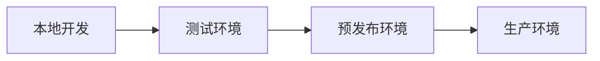

# 部署架构

## 部署演进



## 环境规划

| 环境   | 用途       | 数据      | 访问控制 |
| ------ | ---------- | --------- | -------- |
| 本地   | 开发调试   | Mock/本地 | 开发者   |
| 测试   | 功能验证   | 测试数据  | 团队内部 |
| 预发布 | 上线前验收 | 生产脱敏  | 核心团队 |
| 生产   | 正式服务   | 真实数据  | 全量用户 |

## 前端部署方案

### 静态资源部署

```yaml
# 构建产物结构
dist/
├── index.html          # 入口 HTML
├── assets/
│   ├── index-abc.js    # 主 bundle（带 hash）
│   ├── vendor-def.js   # 第三方库（带 hash）
│   ├── index-ghi.css   # 样式（带 hash）
│   └── logo.png
└── favicon.ico
```

### Nginx 配置

```nginx
server {
    listen 80;
    server_name app.example.com;
    root /var/www/html;
    index index.html;

    # Gzip 压缩
    gzip on;
    gzip_types text/plain text/css application/json application/javascript;

    # 缓存策略 - 带 hash 的资源长期缓存
    location ~* \.(js|css|png|jpg|jpeg|gif|ico|svg|woff|woff2)$ {
        expires 1y;
        add_header Cache-Control "public, immutable";
    }

    # HTML 不缓存，保证获取最新版本
    location /index.html {
        expires -1;
        add_header Cache-Control "no-cache, no-store";
    }

    # 单页应用路由
    location / {
        try_files $uri $uri/ /index.html;
    }

    # API 代理
    location /api/ {
        proxy_pass http://backend-server:8080/;
        proxy_set_header Host $host;
        proxy_set_header X-Real-IP $remote_addr;
    }
}
```

### Docker 部署

```dockerfile
# Dockerfile
FROM node:18-alpine AS builder
WORKDIR /app
COPY package*.json ./
RUN npm ci
COPY . .
RUN npm run build

FROM nginx:alpine
COPY --from=builder /app/dist /usr/share/nginx/html
COPY nginx.conf /etc/nginx/conf.d/default.conf
EXPOSE 80
```

```yaml
# docker-compose.yml
version: '3'
services:
  frontend:
    build: .
    ports:
      - '80:80'
    environment:
      - API_URL=http://backend:8080
```

## CI/CD 流水线

```yaml
# .github/workflows/deploy.yml
name: Deploy

on:
  push:
    branches: [main]
  pull_request:
    branches: [main]

jobs:
  test:
    runs-on: ubuntu-latest
    steps:
      - uses: actions/checkout@v3
      - uses: actions/setup-node@v3
        with:
          node-version: 18
          cache: 'npm'
      - run: npm ci
      - run: npm run lint
      - run: npm run test:coverage

  build:
    needs: test
    runs-on: ubuntu-latest
    steps:
      - uses: actions/checkout@v3
      - uses: actions/setup-node@v3
        with:
          node-version: 18
          cache: 'npm'
      - run: npm ci
      - run: npm run build
      - uses: actions/upload-artifact@v3
        with:
          name: dist
          path: dist

  deploy-staging:
    needs: build
    runs-on: ubuntu-latest
    environment: staging
    steps:
      - uses: actions/download-artifact@v3
        with:
          name: dist
          path: dist
      - name: Deploy to staging
        run: |
          # 部署到测试环境
          rsync -avz dist/ user@staging-server:/var/www/staging/

  deploy-production:
    needs: deploy-staging
    runs-on: ubuntu-latest
    environment: production
    steps:
      - uses: actions/download-artifact@v3
        with:
          name: dist
          path: dist
      - name: Deploy to production
        run: |
          # 灰度部署
          rsync -avz dist/ user@prod-server-1:/var/www/html/
          sleep 300  # 观察5分钟
          rsync -avz dist/ user@prod-server-2:/var/www/html/
```

## 云部署方案

### CloudBase (腾讯云)

```bash
# 安装 CLI
npm install -g @cloudbase/cli

# 登录
tcb login

# 部署
tcb hosting deploy dist -e prod-env-id
```

```json
// cloudbaserc.json
{
  "version": "2.0",
  "envId": "prod-env-id",
  "framework": {
    "name": "store-management",
    "plugins": {
      "hosting": {
        "use": "@cloudbase/framework-plugin-website",
        "inputs": {
          "buildCommand": "npm run build",
          "outputPath": "dist",
          "cloudPath": "/"
        }
      }
    }
  }
}
```

### EdgeOne Pages

```yaml
# 配置自动部署
eop.yaml
project:
  name: store-management
  build:
    command: npm run build
    output: dist
  deploy:
    - branch: main
      environment: production
    - branch: develop
      environment: staging
```

## 监控与告警

```typescript
// 错误监控集成
import * as Sentry from '@sentry/react'

Sentry.init({
  dsn: 'https://xxx@xxx.ingest.sentry.io/xxx',
  environment: process.env.NODE_ENV,
  release: process.env.RELEASE_VERSION,
  integrations: [Sentry.browserTracingIntegration(), Sentry.replayIntegration()],
  tracesSampleRate: 0.1,
  replaysSessionSampleRate: 0.01,
})

// 自定义上报
try {
  riskyOperation()
} catch (error) {
  Sentry.captureException(error, {
    tags: { section: 'project' },
    extra: { projectId, userId },
  })
}
```

## 回滚策略

```bash
#!/bin/bash
# rollback.sh

PREVIOUS_VERSION=$1

# 1. 从备份恢复
aws s3 cp s3://backup/dist-${PREVIOUS_VERSION}.tar.gz .

# 2. 解压部署
tar -xzf dist-${PREVIOUS_VERSION}.tar.gz -C /var/www/html/

# 3. 刷新 CDN
aws cloudfront create-invalidation \
  --distribution-id XXX \
  --paths "/*"

echo "回滚完成: ${PREVIOUS_VERSION}"
```
